# Fase 0 — Ambiente

Objetivo: manter o Mac em macOS Monterey 12.7 com Xcode 14.2 / Swift 5.7 para o desenvolvimento
local, usar o Xcode 26 na CI (GitHub Actions, `macos-26`), preparar as ferramentas de linha de
comando, o repositório Git/GitHub, a arquitetura do código e o Claude Code com os subagentes de
aprendizado, e instalar o app no iPhone via Sideloadly. (OCLP + Sequoia + Xcode 26 no Mac fica
registrado apenas como plano B, caso o ciclo pela nuvem fique lento.)

<!-- O subagente teacher acrescenta as entradas abaixo, uma por tarefa concluída. -->

## Tarefa 0.1 — Xcode 14.2 no Monterey (2026-10-03)

### O que foi feito
Sem diff no repositório: a mudança foi no Mac. O MacBook Pro 15" 2015 (macOS Monterey 12.7.x) tinha o Xcode 13.2.1, que não inclui o SDK do iOS 16. Ricardo instalou o Xcode 14.2 (a última versão que roda no Monterey) em `/Applications` e apontou as ferramentas de linha de comando para ele com `sudo xcode-select -s <caminho>/Contents/Developer`. O Swift passou a ser o 5.7.2. O requisito vem de `ios/project.yml` (`deploymentTarget` iOS `16.0`, `SWIFT_VERSION: "5.0"`).

### Conceitos envolvidos

**Toolchain, SDK e deployment target são três coisas diferentes.**

| Conceito | O que é | Exemplo aqui |
| --- | --- | --- |
| Toolchain | Os programas: compilador (`swiftc`, clang), linker, `swift-frontend`, depurador | Swift 5.7.2 no Xcode 14.2 |
| SDK | Os "cabeçalhos" e interfaces da plataforma: `.swiftinterface`/`.tbd` dos frameworks (UIKit, SwiftUI, CoreData, Vision) naquela versão do sistema | iPhoneOS16.2.sdk, dentro do Xcode 14.2 |
| Deployment target | A versão mínima do sistema em que o app promete rodar; vira `LC_BUILD_VERSION`/`minos` no binário | `16.0` |

Compilar é: o toolchain lê seu código e, para cada `import SwiftUI`, consulta o **SDK** para saber que tipos e funções existem. O deployment target diz quais APIs são "garantidas": usar algo introduzido no iOS 17 com target 16 gera erro de disponibilidade, a menos que você proteja com `if #available`.

Por que o 13.2.1 não serve: ele traz o SDK do iOS 15.x. O deployment target não pode ser maior que o SDK (o SDK não conhece o iOS 16), e o simulador de iOS 16 e as APIs novas daquele ano (por exemplo `NavigationStack`, que é iOS 16) nem existem para ele. Ele "compila Swift", mas o Swift é só o toolchain; sem o SDK certo, `NavigationStack` simplesmente não é encontrado. Além disso, o SDK do iOS 16 e o Swift 5.7 vêm empacotados juntos no Xcode 14.

**O que o `xcode-select` faz.** Vários executáveis em `/usr/bin` (`xcodebuild`, `swift`, `git`, `clang`, `xcrun`...) são *shims*: pequenos binários que não contêm o compilador, apenas descobrem qual Xcode (ou Command Line Tools) está ativo e executam a ferramenta de lá. A resolução, em linhas gerais, segue esta ordem:

1. variável de ambiente `DEVELOPER_DIR`, se definida (vale só para aquele processo/shell);
2. o diretório gravado pelo `xcode-select -s`, que fica como um link simbólico em `/var/db/xcode_select_link`;
3. um padrão (Xcode em `/Applications`, ou as Command Line Tools em `/Library/Developer/CommandLineTools`).

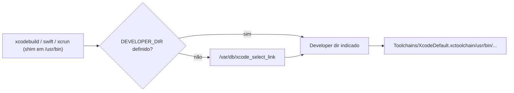

`xcrun` é o mesmo mecanismo exposto: `xcrun --find swiftc` mostra o caminho resolvido; `xcrun --show-sdk-path --sdk iphoneos` mostra o SDK. Por isso `sudo` é necessário no `-s` (escreve em `/var/db`, global ao Mac), enquanto `DEVELOPER_DIR=... comando` é uma troca temporária sem sudo. Comandos para verificar: `xcode-select -p`, `xcodebuild -version`, `swift --version`. (Detalhes exatos do link e da ordem de busca: `man xcode-select` e `man xcrun`.)

**Por que macros, `@Observable`, `#Preview` e Swift Testing estão proibidos.** Todos nasceram no Swift 5.9 / Xcode 15 (2023): macros do Swift (SE-0382 e seguintes), que sustentam `@Observable` (Observation), `#Preview` e `@Model` do SwiftData, e o Swift Testing (`import Testing`, também baseado em macros como `@Test`). O compilador 5.7 não sabe expandir macros nem tem esses módulos; o erro seria de sintaxe/módulo não encontrado. Além disso, `@Observable` e SwiftData exigem iOS 17 em runtime. Dois motivos independentes: ferramenta (compilador) e plataforma (SDK/runtime).

**`SWIFT_VERSION = 5.0` não é a versão do compilador.** É o *modo de linguagem* (`-swift-version 5`): diz ao compilador quais regras de linguagem aplicar. O compilador do Xcode 26 é Swift 6.x, mas, com modo 5, ele aceita o dialeto Swift 5 e não impõe a checagem estrita de concorrência do modo 6. O Xcode 14.2 (compilador 5.7) aceita o modo 5 também. Assim o mesmo código atende os dois. Note que o modo de linguagem não traz recursos de compilador que o 5.7 não tem: se o código usar uma macro, o modo 5 não salva. Daí a lista de proibições continuar valendo.

### Por que assim
- Xcode 14.2 local: é o teto do Monterey, e dá SDK iOS 16 com simulador, mantendo o Mac sem mexer no sistema (OCLP é arriscado em hardware 2015).
- Xcode 26 só na CI: a Apple exige SDK novo para envio, e a CI testa que nada quebrou na ponta nova.
- Regra "compila nos dois": o menor denominador comum é o 14.2, então ele dita o que se pode usar.

### Alternativas descartadas
- OCLP + Sequoia + Xcode 26 no Mac: instalação não suportada pela Apple, risco de instabilidade e de perder o ciclo de atualizações; fica como plano B.
- Baixar o target para iOS 15 e continuar com o Xcode 13.2.1: perderia `NavigationStack` e o Swift 5.7 (e a Apple não suporta mais o 13 em novos projetos de CI).
- Só desenvolver na nuvem/CI: ciclo lento, sem simulador local.

### Padrões e boas práticas
- Fixar o ambiente por escrito (CLAUDE.md, PLANO.md) e por configuração (`project.yml`) em vez de por memória.
- Preferir `DEVELOPER_DIR` para trocar de Xcode em um script/CI sem alterar o estado global; usar `xcode-select -s` para o estado padrão da máquina.
- Não usar isso quando a CI precisar de um Xcode específico: lá se seleciona a versão explicitamente no workflow.

### Armadilhas
- `xcode-select -p` apontando para `/Library/Developer/CommandLineTools` faz `xcodebuild` falhar ("requires Xcode"); corrija com `-s`.
- Caminho errado no `-s`: precisa terminar em `.../Contents/Developer`.
- Dois Xcodes instalados com `DEVELOPER_DIR` esquecido em `~/.zshrc`: o `xcode-select` parece "ignorado".
- Compilar bem no 26 e quebrar no 14.2 por uma API/macro nova: a CI não pega isso, só o Mac local. Compile local antes de dar o assunto por encerrado.
- Confundir `SWIFT_VERSION` com versão do compilador ao ler erros.

### Para ir além
- `man xcode-select` e `man xcrun` (no próprio Mac).
- Swift Evolution SE-0382 (Expression Macros) e a documentação "Swift Language Versions" em swift.org.
- Apple, "Xcode Release Notes" e a tabela de requisitos de Xcode × macOS em developer.apple.com/support/xcode.

### Perguntas
1. Com suas palavras: qual a diferença entre toolchain, SDK e deployment target? Qual deles faltava no Xcode 13.2.1?
2. Se você instalasse o Xcode 15 em outra máquina e definisse `DEVELOPER_DIR` só no terminal atual, qual Xcode o `xcodebuild` usaria nesse terminal e em outro aberto depois? Por quê?
3. Um colega coloca `@Observable` num ViewModel e deixa `SWIFT_VERSION = 5.0`. Compila no Xcode 26? E no 14.2? Dê dois motivos pelos quais o código seria proibido mesmo assim.

### Minhas respostas
<!-- Ricardo responde aqui por escrito. O teacher corrige na próxima chamada. -->

## Tarefa 0.2 — XcodeGen 2.46.0 pelo binário pronto (2026-10-03)

### O que foi feito
Sem diff no repositório: a mudança foi no Mac. O `brew install xcodegen` não funciona no macOS 12, então Ricardo baixou o binário pronto do XcodeGen 2.46.0 (release do GitHub `yonaskolb/XcodeGen`) e o colocou em `/usr/local/bin/xcodegen`. A versão importa por causa de `ios/project.yml`, que usa `projectFormat: xcode14_0`, opção que só existe a partir do XcodeGen 2.45. Na CI (`macos-26`) o XcodeGen entra por `brew install xcodegen`. A versão local (2.46.0) é a de referência e não será trocada.

### Conceitos envolvidos

**Projeto gerado × `.xcodeproj` commitado.** Um `.xcodeproj` é uma pasta (pacote) cujo coração é o `project.pbxproj`: um arquivo de texto no formato "property list" antigo (estilo NeXTSTEP) que descreve o projeto inteiro. Ele contém:

- uma lista de *objetos*, cada um com um ID de 24 caracteres hexadecimais (por exemplo `A1B2C3...`): referências de arquivo (`PBXFileReference`), grupos (`PBXGroup`), targets (`PBXNativeTarget`), fases de build (`PBXSourcesBuildPhase`), configurações (`XCBuildConfiguration`);
- as ligações entre eles, sempre por ID.

Cada arquivo `.swift` do projeto aparece pelo menos duas vezes: uma como referência de arquivo, outra como item da fase "Compile Sources" do target. Também aparece como filho de um grupo, que espelha a árvore do Navigator.

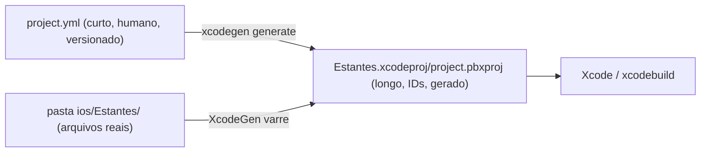

*Por que dá conflito de merge.* Duas pessoas (ou dois branches) adicionam um arquivo cada. As duas edições caem nas mesmas regiões do `pbxproj`: a lista de referências, o grupo-pai e a fase de compilação. O Git faz merge por linhas de texto, e linhas vizinhas editadas dos dois lados viram conflito. Resolver à mão exige entender IDs e estrutura interna, e um erro costuma gerar um projeto que o Xcode recusa abrir. Os IDs também não têm significado: um mesmo arquivo recebe IDs diferentes em cada máquina, e isso agrava o problema.

*Por que o Claude consegue criar arquivos sem editar o `pbxproj`.* No modelo gerado, a fonte da verdade é o sistema de arquivos. O `project.yml` diz `sources: - path: Estantes`, e o XcodeGen varre essa pasta na hora de gerar. Criar `Dominio/Estante.swift` é só criar o arquivo; o `pbxproj` é regenerado depois. Ninguém precisa conhecer o formato interno.

*Por que o `.xcodeproj` está no `.gitignore`.* É um artefato derivado, como um `.o` ou um `.class`: dá para reproduzi-lo a qualquer momento a partir do `project.yml` mais as pastas. Commitar derivados cria ruído nos diffs, conflitos e o risco de a cópia commitada divergir da fonte. A CI também gera o projeto do zero antes de testar, então o repositório fica com uma única fonte da verdade (esta é a regra do CLAUDE.md: "nunca edite nem commite `Estantes.xcodeproj`").

**`projectFormat` e `objectVersion`.** O `pbxproj` começa com um cabeçalho que inclui `objectVersion = NN;` (e, no `.xcodeproj`, `compatibilityVersion = "Xcode X.Y"`). Esse número é a versão do *esquema* do arquivo: quais tipos de objeto e quais campos existem. Cada Xcode sabe ler até certa versão. O `project.pbxproj` deste projeto, gerado com `xcode14_0`, traz `objectVersion = 56` (conferido). Pelo que conheço, o Xcode 15 usa 60 e o Xcode 16 usa 77; esses dois não foram conferidos aqui. A opção `projectFormat: xcode14_0` do XcodeGen fixa o formato de saída no nível do Xcode 14; sem ela, o XcodeGen gera o padrão de sua versão, que pode ser mais novo.

Um formato mais novo não abre num Xcode antigo porque os formatos só são retrocompatíveis em um sentido: o Xcode novo lê o antigo (e até oferece "atualizar"), mas o antigo não conhece os objetos e campos novos. Ele recusa abrir o projeto (com uma mensagem de que o projeto é de uma versão mais recente) em vez de arriscar corromper algo. No nosso caso, o formato 14 é o menor denominador comum: o Xcode 14.2 abre, e o Xcode 26 também. Para dizer exatamente o que cada versão aceita, consulte o README/changelog do XcodeGen e o `pbxproj` gerado.

**Binário pronto × compilar do código-fonte; bottles.** O Homebrew tem dois jeitos de instalar uma fórmula:

1. *Bottle*: um pacote já compilado (tar.gz) para uma combinação de macOS e arquitetura. Instalar é baixar e descompactar, e é rápido.
2. *Source build*: baixar o código e compilar na sua máquina. Exige todas as dependências de build (compilador, SDK, às vezes um Xcode ou CLT mais novos que os instalados).

O XcodeGen é escrito em Swift e depende de pacotes que usam recursos recentes da linguagem e do SDK. O Homebrew só gera bottles para os macOS que ainda suporta (em geral as últimas três versões principais), e fórmulas modernas deixam de ter bottle para o Monterey. Sem bottle, o `brew` tenta compilar do código-fonte, e com o Xcode 14.2/Swift 5.7 isso não funciona: o código atual pede um toolchain mais novo do que o Monterey consegue ter. (Não reproduzi a mensagem de erro; a causa é geral, e o log do `brew` mostra a mensagem exata.)

*Por que o macOS antigo perde suporte.* Todo software em cadeia (Apple, Homebrew, mantenedores) precisa testar cada combinação, e o custo cresce a cada versão. A Apple para de dar updates, o Xcode mais novo exige macOS mais novo, e as bibliotecas passam a usar APIs que só existem nos SDKs recentes. O Homebrew então "corta" o suporte por política (os "tiers" de suporte estão na documentação deles). O binário do GitHub funciona porque o mantenedor o compilou de antemão e ele roda no macOS 12: no fim, é só um executável com um deployment target baixo o bastante.

**Por que rodar `xcodegen generate` a cada arquivo novo.** O `pbxproj` é um *instantâneo* da pasta no momento da geração. O XcodeGen não fica observando o disco: se você cria `Estante.swift` e não regenera, o Xcode abre o projeto antigo, que não conhece o arquivo, e ele não entra no target. O sintoma típico é "Cannot find 'Estante' in scope" para um arquivo que existe no disco. Remover ou renomear sem regenerar é pior: o projeto aponta para um caminho que não existe (referência em vermelho no Navigator).

### Por que assim
- **XcodeGen em vez de `.xcodeproj` à mão:** o projeto é pequeno e será editado também pelo Claude Code, que não roda Xcode. Um YAML de ~60 linhas é revisável; um `pbxproj` de milhares de linhas não é.
- **Binário do GitHub no Mac:** é o único caminho que funciona no Monterey sem tentar compilar o XcodeGen.
- **2.46.0 como referência, sem trocar:** o `projectFormat: xcode14_0` exige ≥ 2.45. Fixar a versão evita que local e CI gerem projetos diferentes sem ninguém perceber.
- **`brew install xcodegen` na CI:** lá o macOS é novo, o bottle existe e o comando é uma linha. Porém o Homebrew instala a versão mais recente, não a 2.46.0. Há então uma assimetria consciente: se uma versão futura mudar o comportamento, a CI pode divergir do local. Quando isso incomodar, a solução é fixar a versão no workflow (ver abaixo).

### Alternativas descartadas
- **Compilar o XcodeGen do código-fonte no Monterey:** o toolchain 5.7 provavelmente não dá conta das versões atuais; seria esforço grande para zero ganho.
- **Atualizar o macOS (OCLP):** já descartado na 0.1 (risco em hardware de 2015).
- **Commitar o `.xcodeproj`:** conflitos de merge e divergência entre o projeto e o `project.yml`.
- **Swift Package Manager puro / Tuist:** o SwiftPM não gera um app iOS com `Info.plist` e assinatura de forma simples; o Tuist é mais pesado, e a documentação dele pressupõe Xcode mais recente. Não os avaliei a fundo aqui.
- **Mint ou `brew install` de uma versão fixa:** o Mint também compila do código-fonte, então bate no mesmo problema do Monterey.

### Padrões e boas práticas
- **Fonte da verdade única e artefatos derivados fora do Git** (princípio "don't commit build outputs"). Não vale quando o derivado é caro de reproduzir ou quando a ferramenta de geração some.
- **Versão da ferramenta fixada**: ferramentas de geração de código devem ter versão conhecida (um `.tool-versions`, uma linha de instalação com URL de release). Aqui está só na documentação e na cabeça do Ricardo: vale registrar em `docs/PLANO.md`.
- **Infraestrutura como código declarativa** (YAML descreve o *quê*, a ferramenta decide o *como*).

### Armadilhas
- Esquecer `xcodegen generate` depois de pull, de mudança de branch ou de arquivo novo: "Cannot find X in scope".
- Binário baixado do GitHub no macOS: o Gatekeeper pode bloquear ("não pode ser aberto porque o desenvolvedor não pode ser verificado") por causa da quarentena (atributo estendido `com.apple.quarantine`). A solução comum é `xattr -d com.apple.quarantine /usr/local/bin/xcodegen` ou liberar nos Ajustes. Verifique também se o arquivo tem permissão de execução (`chmod +x`).
- Binário errado para a arquitetura: o Mac é Intel (x86_64); confira que o release serve (`file /usr/local/bin/xcodegen`). Em Macs Apple Silicon o caminho do Homebrew é outro (`/opt/homebrew`).
- Rodar a versão errada: `xcodegen --version` deve imprimir 2.46.0. Se o Homebrew tiver outra cópia antes no `PATH`, `which -a xcodegen` mostra a ordem.
- Versão antiga do XcodeGen com `projectFormat: xcode14_0`: erro de valor inválido para a opção.
- A divergência local × CI descrita acima (versões diferentes do XcodeGen).

### Para ir além
- README e documentação de projeto do XcodeGen (`github.com/yonaskolb/XcodeGen`, arquivos `Docs/ProjectSpec.md` e `CHANGELOG.md`): opção `projectFormat` e versão em que apareceu.
- Documentação do Homebrew: "Support Tiers" e "Bottles" (docs.brew.sh).
- Para olhar por dentro: abra um `project.pbxproj` gerado num editor de texto e procure `objectVersion`, `PBXSourcesBuildPhase` e o nome de um arquivo seu.

### Perguntas
1. Com suas palavras: o que é o `project.pbxproj` e por que mantê-lo fora do Git (gerado a partir do `project.yml`) evita conflitos de merge?
2. Você cria `ios/Estantes/Dominio/Estante.swift` e abre o Xcode sem rodar nada. O que acontece e por quê? E se tivesse apagado um arquivo em vez de criar?
3. Daqui a seis meses o XcodeGen lança a 3.0 e a CI (com `brew install xcodegen`) passa a gerar o projeto com ela, enquanto seu Mac continua na 2.46.0. Que problemas podem surgir, e como você tornaria os dois ambientes reproduzíveis?

### Minhas respostas
<!-- Ricardo responde aqui por escrito. O teacher corrige na próxima chamada. -->

## Tarefa 0.3 — Projeto gerado e rodado no simulador do iOS 16 (2026-10-03)

### O que foi feito
Ricardo rodou `cd ios && xcodegen generate`, abriu o `Estantes.xcodeproj` no Xcode 14.2, executou o app no simulador iPhone 14 (iOS 16.2) e viu o teste XCTest passar. O código era o do commit `bcfc61a`: `ios/Estantes/EstantesApp.swift` (ponto de entrada), `ContentView.swift` (tela provisória e o `enum AppInfo`, que lê `CFBundleShortVersionString`) e `ios/EstantesTests/EstantesTests.swift` (`testVersaoDoAppEstaDefinida`). É o primeiro ciclo completo gerar, compilar, rodar e testar no ambiente local.

### Conceitos envolvidos

**Simulador não é emulador.** Um emulador (como o QEMU) interpreta as instruções de outra CPU. O simulador do Xcode não faz isso: ele compila o app para a arquitetura do próprio Mac (x86_64 neste MacBook 2015; arm64 em Macs Apple Silicon) e o executa como processo nativo do macOS, linkado contra uma versão "simulada" dos frameworks do iOS (o *runtime* do simulador, iOS 16.2). O destino de build é `iphonesimulator`, diferente de `iphoneos` (dispositivo, arm64). Consequências:

| | Simulador | iPhone real |
| --- | --- | --- |
| Arquitetura do binário | do Mac (x86_64 aqui) | arm64 |
| Assinatura de código | não exige | exige (Apple ID, perfil de provisionamento) |
| Velocidade | CPU do Mac | CPU do iPhone |
| Câmera | não existe | existe |

Por isso não houve nada de Apple ID até agora, e por isso a câmera ficará de fora: não há hardware de captura, então `AVCaptureSession` não tem dispositivo para abrir. Nas fases de Vision, a leitura de código de barras e o OCR serão alimentados com imagens de arquivo ou do `PhotosPicker` (iOS 16, framework PhotosUI), e a captura ao vivo só será validada no iPhone. Isso empurra uma decisão de arquitetura: o código de Vision deve receber uma imagem (`CGImage`/`Data`), não a câmera, para ser testável no simulador. (Que o simulador não tenha câmera é comportamento documentado da Apple; confira em "Running your app in Simulator" na documentação do Xcode.)

**O que `xcodebuild test` faz.** O teste não é um programa separado:

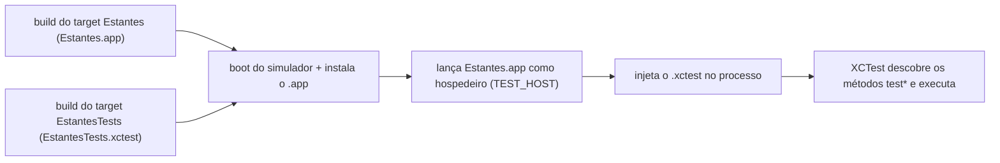

O `.xctest` é um *bundle* (pasta com binário e recursos) carregado dinamicamente dentro do processo do app hospedeiro. Como roda dentro do app, o teste acessa o mesmo código já carregado, e `Bundle.main` aponta para o `Estantes.app`, não para o executor de testes. É por isso que `AppInfo.versao` (que usa `Bundle.main`) funciona no teste. Dentro de um bundle de testes sem hospedeiro, `Bundle.main` seria outra coisa e o teste falharia. A configuração do hospedeiro é feita por `TEST_HOST` e `BUNDLE_LOADER` nos build settings; o XcodeGen preenche isso a partir de `dependencies: - target: Estantes` (conferido no `project.pbxproj` gerado: `TEST_HOST = "$(BUILT_PRODUCTS_DIR)/Estantes.app/Estantes"` e `BUNDLE_LOADER = "$(TEST_HOST)"`).

**`@testable import Estantes` e o nível `internal`.** Em Swift, o padrão é `internal`: visível dentro do módulo, invisível fora dele. `AppInfo` não tem modificador, logo é `internal` ao módulo `Estantes`, e o módulo de testes é outro. Um `import` comum não enxergaria `AppInfo`. O `@testable` pede ao compilador que trate os símbolos `internal` como visíveis. Isso só funciona porque o módulo foi compilado com `-enable-testing` (build setting `ENABLE_TESTABILITY`, ligado por padrão em Debug): nesse modo o compilador mantém os símbolos internos exportados e descritos no `.swiftmodule`; sem ele, eles podem ser otimizados ou escondidos. Em Release esse flag normalmente fica desligado, e `@testable import` falha; por isso se testa em Debug. Atenção: `@testable` **não** dá acesso a `private` e `fileprivate`. Isso é uma razão prática para testar o comportamento público do tipo, não os detalhes internos.

**Por que XCTest e não Swift Testing.** O Swift Testing (`import Testing`, `@Test`, `#expect`) depende de macros e de um toolchain novo (Xcode 16 / Swift 6; ver 0.1). No Xcode 14.2 o módulo não existe. O XCTest existe desde sempre, roda nos dois Xcodes e a CI com Xcode 26 ainda o suporta. O custo: uma API mais verbosa (`XCTAssertEqual`, classes herdando `XCTestCase`). Quando o projeto puder abandonar o Xcode 14.2, vale reavaliar.

**Info.plist e `CFBundleShortVersionString`.** O Info.plist é um arquivo de propriedades (XML) dentro do `.app` com metadados que o sistema lê *antes* de executar seu código: nome exibido, identificador, versão, orientações suportadas, textos de permissão (`NSCameraUsageDescription`: sem ele, acessar a câmera derruba o app). `CFBundleShortVersionString` é a versão "de marketing" que o usuário vê (0.1.0); `CFBundleVersion` é o número de build (1). A cadeia aqui é:

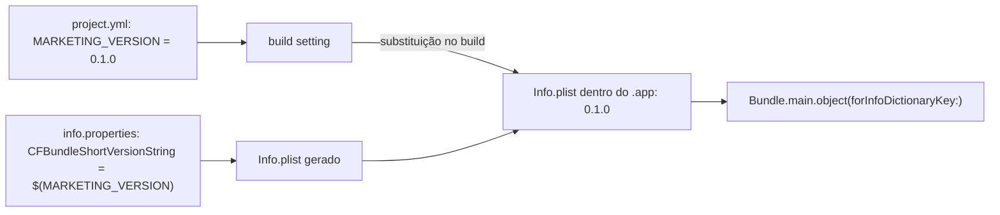

O `$(MARKETING_VERSION)` no arquivo é literal; o Xcode o troca pelo valor do build setting ao empacotar. Em runtime, `Bundle.main.object(forInfoDictionaryKey:)` lê o plist final. Por isso o teste prova algo real: a variável foi expandida (se não fosse, viria a string `"$(MARKETING_VERSION)"`, que não é vazia; o teste não pegaria isso, ver Armadilhas).

### Por que assim
- **Testar no simulador primeiro:** ciclo rápido, sem assinatura, sem iPhone conectado.
- **Teste de versão trivial:** serve de "teste de fumaça": prova que o target de teste compila, linka contra o app, carrega no hospedeiro e que o `Info.plist` está sendo gerado. Quando os testes de Domínio chegarem, a infraestrutura já estará validada.
- **Versão vinda do `project.yml`:** um só lugar para mudar a versão, sem editar o plist à mão.

### Alternativas descartadas
- **Testar só pela CI:** ciclo de minutos por tentativa; o simulador local dá feedback em segundos.
- **Test bundle "lógico" sem hospedeiro:** é mais rápido e ideal para o Domínio puro, mas aqui o teste precisa do `Bundle.main` do app. Pode valer para a camada `Dominio/` no futuro (não avaliado a fundo).
- **Swift Testing:** descartado acima.

### Padrões e boas práticas
- **Teste de fumaça (smoke test)** no começo do projeto para validar a infraestrutura antes de haver lógica.
- **Isolar o que depende de hardware** atrás de um protocolo ou de uma entrada em forma de imagem, para testar no simulador. Não vale a pena abstrair quando só há um uso e nenhuma necessidade de teste.
- `PreviewProvider` em vez de `#Preview`, como no `ContentView.swift`, por causa do Xcode 14.2.

### Armadilhas
- **O teste da versão é fraco:** `XCTAssertFalse(AppInfo.versao.isEmpty)` passa com `"$(MARKETING_VERSION)"` literal. Um teste mais forte compararia com `"0.1.0"` ou verificaria que não contém `$(`. O `?? "?"` também passa por não vazio.
- Rodar contra o destino errado: o simulador pode estar com um iOS diferente do esperado; confira em "Product > Destination".
- Esquecer `xcodegen generate` após mudar o `project.yml` ou criar arquivos (ver 0.2).
- `@testable import` falha em Release: rode testes em Debug.
- Hospedeiro mal configurado: erros como "Could not find test host" ou símbolos não encontrados ao carregar o bundle; confira `TEST_HOST` e `BUNDLE_LOADER`.
- Câmera: código que presume `AVCaptureDevice.default(...)` não nulo falha no simulador; trate o caso `nil`.

### Para ir além
- Apple, "Testing your apps in Xcode" e "Running your app in Simulator or on a device" (developer.apple.com/documentation/xcode).
- The Swift Programming Language, capítulo "Access Control" (docs.swift.org), para `internal` versus `private`.
- Apple, "Information Property List Key Reference" (developer.apple.com/documentation/bundleresources/information_property_list).

### Perguntas
1. Com suas palavras: por que o simulador não precisa de assinatura nem emula ARM, e o que isso significa para testar a câmera e o Vision?
2. Se você marcasse `AppInfo` como `private` (ou `fileprivate`) e mantivesse `@testable import Estantes`, o teste compilaria? E se o target fosse compilado em Release? Explique o papel de `ENABLE_TESTABILITY`.
3. Você muda `MARKETING_VERSION` para `"0.2.0"` no `project.yml` e roda `xcodegen generate`. O que o app exibe ao rodar? E se o valor em `info.properties` tivesse `CFBundleShortVersionString: 0.1.0` fixo? Escreva um teste melhor que o atual para detectar o erro de variável não expandida.

### Minhas respostas
<!-- Ricardo responde aqui por escrito. O teacher corrige na próxima chamada. -->

(sem respostas)

---

## Tarefa 0.4 — Erros no Git e como foram corrigidos (2026-10-03)

### O que foi feito
O upload por arrastar no site do GitHub deixou de fora `.github/` e `.claude/`, e depois um `git init` em `ios/` criou um repositório aninhado. A correção foi feita na raiz: `git init`, `git remote add origin https://github.com/d0gz/estantes.git`, `git fetch`, `git reset origin/main` (misto) e um commit com o que faltava (`bcfc61a`, "esqueleto app, primeiro commit"). Hoje não há `.git` dentro de `ios/`.

### Conceitos envolvidos

**Arquivos ocultos no Unix.** "Oculto" é só convenção: um nome que começa com `.` é pulado por `ls` e por globs como `*`. Não existe um atributo "hidden" no sistema de arquivos (no Windows existe; no macOS há também a flag `UF_HIDDEN`, que é outra coisa). Quem mostra ou esconde é o programa: `ls -a` mostra tudo, e o Finder alterna com Cmd+Shift+. . Um upload por arrastar passa pelo navegador, que recebe a lista de itens do SO e do gerenciador de arquivos. Pastas de nome com ponto podem ser filtradas nesse caminho, e foi isso que aconteceu. Não confio em uma causa única para todos os navegadores; o que importa é que o upload web não é um meio confiável para pastas ocultas. Já `git add` e `git push` não distinguem ocultos.

**Por que `.github/` e `.claude/` precisam estar no repositório.** Ferramentas procuram configuração em caminhos fixos:
- O GitHub Actions só lê workflows em `.github/workflows/*.yml` do repositório remoto. Sem a pasta no remoto, a CI simplesmente não existe, e não há erro algum.
- O Claude Code lê `.claude/agents` (subagentes como o `teacher`) e `.claude/skills` do projeto. Versioná-los faz o time, e a CI, usar a mesma configuração.

**Como o Git acha o repositório.** A partir do diretório atual, o Git sobe pelos pais procurando uma pasta `.git`. A primeira que encontrar vence.

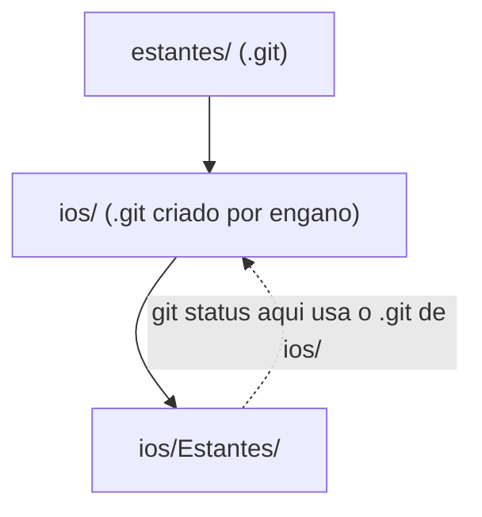

Por isso o `git init` em `ios/` "sequestrou" todo comando rodado ali dentro: eles passaram a falar com o repositório interno, sem enxergar o externo. Visto de fora, o repositório da raiz não rastreia os arquivos de `ios/`. Ele registra `ios/` como um único item de modo `160000` (um **gitlink**, apontando para um commit do repositório interno) e não guarda o conteúdo. Um **submódulo** usa o mesmo mecanismo de gitlink, mas de forma declarada: há um `.gitmodules` com a URL, e quem clona sabe de onde buscar o conteúdo. Um repositório embutido por acidente não tem `.gitmodules`, então quem clonasse veria uma pasta vazia. Diagnóstico:
- `git rev-parse --show-toplevel` imprime a raiz do repositório que o Git está usando. Se não for a esperada, há um `.git` no caminho.
- `git status` na raiz mostraria `ios/` como um único item, sem seus arquivos.
- `ls -a ios/` revela o `.git` sobrando.

**fetch, pull e reset.**
- `fetch` baixa objetos e atualiza refs remotas (`origin/main`). Não mexe em branch local, índice nem arquivos. É sempre seguro.
- `pull` = `fetch` + integrar (merge por padrão, ou rebase). Mexe nos seus arquivos.
- `reset` move o ponteiro da branch atual para outro commit e, conforme a opção, alinha também o índice e o diretório de trabalho.

Os três "lugares": **HEAD** (último commit), **índice** (o que irá no próximo commit, a *staging area*) e **diretório de trabalho** (arquivos no disco).

| Modo | Move HEAD/branch | Atualiza índice | Atualiza arquivos |
|---|---|---|---|
| `--soft` | sim | não | não |
| `--mixed` (padrão) | sim | sim | não |
| `--hard` | sim | sim | sim (descarta mudanças) |

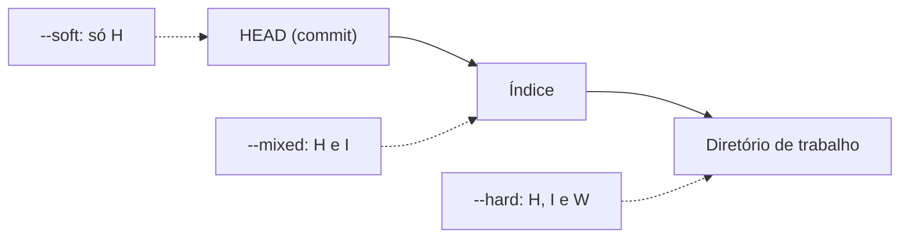

**Por que `reset origin/main` misto foi o certo.** Logo após `git init` + `fetch`, o repositório local não tinha commits e nenhuma branch; o disco tinha os arquivos corretos (incluindo `.github` e `.claude`). `reset origin/main` (misto) fez a branch apontar ao histórico remoto e o índice igualar o commit remoto. Os arquivos do disco ficaram intactos, e o `git status` passou a mostrar exatamente a diferença: o que faltava no remoto (as pastas ocultas) como "não rastreado". Bastou `add` e `commit`. Um `--hard` teria sobrescrito os arquivos locais com os do remoto, perdendo o que só existia no disco. (Um `git pull` direto também falharia ou recusaria, porque arquivos não rastreados seriam sobrescritos.)

### Por que assim
- Corrigir na raiz, não em `ios/`: `.github/` e `.claude/` ficam ao lado de `ios/`, não dentro dele, então a raiz é o único nível onde tudo cabe em um repositório.
- Reaproveitar o histórico remoto em vez de recriar: evita forçar push e preserva o que já estava no GitHub.
- Remover o `.git` de `ios/`: dois repositórios aninhados geram o gitlink fantasma e confusão de comandos.

### Alternativas descartadas
- `git clone` em outra pasta e copiar os arquivos: funciona, porém é mais manual e arrisca esquecer ocultos de novo.
- `reset --hard`: destrutivo aqui, como visto.
- `push --force` de um repositório novo: reescreve o histórico remoto sem necessidade.
- Submódulo para `ios/`: complexidade sem benefício; `ios/` faz parte do mesmo projeto.

### Padrões e boas práticas
- Rode `git rev-parse --show-toplevel` e `git status` antes de comandos que alteram estado.
- Crie o repositório na raiz do projeto, antes de qualquer subpasta.
- Prefira `git clone` / `push` a upload pelo site para mais de um arquivo.
- Não use ocultos como segredo: ser "oculto" não protege nada. Segredos ficam fora do repositório (e em `.gitignore`).
- Quando NÃO usar `reset --mixed` como ferramenta: em commits já publicados e compartilhados, prefira `git revert`, pois reescrever histórico público atrapalha os outros.

### Armadilhas
- `reset --hard` sem checar `git status` antes: perde trabalho não commitado (só se recupera com sorte via `git reflog`, e apenas o que foi commitado ou estava no índice).
- Um `.git` esquecido em subpasta faz o repositório pai tratar a pasta como gitlink; o GitHub mostra a pasta com seta/"sem conteúdo".
- A CI "não rodar" sem erro costuma significar workflow no caminho errado ou ausente.
- `.gitignore` não afeta arquivos já rastreados.

### Para ir além
- Pro Git (git-scm.com/book), capítulos "Git Tools — Reset Demystified" e "Git Tools — Submodules".
- Documentação do Git: `man git-reset`, `man gitrepository-layout` (git-scm.com/docs).
- GitHub Docs, "Workflow syntax for GitHub Actions" (docs.github.com/actions).

### Perguntas
1. Com suas palavras: o que diferencia `reset --soft`, `--mixed` e `--hard` em relação a HEAD, índice e diretório de trabalho? Por que `fetch` não altera seus arquivos?
2. Se o `.git` de `ios/` ainda existisse e você rodasse `git add .` na raiz, o que o repositório da raiz registraria sobre `ios/`? Como você confirmaria isso com um comando?
3. Você estava em `ios/Estantes/` e `git status` mostrou um repositório sem nenhum commit. Quais dois comandos usaria para descobrir qual `.git` está sendo usado, e como decidiria o que remover?

### Minhas respostas
<!-- Ricardo responde aqui por escrito. O teacher corrige na próxima chamada. -->


(sem respostas)

---

## Tarefa 0.5 — Token fine-grained e CI verde no Xcode 26 (2026-10-03)

### O que foi feito
Para dar push por HTTPS, Ricardo criou um Personal Access Token *fine-grained* restrito a `d0gz/estantes`, com "Contents" (leitura e escrita) e "Workflows" (escrita). O primeiro push disparou o workflow `.github/workflows/ios.yml` no runner `macos-26` (Xcode 26.6, macOS 26.6.2) e passou. Depois, "Run workflow" (`workflow_dispatch`) executou os dois jobs, e o artefato `Estantes-ipa` (~9 KB zipado, retenção de 7 dias) foi publicado.

### Conceitos envolvidos

**Senha × token.** Desde agosto de 2021 o GitHub não aceita senha de conta em operações Git via HTTPS. Motivos: a senha dá acesso a tudo (inclusive trocar e-mail e apagar a conta), não pode ser limitada nem revogada sem trocar a senha da conta, e se vaza num log ou histórico de shell o estrago é total. O token é uma credencial separada: tem escopo, validade e pode ser revogado sozinho. No Git, ele é usado no lugar da senha (o "usuário" é o seu login).

**Clássico × fine-grained.**
- Token clássico: escopos largos, como `repo`, que vale para *todos* os repositórios a que você tem acesso, e pode não expirar.
- Fine-grained: você escolhe *quais repositórios* e *quais permissões*, cada uma com nível (nenhum, leitura, escrita), e a expiração é obrigatória. Se vazar, o raio de dano é um repositório, não a conta inteira.
- Isso é o **princípio do menor privilégio**: dar a cada credencial só o que a tarefa exige, pelo tempo necessário. Aqui a tarefa é "dar push de código e workflows em um repositório", então só "Contents: write" e "Workflows: write" nesse repositório.

**Por que "Workflows" é uma permissão separada.** Um workflow é código que o GitHub executa numa máquina com acesso aos *secrets* do repositório (no futuro: chaves do Supabase, Gemini etc.) e ao `GITHUB_TOKEN`. Quem altera um arquivo em `.github/workflows/` altera o que roda com esses segredos. Se "Contents: write" bastasse, um token de escopo "só código" poderia, num push, adicionar um workflow que imprime ou envia os secrets para fora. Separar a permissão impede essa escalada de privilégio. Por isso o GitHub recusa o push (mensagem sobre `workflow` scope / "refusing to allow ... to create or update workflow") sem ela.

**Onde o token fica.** O Git delega a credencial a um *credential helper*. No macOS é o `osxkeychain`, que grava no Keychain do sistema (cifrado, protegido pela sua conta). Na primeira vez o Git pede usuário e token; depois o helper responde sozinho. Verifique com `git config --get credential.helper`. Nunca no repositório: o Git guarda histórico para sempre, repositórios são clonados e espelhados, e bots varrem o GitHub por tokens em segundos (o GitHub tem *secret scanning* que revoga tokens detectados, mas não conte com isso). Apagar o arquivo num commit novo não remove o token do histórico; o correto é revogar o token e criar outro.

**Runner hospedado.** É uma máquina virtual efêmera que o GitHub cria para cada job, executa os passos e destrói. `runs-on: macos-26` pede uma VM macOS 26 com Xcode 26 já instalado. Como a máquina nasce limpa, tudo (XcodeGen, projeto gerado) precisa ser instalado a cada execução. Minutos em macOS são cobrados com multiplicador maior que Linux nos planos com cota (em repositório público costuma ser gratuito; confira a tabela de preços atual do GitHub).

**O `ios.yml`, passo a passo.**

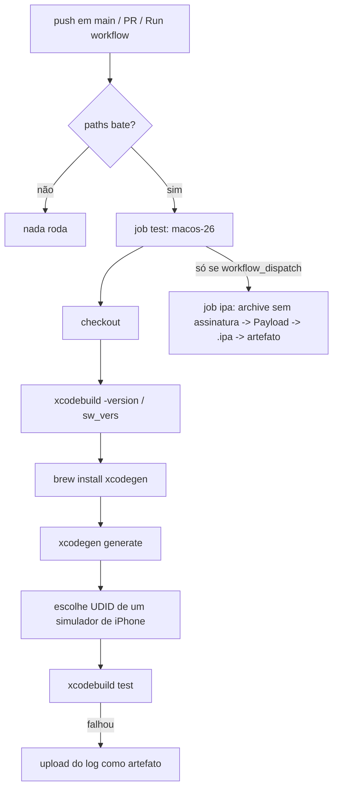

- **Gatilhos e `paths`:** push em `main`, qualquer PR e execução manual. O filtro `paths` (`ios/**` e o próprio workflow) faz com que mudar só `docs/` ou `supabase/` não gaste minutos de macOS. Detalhe: `paths` se aplica a `push` e `pull_request`, não ao `workflow_dispatch`.
- **`concurrency`:** `group: ios-${{ github.ref }}` agrupa execuções do mesmo branch; `cancel-in-progress: true` cancela a anterior quando chega um push novo. Resultado: não se paga por um build que já está obsoleto.
- **`defaults.run.working-directory: ios`:** todos os `run` partem de `ios/`, onde está o `project.yml`.
- **`xcodegen generate`:** como `Estantes.xcodeproj` não é versionado, a CI o gera do `project.yml`, igual ao Mac do Ricardo. Isso garante que a fonte da verdade é uma só.
- **Escolha do simulador:** em vez de fixar "iPhone 16", o script Python lê `xcrun simctl list devices available -j`, ordena os runtimes em ordem decrescente e pega o UDID do primeiro iPhone de um runtime iOS. Assim o workflow sobrevive quando a imagem do runner troca de versão. Cuidado: a ordenação é por *string*, então "iOS-9" ganharia de "iOS-26" se existisse; funciona aqui porque só há runtimes recentes. O UDID passa ao passo seguinte via `$GITHUB_OUTPUT`.
- **`CODE_SIGNING_ALLOWED=NO`:** o simulador não exige assinatura, e a CI não tem certificado nem perfil de provisionamento. Sem essa flag, o Xcode tentaria assinar e falharia.
- **Log só se falhar:** o `xcodebuild` é muito verboso. O passo salva tudo em arquivo, imprime só linhas úteis (`grep`) e termina com o status original (`&& STATUS=0 || STATUS=$?` captura o código sem que o shell aborte antes do `grep`). `if: failure()` no passo seguinte sobe o log completo como artefato apenas quando algo quebrou.

**Dois jobs.** `test` roda em todo push/PR (feedback rápido, barato). `ipa` tem `needs: test` (só vale gerar o pacote se os testes passaram) e `if: github.event_name == 'workflow_dispatch'` (só sob demanda). Compilar em Release para dispositivo é mais lento e raramente necessário, e cada minuto de macOS custa mais que Linux.

**Artefato.** Arquivo(s) que uma execução guarda para você baixar depois (`actions/upload-artifact`). Como o runner é destruído ao fim, sem upload o `.ipa` se perderia. A *retenção* (`retention-days: 7`) apaga o artefato depois do prazo, poupando armazenamento. O `.ipa` é só um zip com uma pasta `Payload/Estantes.app`, o que o passo "Empacotar" faz à mão. Sai **sem assinatura** (`CODE_SIGNING_REQUIRED=NO`, `CODE_SIGN_IDENTITY=""`) porque a CI não tem certificado; a assinatura é feita depois, no Mac, pelo Sideloadly (assunto da próxima entrada).

**Por que Xcode 26 na CI.** A Apple exige que apps enviados à App Store sejam compilados com o SDK da geração atual. Rodar a CI no Xcode 26 detecta cedo problemas do SDK novo (APIs depreciadas, avisos que viram erro), enquanto o Mac do Ricardo valida a compatibilidade com Xcode 14.2. Os dois juntos cobrem o intervalo iOS 16 até o SDK atual.

### Por que assim
- Token fine-grained de um só repositório: menor privilégio; vazamento limitado.
- "Workflows" habilitado conscientemente: o projeto de fato versiona workflows, então é necessário, mas é uma permissão a tratar como sensível.
- Dois jobs com `needs` e `if`: economia de minutos e garantia de que só se empacota código testado.
- Log como artefato só em falha: depuração possível sem poluir cada execução.
- Retenção de 7 dias: coincide com a validade do app assinado com Apple ID gratuito, então não há razão para guardar mais.

### Alternativas descartadas
- **SSH com chave de deploy/pessoal:** também válido e sem token a rotacionar, mas exige gerar e registrar chaves; HTTPS + token é mais simples para começar. Não é errado trocar depois.
- **GitHub CLI (`gh auth login`):** guarda o token por você; boa opção, mas o objetivo aqui era entender o mecanismo.
- **Token clássico com `repo` + `workflow`:** funciona, porém amplo demais.
- **Rodar testes em Linux:** impossível, pois Xcode/simulador só existem no macOS.
- **Gerar `.ipa` em todo push:** gasta minutos caros sem necessidade.
- **Fixar o nome do simulador:** quebra quando a imagem do runner muda.

### Padrões e boas práticas
- Menor privilégio e expiração curta para credenciais; revogue o que não usa mais.
- *Fail fast* e cancelamento de execuções obsoletas (`concurrency`).
- Infraestrutura como código: o pipeline vive no repositório, versionado e revisável.
- Fixar versão de ações (`@v7`) por reprodutibilidade; para ações de terceiros críticas, o mais seguro é fixar por SHA do commit.
- Quando NÃO cancelar execuções em andamento: em deploy/publicação, cancelar no meio pode deixar estado inconsistente; ali se usa `cancel-in-progress: false`.

### Armadilhas
- Token expira e o `git push` passa a falhar com 403/401: gere outro e atualize o Keychain (Acesso às Chaves, entrada `github.com`, ou `git credential-osxkeychain erase`).
- Digitar a senha da conta no lugar do token: erro de autenticação.
- Esquecer "Workflows": o push é rejeitado só quando mexe em `.github/workflows/`, o que confunde porque pushes anteriores funcionavam.
- Colar o token em comando/URL (`https://token@github.com/...`): vai para `.git/config` e histórico do shell.
- `paths` filtrando demais: workflow "não roda" sem erro (já visto na 0.4).
- Passo com `| tail` sem `set -o pipefail` esconde falha do `xcodebuild`; o passo de testes evita isso capturando `STATUS`, e o do `archive` usa `pipefail`.

### Para ir além
- GitHub Docs, "Managing your personal access tokens" e "Permissions required for fine-grained personal access tokens" (docs.github.com).
- GitHub Docs, "Workflow syntax for GitHub Actions" e "Security hardening for GitHub Actions" (docs.github.com/actions).
- Saltzer & Schroeder, "The Protection of Information in Computer Systems" (1975), origem do princípio do menor privilégio.

### Perguntas
1. Com suas palavras: por que o GitHub separou a permissão "Workflows" de "Contents"? Descreva um ataque que seria possível se não fosse separada.
2. Se o `ios.yml` passasse a usar uma chave do Supabase, onde ela deveria ficar e como o workflow a acessaria? O que mudaria no risco de rodar workflows vindos de PRs de forks?
3. Você faz dois pushes seguidos no mesmo branch com 20 segundos de intervalo, ambos mexendo em `ios/`. O que acontece com a primeira execução, e por quê? E se o segundo push mexer só em `docs/`?

### Minhas respostas
<!-- Ricardo responde aqui por escrito. O teacher corrige na próxima chamada. -->

## Tarefa 0.6 — Arquitetura definida: MVVM em camadas (e por que não MVC) (2026-10-03)

### O que foi feito
O commit `440cdc5` acrescentou a seção "Arquitetura do código" em `docs/PLANO.md` (camadas, árvore de pastas, regras práticas), as regras críticas de arquitetura em `CLAUDE.md` e uma categoria "Arquitetura" no subagente `.claude/agents/revisor.md`. Nenhum código Swift foi escrito: é uma decisão de projeto registrada antes de existir código que a contrarie.

### Conceitos envolvidos

**MVC no UIKit e o "Massive View Controller".** MVC separa Model (dados e regras), View (pixels) e Controller (intermediário). No UIKit, o `UIViewController` é o controller, mas também é dono da view raiz, recebe os eventos do ciclo de vida (`viewDidLoad`, `viewWillAppear`...), serve de `delegate`/`dataSource` de tabelas, dispara chamadas de rede, formata dados para exibição e navega para outras telas. Como a Apple o torna o ponto de encontro de tudo, a regra de negócio acaba ali. O resultado são controllers de milhares de linhas, difíceis de testar (testar exige instanciar a view hierarchy) e de reutilizar. Esse é o "Massive View Controller".

**Por que no SwiftUI não há controller.** No SwiftUI, a `View` é uma struct cujo `body` é uma função do estado: `UI = f(estado)`. Você não manda a view "mudar o texto do label"; você muda o estado e o framework recalcula o `body` e aplica a diferença. Sem objeto de view mutável, não há para onde o controller "empurrar" dados. Sobra a pergunta "onde mora o estado e a lógica que o altera?". O **ViewModel** responde: é uma classe que guarda o estado da tela e expõe ações. Ele faz o que o controller fazia (traduzir ação do usuário em chamada ao modelo), mas sem conhecer nenhuma view. Daí a frase do PLANO: "o ViewModel faz o papel que o controller tinha".

**MVVM e binding.** Em Swift, o ViewModel é um `ObservableObject` com propriedades `@Published`. Por dentro, `ObservableObject` exige um publisher `objectWillChange` (do Combine); o `@Published` reescreve o setter da propriedade para, **antes** de gravar o novo valor, chamar `objectWillChange.send()`. A view que o observa (`@StateObject`/`@ObservedObject`) está inscrita nesse publisher: ao receber o aviso, invalida o `body` e o SwiftUI o reavalia no próximo ciclo, já com o valor novo. Detalhe importante: o aviso é por *objeto*, não por propriedade. Mudar qualquer `@Published` reavalia todas as views que observam aquele objeto (depois compara o resultado e só atualiza o que mudou). Por isso ViewModels enormes custam caro e é melhor um por tela. `@MainActor` garante que essas mutações aconteçam na thread principal, a única em que a UI pode ser tocada.

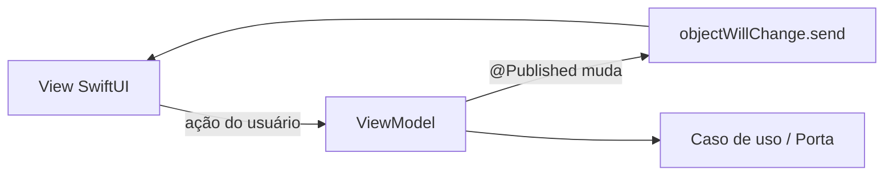

**Regra de dependência.** Dependências de *código-fonte* (quem dá `import`/referencia quem) só apontam para dentro: Dados e Apresentacao conhecem o Dominio; o Dominio não conhece ninguém. Consequência prática: o Dominio importa só Foundation, então compila e testa sem UIKit, Core Data ou rede. Note que dependência de código-fonte é diferente de fluxo de execução: em tempo de execução o Dominio *chama* o Core Data (para salvar), mas sem nomeá-lo.

**Inversão de dependência (o "D" do SOLID).** Se o caso de uso precisa salvar, o fluxo natural seria Dominio → Core Data (apontando para fora). Inverte-se: o Dominio declara o que precisa (um protocolo, "porta") e a camada de fora o implementa.

```swift
// Dominio/Portas/BibliotecaRepositorio.swift  (só Foundation)
protocol BibliotecaRepositorio {
    func estantes() async throws -> [Estante]
    func salvar(_ livro: Livro, em estanteID: UUID) async throws
}

// Dominio/CasosDeUso/ImportarBiblioteca.swift
struct ImportarBiblioteca {
    private let repositorio: BibliotecaRepositorio   // recebe pelo init
    init(repositorio: BibliotecaRepositorio) { self.repositorio = repositorio }
    func executar(_ livros: [Livro], em estanteID: UUID) async throws {
        for livro in livros { try await repositorio.salvar(livro, em: estanteID) }
    }
}

// Dados/Persistencia/BibliotecaRepositorioCoreData.swift  (import CoreData)
final class BibliotecaRepositorioCoreData: BibliotecaRepositorio { /* NSManagedObject <-> struct aqui */ }

// EstantesTests/...  : um falso em memória
final class BibliotecaFalsa: BibliotecaRepositorio {
    var livros: [Livro] = []
    func estantes() async throws -> [Estante] { [] }
    func salvar(_ livro: Livro, em estanteID: UUID) async throws { livros.append(livro) }
}
```

A seta de código fonte vai de `BibliotecaRepositorioCoreData` para o protocolo (dentro), embora a seta de execução vá do caso de uso ao Core Data (fora). Essa "inversão" é o que dá nome ao princípio. Protocolos com `async` em métodos funcionam em Swift 5.7/Xcode 14.2 (iOS 13+ com backdeploy do runtime de concorrência), então o exemplo é compatível com as restrições do projeto.

**Structs × NSManagedObject.** Uma struct é tipo de valor: cada cópia é independente, não há identidade compartilhada nem mutação à distância, é segura para passar entre threads (copiar-ao-escrever; `Sendable` quando seus campos são) e ganha `Equatable`/`Hashable`/`Codable` por síntese. Um `NSManagedObject` é uma classe ligada a um `NSManagedObjectContext`: só pode ser tocado na fila desse contexto (`perform`), não é thread-safe, e usa *faulting* (o objeto pode ser um "fantasma" cujos atributos só são lidos do store quando acessados; se o contexto some ou o objeto é apagado, o acesso pode falhar ou devolver lixo). Deixar isso vazar para telas e ViewModels espalha regras de threading e de ciclo de vida do Core Data por todo o app. Por isso a conversão acontece num único ponto, dentro de `BibliotecaRepositorioCoreData`: o risco fica confinado.

**Testabilidade.** ISBN, ParserISBD, Jaro-Winkler e Pontuação são funções puras: entrada → saída, sem I/O. Num alvo de testes que não precisa do simulador para o domínio, o XCTest executa milhares de casos em milissegundos. Os ViewModels são testados com portas falsas (sem rede, sem banco). Só os testes de `Dados/` precisam do Core Data (em memória, `NSInMemoryStoreType`).

**Injeção pelo `init` × singleton.** Um singleton (`Banco.shared`) é estado global escondido: qualquer código o alcança sem declarar a dependência, a ordem de inicialização vira surpresa, e um teste que altera o estado contamina o seguinte (testes acoplados, resultados dependentes da ordem). Com injeção pelo `init`, as dependências aparecem na assinatura, cada teste monta o seu mundo, e a montagem real fica num único lugar (`App/Dependencias`, a "composition root").

### Por que assim
- Os algoritmos são o coração do app e o conjunto de avaliação da Fase 3 os exercitará: ficam puros e baratos de testar.
- Core Data escondido atrás de protocolo: trocá-lo (por SwiftData quando o Xcode permitir) mexe só em `Dados/Persistencia/`.
- Sem `@FetchRequest`: ele só funciona dentro de uma View e ligaria a tela ao Core Data. O custo é recarregar o estado após cada alteração manualmente; o ganho é uma tela que só conhece structs.
- Caso de uso só quando há orquestração real (`IdentificarLivro` encadeia leitura, OCR, catálogo, pontuação): ações triviais vão direto ao repositório, evitando classes que só repassam chamadas.
- Nomes do domínio em português (a linguagem do problema jurídico/biblioteconômico), sufixos Swift em inglês (`ViewModel`) para seguir as convenções da plataforma.

### Alternativas descartadas
- **MVC:** é o padrão do UIKit; no SwiftUI não há controller natural, e reproduzi-lo recria o Massive View Controller.
- **Clean Architecture "de livro":** um caso de uso por ação, conversores entre todas as camadas, muitos arquivos de cerimônia. Para duas entidades (Livro, Estante) o custo supera o ganho.
- **NSManagedObject nas telas:** mais rápido no começo (`@FetchRequest` é cômodo), mas acopla UI e persistência e torna o teste de telas dependente do banco.

### Padrões e boas práticas
- Repositório (porta + adaptador), injeção de dependência, composition root, ViewModel como holder de estado da tela. É a ideia de "Ports and Adapters" (arquitetura hexagonal) de Alistair Cockburn.
- Quando é exagero: app de uma tela, protótipo descartável ou CRUD sem regra, onde `@FetchRequest` direto é perfeitamente razoável. Protocolo com uma única implementação e nenhum teste que use um falso é cerimônia. Aqui se justifica porque há dois alvos de teste, mais de um backend (Supabase/Google/Gemini, atrás de `CatalogoServico`) e uma restrição real de Xcode.
- O revisor agora checa a arquitetura: sem isso, regras escritas em Markdown erodem sozinhas.

### Armadilhas
- "Vazamento" de `import CoreData` ou `import SwiftUI` no Dominio: confira os imports no topo de cada arquivo da pasta.
- Criar o ViewModel dentro da View com `@ObservedObject var vm = VM()`: a view recria o objeto e perde o estado a cada reavaliação do pai. Para o dono usa-se `@StateObject`.
- Esquecer `@MainActor`: mutar `@Published` fora da thread principal gera avisos/crashes de UI.
- Conversão struct ↔ NSManagedObject duplicada em vários pontos: dois lugares divergem e viram bugs sutis.
- Protocolos "gordos" (um repositório com 30 métodos): quebre em portas por necessidade.
- Faulting: acessar um objeto gerenciado depois de o contexto ser liberado. É exatamente o que a conversão imediata para struct evita.

### Para ir além
- Robert C. Martin, *Clean Architecture* (2017), capítulos sobre a regra de dependência e a inversão de dependência.
- Alistair Cockburn, "Hexagonal Architecture" (alistair.cockburn.us).
- Apple, documentação de Core Data ("Using Core Data in the Background" / concurrency) e "Managing model data in your app" do SwiftUI (developer.apple.com).

### Perguntas
1. Com suas palavras: o que significa dizer que na regra de dependência "as setas de código-fonte apontam para dentro" e como o protocolo `BibliotecaRepositorio` permite que o fluxo de execução vá para fora mesmo assim?
2. Se amanhã você quisesse trocar o Core Data por um arquivo JSON local, quais arquivos mudariam e quais não? E se a tela usasse `@FetchRequest`?
3. Um colega escreve `@ObservedObject var vm = EstanteViewModel(...)` dentro de uma View e reclama que a lista "volta ao início" sempre que o pai atualiza. Qual a causa e a correção? Explique o que `objectWillChange` tem a ver com isso.

### Minhas respostas
<!-- Ricardo responde aqui por escrito. O teacher corrige na próxima chamada. -->


## Tarefa 0.7 — Sideloadly instalado; instalação no iPhone pendente (2026-10-03)

### O que foi feito
O Sideloadly foi instalado no Mac, mas a instalação do app no iPhone ficou **pendente**: o cabo USB estava com defeito. Nada no repositório mudou. O fluxo já está documentado em `README.md` ("Instalar no iPhone") e o `.ipa` sai do job `ipa` de `.github/workflows/ios.yml`. Esta entrada explica por que o fluxo tem essa forma. A CI e os artefatos já foram vistos na 0.5.

### Conceitos envolvidos

**1. Por que o iOS só executa código assinado.**
O iOS é um sistema fechado de propósito: antes de executar qualquer página de código de um app, o kernel (via o mecanismo AMFI, *Apple Mobile File Integrity*) confere se o binário tem uma assinatura válida, feita por uma identidade que a Apple reconhece. O objetivo é impedir que código arbitrário (malware, app adulterado) rode no aparelho. Duas garantias saem daí: **autenticidade** (sei quem assinou) e **integridade** (nada foi alterado depois de assinar).

A cadeia de confiança funciona assim:

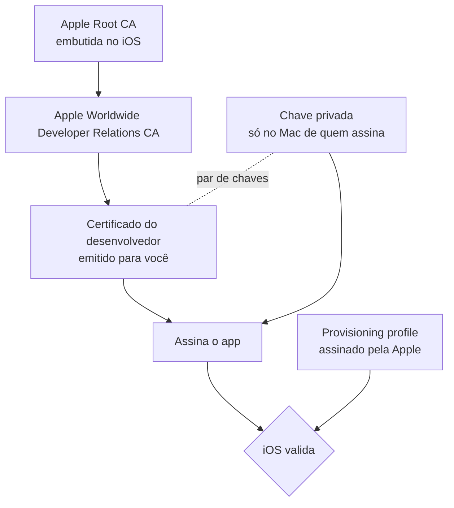

- Você gera um par de chaves (pública/privada). A **chave privada nunca sai da sua máquina** (fica no Keychain). A Apple recebe um pedido de certificado (CSR) com a chave pública e devolve um **certificado** assinado por ela, que liga sua identidade à chave pública.
- Ao assinar, calcula-se um hash dos arquivos do app e assina-se esse hash com a chave privada. Quem verifica usa o certificado (chave pública) e sobe a cadeia até a raiz da Apple, que o iOS já conhece. É criptografia de chave pública padrão: só quem tem a privada produz a assinatura; qualquer um com a pública a verifica.
- Dentro do bundle, a assinatura fica em duas partes. O executável Mach-O ganha um bloco de assinatura (`LC_CODE_SIGNATURE`) com hashes de cada página de código. E o resto do bundle (Info.plist, imagens, storyboards, frameworks) é coberto por `Estantes.app/_CodeSignature/CodeResources`, um plist com o hash de cada arquivo. Mudar um byte de qualquer recurso invalida a assinatura.

**2. Provisioning profile.**
O certificado diz *quem* é você; não diz *o que* pode rodar *onde*. Isso é o papel do arquivo `embedded.mobileprovision`, dentro do `.app`, assinado pela Apple. Ele une:
- o **App ID** (bundle identifier, por exemplo `com.fulano.estantes`);
- o(s) **certificado(s)** autorizados a assinar;
- a lista de **dispositivos autorizados (UDIDs)**, em perfis de desenvolvimento;
- os **entitlements** permitidos (capacidades como push, App Groups, iCloud, Keychain sharing);
- uma **data de validade**.

O iOS confere: a assinatura do app bate com um certificado do perfil? este aparelho está na lista? os entitlements do binário são um subconjunto do que o perfil concede? o perfil não expirou? Qualquer "não" e o app não abre (ou nem instala).

**3. Apple ID gratuito vs. Developer Program.**

| | Apple ID gratuito | Developer Program (US$ 99/ano) |
|---|---|---|
| Validade do perfil | 7 dias | 1 ano |
| Distribuição | só aparelhos seus, via Xcode/sideload | TestFlight, App Store, ad hoc, enterprise à parte |
| Limites | poucos apps ativos e poucos App IDs novos por semana | muito mais folgado |
| Capacidades | limitadas (sem push, iCloud etc.) | completas |

Por que 7 dias? É decisão comercial/de segurança da Apple: perfis curtos limitam o uso do canal gratuito para distribuir apps a terceiros fora da loja, e uma conta gratuita não passou por verificação de identidade. Os limites exatos de apps simultâneos e App IDs por semana mudam com o tempo e **devem ser conferidos** na documentação da Apple ou na do Sideloadly (não os cravo aqui). Quando o perfil vence, o iOS deixa de validar o app: o ícone continua lá, mas ele não abre até ser re-assinado.

**4. Por que a CI gera o `.ipa` sem assinatura.**
No job `ipa` aparecem `CODE_SIGNING_ALLOWED=NO`, `CODE_SIGNING_REQUIRED=NO` e `CODE_SIGN_IDENTITY=""`. Isso manda o `xcodebuild archive` compilar tudo sem tentar assinar. Assinar na CI exigiria guardar o certificado e a **chave privada** (um `.p12` com senha) e o perfil como *secrets* do GitHub, e o runner é uma máquina efêmera de terceiros. Se isso vazasse, alguém assinaria código em seu nome. Sem assinatura, não há segredo nenhum na CI, e o artefato é inofensivo até alguém assinar. Quem assina é o Sideloadly, localmente, com a sua conta. É o princípio do menor privilégio aplicado ao pipeline.

**5. O `.ipa` é só um zip.**
Um `.ipa` é um arquivo ZIP com uma pasta `Payload/` contendo `Estantes.app`. É exatamente o que o passo "Empacotar o .ipa" faz: copia o `.app` de dentro do `.xcarchive` (`Products/Applications/`) para `Payload/` e roda `zip -qry`. Você pode conferir com `unzip -l Estantes.ipa`. Num `.ipa` sem assinatura não existe `_CodeSignature/` nem `embedded.mobileprovision`; eles surgem depois.

**6. O que o Sideloadly faz.**
Com o seu Apple ID (autenticando nos serviços de desenvolvimento da Apple, como o Xcode faz), ele: registra o UDID do iPhone, cria/reusa um App ID (e pode alterar o bundle id para um único na sua conta), pede um certificado de desenvolvimento e um provisioning profile, **re-assina** o `.app` com a sua chave e o perfil embutido, e instala no aparelho por USB (ou Wi-Fi, se habilitado) usando o protocolo do iOS para instalação (`installd`). Por isso o iPhone precisa estar conectado e desbloqueado, e por isso o cabo importa: cabo só de carga, sem linhas de dados, ou com defeito, impede o Mac de falar com o aparelho.

**7. Confiar no perfil e Modo de Desenvolvedor.**
Um certificado de desenvolvimento "pessoal" não é de uma entidade conhecida da Apple para distribuição, então o iOS pede confirmação explícita em Ajustes → Geral → VPN e Gerenciamento de Dispositivos. Já o **Modo de Desenvolvedor** (obrigatório a partir do iOS 16) é um interruptor extra: sem ele, o aparelho recusa executar apps assinados com certificado de desenvolvimento. Ele aparece em Privacidade e Segurança só depois que uma ferramenta de desenvolvimento se conecta, e exige reiniciar. Ele reduz a proteção do sistema, por isso é opt-in.

### Por que assim
- **Sideload com Apple ID gratuito:** o objetivo é aprender e rodar no próprio aparelho, e US$ 99/ano não se justifica agora (ver `docs/PLANO.md`).
- **`.ipa` não assinado na CI:** zero segredos de assinatura no GitHub; a assinatura acontece onde a chave privada já vive de forma legítima.
- **Gatilho manual (`workflow_dispatch`):** gerar `.ipa` consome minutos de macOS, que na CI são caros.
- **Backup por exportar/importar JSON (Fase 2):** o app expira em 7 dias e, ao re-assinar, o ideal é manter o bundle id para preservar os dados. Se o bundle id mudar, ou o app for removido, o sandbox com o banco Core Data é apagado. Exportar/importar JSON é o seguro contra isso.

### Alternativas descartadas
- **Developer Program (US$ 99/ano):** 1 ano de validade e TestFlight, mas custo recorrente sem necessidade agora.
- **Assinar na CI com secrets:** automatiza, mas expõe certificado e chave privada num runner externo.
- **Rodar pelo Xcode 14.2 direto no iPhone:** também funciona com Apple ID gratuito, mas o Xcode 14.2 precisa ter suporte ao iOS do aparelho; se o iPhone tiver um iOS bem mais novo que o Xcode, ele pode não reconhecê-lo. Verifique antes. O Sideloadly não depende do Xcode.
- **AltStore e similares:** renovam sozinhos via servidor no Mac, mas são mais peças móveis.

### Padrões e boas práticas
- Princípio do menor privilégio: o pipeline só produz o que não precisa de segredo.
- Separar **build** (reprodutível, na CI) de **assinatura** (identidade, local). Em projetos com App Store, usa-se `fastlane match` ou perfis gerenciados e secrets, e então a CI assina; aqui seria exagero.
- Nunca commitar `.p12`, `.mobileprovision` ou chaves (regra 6 do `CLAUDE.md`).

### Armadilhas
- Cabo só de carga ou defeituoso: o Sideloadly não enxerga o iPhone. Teste com outro cabo, de preferência original ou certificado MFi, e toque em "Confiar neste computador" no iPhone.
- Esquecer o Modo de Desenvolvedor: o app instala, mas não abre.
- Esquecer o prazo: passados 7 dias o app deixa de abrir. Re-assine **antes** e mantenha o mesmo bundle id e Apple ID para não perder dados.
- Limite de App IDs por semana: muitas tentativas com bundle ids diferentes podem bloquear novas instalações por um tempo.
- Autenticação em dois fatores no Apple ID: pode ser necessário usar o código de verificação; use sempre fontes confiáveis do Sideloadly.

### Para ir além
- Apple, *Code Signing Guide* e "Distributing your app to registered devices" (developer.apple.com).
- Apple, "Enabling Developer Mode on a device" (developer.apple.com/documentation/xcode).
- Documentação e FAQ do Sideloadly (sideloadly.io), para limites atuais da conta gratuita.

### Perguntas
1. Com suas palavras: qual é a diferença entre o certificado, a chave privada e o provisioning profile, e o que cada um garante?
2. Se o job `ipa` passasse a assinar o app na própria CI, o que precisaria ser guardado como secret e qual seria o risco? Em que cenário valeria a pena?
3. Você re-assina o app no 6º dia, mas o Sideloadly cria um bundle id diferente do anterior. O que acontece com os livros que estavam no app? Como a exportação em JSON da Fase 2 resolve isso?

### Minhas respostas
<!-- Ricardo responde aqui por escrito. O teacher corrige na próxima chamada. -->

### O que falta
Refazer a instalação com outro cabo USB: baixar o artefato `Estantes-ipa`, abrir o Sideloadly, arrastar o `.ipa`, entrar com o Apple ID, confiar no perfil e ativar o Modo de Desenvolvedor no iPhone. Depois, anotar a data da instalação para lembrar do vencimento em 7 dias.

---

## Tarefa 0.8 — Código reorganizado nas camadas (2026-10-03)

### O que foi feito
O commit `8c43381` (PR #1) criou o esqueleto de pastas das camadas (`App/`, `Dominio/`, `Dados/`, `Apresentacao/` e os espelhos em `EstantesTests/`), usando `.gitkeep` nas pastas ainda vazias. Moveu `EstantesApp.swift` para `App/` e `ContentView.swift` para `Apresentacao/Inicio/` com `git mv`, levou o `AppInfo` para `App/AppInfo.swift` (o teste virou `EstantesTests/App/AppInfoTests.swift`) e trocou o comentário do `EstantesApp` que sugeria `.environment(\.managedObjectContext)` pela descrição da montagem via `init` em `App/Dependencias`. Sobre MVVM e a regra de dependência, veja a tarefa 0.6; aqui o foco é a mecânica de Git, Xcode e build.

### Conceitos envolvidos

**1. Por que o Git não versiona pastas vazias**

O Git guarda conteúdo, não diretórios. Por dentro há três tipos de objeto: *blob* (bytes de um arquivo), *tree* (lista de entradas `modo nome -> hash` apontando para blobs ou outras trees) e *commit* (aponta para uma tree raiz). O **índice** (staging area) é uma lista plana de **arquivos** com seus caminhos, como `ios/Estantes/Dominio/Regras/Foo.swift`. As trees do commit são *derivadas* desses caminhos: a pasta existe no Git só porque algum arquivo passa por ela. Sem arquivos, nenhuma entrada vai para o índice e, portanto, não há tree a gravar. (Tecnicamente existe a tree vazia, hash `4b825dc...`, mas o `git add` não consegue colocá-la numa árvore de trabalho como entrada.)

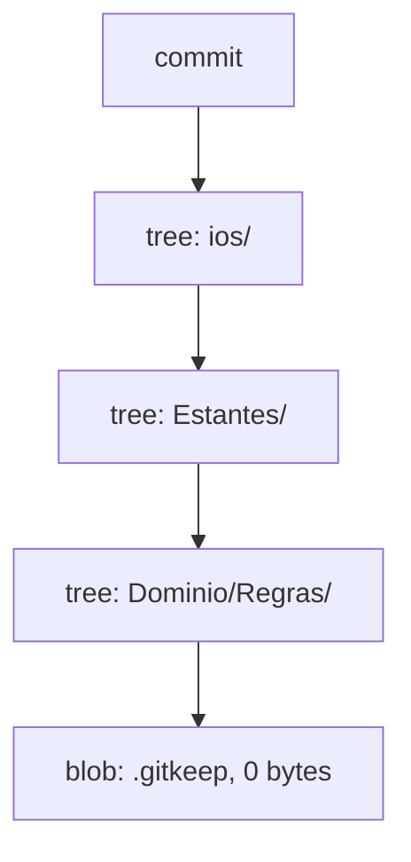

A convenção `.gitkeep` é só isso: um arquivo vazio com um nome que ninguém precisa usar. **Não é recurso do Git**, e o nome é arbitrário (`.keep` também funciona). O que importa é que ele existe e obriga a pasta a ser rastreada. Todos os blobs vazios têm o mesmo hash, então os 15 `.gitkeep` ocupam um único objeto no banco do Git (deduplicação por conteúdo). Quando a pasta ganhar o primeiro arquivo real, o `.gitkeep` pode ser apagado.

**2. `git mv` e detecção de renomeação**

`git mv a b` equivale a `mv a b; git rm a; git add b`. Não grava nenhum "rename". O Git **não armazena renomeações**: cada commit é um snapshot completo. Quando você roda `git log --follow`, `git diff -M` ou `git show`, o Git *infere* a renomeação comparando arquivos removidos com arquivos adicionados:

1. Pares com hash idêntico são renomeações exatas (similaridade 100%).
2. Para os restantes, calcula-se uma similaridade (grosso modo, quantas linhas/bytes são comuns) e, se passar do limiar (padrão **50%**, ajustável com `-M<n>%`), o par é considerado renomeação com modificação.

Neste commit: `ContentView.swift` (perdeu 9 linhas) e `EstantesTests.swift` -> `AppInfoTests.swift` (mudou 1 linha) foram detectados como renomeações. Já `EstantesApp.swift` apareceu como **apagado em um lugar e criado em outro** (`-12` e `+13`): o arquivo é minúsculo, então trocar o comentário alterou uma fração enorme do conteúdo e a similaridade caiu abaixo de 50%. Nada foi perdido: o histórico real é o mesmo; só a *apresentação* do diff mudou. Lição: arquivos pequenos são frágeis à heurística. Para preservar o rastro, faça o commit do move **separado** da edição de conteúdo (1 commit "move", 1 commit "edita"). Aqui os dois foram juntos, e o `--follow` de fato perdeu o fio (conferido): `git log --follow -- ios/Estantes/App/EstantesApp.swift` mostra só o 8c43381, enquanto o mesmo comando para `ContentView.swift` mostra também o bcfc61a.

**3. Grupos do Xcode x pastas no disco**

O `.xcodeproj` é um arquivo (`project.pbxproj`) com um grafo de objetos. Um *grupo* é um nó de organização visual no navegador do Xcode e pode ou não corresponder a uma pasta real. O Xcode clássico não exige que os dois coincidam, e é por isso que times antigos sofriam com projetos em que a árvore do navegador divergia do disco. O XcodeGen resolve isso gerando os grupos **a partir das pastas** de `sources:` do `project.yml`; por isso, "arquivos novos entram sozinhos" (regra do `CLAUDE.md`) e o `.xcodeproj` nunca é versionado. A opção `createIntermediateGroups` do XcodeGen trata de caminhos com pastas intermediárias (ex.: gera os grupos `ios/Estantes/...` quando a fonte é aninhada); confira a semântica exata na documentação do XcodeGen, porque não rodei isso aqui.

**4. Build phases: Sources x Resources**

Cada target tem fases de build. As relevantes:

| Fase | O que faz | Exemplo |
| --- | --- | --- |
| Compile Sources | Passa cada arquivo ao compilador | `.swift` |
| Copy Bundle Resources | **Copia o arquivo, byte a byte, para dentro do `.app`** | `.xcassets` (compilados), `.png`, `.json`, `.plist` |

Se um arquivo cair em Copy Bundle Resources, ele viaja dentro do `.app`, aumenta o tamanho do binário distribuído e fica acessível a quem inspecionar o `.ipa` (um `.ipa` é um zip). Para um `.gitkeep` vazio é inócuo; para um arquivo de dados ou segredo seria um vazamento. O Ricardo verificou que os `.gitkeep` foram adicionados como *referência de arquivo* (aparecem no navegador), mas **não** na fase de Resources (0 ocorrências de `gitkeep in Resources` no `project.pbxproj`). Verificação boa, e é o tipo de coisa que se confere em vez de presumir. Se aparecesse, a solução seria `excludes:` no `project.yml`.

**5. Comentário errado como dívida de arquitetura**

Dívida técnica não é só código ruim: é qualquer coisa que torna a próxima mudança mais cara ou mais arriscada. Um comentário no ponto de entrada do app dizendo "use `.environment(\.managedObjectContext)`" é um **convite**: quem abrir o arquivo (você daqui a 2 meses, ou uma IA) seguirá a instrução. O padrão do template da Apple (`@FetchRequest` nas telas) coloca `NSManagedObjectContext` e consultas dentro da `View`, quebrando a regra "`NSManagedObject` só existe em `Dados/Persistencia/`" e tornando a tela impossível de testar sem Core Data. Documentação que contradiz a decisão vence a decisão por inércia. Por isso corrigir o comentário é parte da arquitetura, não limpeza estética.

### Por que assim
- **Pastas vazias com `.gitkeep`:** o mapa das camadas fica visível desde o dia 1 e orienta onde cada coisa nova entra.
- **`AppInfo` em `App/`:** ler o `Bundle` é detalhe da plataforma e de montagem, não regra de negócio; em `Dominio/` violaria "só Foundation, sem detalhes de plataforma" no espírito (Bundle é Foundation, mas o conceito é de infraestrutura).
- **`git mv`:** deixa o intento explícito no índice, embora o Git infira de qualquer forma.
- **Comentário trocado agora:** custa um minuto hoje e evita um desvio de arquitetura amanhã.

### Alternativas descartadas
- **Criar só pastas que têm arquivo:** esconderia o mapa; a estrutura deixaria de ser documentação.
- **Apagar `AppInfo` e o teste:** perderia o único teste da infraestrutura de CI funcionando, que prova que o pipeline roda.
- **Excluir `.gitkeep` no `project.yml`:** desnecessário, já que não vão para Resources; só se adiciona configuração quando há problema medido.
- **Pastas "azul" (folder references):** o Xcode copiaria a pasta inteira para o bundle; não é o que se quer para código-fonte.

### Padrões e boas práticas
- Estrutura de pastas espelha as camadas; `EstantesTests/` espelha `Estantes/`.
- Separar commits de **mover** e de **editar** para preservar o histórico.
- Gerar o projeto a partir de uma fonte declarativa (XcodeGen) em vez de versionar um arquivo gerado e propenso a conflitos de merge.
- Quando NÃO usar `.gitkeep`: se a pasta vai ganhar arquivo logo em seguida, ele é ruído.

### Armadilhas
- Achar que "sumiu o histórico" ao ver apagado+criado: use `git log --follow -- <arquivo>` ou `git diff -M30%` para testar; não é perda.
- Um `.gitkeep` ou outro arquivo indevido em Copy Bundle Resources: confira com `grep "in Resources" Estantes.xcodeproj/project.pbxproj`.
- Rodar a CI sem regenerar o projeto: lembre de `xcodegen generate` após mover arquivos.
- Em Mac com sistema de arquivos insensível a maiúsculas (APFS padrão), renomear só a caixa (`app` -> `App`) exige `git mv` em duas etapas.

### Para ir além
- Scott Chacon e Ben Straub, *Pro Git*, cap. 10 "Git Internals" (git-scm.com/book): objetos blob/tree/commit.
- Documentação do `git diff` (opção `-M`/`--find-renames`) em git-scm.com/docs/git-diff.
- Documentação do XcodeGen (`ProjectSpec.md`, seções `sources` e `options`) em github.com/yonaskolb/XcodeGen.

### Perguntas
1. Com suas palavras: por que o Git não consegue guardar uma pasta vazia, e o que o `.gitkeep` realmente faz?
2. Se você tivesse feito o `git mv` do `EstantesApp.swift` em um commit e a troca do comentário em outro, o que mudaria no `git show` e por quê?
3. Um colega adiciona `config-secreta.json` em `ios/Estantes/Dados/Rede/` e ele cai em "Copy Bundle Resources". O que acontece com esse arquivo no `.ipa`, e como você descobriria e corrigiria isso?

### Minhas respostas
<!-- Ricardo responde aqui por escrito. O teacher corrige na próxima chamada. -->

(sem respostas)

---

## Tarefa 0.9 — Ações dos workflows em Node 24 (2026-10-03)

### O que foi feito
Em `.github/workflows/ios.yml`, `actions/checkout` e `actions/upload-artifact` saltaram de `@v4` para `@v7` (ambas com `runs.using: node24`), eliminando o aviso de depreciação do Node 20. No mesmo `ios.yml`, o gatilho `pull_request.paths` ganhou `.github/workflows/ios.yml`. Em `supabase-keepalive.yml`, a consulta passou a usar `lexml_livros?select=lexml_id`, tabela prevista no `docs/PLANO.md`. A CI do PR #2 rodou e passou.

### Conceitos envolvidos

**Action JavaScript e o runtime embutido.** Uma action é um pacote com um `action.yml`. Nas actions JavaScript, ele tem este formato:

```yaml
runs:
  using: node24
  main: dist/index.js
```

O runner (o agente do GitHub na máquina) lê esse arquivo, baixa o repositório da action na versão pedida e executa `main` com o **Node que vem embutido no próprio runner**, não com o Node que você instalou no sistema. Por isso `actions/setup-node` não afeta o `checkout`: são dois Nodes diferentes. O `dist/index.js` é código já empacotado (bundle com as dependências), para a action não precisar de `npm install` a cada execução.

**Por que o fim de vida do Node força uma major nova.** O runtime é parte do contrato da action. Trocar `node20` por `node24` pode quebrar quem dependia de comportamento antigo (módulos nativos, APIs removidas, mudanças em `fetch`/TLS). Pelo versionamento semântico, mudança que pode quebrar consumidores é major. O GitHub também precisa que o runner traga o runtime que as actions pedem, e deixa de embutir versões sem suporte. Por isso o caminho é `v4 → v7`, e não uma correção dentro da v4.

**Versionamento: tag móvel × SHA fixo.** `@v7` é uma tag que o mantenedor **move** a cada release v7.x. Você recebe correções sem mexer no workflow, mas confia que o mantenedor (e a conta dele) não vão publicar nada malicioso. Já `@<sha de 40 caracteres>` aponta para um commit imutável. É a prática mais segura contra ataque de cadeia de suprimentos: em março de 2025 um ataque à action `tj-actions/changed-files` (CVE-2025-30066) reescreveu as tags e expôs, nos logs das execuções, segredos de quem usava tag móvel. O custo é manutenção: você precisa atualizar o SHA à mão, e o SHA não diz a versão (por isso se anota `# v7.0.1` ao lado). O **Dependabot** (`package-ecosystem: github-actions`) abre PRs atualizando tanto tags quanto SHAs, o que reduz esse custo. Para `actions/*` (oficiais do GitHub) o risco é menor; para actions de terceiros, fixar por SHA vale mais a pena.

**Filtro `paths`.** Em `on.push` e `on.pull_request`, `paths` é uma lista de globs comparada com a lista de arquivos alterados. Para um push, a comparação é entre os commits do push. Para um PR, é o diff do PR contra a base. Se **algum** arquivo casar, o workflow roda. Se nenhum casar, não roda. `**` atravessa diretórios, e `ios/**` cobre tudo abaixo de `ios/`. Em `workflow_dispatch` não há arquivos alterados, então `paths` não se aplica: o disparo manual sempre roda.

A assimetria que existia: o `push` já listava o próprio `ios.yml`, mas o `pull_request` não. Um PR que só mexesse no workflow não disparava teste algum, e a mudança só era testada **depois** do merge, quando um erro já estaria na `main`. Agora os dois gatilhos são coerentes.

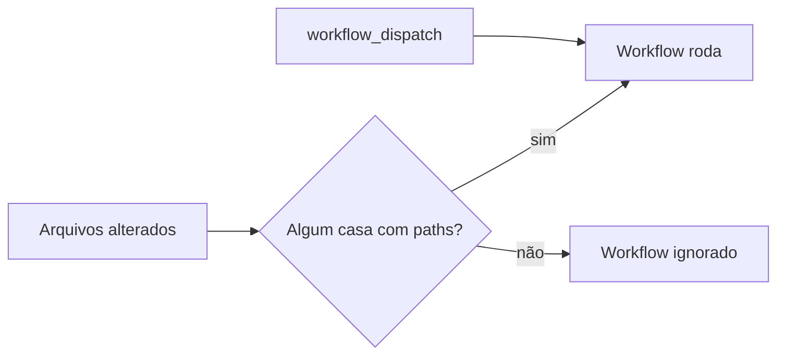

### Por que assim
- **v7 e não uma v5/v6 intermediária:** é a última major, já em Node 24. Pular majors vale quando o changelog foi lido e nada do que usamos mudou.
- **Conferir na fonte:** a versão e o `runs.using` foram lidos na API de releases e no `action.yml` da tag v7. Memória de versões envelhece rápido, ainda mais com nomes e números que mudam a cada ano. Documentação oficial e o arquivo real da tag são a única verdade verificável. Para um `.yml` que roda código com acesso ao repositório, errar a versão tem custo real.
- **Keepalive com `lexml_livros`:** o `livros?select=id` faria o `curl -f` falhar quando os secrets existissem na Fase 1, e o job que existe para manter o projeto vivo passaria a quebrar sozinho.
- **`upload-artifact` ainda zipado:** a v7 aceita `archive: false`, mas isso mudaria o passo a passo do README para baixar o `.ipa`. É melhoria separada, fora do escopo.

### Alternativas descartadas
- **Fixar por SHA agora:** mais seguro, mas só traz benefício se houver rotina de atualização (Dependabot). Fica como decisão futura; hoje as duas actions são oficiais do GitHub.
- **Ignorar o aviso:** o Node 20 vai deixar de ser suportado, e o workflow quebraria sem aviso na data do corte.
- **Variável de ambiente para forçar Node 24 nas actions antigas:** é paliativo. Resolve o aviso, mas deixa a action rodando fora do que o mantenedor testou.

### Padrões e boas práticas
- **Princípio do menor privilégio:** tudo que roda no CI com acesso ao repositório é código de terceiros. Escolha o nível de confiança (tag ou SHA) conforme a origem.
- **Testar a própria CI:** mudança no workflow precisa ser exercitada no PR. Mas se o workflow usa `paths` e nada o inclui, ele é um ponto cego.
- Quando NÃO fixar por SHA: em projetos pequenos, sem rotina de atualização, sem Dependabot, o SHA fica velho e deixa de receber correções de segurança.

### Armadilhas
- Um PR que só muda o workflow e não dispara nada: confira se o próprio arquivo está em `paths`.
- `paths` e proteção de branch: se o check for obrigatório e o workflow não rodar por causa de `paths`, o PR fica esperando um check que nunca chega. Diagnóstico: aba "Actions" e a lista de checks do PR.
- Job `skipped` (como o `ipa` no PR) não é falha. Verifique a condição `if` ou o gatilho antes de se preocupar.
- Tag móvel: duas execuções com o mesmo `@v7` podem rodar código diferente. Se algo "quebrou sem mudança no repo", confira se a action lançou uma versão nova.

### Para ir além
- Documentação do GitHub: "Metadata syntax for GitHub Actions" (`runs.using`) e "Workflow syntax" (`on.<push|pull_request>.paths`) em docs.github.com.
- GitHub Docs: "Security hardening for GitHub Actions", seção sobre usar SHA de commit completo para fixar actions.
- Documentação do Dependabot para `github-actions` em docs.github.com.

### Perguntas
1. Com suas palavras: por que `actions/checkout@v7` roda em Node 24 mesmo que o runner tenha outro Node instalado no sistema? Onde essa escolha está declarada?
2. Se você quisesse fixar `checkout` por SHA, o que escreveria no workflow, e como manteria isso atualizado sem trabalho manual?
3. Um PR muda só `README.md`. Com os `paths` atuais do `ios.yml`, o job `test` roda? E se o PR mudar `ios/Estantes/App/AppInfo.swift`? E se alguém clicar em "Run workflow"? Justifique cada caso.

### Minhas respostas
<!-- Ricardo responde aqui por escrito. O teacher corrige na próxima chamada. -->

## Tarefa 0.10 — Script de testes e economia de contexto (2026-10-03)

### O que foi feito
Criamos `scripts/testar.sh`, que gera o projeto com XcodeGen, roda `xcodebuild test` no simulador e mostra só erros, testes falhos e o resumo; a saída completa vai para um log em `$TMPDIR`. Em `.claude/settings.json` entrou uma deny-list de `Read` para arquivos grandes de `data/` e para o `Estantes.xcodeproj` gerado. O `CLAUDE.md` ganhou as seções "Economia de contexto" e "Compact instructions" (PR #3, commit `a6f9146`).

### Conceitos envolvidos

**Janela de contexto e custo por token.** Um LLM não "lembra": a cada resposta ele recebe de novo todo o contexto (instruções, conversa, saídas de ferramentas) como uma sequência de tokens. Essa sequência tem limite (a janela de contexto), e o custo e a latência crescem com o volume processado. Cada token que entra fica lá até o fim da sessão, sendo reprocessado a cada turno. Um `xcodebuild test` completo despeja milhares de linhas (comandos de compilação, caminhos, warnings repetidos) que não mudam nenhuma decisão. Isso tem dois custos: dinheiro e atenção. Quanto mais ruído, mais difícil o modelo achar o único `error:` que importa. A regra é: o que entra no contexto deve ser informação, não volume.

**O script como filtro.** O padrão é "ruído para o arquivo, sinal para a tela":

- `> "$LOG" 2>&1` redireciona o stdout (fd 1) para o arquivo e depois o stderr (fd 2) para onde o fd 1 aponta. A ordem importa: `2>&1 > arquivo` mandaria o stderr ao terminal. O log completo continua disponível para diagnóstico.
- `$?` guarda o código de saída do último comando (0 = sucesso). Salvamos em `STATUS` logo em seguida, porque qualquer comando posterior (o `grep`, por exemplo) sobrescreve `$?`. O script termina com `exit $STATUS`: o `grep | awk | head` é só apresentação e não pode mascarar a falha. Preservar o código é o que permite a CI, um `&&` ou o próprio Claude saber se passou, sem ler texto.
- `${DESTINO:-"padrão"}` (aqui escrito como atribuição `DESTINO=${DESTINO:-...}`) usa o valor da variável de ambiente se ela existir e não for vazia; senão, o padrão. Dá configuração sem editar o script.
- `cd "$(dirname "$0")/../ios" || exit 1`: `$0` é o caminho do script, `dirname` tira o nome do arquivo, e assim o `cd` é relativo ao script, não a quem o chamou. O `|| exit 1` evita rodar o resto no diretório errado se o `cd` falhar. As aspas protegem contra espaços no caminho.
- `awk '!visto[$0]++'`: `visto` é um array associativo (hash) e `$0` é a linha inteira. `visto[$0]` vale 0 (falso) na primeira vez; `++` incrementa depois de avaliar (pós-incremento). `!0` é verdadeiro, então a linha é impressa (ação padrão do awk). Nas próximas vezes o valor é ≥ 1, `!` dá falso e a linha é descartada. Resultado: deduplicação em passada única, O(n) de tempo, mantendo a ordem original, ao contrário de `sort | uniq`, que reordena, e de `uniq` sozinho, que só remove duplicatas adjacentes. O custo é memória proporcional ao número de linhas distintas, irrelevante aqui.
- `head -80` é um teto de segurança: mesmo que o filtro deixe passar muita coisa, o contexto não explode.

**Deny-list como defesa em profundidade.** As regras `permissions.deny` fazem a ferramenta `Read` recusar certos caminhos, evitando que um arquivo de dezenas de MB entre no contexto por descuido. É uma camada, não um cofre: vale para a ferramenta Read, e um `cat data/x.jsonl` via Bash passa por outro conjunto de regras. Por isso a deny-list se combina com a instrução no `CLAUDE.md` (camada de comportamento) e com o script (camada de ferramenta). Nenhuma camada sozinha é garantia; juntas reduzem muito a chance de erro. Para bloquear de fato, seria preciso também negar `Bash(cat data/...)` e afins, e mesmo assim comandos como `head`, `less` ou `python` abrem brechas. Confirme a sintaxe exata dos padrões na documentação de permissões do Claude Code.

**Compactação de contexto.** Quando a conversa se aproxima do limite da janela, o histórico é resumido por um modelo e o resumo substitui as mensagens antigas. Perde-se detalhe. A seção "Compact instructions" diz o que o resumo deve preservar (decisões, estado da tarefa, arquivos alterados). Por isso também a recomendação de uma tarefa por sessão com `/clear`: começar limpo é mais barato e mais confiável que carregar um histórico resumido.

### Por que assim
- Script em vez de explicar ao Claude "filtre a saída": o comportamento fica versionado, determinístico e igual para o Ricardo e para o agente.
- Log em `$TMPDIR`, fora do repositório: não polui o git e é descartável. O fallback `/tmp` cobre ambientes sem `TMPDIR`.
- Padrão "iPhone 14" porque foi conferido que o simulador local tem esse nome exato (iOS 16.2, compatível com o Xcode 14.2). Se o nome não existir, o `xcodebuild` falha com erro de destino.
- Regex do `grep` inclui `BUILD FAILED` e `error:` para que erros de compilação (que não geram "Test Case failed") também apareçam.

### Alternativas descartadas
- **`xcpretty`/`xcbeautify`:** formatam bem, mas são dependências extras (Ruby/Homebrew) em um Mac antigo. Um `grep` resolve.
- **Deixar a saída inteira e confiar no modelo:** custo alto e sinal diluído.
- **Só a deny-list:** não resolve o caso do `xcodebuild`, cuja saída vem pelo Bash, não pelo Read.

### Padrões e boas práticas
- Separar o código de saída (verdade para máquinas) da saída textual (conveniência para humanos).
- Defesa em profundidade: várias barreiras imperfeitas e independentes.
- Pontos de entrada únicos e documentados (`./scripts/testar.sh`) para tarefas repetidas.
- Quando NÃO filtrar: ao depurar algo estranho, abra o log completo (o script indica o caminho). Filtrar demais esconde a causa.
- **Por que o modo automático bloqueou a edição de `.claude/settings.json` e do `CLAUDE.md`:** permissões e instruções são o que limita e orienta o agente. Se ele pudesse reescrevê-las sozinho, poderia ampliar o próprio poder (remover um `deny`, liberar comandos) sem que um humano decidisse. Há também o risco de injeção de instruções: um texto malicioso em um arquivo, página ou saída de ferramenta que o agente lê poderia induzi-lo a gravar uma regra persistente no `CLAUDE.md`, que seria obedecida em todas as sessões futuras. Exigir que o humano aplique essas mudanças (o `!` no prompt) mantém o controle da fronteira de confiança no Ricardo. O bloqueio foi incômodo aqui, mas o comportamento está correto.

### Armadilhas
- Ler `$?` depois de outro comando: o valor já mudou. Salve em variável imediatamente.
- `2>&1` antes do `>` na ordem errada: o stderr vai para o terminal.
- Em `set -e`/pipelines: o código de um pipeline é o do último comando (a menos que haja `set -o pipefail`), por isso o script captura `STATUS` antes do pipe.
- Nome do simulador errado: `xcodebuild` falha; liste com `xcrun simctl list devices`.
- Padrão do filtro desatualizado: se a Apple mudar o formato das mensagens, o script pode mostrar 0 linhas mesmo com falha. O `Falhou (código N)` cobre esse caso.

### Para ir além
- GNU Bash Reference Manual: "Redirections", "Shell Parameter Expansion" (`:-`) e "Exit Status".
- Livro "The AWK Programming Language" (Aho, Kernighan, Weinberger): arrays associativos e o idioma de deduplicação.
- Documentação do Claude Code: seções de permissões (settings) e gerenciamento de contexto (`/clear`, `/compact`).

### Perguntas
1. Com suas palavras: por que o script salva `$?` em `STATUS` em vez de usar `exit $?` no final, e o que aconteceria na CI se ele terminasse com o código do `head`?
2. Você quer que o script aceite também `SCHEME` como variável com padrão `Estantes`. Como escreveria a linha, e o que muda no `xcodebuild`?
3. Explique, passo a passo, o que `awk '!visto[$0]++'` imprime para a entrada `a b a c b`, uma palavra por linha. Depois diga por que `cat data/x.jsonl` no Bash não é barrado pela regra `Read(./data/**/*.jsonl)` e o que você faria para cobrir isso.

### Minhas respostas
<!-- Ricardo responde aqui por escrito. O teacher corrige na próxima chamada. -->
