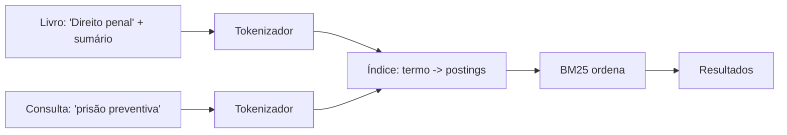

# Fase 1 — Dados

Objetivo da fase: preparar o catálogo (LexML filtrado, esquema no Supabase, RPC `buscar_livro`) que alimenta a identificação de livros. Esta fase também recebeu uma decisão de produto que afeta o modelo das fases seguintes: a busca por assunto.

## Tarefa 1.0 — Plano da busca por assunto (2026-10-03)

### O que foi feito
Só documentação: `docs/PLANO.md` e `CLAUDE.md` passaram a descrever a busca por assunto nos livros já catalogados. O plano ganhou as entidades `ItemSumario` e `Categoria`, o campo `Livro.cddirCaminho`, a seção "Busca na biblioteca" (`Dominio/Busca/`), o sumário nas Fases 3 e 4, os sinônimos na Fase 5 e a RPC `buscar_livro` devolvendo também a `descricao`. Não há código.

### Conceitos envolvidos

**Índice invertido.** Em vez de varrer todos os livros a cada consulta, guarda-se o mapa `termo -> lista de (livro, campo, frequência)`. É o mesmo princípio do índice remissivo no fim de um livro.



Montar custa O(tamanho total do texto). Consultar custa O(soma das listas dos termos da consulta), não O(número de livros). Com uma biblioteca doméstica (centenas ou poucos milhares de livros) o índice cabe folgado em memória, e é por isso que dá para reconstruí-lo ao abrir o app e depois só atualizar: remover o livro (apagar seus postings) e reindexá-lo. Aqui um `[String: [Posting]]` em Swift (dicionário, busca O(1) média por hash) resolve.

**Normalização/tokenização.** Minúsculas, remoção de acentos (por decomposição Unicode e descarte das marcas combinantes) e remoção de palavras vazias (stop words: "de", "da", "e"). Regra de ouro: **o mesmo pipeline vale para indexar e para consultar**. Se divergirem, "prisão" é indexado como `prisao` mas buscado como `prisão` e nada casa. Por isso o plano reaproveita `Regras/Normalizacao`.

**TF-IDF.** Peso de um termo num documento = quão frequente nele (TF) × quão raro na coleção (IDF). Termos que aparecem em todo livro ("direito") valem pouco; "usucapião" vale muito.

**BM25.** É a evolução probabilística do TF-IDF, padrão de fato em busca textual (Lucene/Elasticsearch o usam):

```
score(D,Q) = Σ_q  IDF(q) · f(q,D)·(k1+1) / ( f(q,D) + k1·(1 - b + b·|D|/avgdl) )
IDF(q)     = ln( (N - n_q + 0.5)/(n_q + 0.5) + 1 )
```

- `f(q,D)`: quantas vezes o termo aparece no documento; `N`: total de documentos; `n_q`: em quantos o termo aparece.
- `k1` (tipicamente 1,2 a 2): **saturação**. No TF-IDF puro, 20 ocorrências valem 20 vezes uma; no BM25 a contribuição cresce e achata. Repetir "penal" 20 vezes não faz o livro 20 vezes mais relevante.
- `b` (tipicamente 0,75): **normalização pelo tamanho**. `|D|/avgdl` compara o documento com o tamanho médio. Um livro com sumário de 300 itens contém muitos termos só por ser grande; `b` o penaliza. `b=0` desliga isso, `b=1` normaliza totalmente.

**BM25F (pesos por campo).** O plano quer título valendo mais que autor ou item de sumário. A forma correta (BM25F) é combinar as frequências **antes** da saturação: `f' = Σ_campo peso_campo · f_campo` (com normalização de tamanho por campo), e só então aplicar a fórmula. Somar BM25 separados por campo daria resultado diferente, porque a saturação seria aplicada campo a campo e um termo repetido em vários campos acumularia demais. Vale decidir isso conscientemente na Fase 2. O plano também diz que o item do sumário de melhor nota é o mostrado no resultado: isso é um segundo cálculo, por item, e não só por livro.

**Regras de exclusão no Core Data.** Aplicam-se à relação, do lado do objeto que é apagado:
- *Cascade*: apagar o pai apaga os filhos. `Livro -> itensSumario`: um item sem livro não faz sentido.
- *Nullify*: apagar o objeto apenas zera a referência no outro lado. `Categoria <-> Livro`: apagar a categoria só tira a etiqueta dos livros.
- (Existem ainda *Deny* e *No Action*; No Action deixa referências penduradas, quase sempre um erro.)

**Muitos-para-muitos.** Um livro tem várias categorias e uma categoria tem vários livros. No Core Data basta declarar to-many nos dois lados com relação inversa; o SQLite por baixo cria a tabela de junção. Na exportação JSON isso vira uma lista de UUIDs de categoria dentro de cada livro.

### Por que assim
- **Busca local, no Domínio:** a biblioteca é pequena, o app já funciona offline e o algoritmo vira função pura testável em XCTest, sem simulador. Um servidor traria latência, dependência de rede e custo sem benefício.
- **Categoria como entidade (e não campo `assuntos` de texto):** pode ser renomeada num só lugar, ter cor, ser filtrada e apagada sem apagar livros. Texto livre geraria "Penal", "penal" e "Direito Penal" como assuntos distintos.
- **Cor como enum de paleta:** o Domínio só importa Foundation e um hex fixo não serve para os dois modos (claro/escuro). O identificador é traduzido para `Color` na Apresentação, com dois tons.
- **`cddirCaminho` como String com " > ":** evita um atributo Transformable (serialização opaca, difícil de migrar); no Domínio continua `[String]`. Custo: o separador não pode aparecer num nível.
- **Sumário guarda só texto:** é o que a busca consome; fotos pesariam no banco e na exportação.
- **Assuntos do LexML continuam fora:** só existem em `/busca/`, que o robots.txt proíbe. A `descricao` (24.118 livros com "Sumário: ...") entra por outra via legítima.

### Alternativas descartadas
- **`NSPredicate` com `CONTAINS[cd]`:** simples, mas sem ranking, sem pesos e varre tudo; o acento ainda exigiria cuidado. (Para uma lista pequena funcionaria; porém o objetivo do projeto é aprender e o ranking é o ponto.)
- **Core Data + FTS5 do SQLite:** o Core Data não expõe FTS; seria preciso um segundo banco. Mais acoplamento à infraestrutura e o algoritmo deixaria de estar no Domínio.
- **Busca no Postgres (`tsvector`/`pg_trgm`):** exigiria enviar a biblioteca do usuário ao servidor e perderia o offline.
- **TF-IDF puro:** ignora saturação e tamanho; livros com sumário enorme dominariam o ranking.
- **Empurrar a identificação do sumário para as Fases 6/7:** adiaria o valor principal; fundi-la nas Fases 3-5 reaproveita câmera, Vision e Edge Functions.

### Padrões e boas práticas
- **Ports and adapters / arquitetura limpa:** a regra (busca) no centro, sem dependência de framework.
- **Mesma função de normalização na escrita e na leitura.**
- **Índice como dado derivado:** a fonte da verdade é o Core Data; o índice pode ser descartado e reconstruído. Não o persista sem necessidade, pois persistir cria um problema de sincronização.
- **Quando NÃO usar índice invertido:** com poucas dezenas de itens, uma varredura linear é mais simples e igualmente rápida. Aqui ele se justifica pelo ranking e pelo número de itens de sumário (milhares de linhas).

### Armadilhas
- **IDF instável em coleção pequena:** com poucos livros, `N` e `n_q` são pequenos e o IDF oscila muito. O `+1` dentro do `ln` evita IDF negativo para termos presentes em mais da metade dos documentos (a variante original podia dar negativo).
- **Esquecer de reindexar** ao editar, mover ou apagar um livro: resultados fantasmas. Teste: alterar e consultar.
- **Stop words agressivas** apagam termos úteis (ex.: "não", em "ônus da prova" ficaria bem, mas "lei n" perderia contexto); mantenha a lista curta.
- **Normalização Unicode:** "é" pode vir pré-composto (NFC) ou decomposto (NFD). Normalize com `folding(options: .diacriticInsensitive, locale:)` ou decomponha antes de comparar.
- **`avgdl` com campo vazio:** divisão por zero se não houver documentos; trate o índice vazio.
- **Core Data:** esquecer a relação inversa gera avisos e inconsistências; escolher cascade no lado errado apaga dados do usuário.

### Para ir além
- Manning, Raghavan, Schütze, *Introduction to Information Retrieval* (gratuito online), caps. 1, 6 e 11.
- Robertson e Zaragoza, "The Probabilistic Relevance Framework: BM25 and Beyond" (2009), sobre BM25 e BM25F.
- Documentação da Apple, "Core Data > Relationships" (delete rules).

### Perguntas
1. Com suas palavras: por que um índice invertido torna a consulta mais rápida que percorrer todos os livros, e qual é o preço dessa velocidade?
2. Se um usuário tem uma biblioteca de 40 livros em vez de 2.000, o que muda na confiabilidade do IDF? Você ainda usaria BM25 ou algo mais simples? Justifique.
3. Um livro tem sumário com 300 itens e outro tem 10. Ambos contêm "prescrição" uma vez. Qual vai ficar na frente, e quais parâmetros da fórmula controlam isso? O que muda se `b` for 0?

### Minhas respostas
<!-- Ricardo responde aqui por escrito. O teacher corrige na próxima chamada. -->
