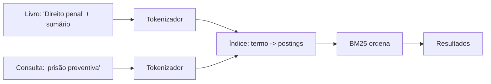
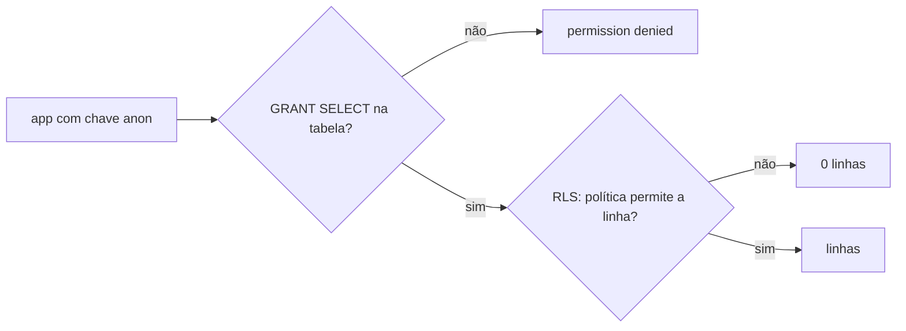

# Fase 1 — Dados

Objetivo da fase: preparar o catálogo (LexML filtrado, esquema no Supabase, RPC `buscar_livro`) que alimenta a identificação de livros. Esta fase também recebeu uma decisão de produto que afeta o modelo das fases seguintes: a busca por assunto.

## Tarefa 1.0 — Plano da busca por assunto (2026-10-03)

### O que foi feito
Só documentação: `docs/PLANO.md` e `CLAUDE.md` passaram a descrever a busca por assunto nos livros já catalogados. O plano ganhou as entidades `ItemSumario` e `Categoria`, o campo `Livro.cddirCaminho`, a seção "Busca na biblioteca" (`Dominio/Busca/`), o sumário nas Fases 3 e 4, os sinônimos na Fase 5 e a RPC `buscar_livro` devolvendo também a `descricao`. Não há código.

### Conceitos envolvidos

**Índice invertido.** Em vez de varrer todos os livros a cada consulta, guarda-se o mapa `termo -> lista de (livro, campo, frequência)`. É o mesmo princípio do índice remissivo no fim de um livro.



Montar custa O(tamanho total do texto). Consultar custa O(soma das listas dos termos da consulta), não O(número de livros). Com uma biblioteca doméstica (centenas ou poucos milhares de livros) o índice cabe folgado em memória, e é por isso que dá para reconstruí-lo ao abrir o app e depois só atualizar: remover o livro (apagar seus postings) e reindexá-lo. Aqui um `[String: [Posting]]` em Swift (dicionário, busca O(1) média por hash) resolve.

**Normalização/tokenização.** Minúsculas, remoção de acentos (por decomposição Unicode e descarte das marcas combinantes) e remoção de palavras vazias (stop words: "de", "da", "e"). Regra de ouro: **o mesmo pipeline vale para indexar e para consultar**. Se divergirem, "prisão" é indexado como `prisao` mas buscado como `prisão` e nada casa. Por isso o plano reaproveita `Regras/Normalizacao`.

**TF-IDF.** Peso de um termo num documento = quão frequente nele (TF) × quão raro na coleção (IDF). Termos que aparecem em todo livro ("direito") valem pouco; "usucapião" vale muito.

**BM25.** É a evolução probabilística do TF-IDF, padrão de fato em busca textual (Lucene/Elasticsearch o usam):

```
score(D,Q) = Σ_q  IDF(q) · f(q,D)·(k1+1) / ( f(q,D) + k1·(1 - b + b·|D|/avgdl) )
IDF(q)     = ln( (N - n_q + 0.5)/(n_q + 0.5) + 1 )
```

- `f(q,D)`: quantas vezes o termo aparece no documento; `N`: total de documentos; `n_q`: em quantos o termo aparece.
- `k1` (tipicamente 1,2 a 2): **saturação**. No TF-IDF puro, 20 ocorrências valem 20 vezes uma; no BM25 a contribuição cresce e achata. Repetir "penal" 20 vezes não faz o livro 20 vezes mais relevante.
- `b` (tipicamente 0,75): **normalização pelo tamanho**. `|D|/avgdl` compara o documento com o tamanho médio. Um livro com sumário de 300 itens contém muitos termos só por ser grande; `b` o penaliza. `b=0` desliga isso, `b=1` normaliza totalmente.

**BM25F (pesos por campo).** O plano quer título valendo mais que autor ou item de sumário. A forma correta (BM25F) é combinar as frequências **antes** da saturação: `f' = Σ_campo peso_campo · f_campo` (com normalização de tamanho por campo), e só então aplicar a fórmula. Somar BM25 separados por campo daria resultado diferente, porque a saturação seria aplicada campo a campo e um termo repetido em vários campos acumularia demais. Vale decidir isso conscientemente na Fase 2. O plano também diz que o item do sumário de melhor nota é o mostrado no resultado: isso é um segundo cálculo, por item, e não só por livro.

**Regras de exclusão no Core Data.** Aplicam-se à relação, do lado do objeto que é apagado:
- *Cascade*: apagar o pai apaga os filhos. `Livro -> itensSumario`: um item sem livro não faz sentido.
- *Nullify*: apagar o objeto apenas zera a referência no outro lado. `Categoria <-> Livro`: apagar a categoria só tira a etiqueta dos livros.
- (Existem ainda *Deny* e *No Action*; No Action deixa referências penduradas, quase sempre um erro.)

**Muitos-para-muitos.** Um livro tem várias categorias e uma categoria tem vários livros. No Core Data basta declarar to-many nos dois lados com relação inversa; o SQLite por baixo cria a tabela de junção. Na exportação JSON isso vira uma lista de UUIDs de categoria dentro de cada livro.

### Por que assim
- **Busca local, no Domínio:** a biblioteca é pequena, o app já funciona offline e o algoritmo vira função pura testável em XCTest, sem simulador. Um servidor traria latência, dependência de rede e custo sem benefício.
- **Categoria como entidade (e não campo `assuntos` de texto):** pode ser renomeada num só lugar, ter cor, ser filtrada e apagada sem apagar livros. Texto livre geraria "Penal", "penal" e "Direito Penal" como assuntos distintos.
- **Cor como enum de paleta:** o Domínio só importa Foundation e um hex fixo não serve para os dois modos (claro/escuro). O identificador é traduzido para `Color` na Apresentação, com dois tons.
- **`cddirCaminho` como String com " > ":** evita um atributo Transformable (serialização opaca, difícil de migrar); no Domínio continua `[String]`. Custo: o separador não pode aparecer num nível.
- **Sumário guarda só texto:** é o que a busca consome; fotos pesariam no banco e na exportação.
- **Assuntos do LexML continuam fora:** só existem em `/busca/`, que o robots.txt proíbe. A `descricao` (24.118 livros com "Sumário: ...") entra por outra via legítima.

### Alternativas descartadas
- **`NSPredicate` com `CONTAINS[cd]`:** simples, mas sem ranking, sem pesos e varre tudo; o acento ainda exigiria cuidado. (Para uma lista pequena funcionaria; porém o objetivo do projeto é aprender e o ranking é o ponto.)
- **Core Data + FTS5 do SQLite:** o Core Data não expõe FTS; seria preciso um segundo banco. Mais acoplamento à infraestrutura e o algoritmo deixaria de estar no Domínio.
- **Busca no Postgres (`tsvector`/`pg_trgm`):** exigiria enviar a biblioteca do usuário ao servidor e perderia o offline.
- **TF-IDF puro:** ignora saturação e tamanho; livros com sumário enorme dominariam o ranking.
- **Empurrar a identificação do sumário para as Fases 6/7:** adiaria o valor principal; fundi-la nas Fases 3-5 reaproveita câmera, Vision e Edge Functions.

### Padrões e boas práticas
- **Ports and adapters / arquitetura limpa:** a regra (busca) no centro, sem dependência de framework.
- **Mesma função de normalização na escrita e na leitura.**
- **Índice como dado derivado:** a fonte da verdade é o Core Data; o índice pode ser descartado e reconstruído. Não o persista sem necessidade, pois persistir cria um problema de sincronização.
- **Quando NÃO usar índice invertido:** com poucas dezenas de itens, uma varredura linear é mais simples e igualmente rápida. Aqui ele se justifica pelo ranking e pelo número de itens de sumário (milhares de linhas).

### Armadilhas
- **IDF instável em coleção pequena:** com poucos livros, `N` e `n_q` são pequenos e o IDF oscila muito. O `+1` dentro do `ln` evita IDF negativo para termos presentes em mais da metade dos documentos (a variante original podia dar negativo).
- **Esquecer de reindexar** ao editar, mover ou apagar um livro: resultados fantasmas. Teste: alterar e consultar.
- **Stop words agressivas** apagam termos úteis (ex.: "não", em "ônus da prova" ficaria bem, mas "lei n" perderia contexto); mantenha a lista curta.
- **Normalização Unicode:** "é" pode vir pré-composto (NFC) ou decomposto (NFD). Normalize com `folding(options: .diacriticInsensitive, locale:)` ou decomponha antes de comparar.
- **`avgdl` com campo vazio:** divisão por zero se não houver documentos; trate o índice vazio.
- **Core Data:** esquecer a relação inversa gera avisos e inconsistências; escolher cascade no lado errado apaga dados do usuário.

### Para ir além
- Manning, Raghavan, Schütze, *Introduction to Information Retrieval* (gratuito online), caps. 1, 6 e 11.
- Robertson e Zaragoza, "The Probabilistic Relevance Framework: BM25 and Beyond" (2009), sobre BM25 e BM25F.
- Documentação da Apple, "Core Data > Relationships" (delete rules).

### Perguntas
1. Com suas palavras: por que um índice invertido torna a consulta mais rápida que percorrer todos os livros, e qual é o preço dessa velocidade?
2. Se um usuário tem uma biblioteca de 40 livros em vez de 2.000, o que muda na confiabilidade do IDF? Você ainda usaria BM25 ou algo mais simples? Justifique.
3. Um livro tem sumário com 300 itens e outro tem 10. Ambos contêm "prescrição" uma vez. Qual vai ficar na frente, e quais parâmetros da fórmula controlam isso? O que muda se `b` for 0?

### Minhas respostas
<!-- Ricardo responde aqui por escrito. O teacher corrige na próxima chamada. -->

(sem respostas até a Tarefa 1.1: nada a corrigir ainda. As três perguntas acima continuam abertas.)

## Tarefa 1.1 — BM25F fixado como ranking (2026-10-03)

### O que foi feito
`docs/PLANO.md` (e `CLAUDE.md`) passaram a dizer "BM25F" onde antes dizia "BM25": diagrama, árvore de pastas, checklist e histórico. O plano agora registra que as frequências são combinadas com pesos antes da saturação, que cada campo tem seu `b`, que o IDF é calculado uma vez por termo sobre o livro inteiro, e que o item de sumário exibido é o de melhor nota BM25 entre os itens do livro. Só documentação, sem código.

### Conceitos envolvidos

**Por que somar BM25 por campo é diferente: um exemplo com números.** A teoria está na Tarefa 1.0; aqui só os números. A parte da fórmula que satura é `sat(f) = f·(k1+1) / (f + k1)`. Para isolar o efeito, use `b = 0` (sem normalização de tamanho), `IDF = 1` e `k1 = 1,2`, então `sat(f) = 2,2·f / (f + 1,2)`. Pesos ilustrativos: título = 3, sumário = 1. Consulta de um termo só: "prescrição".

| Livro | Ocorrências | Soma de BM25 por campo | BM25F |
| --- | --- | --- | --- |
| A | 1 no título, 1 no sumário | 3·sat(1) + 1·sat(1) = 3·1,00 + 1·1,00 = **4,00** | f' = 3·1 + 1·1 = 4; sat(4) = **1,69** |
| B | 4 no sumário | 1·sat(4) = **1,69** | f' = 4; sat(4) = **1,69** |
| D | 1 no título | 3·sat(1) = **3,00** | f' = 3; sat(3) = **1,57** |

O que isso mostra:
- **O teto.** No BM25F a nota de um termo nunca passa de `IDF·(k1+1) = 2,2`, não importa em quantos campos ele apareça. Na soma por campo o teto é `(soma dos pesos)·2,2 = 8,8`. Ou seja, o peso dos campos passa a funcionar como multiplicador da nota final, não como importância relativa de cada campo.
- **O termo repetido é contado como evidência nova.** Em A, o termo aparece em dois campos e a soma por campo dá 4,00 contra 3,00 de D (33% a mais). No BM25F, A fica com 1,69 contra 1,57 de D (8% a mais): o segundo aparecimento ajuda, mas com retorno decrescente, que é o comportamento desejado.
- **A e B empatam no BM25F.** Com esses pesos, "uma vez no título + uma no sumário" equivale a "quatro vezes só no sumário" (`f' = 4` nos dois). Na soma por campo, A ganha de B por 2,4 vezes. Esse empate é uma consequência dos pesos escolhidos; por isso o plano manda ajustá-los com testes, e não por intuição.

Com `b > 0` o cálculo muda só em um ponto: cada `f_campo` é dividido por seu próprio fator `1 - b_campo + b_campo·|campo|/avgdl_campo` antes de ser multiplicado pelo peso. A saturação continua uma só.

### Por que assim
- **Um único IDF por termo, sobre o livro inteiro:** "prescrição" é rara ou comum na biblioteca independentemente do campo em que apareceu. IDF por campo faria o mesmo termo ter "raridades" diferentes.
- **Constantes nomeadas para pesos, `k1` e `b`:** são parâmetros de ajuste, não lógica. Testes XCTest com pequenas bibliotecas fixas (por exemplo, "o livro com o termo no título vem antes do que o tem só no sumário") travam o comportamento desejado quando se mexe nos números.
- **Nota por item de sumário só para escolher o trecho mostrado:** a nota do livro vem do BM25F; a do item serve para exibir "o capítulo que casou", sem alterar a ordenação.

### Alternativas descartadas
- **Soma de BM25 por campo:** ver a tabela; infla livros com o termo repetido em vários campos.
- **Pesos fixos sem testes:** os números do exemplo acima mostram como é fácil produzir empates ou inversões inesperadas.

### Padrões e boas práticas
- **Parâmetros como dados, comportamento como teste:** os valores mudam; as propriedades ("título ganha de sumário") ficam protegidas.
- **Decisão de algoritmo registrada antes do código:** o custo de mudar um documento é quase zero; o de mudar um índice já implementado, não.

### Armadilhas
- **Aplicar o peso depois da saturação** é justamente a soma por campo disfarçada: o peso multiplica `f`, não a nota.
- **`avgdl` por campo, não global:** títulos têm 5 palavras, sumários têm centenas; usar uma média única faria o `b` penalizar o sumário e favorecer o título sem motivo.

### Para ir além
- Robertson e Zaragoza, "The Probabilistic Relevance Framework: BM25 and Beyond" (2009), seção sobre BM25F.

### Perguntas
1. Refaça a tabela com `k1 = 2` (mantendo pesos e `b = 0`). O teto muda? A e B continuam empatados no BM25F?
2. Se o peso do título passar de 3 para 5, quantas ocorrências no sumário equivalem a uma no título? Isso é bom para livros com sumários enormes?
3. Um colega propõe aplicar o IDF por campo ("prescrição" é rara no título, comum no sumário). Que problema isso traria para o ranking do livro?

### Minhas respostas
<!-- Ricardo responde aqui por escrito. O teacher corrige na próxima chamada. -->

(sem respostas)

## Tarefa 1.2 — Conexão com o Supabase e ajustes do plano (2026-10-07)

### O que foi feito
Conectamos ao Postgres do Supabase (projeto vazio) pelo `psql` 14 já instalado, usando a connection string do Session pooler em `SUPABASE_DB_URL` (arquivo `.env`, ignorado pelo Git; `.env.example` versionado, sem segredo). O teste `select version()` devolveu PostgreSQL 17.11. Em `docs/PLANO.md` foram registradas as decisões de migrations, extensões, importação, RLS e keepalive, e o checklist foi renumerado em 1.2 a 1.7. Também diagnosticamos a falha do workflow "Supabase keepalive #1".

### Conceitos envolvidos

**IPv4 x IPv6 e o pooler.** A conexão direta do Supabase (`db.<ref>.supabase.co:5432`) só tem endereço IPv6. Redes e máquinas sem IPv6 (comum em provedores residenciais) não alcançam. O Supavisor, pooler de conexões do Supabase, tem endereço IPv4 e fica na frente do Postgres. Um pooler existe porque cada conexão Postgres é um processo do sistema operacional (modelo process-per-connection), caro em memória; centenas de clientes abrindo conexões esgotam o servidor. O pooler multiplexa muitos clientes em poucas conexões reais.

**Session mode (5432) x transaction mode (6543).**

| | Session | Transaction |
| --- | --- | --- |
| Conexão real | dedicada enquanto o cliente está conectado | emprestada só durante uma transação |
| `SET`, prepared statements, `LISTEN`, tabelas temporárias | funcionam | podem quebrar (a próxima transação pode cair em outra conexão real) |
| Bom para | `psql`, migrations, `\copy` | serverless / muitas conexões curtas |

Aqui usamos session mode porque a importação do CSV usa uma tabela temporária de staging, que vive na sessão. Em transaction mode ela poderia sumir entre comandos.

**Schemas e extensões.** Um schema é um namespace dentro do banco. O PostgREST (API REST do Supabase) expõe por padrão o schema `public`. Extensões instaladas em `public` despejam suas funções lá, ficando visíveis pela API. Em `extensions`, não. Daí `create extension ... with schema extensions`.

**`f_unaccent` e `IMMUTABLE`.** `unaccent` é declarada `STABLE` (depende do dicionário), e índices por expressão exigem função `IMMUTABLE`. O embrulho `f_unaccent` declara `immutable` para poder indexar `f_unaccent(titulo)` com trigram. Chamar `extensions.unaccent('extensions.unaccent', $1)` com o dicionário qualificado fixa qual dicionário é usado, sem depender do `search_path` da sessão; é isso que torna a promessa de imutabilidade razoavelmente honesta. Se o dicionário mudasse, o índice ficaria inconsistente.

**RLS (Row Level Security).** Política por linha avaliada pelo Postgres. Com RLS ligado e sem política, nada passa. Fizemos `select` para `anon`/`authenticated` e nenhuma política de escrita: escrever é negado por padrão. A service role tem o atributo `BYPASSRLS` e ignora tudo, por isso só as Edge Functions escrevem.

**Staging.** `\copy` é comando do `psql` (lê o arquivo no cliente), diferente de `COPY` (lê no servidor, onde não temos acesso no Supabase). Ele exige que as colunas do arquivo casem com as da tabela de destino; como o CSV tem 7 colunas e a tabela tem 6, carregamos numa tabela temporária com as 7 e depois `insert ... select` das 6 úteis.

**Keepalive e agendamento.** O projeto grátis pausa após 7 dias sem atividade; o workflow agendado faz um ping HTTP. O header `apikey` basta; a chave `sb_publishable_` não é JWT, então não vai em `Authorization: Bearer`.

**A falha do keepalive #1.** A mensagem `The job was not acquired by Runner of type hosted even after multiple attempts` significa que o GitHub não alocou nenhuma máquina; o job foi cancelado após ~15 min na fila. Nenhuma linha do nosso script rodou, logo não é bug nosso. Mesmo se rodasse, sairia com exit 0 por falta dos secrets (a tarefa 1.6 resolve).

### Por que assim
- **psql em vez do CLI:** já está instalado; o CLI só é necessário para Edge Functions (Fase 4). Nomear os arquivos `AAAAMMDDHHMMSS_nome.sql` evita renomear depois. A ordem lexicográfica do nome é a ordem de aplicação.
- **`.env` + `.env.example`:** o exemplo documenta a variável sem expor a senha; o real nunca entra no Git.
- **Importação fora das migrations:** migration descreve esquema e deve ser repetível em qualquer ambiente; dado de 83 mil linhas é outra natureza.

### Alternativas descartadas
- **Supabase CLI agora:** mais uma ferramenta no macOS Monterey sem benefício até a Fase 4.
- **SQL Editor do painel:** não tem `\copy` e deixa o repositório divergir do banco (esquema que ninguém versionou).
- **Reescrever o CSV em Python para tirar a coluna `autores`:** mais código para manter e outro arquivo gerado; o staging resolve em SQL.
- **Conexão direta:** não funciona sem IPv6.

### Padrões e boas práticas
- **Migrations versionadas e imutáveis:** nunca edite uma já aplicada; crie outra. Quando NÃO usar: protótipos descartáveis.
- **Segredo fora do repositório, exemplo dentro:** padrão `.env.example`.
- **Menor privilégio:** o app só lê; escrita só com a service role, que nunca vai ao app.

### Armadilhas
- **Senha com caracteres especiais** (`@`, `/`, `#`) na URL precisa de percent-encoding, ou o `psql` interpreta o host errado.
- **`source .env` com `set -a`:** sem exportar, `$SUPABASE_DB_URL` fica vazia no `psql`. Diagnostique com `echo ${SUPABASE_DB_URL:+definida}`.
- **Workflows agendados são desativados após 60 dias sem commits** no repositório; o keepalive pararia sem aviso e o projeto seria pausado.
- **Rodar prepared statements/`SET` no porta 6543** e ver comportamento estranho.
- **`COPY` x `\copy`:** o primeiro falha por permissão no Supabase.

### Para ir além
- Documentação do Supabase: "Connecting to your database" (direct, session e transaction pooler).
- PostgreSQL docs: "Row Security Policies" e "Volatility Categories" (IMMUTABLE/STABLE/VOLATILE) em CREATE FUNCTION.

### Perguntas
1. Com suas palavras: por que a conexão direta falhou e o pooler funciona? Qual a diferença prática entre session e transaction mode?
2. Se a importação fosse feita pela porta 6543, o que poderia dar errado com a tabela de staging temporária? Por quê?
3. Alguém marca `f_unaccent` como `IMMUTABLE` mas ela chama `unaccent` sem qualificar o dicionário, e o `search_path` de um usuário é diferente. Que bug pode aparecer no índice trigram?

### Minhas respostas
<!-- Ricardo responde aqui por escrito. O teacher corrige na próxima chamada. -->

(sem respostas)

---

## Tarefa 1.3 — Migration do esquema inicial (2026-10-07)

### O que foi feito
Você escreveu a migration `supabase/migrations/20261007120000_esquema_inicial.sql`: extensões `pg_trgm` e `unaccent` no schema `extensions`, a função `f_unaccent`, as tabelas `lexml_livros`, `obras` e `edicoes`, os índices (GIN trigrama no título, GIN em `isbn13`, B-tree em `obra_id`) e RLS de leitura pública. Na revisão entraram os `grant`/`revoke` explícitos e o `set search_path = ''`. O `docs/PLANO.md` foi atualizado para refletir isso. A migration foi aplicada e testada com `set role anon`.

### Conceitos envolvidos

**Migration.** É um arquivo SQL versionado que muda o esquema do banco, aplicado uma vez e em ordem. Pense numa lei que altera o ordenamento: não se reescreve lei já publicada, edita-se por emenda (outra migration). O nome `AAAAMMDDHHMMSS_nome.sql` dá a ordem pela ordenação lexicográfica. O banco é um estado; as migrations são o histórico que reconstrói esse estado do zero em qualquer ambiente.

**Transação e `begin ... commit`.** Todo o arquivo roda como uma unidade: ou o esquema inteiro nasce, ou nada. O DDL do Postgres é transacional (o MySQL, por exemplo, não é), então dá para desfazer um `create table`. Por isso o ensaio com `begin ... rollback` funciona: roda tudo, confere e desfaz.

A armadilha do `psql`: sem `-v ON_ERROR_STOP=1`, quando um comando falha dentro da transação o Postgres a marca como abortada, os comandos seguintes falham com "current transaction is aborted", o `commit` final vira `rollback` e o `psql` ainda sai com código 0. Um script de deploy acharia que deu certo. Com `ON_ERROR_STOP` o `psql` para no primeiro erro e sai com código diferente de zero.

**Índice B-tree x GIN.** O B-tree é a lista telefônica: guarda valores em ordem, serve para `=`, `<`, `>` e prefixo (`like 'abc%'`), e é inútil para "parecido com". O GIN (Generalized Inverted Index) é o índice remissivo no fim do livro: mapeia cada *chave* para a lista de linhas que a contêm. Em `isbn13 text[]`, as chaves são os elementos do array; em `titulo` com `gin_trgm_ops`, as chaves são trigramas.

**Trigramas.** O `pg_trgm` quebra o texto (com espaços de preenchimento) em sequências de 3 caracteres. "penal" vira `"  p"`, `" pe"`, `"pen"`, `"ena"`, `"nal"`, `"al "`. Um OCR errado, "pena1", vira `"  p"`, `" pe"`, `"pen"`, `"ena"`, `"na1"`, `"a1 "`. Compartilham 4 de 8 trigramas distintos no total, similaridade 0,5. Um erro de um caractere destrói só 3 trigramas, o resto sobrevive. Por isso a busca tolera erro de OCR, e o GIN encontra rápido as linhas que compartilham trigramas com a consulta.

**`f_unaccent` e índice por expressão.** O índice é sobre `lower(f_unaccent(titulo))`, não sobre `titulo`. O Postgres só usa esse índice se a consulta contiver a *mesma expressão*. Isso será decisivo na tarefa 1.5.

**`set search_path = ''`.** O linter do Supabase (`function_search_path_mutable`) avisa quando uma função depende do `search_path` de quem a chama, o que permite a um usuário malicioso criar um objeto homônimo em um schema que apareça antes. Com `''`, nada é resolvido implicitamente. Funciona aqui porque tudo está qualificado (`extensions.unaccent(...)`). Não atrapalha o índice por expressão; o efeito colateral é que funções SQL com `SET` não sofrem *inlining* pelo planejador (o corpo não é "colado" na consulta), um custo pequeno aqui.

**RLS e GRANT são camadas independentes.** Para ler uma linha, o papel precisa passar por duas portas:
1. **GRANT**: pode usar a tabela? (privilégio de objeto: SELECT, INSERT, TRUNCATE...)
2. **RLS**: quais linhas? (política por linha)



Verificamos com `pg_default_acl` que, neste projeto, tabelas criadas pelo papel `postgres` dão ao `anon` só `Dxtm` (TRUNCATE, REFERENCES, TRIGGER, MAINTAIN) e **não** dão SELECT. Resultado sem o `grant`: "permission denied" mesmo com a política correta. Pior: TRUNCATE **não é controlado por RLS**, então o `anon` poderia apagar a tabela inteira. O `revoke all` + `grant select` fecha as duas falhas. Analogia: a política é a autorização escrita na portaria; o GRANT é o crachá que deixa você chegar até a portaria. A chave pública (`anon`) vai dentro do `.ipa` e qualquer um a extrai, portanto a segurança tem de estar no banco, não no segredo da chave.

**Sintaxe da política.** `create policy nome on tabela for select to anon, authenticated using (true)`. `using` é o filtro de linhas visíveis; `true` = todas. Sem política de `insert/update/delete`, essas operações são negadas por padrão. A service role tem `BYPASSRLS`, e é por ela que a Edge Function escreve.

**Modelo de dados e o fluxo.**
- `lexml_livros`: catálogo importado, só leitura, usado na busca por título.
- `obras` + `edicoes`: *cache* preenchido de uma vez pela Edge Function `enriquecer-urn` (1 obra + N edições da ficha `/urn`), depois que o usuário confirma o candidato.
- A comparação de autores acontece no app (`Pontuacao`), não no banco.
- O ISBN lido do código de barras é consultado primeiro em `edicoes.isbn13`.
- `local` não é palavra reservada no Postgres (é *keyword* não reservada); o editor só a colore.
- `on delete cascade` em `edicoes.obra_id`: apagar a obra apaga suas edições, evitando órfãs.

### Por que assim
- **Migration em transação:** esquema atômico, sem estado meio criado.
- **Extensões em `extensions`:** padrão do Supabase, fora da API REST.
- **`ficha jsonb` bruta:** permite reprocessar sem chamar a fonte de novo.
- **`isbn13 text[]` + GIN:** uma edição pode ter vários ISBNs; GIN indexa os elementos.
- **`urn` como PK de `edicoes`:** é a chave natural, estável.
- **Grants explícitos:** não depender de defaults da plataforma, que mudam e variam por papel criador.
- **`alter policy ... rename` em vez de nova migration:** a migration já estava aplicada, mas ainda não commitada. Renomeamos no banco e no arquivo para ficarem iguais. Depois do commit (e do merge), mudar seria uma migration nova.

### Alternativas descartadas
- **Criar a política "para todos" sem `to`:** valeria para `public` (todos os papéis); preferimos nomear os papéis.
- **Desligar o RLS e só usar GRANT:** funcionaria para leitura, mas RLS é a defesa que continua valendo se alguém conceder um privilégio a mais por engano; o Supabase também recomenda RLS em tudo que fica exposto.
- **Chave natural única em `obras`:** não existe uma; veja armadilhas.
- **B-tree em `titulo`:** não atende "parecido com".

### Padrões e boas práticas
- **Menor privilégio e defesa em profundidade:** GRANT mínimo + RLS + sem política de escrita.
- **Ensaio com `begin ... rollback`:** teste destrutivo sem risco; só vale para DDL transacional (Postgres).
- **Migration imutável depois de publicada.** Quando NÃO seguir: antes do commit/aplicação em ambientes compartilhados, ajustar o arquivo é aceitável, desde que banco e arquivo fiquem idênticos.
- **Verificar com o papel real:** `set role anon` e tentar `select`, `insert`, `truncate`. Testar como superusuário não prova nada sobre permissões.

### Armadilhas
- **Índice por expressão só é usado se a consulta repetir a expressão.** Na 1.5, `similarity(...) > 0.3` no `WHERE` faz *seq scan*; o índice é usado com o operador `%`: `lower(f_unaccent(titulo)) % lower(f_unaccent($1))`. Diagnostique com `explain analyze`.
- **Operadores de array:** `isbn13 @> array['978...']` usa o GIN; `'978...' = any(isbn13)` não.
- **`obras` não tem chave natural única:** a Fase 4 precisa evitar duplicar a mesma obra ao enriquecer duas edições dela.
- **Default privileges variam por projeto/papel:** confira com `\ddp` ou `pg_default_acl` em vez de presumir.
- **Esquecer `ON_ERROR_STOP`** (ver acima).

### Para ir além
- PostgreSQL docs: "pg_trgm" e "GIN Index Types"; "Row Security Policies" e "GRANT".
- Supabase docs: "Row Level Security" e a seção sobre privilégios das tabelas / Database Linter.
- *Designing Data-Intensive Applications* (Kleppmann), cap. 3, sobre estruturas de índice.

### Perguntas
1. Com suas palavras: por que a RLS sozinha não bastava para o app ler `lexml_livros`? Qual a diferença entre GRANT e uma política?
2. Se amanhã quisermos buscar por autor com tolerância a erro, usando `autores text[]` em `obras`, que tipo de índice você criaria e que cuidado teria para o planejador realmente usá-lo?
3. Você descobre um erro na migration já mergeada (esqueceu um `not null` numa coluna). Você edita o arquivo e reaplica? Por quê, e o que faz em vez disso?

### Minhas respostas
<!-- Ricardo responde aqui por escrito. O teacher corrige na próxima chamada. -->
