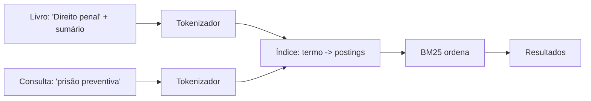
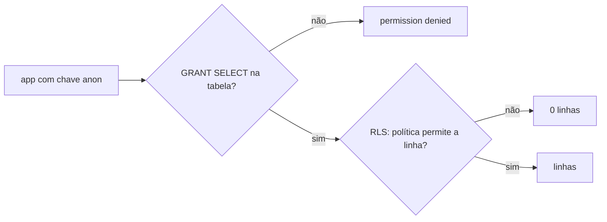
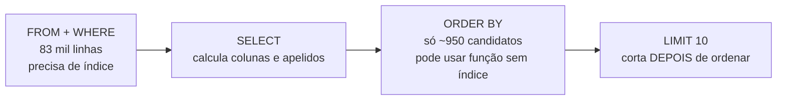

# Fase 1 — Dados

Objetivo da fase: preparar o catálogo (LexML filtrado, esquema no Supabase, RPC `buscar_livro`) que alimenta a identificação de livros. Esta fase também recebeu uma decisão de produto que afeta o modelo das fases seguintes: a busca por assunto.

## Tarefa 1.0 — Plano da busca por assunto (2026-10-03)

### O que foi feito
Só documentação: `docs/PLANO.md` e `CLAUDE.md` passaram a descrever a busca por assunto nos livros já catalogados. O plano ganhou as entidades `ItemSumario` e `Categoria`, o campo `Livro.cddirCaminho`, a seção "Busca na biblioteca" (`Dominio/Busca/`), o sumário nas Fases 3 e 4, os sinônimos na Fase 5 e a RPC `buscar_livro` devolvendo também a `descricao`. Não há código.

### Conceitos envolvidos

**Índice invertido.** Em vez de varrer todos os livros a cada consulta, guarda-se o mapa `termo -> lista de (livro, campo, frequência)`. É o mesmo princípio do índice remissivo no fim de um livro.



Montar custa O(tamanho total do texto). Consultar custa O(soma das listas dos termos da consulta), não O(número de livros). Com uma biblioteca doméstica (centenas ou poucos milhares de livros) o índice cabe folgado em memória, e é por isso que dá para reconstruí-lo ao abrir o app e depois só atualizar: remover o livro (apagar seus postings) e reindexá-lo. Aqui um `[String: [Posting]]` em Swift (dicionário, busca O(1) média por hash) resolve.

**Normalização/tokenização.** Minúsculas, remoção de acentos (por decomposição Unicode e descarte das marcas combinantes) e remoção de palavras vazias (stop words: "de", "da", "e"). Regra de ouro: **o mesmo pipeline vale para indexar e para consultar**. Se divergirem, "prisão" é indexado como `prisao` mas buscado como `prisão` e nada casa. Por isso o plano reaproveita `Regras/Normalizacao`.

**TF-IDF.** Peso de um termo num documento = quão frequente nele (TF) × quão raro na coleção (IDF). Termos que aparecem em todo livro ("direito") valem pouco; "usucapião" vale muito.

**BM25.** É a evolução probabilística do TF-IDF, padrão de fato em busca textual (Lucene/Elasticsearch o usam):

```
score(D,Q) = Σ_q  IDF(q) · f(q,D)·(k1+1) / ( f(q,D) + k1·(1 - b + b·|D|/avgdl) )
IDF(q)     = ln( (N - n_q + 0.5)/(n_q + 0.5) + 1 )
```

- `f(q,D)`: quantas vezes o termo aparece no documento; `N`: total de documentos; `n_q`: em quantos o termo aparece.
- `k1` (tipicamente 1,2 a 2): **saturação**. No TF-IDF puro, 20 ocorrências valem 20 vezes uma; no BM25 a contribuição cresce e achata. Repetir "penal" 20 vezes não faz o livro 20 vezes mais relevante.
- `b` (tipicamente 0,75): **normalização pelo tamanho**. `|D|/avgdl` compara o documento com o tamanho médio. Um livro com sumário de 300 itens contém muitos termos só por ser grande; `b` o penaliza. `b=0` desliga isso, `b=1` normaliza totalmente.

**BM25F (pesos por campo).** O plano quer título valendo mais que autor ou item de sumário. A forma correta (BM25F) é combinar as frequências **antes** da saturação: `f' = Σ_campo peso_campo · f_campo` (com normalização de tamanho por campo), e só então aplicar a fórmula. Somar BM25 separados por campo daria resultado diferente, porque a saturação seria aplicada campo a campo e um termo repetido em vários campos acumularia demais. Vale decidir isso conscientemente na Fase 2. O plano também diz que o item do sumário de melhor nota é o mostrado no resultado: isso é um segundo cálculo, por item, e não só por livro.

**Regras de exclusão no Core Data.** Aplicam-se à relação, do lado do objeto que é apagado:
- *Cascade*: apagar o pai apaga os filhos. `Livro -> itensSumario`: um item sem livro não faz sentido.
- *Nullify*: apagar o objeto apenas zera a referência no outro lado. `Categoria <-> Livro`: apagar a categoria só tira a etiqueta dos livros.
- (Existem ainda *Deny* e *No Action*; No Action deixa referências penduradas, quase sempre um erro.)

**Muitos-para-muitos.** Um livro tem várias categorias e uma categoria tem vários livros. No Core Data basta declarar to-many nos dois lados com relação inversa; o SQLite por baixo cria a tabela de junção. Na exportação JSON isso vira uma lista de UUIDs de categoria dentro de cada livro.

### Por que assim
- **Busca local, no Domínio:** a biblioteca é pequena, o app já funciona offline e o algoritmo vira função pura testável em XCTest, sem simulador. Um servidor traria latência, dependência de rede e custo sem benefício.
- **Categoria como entidade (e não campo `assuntos` de texto):** pode ser renomeada num só lugar, ter cor, ser filtrada e apagada sem apagar livros. Texto livre geraria "Penal", "penal" e "Direito Penal" como assuntos distintos.
- **Cor como enum de paleta:** o Domínio só importa Foundation e um hex fixo não serve para os dois modos (claro/escuro). O identificador é traduzido para `Color` na Apresentação, com dois tons.
- **`cddirCaminho` como String com " > ":** evita um atributo Transformable (serialização opaca, difícil de migrar); no Domínio continua `[String]`. Custo: o separador não pode aparecer num nível.
- **Sumário guarda só texto:** é o que a busca consome; fotos pesariam no banco e na exportação.
- **Assuntos do LexML continuam fora:** só existem em `/busca/`, que o robots.txt proíbe. A `descricao` (24.118 livros com "Sumário: ...") entra por outra via legítima.

### Alternativas descartadas
- **`NSPredicate` com `CONTAINS[cd]`:** simples, mas sem ranking, sem pesos e varre tudo; o acento ainda exigiria cuidado. (Para uma lista pequena funcionaria; porém o objetivo do projeto é aprender e o ranking é o ponto.)
- **Core Data + FTS5 do SQLite:** o Core Data não expõe FTS; seria preciso um segundo banco. Mais acoplamento à infraestrutura e o algoritmo deixaria de estar no Domínio.
- **Busca no Postgres (`tsvector`/`pg_trgm`):** exigiria enviar a biblioteca do usuário ao servidor e perderia o offline.
- **TF-IDF puro:** ignora saturação e tamanho; livros com sumário enorme dominariam o ranking.
- **Empurrar a identificação do sumário para as Fases 6/7:** adiaria o valor principal; fundi-la nas Fases 3-5 reaproveita câmera, Vision e Edge Functions.

### Padrões e boas práticas
- **Ports and adapters / arquitetura limpa:** a regra (busca) no centro, sem dependência de framework.
- **Mesma função de normalização na escrita e na leitura.**
- **Índice como dado derivado:** a fonte da verdade é o Core Data; o índice pode ser descartado e reconstruído. Não o persista sem necessidade, pois persistir cria um problema de sincronização.
- **Quando NÃO usar índice invertido:** com poucas dezenas de itens, uma varredura linear é mais simples e igualmente rápida. Aqui ele se justifica pelo ranking e pelo número de itens de sumário (milhares de linhas).

### Armadilhas
- **IDF instável em coleção pequena:** com poucos livros, `N` e `n_q` são pequenos e o IDF oscila muito. O `+1` dentro do `ln` evita IDF negativo para termos presentes em mais da metade dos documentos (a variante original podia dar negativo).
- **Esquecer de reindexar** ao editar, mover ou apagar um livro: resultados fantasmas. Teste: alterar e consultar.
- **Stop words agressivas** apagam termos úteis (ex.: "não", em "ônus da prova" ficaria bem, mas "lei n" perderia contexto); mantenha a lista curta.
- **Normalização Unicode:** "é" pode vir pré-composto (NFC) ou decomposto (NFD). Normalize com `folding(options: .diacriticInsensitive, locale:)` ou decomponha antes de comparar.
- **`avgdl` com campo vazio:** divisão por zero se não houver documentos; trate o índice vazio.
- **Core Data:** esquecer a relação inversa gera avisos e inconsistências; escolher cascade no lado errado apaga dados do usuário.

### Para ir além
- Manning, Raghavan, Schütze, *Introduction to Information Retrieval* (gratuito online), caps. 1, 6 e 11.
- Robertson e Zaragoza, "The Probabilistic Relevance Framework: BM25 and Beyond" (2009), sobre BM25 e BM25F.
- Documentação da Apple, "Core Data > Relationships" (delete rules).

### Perguntas
1. Com suas palavras: por que um índice invertido torna a consulta mais rápida que percorrer todos os livros, e qual é o preço dessa velocidade?
2. Se um usuário tem uma biblioteca de 40 livros em vez de 2.000, o que muda na confiabilidade do IDF? Você ainda usaria BM25 ou algo mais simples? Justifique.
3. Um livro tem sumário com 300 itens e outro tem 10. Ambos contêm "prescrição" uma vez. Qual vai ficar na frente, e quais parâmetros da fórmula controlam isso? O que muda se `b` for 0?

### Minhas respostas
<!-- Ricardo responde aqui por escrito. O teacher corrige na próxima chamada. -->

(sem respostas até a Tarefa 1.1: nada a corrigir ainda. As três perguntas acima continuam abertas.)

## Tarefa 1.1 — BM25F fixado como ranking (2026-10-03)

### O que foi feito
`docs/PLANO.md` (e `CLAUDE.md`) passaram a dizer "BM25F" onde antes dizia "BM25": diagrama, árvore de pastas, checklist e histórico. O plano agora registra que as frequências são combinadas com pesos antes da saturação, que cada campo tem seu `b`, que o IDF é calculado uma vez por termo sobre o livro inteiro, e que o item de sumário exibido é o de melhor nota BM25 entre os itens do livro. Só documentação, sem código.

### Conceitos envolvidos

**Por que somar BM25 por campo é diferente: um exemplo com números.** A teoria está na Tarefa 1.0; aqui só os números. A parte da fórmula que satura é `sat(f) = f·(k1+1) / (f + k1)`. Para isolar o efeito, use `b = 0` (sem normalização de tamanho), `IDF = 1` e `k1 = 1,2`, então `sat(f) = 2,2·f / (f + 1,2)`. Pesos ilustrativos: título = 3, sumário = 1. Consulta de um termo só: "prescrição".

| Livro | Ocorrências | Soma de BM25 por campo | BM25F |
| --- | --- | --- | --- |
| A | 1 no título, 1 no sumário | 3·sat(1) + 1·sat(1) = 3·1,00 + 1·1,00 = **4,00** | f' = 3·1 + 1·1 = 4; sat(4) = **1,69** |
| B | 4 no sumário | 1·sat(4) = **1,69** | f' = 4; sat(4) = **1,69** |
| D | 1 no título | 3·sat(1) = **3,00** | f' = 3; sat(3) = **1,57** |

O que isso mostra:
- **O teto.** No BM25F a nota de um termo nunca passa de `IDF·(k1+1) = 2,2`, não importa em quantos campos ele apareça. Na soma por campo o teto é `(soma dos pesos)·2,2 = 8,8`. Ou seja, o peso dos campos passa a funcionar como multiplicador da nota final, não como importância relativa de cada campo.
- **O termo repetido é contado como evidência nova.** Em A, o termo aparece em dois campos e a soma por campo dá 4,00 contra 3,00 de D (33% a mais). No BM25F, A fica com 1,69 contra 1,57 de D (8% a mais): o segundo aparecimento ajuda, mas com retorno decrescente, que é o comportamento desejado.
- **A e B empatam no BM25F.** Com esses pesos, "uma vez no título + uma no sumário" equivale a "quatro vezes só no sumário" (`f' = 4` nos dois). Na soma por campo, A ganha de B por 2,4 vezes. Esse empate é uma consequência dos pesos escolhidos; por isso o plano manda ajustá-los com testes, e não por intuição.

Com `b > 0` o cálculo muda só em um ponto: cada `f_campo` é dividido por seu próprio fator `1 - b_campo + b_campo·|campo|/avgdl_campo` antes de ser multiplicado pelo peso. A saturação continua uma só.

### Por que assim
- **Um único IDF por termo, sobre o livro inteiro:** "prescrição" é rara ou comum na biblioteca independentemente do campo em que apareceu. IDF por campo faria o mesmo termo ter "raridades" diferentes.
- **Constantes nomeadas para pesos, `k1` e `b`:** são parâmetros de ajuste, não lógica. Testes XCTest com pequenas bibliotecas fixas (por exemplo, "o livro com o termo no título vem antes do que o tem só no sumário") travam o comportamento desejado quando se mexe nos números.
- **Nota por item de sumário só para escolher o trecho mostrado:** a nota do livro vem do BM25F; a do item serve para exibir "o capítulo que casou", sem alterar a ordenação.

### Alternativas descartadas
- **Soma de BM25 por campo:** ver a tabela; infla livros com o termo repetido em vários campos.
- **Pesos fixos sem testes:** os números do exemplo acima mostram como é fácil produzir empates ou inversões inesperadas.

### Padrões e boas práticas
- **Parâmetros como dados, comportamento como teste:** os valores mudam; as propriedades ("título ganha de sumário") ficam protegidas.
- **Decisão de algoritmo registrada antes do código:** o custo de mudar um documento é quase zero; o de mudar um índice já implementado, não.

### Armadilhas
- **Aplicar o peso depois da saturação** é justamente a soma por campo disfarçada: o peso multiplica `f`, não a nota.
- **`avgdl` por campo, não global:** títulos têm 5 palavras, sumários têm centenas; usar uma média única faria o `b` penalizar o sumário e favorecer o título sem motivo.

### Para ir além
- Robertson e Zaragoza, "The Probabilistic Relevance Framework: BM25 and Beyond" (2009), seção sobre BM25F.

### Perguntas
1. Refaça a tabela com `k1 = 2` (mantendo pesos e `b = 0`). O teto muda? A e B continuam empatados no BM25F?
2. Se o peso do título passar de 3 para 5, quantas ocorrências no sumário equivalem a uma no título? Isso é bom para livros com sumários enormes?
3. Um colega propõe aplicar o IDF por campo ("prescrição" é rara no título, comum no sumário). Que problema isso traria para o ranking do livro?

### Minhas respostas
<!-- Ricardo responde aqui por escrito. O teacher corrige na próxima chamada. -->

(sem respostas)

## Tarefa 1.2 — Conexão com o Supabase e ajustes do plano (2026-10-07)

### O que foi feito
Conectamos ao Postgres do Supabase (projeto vazio) pelo `psql` 14 já instalado, usando a connection string do Session pooler em `SUPABASE_DB_URL` (arquivo `.env`, ignorado pelo Git; `.env.example` versionado, sem segredo). O teste `select version()` devolveu PostgreSQL 17.11. Em `docs/PLANO.md` foram registradas as decisões de migrations, extensões, importação, RLS e keepalive, e o checklist foi renumerado em 1.2 a 1.7. Também diagnosticamos a falha do workflow "Supabase keepalive #1".

### Conceitos envolvidos

**IPv4 x IPv6 e o pooler.** A conexão direta do Supabase (`db.<ref>.supabase.co:5432`) só tem endereço IPv6. Redes e máquinas sem IPv6 (comum em provedores residenciais) não alcançam. O Supavisor, pooler de conexões do Supabase, tem endereço IPv4 e fica na frente do Postgres. Um pooler existe porque cada conexão Postgres é um processo do sistema operacional (modelo process-per-connection), caro em memória; centenas de clientes abrindo conexões esgotam o servidor. O pooler multiplexa muitos clientes em poucas conexões reais.

**Session mode (5432) x transaction mode (6543).**

| | Session | Transaction |
| --- | --- | --- |
| Conexão real | dedicada enquanto o cliente está conectado | emprestada só durante uma transação |
| `SET`, prepared statements, `LISTEN`, tabelas temporárias | funcionam | podem quebrar (a próxima transação pode cair em outra conexão real) |
| Bom para | `psql`, migrations, `\copy` | serverless / muitas conexões curtas |

Aqui usamos session mode porque a importação do CSV usa uma tabela temporária de staging, que vive na sessão. Em transaction mode ela poderia sumir entre comandos.

**Schemas e extensões.** Um schema é um namespace dentro do banco. O PostgREST (API REST do Supabase) expõe por padrão o schema `public`. Extensões instaladas em `public` despejam suas funções lá, ficando visíveis pela API. Em `extensions`, não. Daí `create extension ... with schema extensions`.

**`f_unaccent` e `IMMUTABLE`.** `unaccent` é declarada `STABLE` (depende do dicionário), e índices por expressão exigem função `IMMUTABLE`. O embrulho `f_unaccent` declara `immutable` para poder indexar `f_unaccent(titulo)` com trigram. Chamar `extensions.unaccent('extensions.unaccent', $1)` com o dicionário qualificado fixa qual dicionário é usado, sem depender do `search_path` da sessão; é isso que torna a promessa de imutabilidade razoavelmente honesta. Se o dicionário mudasse, o índice ficaria inconsistente.

**RLS (Row Level Security).** Política por linha avaliada pelo Postgres. Com RLS ligado e sem política, nada passa. Fizemos `select` para `anon`/`authenticated` e nenhuma política de escrita: escrever é negado por padrão. A service role tem o atributo `BYPASSRLS` e ignora tudo, por isso só as Edge Functions escrevem.

**Staging.** `\copy` é comando do `psql` (lê o arquivo no cliente), diferente de `COPY` (lê no servidor, onde não temos acesso no Supabase). Ele exige que as colunas do arquivo casem com as da tabela de destino; como o CSV tem 7 colunas e a tabela tem 6, carregamos numa tabela temporária com as 7 e depois `insert ... select` das 6 úteis.

**Keepalive e agendamento.** O projeto grátis pausa após 7 dias sem atividade; o workflow agendado faz um ping HTTP. O header `apikey` basta; a chave `sb_publishable_` não é JWT, então não vai em `Authorization: Bearer`.

**A falha do keepalive #1.** A mensagem `The job was not acquired by Runner of type hosted even after multiple attempts` significa que o GitHub não alocou nenhuma máquina; o job foi cancelado após ~15 min na fila. Nenhuma linha do nosso script rodou, logo não é bug nosso. Mesmo se rodasse, sairia com exit 0 por falta dos secrets (a tarefa 1.6 resolve).

### Por que assim
- **psql em vez do CLI:** já está instalado; o CLI só é necessário para Edge Functions (Fase 4). Nomear os arquivos `AAAAMMDDHHMMSS_nome.sql` evita renomear depois. A ordem lexicográfica do nome é a ordem de aplicação.
- **`.env` + `.env.example`:** o exemplo documenta a variável sem expor a senha; o real nunca entra no Git.
- **Importação fora das migrations:** migration descreve esquema e deve ser repetível em qualquer ambiente; dado de 83 mil linhas é outra natureza.

### Alternativas descartadas
- **Supabase CLI agora:** mais uma ferramenta no macOS Monterey sem benefício até a Fase 4.
- **SQL Editor do painel:** não tem `\copy` e deixa o repositório divergir do banco (esquema que ninguém versionou).
- **Reescrever o CSV em Python para tirar a coluna `autores`:** mais código para manter e outro arquivo gerado; o staging resolve em SQL.
- **Conexão direta:** não funciona sem IPv6.

### Padrões e boas práticas
- **Migrations versionadas e imutáveis:** nunca edite uma já aplicada; crie outra. Quando NÃO usar: protótipos descartáveis.
- **Segredo fora do repositório, exemplo dentro:** padrão `.env.example`.
- **Menor privilégio:** o app só lê; escrita só com a service role, que nunca vai ao app.

### Armadilhas
- **Senha com caracteres especiais** (`@`, `/`, `#`) na URL precisa de percent-encoding, ou o `psql` interpreta o host errado.
- **`source .env` com `set -a`:** sem exportar, `$SUPABASE_DB_URL` fica vazia no `psql`. Diagnostique com `echo ${SUPABASE_DB_URL:+definida}`.
- **Workflows agendados são desativados após 60 dias sem commits** no repositório; o keepalive pararia sem aviso e o projeto seria pausado.
- **Rodar prepared statements/`SET` no porta 6543** e ver comportamento estranho.
- **`COPY` x `\copy`:** o primeiro falha por permissão no Supabase.

### Para ir além
- Documentação do Supabase: "Connecting to your database" (direct, session e transaction pooler).
- PostgreSQL docs: "Row Security Policies" e "Volatility Categories" (IMMUTABLE/STABLE/VOLATILE) em CREATE FUNCTION.

### Perguntas
1. Com suas palavras: por que a conexão direta falhou e o pooler funciona? Qual a diferença prática entre session e transaction mode?
2. Se a importação fosse feita pela porta 6543, o que poderia dar errado com a tabela de staging temporária? Por quê?
3. Alguém marca `f_unaccent` como `IMMUTABLE` mas ela chama `unaccent` sem qualificar o dicionário, e o `search_path` de um usuário é diferente. Que bug pode aparecer no índice trigram?

### Minhas respostas
<!-- Ricardo responde aqui por escrito. O teacher corrige na próxima chamada. -->

(sem respostas)

---

## Tarefa 1.3 — Migration do esquema inicial (2026-10-07)

### O que foi feito
Você escreveu a migration `supabase/migrations/20261007120000_esquema_inicial.sql`: extensões `pg_trgm` e `unaccent` no schema `extensions`, a função `f_unaccent`, as tabelas `lexml_livros`, `obras` e `edicoes`, os índices (GIN trigrama no título, GIN em `isbn13`, B-tree em `obra_id`) e RLS de leitura pública. Na revisão entraram os `grant`/`revoke` explícitos e o `set search_path = ''`. O `docs/PLANO.md` foi atualizado para refletir isso. A migration foi aplicada e testada com `set role anon`.

### Conceitos envolvidos

**Migration.** É um arquivo SQL versionado que muda o esquema do banco, aplicado uma vez e em ordem. Pense numa lei que altera o ordenamento: não se reescreve lei já publicada, edita-se por emenda (outra migration). O nome `AAAAMMDDHHMMSS_nome.sql` dá a ordem pela ordenação lexicográfica. O banco é um estado; as migrations são o histórico que reconstrói esse estado do zero em qualquer ambiente.

**Transação e `begin ... commit`.** Todo o arquivo roda como uma unidade: ou o esquema inteiro nasce, ou nada. O DDL do Postgres é transacional (o MySQL, por exemplo, não é), então dá para desfazer um `create table`. Por isso o ensaio com `begin ... rollback` funciona: roda tudo, confere e desfaz.

A armadilha do `psql`: sem `-v ON_ERROR_STOP=1`, quando um comando falha dentro da transação o Postgres a marca como abortada, os comandos seguintes falham com "current transaction is aborted", o `commit` final vira `rollback` e o `psql` ainda sai com código 0. Um script de deploy acharia que deu certo. Com `ON_ERROR_STOP` o `psql` para no primeiro erro e sai com código diferente de zero.

**Índice B-tree x GIN.** O B-tree é a lista telefônica: guarda valores em ordem, serve para `=`, `<`, `>` e prefixo (`like 'abc%'`), e é inútil para "parecido com". O GIN (Generalized Inverted Index) é o índice remissivo no fim do livro: mapeia cada *chave* para a lista de linhas que a contêm. Em `isbn13 text[]`, as chaves são os elementos do array; em `titulo` com `gin_trgm_ops`, as chaves são trigramas.

**Trigramas.** O `pg_trgm` quebra o texto (com espaços de preenchimento) em sequências de 3 caracteres. "penal" vira `"  p"`, `" pe"`, `"pen"`, `"ena"`, `"nal"`, `"al "`. Um OCR errado, "pena1", vira `"  p"`, `" pe"`, `"pen"`, `"ena"`, `"na1"`, `"a1 "`. Compartilham 4 de 8 trigramas distintos no total, similaridade 0,5. Um erro de um caractere destrói só 3 trigramas, o resto sobrevive. Por isso a busca tolera erro de OCR, e o GIN encontra rápido as linhas que compartilham trigramas com a consulta.

**`f_unaccent` e índice por expressão.** O índice é sobre `lower(f_unaccent(titulo))`, não sobre `titulo`. O Postgres só usa esse índice se a consulta contiver a *mesma expressão*. Isso será decisivo na tarefa 1.5.

**`set search_path = ''`.** O linter do Supabase (`function_search_path_mutable`) avisa quando uma função depende do `search_path` de quem a chama, o que permite a um usuário malicioso criar um objeto homônimo em um schema que apareça antes. Com `''`, nada é resolvido implicitamente. Funciona aqui porque tudo está qualificado (`extensions.unaccent(...)`). Não atrapalha o índice por expressão; o efeito colateral é que funções SQL com `SET` não sofrem *inlining* pelo planejador (o corpo não é "colado" na consulta), um custo pequeno aqui.

**RLS e GRANT são camadas independentes.** Para ler uma linha, o papel precisa passar por duas portas:
1. **GRANT**: pode usar a tabela? (privilégio de objeto: SELECT, INSERT, TRUNCATE...)
2. **RLS**: quais linhas? (política por linha)



Verificamos com `pg_default_acl` que, neste projeto, tabelas criadas pelo papel `postgres` dão ao `anon` só `Dxtm` (TRUNCATE, REFERENCES, TRIGGER, MAINTAIN) e **não** dão SELECT. Resultado sem o `grant`: "permission denied" mesmo com a política correta. Pior: TRUNCATE **não é controlado por RLS**, então o `anon` poderia apagar a tabela inteira. O `revoke all` + `grant select` fecha as duas falhas. Analogia: a política é a autorização escrita na portaria; o GRANT é o crachá que deixa você chegar até a portaria. A chave pública (`anon`) vai dentro do `.ipa` e qualquer um a extrai, portanto a segurança tem de estar no banco, não no segredo da chave.

**Sintaxe da política.** `create policy nome on tabela for select to anon, authenticated using (true)`. `using` é o filtro de linhas visíveis; `true` = todas. Sem política de `insert/update/delete`, essas operações são negadas por padrão. A service role tem `BYPASSRLS`, e é por ela que a Edge Function escreve.

**Modelo de dados e o fluxo.**
- `lexml_livros`: catálogo importado, só leitura, usado na busca por título.
- `obras` + `edicoes`: *cache* preenchido de uma vez pela Edge Function `enriquecer-urn` (1 obra + N edições da ficha `/urn`), depois que o usuário confirma o candidato.
- A comparação de autores acontece no app (`Pontuacao`), não no banco.
- O ISBN lido do código de barras é consultado primeiro em `edicoes.isbn13`.
- `local` não é palavra reservada no Postgres (é *keyword* não reservada); o editor só a colore.
- `on delete cascade` em `edicoes.obra_id`: apagar a obra apaga suas edições, evitando órfãs.

### Por que assim
- **Migration em transação:** esquema atômico, sem estado meio criado.
- **Extensões em `extensions`:** padrão do Supabase, fora da API REST.
- **`ficha jsonb` bruta:** permite reprocessar sem chamar a fonte de novo.
- **`isbn13 text[]` + GIN:** uma edição pode ter vários ISBNs; GIN indexa os elementos.
- **`urn` como PK de `edicoes`:** é a chave natural, estável.
- **Grants explícitos:** não depender de defaults da plataforma, que mudam e variam por papel criador.
- **`alter policy ... rename` em vez de nova migration:** a migration já estava aplicada, mas ainda não commitada. Renomeamos no banco e no arquivo para ficarem iguais. Depois do commit (e do merge), mudar seria uma migration nova.

### Alternativas descartadas
- **Criar a política "para todos" sem `to`:** valeria para `public` (todos os papéis); preferimos nomear os papéis.
- **Desligar o RLS e só usar GRANT:** funcionaria para leitura, mas RLS é a defesa que continua valendo se alguém conceder um privilégio a mais por engano; o Supabase também recomenda RLS em tudo que fica exposto.
- **Chave natural única em `obras`:** não existe uma; veja armadilhas.
- **B-tree em `titulo`:** não atende "parecido com".

### Padrões e boas práticas
- **Menor privilégio e defesa em profundidade:** GRANT mínimo + RLS + sem política de escrita.
- **Ensaio com `begin ... rollback`:** teste destrutivo sem risco; só vale para DDL transacional (Postgres).
- **Migration imutável depois de publicada.** Quando NÃO seguir: antes do commit/aplicação em ambientes compartilhados, ajustar o arquivo é aceitável, desde que banco e arquivo fiquem idênticos.
- **Verificar com o papel real:** `set role anon` e tentar `select`, `insert`, `truncate`. Testar como superusuário não prova nada sobre permissões.

### Armadilhas
- **Índice por expressão só é usado se a consulta repetir a expressão.** Na 1.5, `similarity(...) > 0.3` no `WHERE` faz *seq scan*; o índice é usado com o operador `%`: `lower(f_unaccent(titulo)) % lower(f_unaccent($1))`. Diagnostique com `explain analyze`.
- **Operadores de array:** `isbn13 @> array['978...']` usa o GIN; `'978...' = any(isbn13)` não.
- **`obras` não tem chave natural única:** a Fase 4 precisa evitar duplicar a mesma obra ao enriquecer duas edições dela.
- **Default privileges variam por projeto/papel:** confira com `\ddp` ou `pg_default_acl` em vez de presumir.
- **Esquecer `ON_ERROR_STOP`** (ver acima).

### Para ir além
- PostgreSQL docs: "pg_trgm" e "GIN Index Types"; "Row Security Policies" e "GRANT".
- Supabase docs: "Row Level Security" e a seção sobre privilégios das tabelas / Database Linter.
- *Designing Data-Intensive Applications* (Kleppmann), cap. 3, sobre estruturas de índice.

### Perguntas
1. Com suas palavras: por que a RLS sozinha não bastava para o app ler `lexml_livros`? Qual a diferença entre GRANT e uma política?
2. Se amanhã quisermos buscar por autor com tolerância a erro, usando `autores text[]` em `obras`, que tipo de índice você criaria e que cuidado teria para o planejador realmente usá-lo?
3. Você descobre um erro na migration já mergeada (esqueceu um `not null` numa coluna). Você edita o arquivo e reaplica? Por quê, e o que faz em vez disso?

### Minhas respostas
<!-- Ricardo responde aqui por escrito. O teacher corrige na próxima chamada. -->

(sem respostas)

## Tarefa 1.4 — Importação do catálogo LexML (2026-10-07)

### O que foi feito
Antes de carregar, o CSV foi perfilado em Python (unicidade, anos, nulos, tipo de `descricao`). Depois foi escrito `data/importar_lexml.sh`, que carrega as 83.612 linhas em `lexml_livros` com `\copy` por uma tabela temporária de staging, numa transação única, e confere os totais no fim. O `docs/PLANO.md` foi corrigido: a contagem de "livros com sumário" estava errada.

### Conceitos envolvidos

**Perfilar antes de carregar.** O perfil mostrou: 83.612 `lexml_id` e `urn` únicos (as chaves primária/única da tabela vão funcionar), anos todos numéricos entre 1556 e 2017 (o cast para `smallint` não vai falhar), 2 registros sem título, 24.118 com `descricao`, 1.235 com `outros_tipos`. O achado mais valioso: o PLANO afirmava "24.118 livros com sumário", mas a `descricao` é de dois tipos: 19.936 começam com `Sumário: ...` e 4.182 com `Resumo: ...` (uma sinopse; 1.749 delas também têm a palavra "Sumário" no meio). Se a Fase 4 tivesse tentado extrair itens de sumário de todas as 24.118, teria processado sinopses como se fossem sumários. A lição é metodológica: uma afirmação sobre dados só vale depois de medida; o número no PLANO era uma suposição que virou "fato" por estar escrito.

**`COPY` x `\copy` (confirmando o que a 1.2 previu).** `COPY t FROM '/arquivo'` é executado pelo processo do servidor, que lê o arquivo no disco do servidor. Por isso exige superusuário ou o papel `pg_read_server_files`. O `postgres` do Supabase não é superusuário, e o erro apareceu exatamente assim: "Only roles with privileges of pg_read_server_files may COPY from a file". O `\copy` é um comando do `psql` (não é SQL): ele lê o arquivo no cliente e o envia pela conexão como `COPY ... FROM STDIN`, que qualquer papel com INSERT na tabela pode usar. Aqui o arquivo "entra" pela entrada padrão do `psql` (`pstdin`).

**Staging e ELT.** Carregar os dados brutos numa área intermediária e transformar dentro do banco é o padrão ELT (extract, load, transform), em oposição ao ETL, que transforma antes de carregar. A tabela temporária tem as 7 colunas do CSV, todas `text`: nada pode falhar na leitura por causa de tipo. A conversão (`ano::smallint`) acontece no `insert ... select`, em SQL, onde um erro é fácil de localizar. `on commit drop` faz a tabela sumir sozinha. Temp table pertence à sessão, por isso funciona no pooler em session mode (porta 5432), como a 1.2 antecipou.

**Transação atômica.** `begin; ... commit;` com `ON_ERROR_STOP=1`: se qualquer comando falhar, o psql para e a transação é abortada; nada fica pela metade. Sem a transação, uma falha na linha 60.000 deixaria 59.999 livros no banco e um estado difícil de raciocinar. O Postgres garante isso via MVCC e WAL: as linhas inseridas só se tornam visíveis aos outros no commit.

**Idempotência x guarda explícita.** Idempotente é uma operação que, repetida, produz o mesmo estado. O jeito comum seria `insert ... on conflict do nothing`. Foi descartado porque ele esconde um problema: se alguém rodar o script com um CSV diferente, as linhas novas entram, as antigas ficam, e o banco passa a ser uma mistura que ninguém planejou, sem nenhum erro. Em vez disso, o bloco `do $$ ... raise exception` recusa a carga se a tabela já tiver linhas. É fail-fast: melhor parar com mensagem clara do que seguir em silêncio. Verificado: a segunda execução foi recusada com exit code 3.

**NULL x string vazia.** No CSV, campo vazio chega como `''`. Mas "não sabemos o título" e "o título é um texto vazio" são coisas diferentes, e `NULL` é o modo do SQL de dizer "ausência de dado". `nullif(x, '')` devolve NULL se `x = ''`, senão devolve `x`. Consequências práticas: `count(titulo)` ignora NULL, `titulo is null` acha os 2 sem título, e `coalesce` funciona. Com `''`, essas consultas mentiriam. Atenção: `nullif(ano,'')::smallint` converte o resultado do `nullif`, por precedência do `::`; o cast de `''` direto falharia.

**Process substitution.** `-f <(cat <<'SQL' ... SQL)` faz o shell criar um descritor (algo como `/dev/fd/63`) cujo conteúdo é a saída do comando. O psql lê o SQL dali como se fosse um arquivo, e a entrada padrão fica livre para o CSV (`< "$csv"`). O delimitador `'SQL'` entre aspas impede o shell de expandir `$$` (que seria o PID do shell!) dentro do bloco `do $$`. Process substitution é recurso do bash/zsh, não do `sh` POSIX; o shebang `#!/usr/bin/env bash` garante isso.

**Códigos de saída do psql.** 0 = ok; 1 = erro fatal do próprio psql (ex.: falta de memória); 2 = falha de conexão; 3 = erro num script com `ON_ERROR_STOP` ligado. Um script que chama este deve olhar `$?`.

**`pipefail`.** Em `cmd | tail`, o `$?` é o do último comando do pipe (o `tail`, quase sempre 0), mascarando o erro de `cmd`. `set -o pipefail` faz o pipeline falhar se qualquer etapa falhar. `set -e` encerra o script no primeiro erro; `set -u`, no uso de variável não definida. Combinados: `set -euo pipefail`, o "modo estrito" do bash.

**BOM e CRLF.** O BOM (bytes EF BB BF) fica no início do arquivo, portanto dentro da linha de cabeçalho, que `header true` descarta; se estivesse numa linha de dados, grudaria no primeiro valor. O modo CSV do Postgres aceita CRLF como fim de linha; foi checado que nenhum `\r` sobrou nos dados. Acentos foram conferidos (sem "Ã" de mojibake), o que confirma que `encoding 'UTF8'` bate com o arquivo.

**Índice antes ou depois da carga.** Aqui o GIN trigram já existia (criado na 1.3), e a carga levou cerca de 1 minuto, boa parte montando/atualizando o índice. Em cargas grandes costuma ser mais rápido criar o índice depois: o Postgres constrói de uma vez, ordenando os dados, em vez de inserir entradas uma a uma. (Em GIN, parte disso é amenizada pela `fastupdate`, uma lista pendente, mas o princípio geral permanece.) Contrapartida: exigiria `drop index` + `create index` no script, mais um passo que pode falhar e deixar a tabela sem índice. Para 83 mil linhas e 1 minuto, a simplicidade ganha. Com milhões de linhas, a conta mudaria.

**`ANALYZE`.** Coleta estatísticas (distribuição de valores, quantidade de linhas) em `pg_statistic`. O planner usa isso para estimar quantas linhas cada filtro devolve e escolher entre varredura sequencial e índice. Sem estatísticas após uma carga grande, ele pode escolher planos ruins. O autovacuum eventualmente rodaria, mas só depois de algum tempo; chamar manualmente garante o plano certo já na tarefa 1.7 (medição de buscas). Fica fora da transação aqui por clareza, não por obrigação.

### Por que assim
- **`\copy` + staging:** é a única rota de carga em massa permitida ao papel que temos, e o staging absorve a diferença entre 7 colunas do CSV e 6 da tabela.
- **Transação única:** tudo ou nada.
- **Guarda em vez de `on conflict`:** falha ruidosa vale mais que sucesso parcial silencioso.
- **`nullif`:** ausência de dado representada como NULL.
- **Conferência no fim do script, com valores esperados impressos:** a verificação fica junto da carga e pode ser repetida por qualquer um.
- **Correção do PLANO como linha nova no histórico:** o histórico é um registro do que se pensava em cada data; reescrever a linha antiga apagaria o rastro do erro.

### Alternativas descartadas
- **`COPY` no servidor:** negado por permissão (testado).
- **`insert` linha a linha (script Python):** 83 mil round-trips pela rede e mais código; o `COPY` usa um protocolo de streaming muito mais rápido.
- **`on conflict do nothing`:** discutido acima.
- **Apagar o índice antes e recriar:** ganho pequeno aqui, risco e complexidade maiores.
- **Importar o CSV pelo painel do Supabase:** não é versionável nem repetível.

### Padrões e boas práticas
- **Staging table / ELT:** use quando o formato da fonte difere do destino ou a validação precisa de SQL. Não use se o arquivo já casa com a tabela: `\copy` direto é mais simples.
- **Fail-fast e verificação pós-carga:** conte e compare com o que o perfil previu.
- **Script em modo estrito (`set -euo pipefail`)**, mensagens de erro em `stderr` (`>&2`), código de saída diferente de 0 em falha.
- **Não perfilar = descobrir em produção.** Medir primeiro é barato.

### Armadilhas
- Rodar o script duas vezes: agora é recusado de propósito; para reimportar, esvazie com `delete from lexml_livros` (ou `truncate`, com o papel certo).
- `$?` depois de pipe sem `pipefail` mostra o status do último comando.
- Esquecer as aspas em `<<'SQL'`: o shell expande `$$` e variáveis dentro do SQL.
- `source .env` sem `set -a`: a variável não é exportada para o psql (já visto na 1.2).
- Cast de `ano` sem `nullif`: `''::smallint` dá "invalid input syntax" e a transação inteira é desfeita.
- Confiar em números escritos num documento: foi o caso do "24.118 sumários".

### Para ir além
- PostgreSQL docs: "COPY" e, no manual do psql, "\copy" e a seção "Exit Status".
- PostgreSQL docs: "Populating a Database" (dicas de carga em massa: COPY, índices depois, ANALYZE).
- GNU Bash Manual: "Process Substitution" e a descrição de `set -o pipefail`.

### Perguntas
1. Com suas palavras: por que o `COPY` falhou e o `\copy` funciona, se os dois acabam fazendo uma operação `COPY` no servidor?
2. Se você precisasse rodar a importação de novo com um CSV atualizado (por exemplo, com 90 mil livros, incluindo os 83.612 de antes), o que mudaria no script? Compare "esvaziar e recarregar" com um upsert (`on conflict (lexml_id) do update`) e diga quando cada um é melhor.
3. Suponha que a coluna `ano` tivesse um valor `"s.d."` na linha 40.000. O que acontece com a transação e com o banco? Em qual comando do script o erro aparece, e com qual código de saída o script termina?

### Minhas respostas
<!-- Ricardo responde aqui por escrito. O teacher corrige na próxima chamada. -->

(sem respostas)

## Tarefa 1.5 — RPC buscar_livro (2026-10-08)

### O que foi feito
Tarefa `[eu escrevo]`: o Ricardo escreveu a função `public.buscar_livro(p_texto text, p_ano smallint default null)` em `supabase/migrations/20261007130000_buscar_livro.sql`; o Claude revisou e mediu. A função devolve até 10 livros (`lexml_id, urn, titulo, ano, descricao, media_similaridade`), filtrando por trigramas (índice GIN) e ordenando pela média entre `word_similarity` e `similarity`, depois pela proximidade do ano e por `lexml_id`. A decisão (c″) foi registrada no `docs/PLANO.md` (PR #13). A escolha da fórmula foi feita por medição, com uma correção de rota no meio (seção 4).

### Conceitos envolvidos

#### 1. Funções no Postgres e a RPC

**RPC.** Uma função SQL guardada no banco, que o Supabase publica como `POST /rest/v1/rpc/buscar_livro`. O app (ou uma Edge Function) chama a função pelo HTTP e a lógica fica perto dos dados.

**`security invoker` x `security definer`.**
- `invoker` (o padrão): a função roda com as permissões de quem chama. RLS e grants valem normalmente.
- `definer`: roda como o dono da função (`postgres`), que ignora RLS. É uma procuração com plenos poderes.

Escolhemos `invoker`: o catálogo é público e a função não precisa de poder extra. `definer` seria risco gratuito. Ricardo trouxe da doc do Supabase o trecho sobre definer, `search_path` e execute, e o aplicou bem no comentário do topo da migration.

**As três camadas de proteção** (formulação do Ricardo, refinada):

| Mecanismo | Responde a |
|---|---|
| `revoke`/`grant execute` | QUEM pode chamar |
| `security invoker` | COM QUAIS permissões ela roda |
| `set search_path = ''` | QUAIS objetos ela usa |

O `search_path` protege contra o "impostor". Se ele não for fixado, um nome sem schema (`f_unaccent`) é procurado nos schemas em ordem, e alguém com permissão de criar objetos poderia pôr uma função falsa num schema anterior. Somado a `definer`, o caso fica grave: a função falsa rodaria com poderes do dono. Com `''`, todo nome precisa ser qualificado: `public.lexml_livros`, `public.f_unaccent`, `extensions.similarity` e o operador, que vira `operator(extensions.%)`.

**Volatilidade** (uma promessa ao planner):
- `immutable`: mesma entrada, mesma saída, para sempre. Só essas entram em índice de expressão (`lower`, `f_unaccent`).
- `stable`: constante dentro de uma consulta; lê o banco, mas não altera (`buscar_livro`, `now()`).
- `volatile` (o padrão): pode mudar a qualquer chamada (`random()`, funções que fazem `insert`).

Mentir na promessa não gera erro, gera resultado errado (por exemplo, um índice com valores desatualizados).

**As linhas da 1.3 que ele pediu para entender:**
- `create extension ... with schema extensions`: instala um pacote no banco, dentro do schema `extensions`. O `pg_trgm` traz `similarity`, `%`, `show_trgm` e `gin_trgm_ops`. O `unaccent` traz a função e o dicionário de troca (á vira a).
- `f_unaccent(text)`: `$1` é o primeiro argumento; `$$ ... $$` são aspas do corpo da função (evitam escapar apóstrofos); `parallel safe` permite usar a função em planos paralelos. A versão de 2 argumentos (que nomeia o dicionário por completo) pode ser `immutable`, porque não depende do `search_path`. A de 1 argumento depende dele e só poderia ser `stable`, o que a impediria de entrar no índice.

**Ordem de execução lógica de um SELECT:** `FROM`/`WHERE` → `SELECT` → `ORDER BY` → `LIMIT`.



Consequências:
- O `where` é o único que olha as 83 mil linhas, então é ele que precisa do índice.
- O `order by` roda só sobre os ~950 candidatos e pode usar funções sem índice.
- O apelido criado no SELECT pode ser usado no `ORDER BY`, mas só como nome sozinho (não dentro de uma conta), e NÃO pode ser usado no `WHERE`. Analogia: em "média de notas de alunos" com `as media`, `order by media desc` funciona; `where media > 7` não.

**`abs(l.ano - p_ano) nulls last`:** conta com `null` dá `null`.
- `p_ano` nulo: todas as linhas empatam nesse critério, o ano não influencia e isso sai de graça.
- `l.ano` nulo: só aquela linha vai para o fim.
- `limit` corta depois de ordenar.

**Desempate final `l.lexml_id`:** há 138 livros titulados exatamente "Direito penal" (contado). Sem desempate, a ordem entre eles pode variar entre execuções. Uma ordenação determinística é uma propriedade que se quer em API.

#### 2. similarity x word_similarity (o núcleo da tarefa)

Ambas comparam **trigramas** (pedaços de 3 letras) depois de minúsculas e sem acento.

- **`similarity(A, B)`** = trigramas em comum ÷ todos os trigramas dos dois juntos (índice de Jaccard). É simétrica. Pergunta: "os dois textos inteiros se parecem?". Pune qualquer diferença, dos dois lados.
- **`word_similarity(A, B)`** = procura em B o trecho mais parecido com A e compara só com ele; o resto de B é ignorado. É assimétrica. No nosso código, A é o título do catálogo e B é o texto buscado. Pergunta: "A aparece dentro de B?". Não pune B por ter texto a mais, nem A por ser curto.

**O que cada uma pune:**

| | Título com palavras a MENOS ("Prisão" x "prisão preventiva") | Capa com palavras a MAIS ("A falência..." x capa com autor e edição) |
|---|---|---|
| `similarity` | pune: 0,44 (correto) | pune: 0,43 (injusto) |
| `word_similarity` | não pune: 1,00 (injusto) | não pune: 1,00 (correto) |

Cada uma acerta onde a outra erra.

**Por que a média funciona.** Um título só fica alto se for bom nas DUAS perguntas ("aparece no texto?" e "cobre o texto?"). Um único 1,0 não basta.

| título | texto buscado | sim | wsim | média |
|---|---|---|---|---|
| prisão preventiva | Prisão preventiva | 1,00 | 1,00 | 1,00 |
| a prisão preventiva | Prisão preventiva | 0,89 | 0,89 | 0,89 |
| prisão | Prisão preventiva | 0,44 | 1,00 | 0,72 (desce) |
| a falência da pena de prisão | capa longa | 0,43 | 1,00 | 0,72 (sobe) |

Os dois casos difíceis empatam em 0,72 por motivos opostos. O que decide é contra quem eles disputam: "Prisão" perde para títulos bons nas duas notas; "A falência..." ganha de títulos que não aparecem inteiros na capa (wsim baixa).

Comparando as combinações possíveis:
- **Máximo** das duas: comportamento da (c′), em que um 1,0 basta.
- **Mínimo**: comportamento da (a), em que a capa longa é punida.
- **Média**: meio-termo, em que nenhuma das duas decide sozinha.

**Limite remanescente:** "A Prisão" (0,58) ainda passa "Conceito da Prisão Preventiva" (0,57). É aceitável: a RPC só precisa pôr o livro certo entre os 10; a ordem fina é da Pontuação da Fase 3 (autor, ano, editora).

**Onde usar cada uma: porteiro x nota.**
- `%` (baseado em `similarity`) como FILTRO, porque tem índice. É o porteiro: "passa de 0,3?".
- `word_similarity` e combinações na ORDENAÇÃO, porque rodam só sobre os candidatos. É a nota.

#### 3. Índice e a direção do `<%`

O GIN de trigramas atende:
- `%` ("compartilham trigramas?");
- `texto <% titulo` ("o título contém o texto buscado?").

Ele NÃO atende `titulo <% texto` ("o título está contido no texto buscado?"), que é justamente a direção que nos serviria no filtro. O `EXPLAIN` mostrou Seq Scan (1,3 s).

Um OU (`% or <%`) só usa índice se os DOIS lados puderem (BitmapOr). Como um lado exige ler a tabela inteira, o Postgres lê tudo uma vez: Parallel Seq Scan, 2,9 s. Isso encosta no `statement_timeout` típico de 3 s do papel `anon` no Supabase (valor padrão da plataforma; não foi conferido neste projeto).

#### 4. A decisão medida, em ordem cronológica

| opção | filtro | ordenação | índice? |
|---|---|---|---|
| (a) | `%` | similarity (enunciado original) | sim |
| (b) | word_similarity | word_similarity | não |
| (c) | `%` OU `<%` | wsim, depois sim | não (2,9 s) |
| (c′) | `%` | wsim, depois sim | sim (~0,1 s) |
| (c″) | `%` | MÉDIA de wsim e sim | sim (escolhida) |

A (c′) nasceu de uma pergunta do Ricardo ("a (c) usa o índice só em parte?"), que levou a separar QUEM entra (filtro) de EM QUE ORDEM (ordenação).

Teste com 7 "capas" longas (título + autor + edição): posição do livro certo.

| caso | (a) | (c′) | (c) |
|---|---|---|---|
| 1 Curso de Direito Civil Brasileiro... Saraiva | 3º | 1º | 1º |
| 2 Hely Lopes Meirelles Direito Administrativo Brasileiro... | 1º | 1º | 1º |
| 3 Teoria Geral do Processo + 4 autores | some (sim 0,27) | some | 1º |
| 4 José Afonso da Silva Curso de Direito Constitucional Positivo | 1º | 1º | 1º |
| 5 A falência da pena de prisão: causas e alternativas 5a ed. | 2º | 1º | 1º |
| 6 Responsabilidade civil | 1º | 1º | 1º |
| 7 Instituições de Direito Processual Civil... Dinamarco | 1º | 1º | 1º |

A (c″) dá o mesmo resultado da (c′) nas capas longas. O caso 3 só se resolve mandando o título já extraído (Fase 3), não a capa inteira; isso está registrado no PLANO.

**Lição de método (erro do Claude, vale ler com atenção).** Escolhemos a (c′) com base só em capas longas. O Ricardo aplicou a mudança e, por iniciativa própria, comparou as saídas antes e depois. Viu que "Prisão" e "A Prisão" passavam "A Prisão Preventiva" na consulta curta `'prisao preventiva'`, que é justamente a entrada normal prevista no PLANO. A métrica usada (posição do título exato) não via o problema, porque o exato continuava em 1º; o defeito estava do 2º ao 10º lugar. Lições:
- O conjunto de teste precisa cobrir os tipos de entrada reais (curta e longa).
- Uma métrica só de "posição do alvo" esconde a qualidade do resto da lista.
- Olhar a saída lado a lado pegou o que a métrica não pegava.

#### 5. Erros do Ricardo e correções (com o porquê)

- `set search path` → o nome é `search_path` (com sublinhado).
- `begin;`/`end;` DENTRO do `$$`: confusão entre a transação da migration (fica FORA, no arquivo) e o bloco `begin/end` do plpgsql. Uma função `language sql` não tem esse bloco e roda na transação de quem chama.
- `public.lexml_livros.l.lexml_id`: depois de `from public.lexml_livros l`, a tabela passa a se chamar só `l` ("doravante denominado"). Schema só aparece onde o Postgres procura por nome: tabelas, funções, operadores.
- `similarity((a, b) as similaridade)`: parênteses extras viram um valor composto (row). O apelido vem depois da expressão inteira.
- `case when p_ano is not null ...` era redundante (nulo já se comporta bem no `abs`), e havia um typo `lexlm_livros`.
- `revoke on function` sem `execute` na forma correta, e `public_buscar_livro` com sublinhado no lugar do ponto (`public.buscar_livro`).
- **Na média:** ele somou `word_similarity(...) + titulo operator(extensions.%) texto`. `%` devolve boolean (o porteiro), `similarity()` devolve real (a nota); só a nota entra em conta. Além disso, um operador escrito com `operator(...)` tem a precedência mais baixa de todas, então o Postgres leu `(wsim + titulo) % texto`, ou seja, somar número com texto, e o erro "No operator matches" apontou o `+`.
- **Renomear a coluna de saída** (`similaridade` → `media_similaridade`) exige `drop function` antes: `create or replace` não muda o formato do resultado. Ele fez o drop corretamente.

**Técnica de teste: ensaio com rollback.** `sed 's/^commit;$/rollback;/' arquivo | psql ...` aplica tudo e desfaz. O Postgres para no primeiro erro, por isso corrigir um revela o próximo.

**Revisão (revisor).** Sem bloqueantes. Confirmou com `explain` e plano genérico (`plan_cache_mode = force_generic_plan`) que o índice é usado DE DENTRO da função; `set search_path` impede o inlining da função SQL, mas não o uso do índice. Achados aplicados: desempate por `lexml_id`, `parallel safe` e `comment on function`, e guarda contra texto curto (texto vazio não tem trigramas e fazia Parallel Seq Scan de ~0,6 s). Pendentes de estilo, a cargo do Ricardo antes do merge: alinhamento e quebra de linha do comentário do topo; um comentário dizendo que o limiar 0,3 do `%` depende de `pg_trgm.similarity_threshold` da sessão.

**Detalhe de processo.** A branch nasceu de um `main` local desatualizado (sem o PR #12). Corrigido com fast-forward. Lição: `git pull` no main antes de criar a branch.

### Por que assim
- **Filtro `%` com índice GIN:** só o porteiro precisa olhar 83 mil linhas, e só `%` (direção simétrica) é atendido pelo índice.
- **Ordenação pela média:** pune diferenças nos dois sentidos sem deixar uma nota sozinha decidir; roda só sobre ~950 candidatos.
- **Desempate por ano e depois `lexml_id`:** a ordem fica determinística.
- **`invoker` + `search_path = ''` + grants explícitos:** privilégio mínimo em três camadas independentes.
- **Guarda `length(trim(p_texto)) >= 3`:** texto sem trigramas não deve disparar leitura da tabela inteira.
- **Escopo da RPC:** pôr o livro certo entre os 10; a ordem fina fica para a Fase 3.

### Alternativas descartadas
- **(a) filtro e ordem por `similarity`:** pune capas longas injustamente.
- **(b) filtro por word_similarity:** sem índice.
- **(c) `%` OU `<%`:** 2,9 s, no limite do timeout.
- **(c′) ordem por wsim e depois sim:** deixa "Prisão" e "A Prisão" passarem títulos melhores na consulta curta.
- **`security definer`:** poder desnecessário.
- **Mandar a capa inteira como entrada:** o caso 3 não se resolve na RPC; a Fase 3 enviará o título extraído.

### Padrões e boas práticas
- **Porteiro e nota (filter then rank):** filtro barato e indexável, ordenação cara só nos candidatos. Não vale se o filtro cortar candidatos bons demais (recall); por isso medimos.
- **Privilégio mínimo e defesa em camadas:** grant, invoker, `search_path`.
- **Migration como arquivo versionado e transacional**, testada com ensaio em rollback.
- **Ordenação determinística** em qualquer API paginada ou limitada.
- **Teste com entradas representativas**, não só com os casos que motivaram a mudança.

### Armadilhas
- Usar o apelido do SELECT dentro do `WHERE`, ou dentro de uma conta no `ORDER BY`.
- Somar booleano com número: `%` é porteiro, `similarity()` é nota.
- Esquecer que `operator(...)` tem a menor precedência: use parênteses.
- `create or replace` não troca colunas de saída: `drop function` antes.
- Marcar uma função como `immutable` sem ser: o índice fica errado, sem erro.
- Escolher uma métrica que só olha o alvo (1º lugar) e ignorar o resto da lista.
- O limiar do `%` (0,3) vem de `pg_trgm.similarity_threshold`, configurável por sessão.
- Para diagnosticar índice: `explain (analyze)` e, para dentro de funções, `plan_cache_mode = force_generic_plan`.

### Para ir além
- PostgreSQL docs: "F.35. pg_trgm" (similarity, word_similarity, operadores `%` e `<%`, suporte a índices GIN/GiST).
- PostgreSQL docs: "CREATE FUNCTION" (seções sobre volatilidade, SECURITY DEFINER e "Writing SECURITY DEFINER Functions Safely").
- Documentação do Supabase: "Database Functions" e "Postgres Roles / Row Level Security".

### Perguntas
1. Com suas palavras: o que `similarity` mede e o que `word_similarity` mede? Dê um exemplo em que cada uma erra sozinha e explique por que a média corrige parte do erro.
2. O que mudaria se o filtro do `where` fosse `word_similarity(...) > 0.5` em vez de `%`? Pense no índice, no tempo e em quais livros entrariam como candidatos.
3. Caso novo: o usuário digita só "penal" (uma palavra, 5 letras). Qual das três opções (`similarity`, `word_similarity`, média) você usaria para ordenar, e por quê? E se o usuário colar a capa inteira de um livro? Justifique cada escolha com o que a nota pune.
4. Por que a métrica "posição do título exato" não percebeu o defeito da (c′)? Proponha uma métrica ou um procedimento que o teria percebido.

### Minhas respostas
(sem respostas)

**Correção das respostas:** não há respostas a corrigir. As perguntas seguem em aberto e podem ser respondidas a qualquer momento.

---

## Tarefa 1.6 — Secrets no GitHub e keepalive do Supabase (2026-10-08)

### O que foi feito
O workflow `.github/workflows/supabase-keepalive.yml` passou a usar os secrets `SUPABASE_URL` e `SUPABASE_PUBLISHABLE_KEY` (criados com `gh secret set`, lendo do `.env`). Ele agora falha quando falta secret, em vez de sair verde. A API REST foi testada com `curl` do jeito que o app fará (só cabeçalho `apikey`), e o workflow foi validado numa branch antes do merge (PR #14). `.env.example` ganhou os moldes das duas variáveis.

### Conceitos envolvidos

**Keepalive.** Projetos gratuitos do Supabase pausam após 7 dias sem atividade. O workflow agendado faz um `GET` leve (`limit=1`) na API REST, o que conta como uso. Custo: segundos de CPU do runner e uma linha lida.

**Cron, os 5 campos.** `17 12 * * 1,4` é `minuto hora dia-do-mês mês dia-da-semana`:
- `17` minuto 17; `12` hora 12 (UTC, sempre; o GitHub não usa fuso local);
- `*` qualquer dia do mês; `*` qualquer mês;
- `1,4` segunda e quinta (0 = domingo).
Resultado: segunda e quinta às 12:17 UTC. Dois pings por semana dão folga contra os 7 dias. O minuto 17 (e não 0) evita o horário "redondo", em que todo mundo agenda e o GitHub atrasa mais.

**A falha do run #1 (05/10).** Mensagem: "The job was not acquired by Runner of type hosted even after multiple attempts". O GitHub não alocou uma máquina (esperou ~15 min); o script nem começou. É falha de infraestrutura, não de código. Mesmo que tivesse rodado, o script antigo sairia com `exit 0` sem secrets, ou seja, verde sem verificar nada.

**Fail loud.** Sem secrets, o job agora imprime `::error::...` (comando de workflow que vira anotação vermelha na interface) e sai com `exit 1`. Princípio: um monitor que fica verde sem verificar nada é pior que um vermelho, porque esconde justamente o problema que deveria denunciar (a pausa do projeto). Em geral, o estado "não configurado" de um verificador deve ser erro, não sucesso.

**Chaves do Supabase.**

| Chave | Pode ir no app? | Papel no Postgres | Formato |
| --- | --- | --- | --- |
| `sb_publishable_...` | sim | `anon` | não é JWT |
| `sb_secret_...` | nunca (só painel e Edge Functions, Fase 4) | privilegiado | não é JWT |
| `anon` legada | sim | `anon` | JWT `eyJ...` |

A publicável só identifica o projeto e coloca a requisição no papel `anon`. Quem protege os dados é **GRANT + RLS** (lição da 1.3), não o sigilo da chave. Como não é JWT, ela vai só no cabeçalho `apikey`; a `anon` legada, sendo JWT, ia também em `Authorization: Bearer`. Mandar a publicável em `Bearer` falharia porque o gateway tentaria validá-la como JWT.

**PostgREST.** O Supabase expõe o Postgres via PostgREST: cada tabela/visão vira um endpoint (`/rest/v1/lexml_livros`), filtros vão na query string com operador (`?lexml_id=eq.008040208`, `select=colunas`, `limit=1`), e funções ficam em `/rest/v1/rpc/nome` (POST com JSON dos parâmetros). O PostgREST troca para o papel do Postgres indicado pela chave e executa SQL normal, então as permissões são as do banco.

**Testes feitos (como o app fará, só com `apikey`):**
- `GET /rest/v1/lexml_livros?select=lexml_id,titulo&limit=1`: 200.
- `POST /rest/v1/rpc/buscar_livro` com `{"p_texto":"prisao preventiva","p_ano":2004}`: 200, 10 resultados, o primeiro "Prisão preventiva" de 2004. O desempate por ano da 1.5 funciona pela API.
- `POST` (insert) e `DELETE` em `lexml_livros`: HTTP 401 com `42501 permission denied for table lexml_livros`. O contador seguiu em 83.612.

**GRANT antes de RLS.** O erro `42501` ("permission denied for table") vem da primeira camada: o papel `anon` nem tem o privilégio de INSERT/DELETE, então o Postgres recusa antes de consultar qualquer política RLS. Se o GRANT existisse e a RLS bloqueasse, o erro seria outro (violação de política ou zero linhas afetadas). Isso confirma, na prática, o `revoke all` + `grant select` da 1.3: duas camadas independentes.

**Secrets do GitHub.** Criados com `set -a; source .env; set +a` (exporta tudo que o `.env` define) e `gh secret set NOME --body "$VAR"`. A chave nunca aparece na tela nem no chat. Nos logs da Actions, valores de secrets são mascarados (`***`). O mascaramento é por correspondência de texto, então não é garantia contra transformações (base64, por exemplo).

**Testar o workflow antes do merge.** `gh workflow run supabase-keepalive.yml --ref fase1/keepalive` dispara o `workflow_dispatch` usando o arquivo da branch indicada, desde que o workflow já exista no default branch. Run 37733444457: success em 8 s; o log mostrou `[{"lexml_id":"008040208"}]` e "Supabase respondeu.". Detalhe didático: o log exibe o bloco do script inteiro, inclusive a linha do `::error::`, mas isso é só a exibição do código; a linha não foi executada (o `if` deu falso).

### Por que assim
- **Secret `SUPABASE_PUBLISHABLE_KEY`:** o nome reflete o tipo real da chave; `ANON_KEY` induziria a erro.
- **Só `apikey`:** é o que o app fará; testar igual evita descobrir diferença na Fase 3.
- **Falhar sem secrets:** ver "fail loud"; a notificação de falha do GitHub vira o alarme.
- **Testar na branch:** valida o YAML e os secrets antes de depender do cron, que só dispara dias depois.
- **`.env.example` com molde:** documenta quais variáveis existem sem expor valores.

### Alternativas descartadas
- **Manter `exit 0` sem secrets:** verde enganoso.
- **Ping por outro serviço (cron externo, UptimeRobot):** mais uma conta e dependência; a Actions já está no projeto.
- **Usar a `secret` key no keepalive:** poder desnecessário; a publicável basta para um `SELECT` público.
- **Esperar o cron para testar:** feedback de dias em vez de segundos.

### Padrões e boas práticas
- **Fail loud / fail fast** em automações de monitoramento. Quando NÃO usar: tarefas opcionais, em que a ausência de config é um estado válido (aí prefira um `if` explícito ou desligar o workflow).
- **Privilégio mínimo:** a chave mais fraca que resolve o problema.
- **Segredos fora do repositório:** `.env` ignorado, `.env.example` versionado, secrets do CI.
- **Testar a automação por disparo manual** antes de confiar no agendamento.

### Armadilhas
- O GitHub **desativa workflows agendados após 60 dias sem commits** no repositório (anotado no comentário do workflow e no PLANO). Sintoma: nenhuma execução aparece; reative na aba Actions.
- O cron do GitHub pode **atrasar** em horários de pico, ou até pular uma execução; por isso dois pings por semana.
- `schedule` só roda a partir do **default branch**; editar o cron numa branch não tem efeito até o merge.
- Mandar a chave `sb_publishable_` em `Authorization: Bearer` pode dar erro de JWT.
- `curl -f` faz o comando falhar em HTTP >= 400; sem ele, um 401 sairia como sucesso (`-sS` mostra o erro mesmo em modo silencioso).
- Aspas: `"$VAR"` no `gh secret set --body` evita quebra por espaços ou caracteres especiais.

**Incidente de segurança da sessão (lição).** Ao diagnosticar um `psql` travado, listei processos com `ps -Ao pid,etime,command`. A coluna `command` mostra a linha de comando inteira, que continha a connection string com a **senha do banco**, e ela foi parar na conversa. O Ricardo trocou a senha e atualizou o `.env`. Lições:
- Argumentos de linha de comando são **visíveis a qualquer usuário da máquina** via `ps`. Segredos devem ir por variável de ambiente ou arquivo: `PGPASSWORD`, `~/.pgpass`, `PGSERVICEFILE`.
- Ao listar processos, use `comm` (só o nome do executável) em vez de `command`.
- Um segredo exposto é um segredo comprometido: **rotacione**, não "espere que ninguém viu". A rotação foi a resposta certa.
- Observação técnica: a conexão longa pelo pooler caiu sem aviso e o `psql` ficou parado. Use `statement_timeout` (e, se preciso, `timeout` no shell) em consultas pesadas.

### Para ir além
- Documentação do GitHub Actions: "Events that trigger workflows" (seções `schedule` e `workflow_dispatch`) e "Workflow commands" (`::error::`).
- Documentação do PostgREST (postgrest.org): "Tables and Views", "Stored Procedures" e "Authentication".
- Documentação do Supabase: "API keys" e "Row Level Security" (verifique os nomes atuais das chaves no painel).

### Perguntas
1. Explique com suas palavras cada um dos 5 campos de `17 12 * * 1,4`. Qual expressão rodaria todo dia útil às 9h de Brasília (UTC-3)?
2. Se o time decidisse colocar a `sb_secret_` no app "porque é mais fácil", o que um atacante poderia fazer e que camada de proteção deixaria de valer? Por que a publicável não tem esse problema?
3. O `DELETE` retornou `42501`. Se tivéssemos dado `grant delete` ao `anon` mas mantido a RLS sem política de delete, o que você esperaria como resultado? E por que o erro atual prova que o GRANT foi a camada que barrou?
4. O workflow roda verde, mas o repositório ficou 61 dias sem commits. O que acontece com o keepalive e como você detectaria isso antes de o projeto pausar?

### Minhas respostas
<!-- Ricardo responde aqui por escrito. O teacher corrige na próxima chamada. -->
