# Fase 2 — App

Objetivo da fase: construir o app iOS (SwiftUI + Core Data) em camadas: entidades e regras puras no Domínio, persistência em Dados, telas em Apresentação, e a busca local (índice invertido + BM25F) sobre a biblioteca do usuário.

## Tarefa 2.1 — Entidades do Domínio e a porta BibliotecaRepositorio (2026-10-08)

### O que foi feito
Criamos as entidades puras em `ios/Estantes/Dominio/Entidades/` (`Estante`, `Livro`, `ItemSumario`, `Categoria`, mais os enums `OrigemLivro`, `OrigemItemSumario` e `CorCategoria`), a regra `NomeDeCategoria` e a função `Normalizacao.chave` em `Dominio/Regras/`, e a porta `BibliotecaRepositorio` em `Dominio/Portas/`. Há 13 testes XCTest verdes no Xcode 14.2. A `ValidacaoSumario` ficou de fora de propósito: é a próxima tarefa e quem escreve é você.

### Conceitos envolvidos

**1. Struct versus classe versus NSManagedObject (semântica de valor).**
Em Swift, `struct` é tipo de valor: atribuir ou passar para uma função cria uma cópia independente. `class` é tipo de referência: duas variáveis apontam para o mesmo objeto. O teste `testStructsSaoValores` mostra isso:

```swift
var original = Livro(estanteId: UUID(), titulo: "Original")
let copia = original          // cópia
original.titulo = "Alterado"
// copia.titulo continua "Original"
```

Consequência prática: se a tela de detalhes recebe um `Livro` e o ViewModel da tela de edição altera o dele, uma tela não muda o livro da outra por acidente. Com uma classe, as duas veriam a mesma mudança (estado compartilhado, a fonte clássica de bugs de UI).

`NSManagedObject` é pior ainda para as telas: é uma referência presa a um `NSManagedObjectContext` e à thread (ou fila) desse contexto. Tocar nele de outra thread é comportamento indefinido, e ele "se atualiza sozinho" quando o contexto muda. Já uma struct com `import Foundation` apenas permite testes que rodam em milissegundos, sem Core Data, sem simulador de banco, sem nada.

**2. Identidade: UUID gerado no aparelho.**
Cada entidade tem `id: UUID`. Um UUID v4 tem 122 bits aleatórios; a chance de colisão é desprezível sem precisar de coordenação central. Isso permite MESCLAR na importação: "mesmo UUID = mesmo livro". Por que não as alternativas: o `NSManagedObjectID` é temporário até o primeiro save (vira permanente depois) e é específico daquele armazenamento, então não sobrevive a uma exportação; um número sequencial (1, 2, 3...) colide entre duas bibliotecas diferentes, que começam ambas do 1.

**3. Relações: a chave estrangeira fica no lado "muitos".**
`Livro.estanteId` aponta para a estante; a `Estante` não guarda a lista de livros. É o mesmo desenho do SQL da Fase 1 (`livro.estante_id REFERENCES estante`). Guardar nos dois lados criaria duas fontes da mesma verdade, que precisariam ser mantidas em sincronia.

**4. Agregado (Domain-Driven Design).**
Um agregado é um grupo de objetos tratados como uma unidade de consistência, com uma raiz pela qual tudo passa. Aqui, `Livro` é a raiz e contém `itensSumario`: o sumário vive, morre e é salvo junto com o livro, e na importação é substituído em bloco. `Categoria`, ao contrário, tem vida própria (existe sem livros, é compartilhada por vários), então o livro guarda só `categoriaIds: Set<UUID>`. Renomear uma categoria muda um registro só, sem regravar nenhum livro. Um `Set` (e não `[UUID]`) porque a ordem não importa e não há repetição.

Decorrência importante: **a posição no array É a ordem do sumário**. Não existe campo `ordem` na struct. O repositório (2.2) gravará o índice no atributo `ordem` do Core Data e ordenará ao ler. Se a struct também tivesse `ordem`, haveria duas verdades possíveis (array diz uma coisa, campo diz outra).

**5. Opcionais.**
`String?` é açúcar para `Optional<String>`, um enum com dois casos: `.none` (escrito `nil`) e `.some(valor)`. O compilador obriga a tratar a ausência antes de usar o valor, o que elimina uma classe inteira de erros de ponteiro nulo. Usamos opcional onde a ausência é um estado legítimo do mundo (livro manual sem ISBN, item "Parte I" sem página), e não opcional onde a ausência seria bug (`titulo`, `id`). Você vai usar muito:

```swift
if let p = item.pagina { ... }      // desembrulha com segurança
item.pagina ?? 0                     // valor padrão
item.numeracao?.isEmpty              // encadeamento: resultado também é opcional
```

**6. Enum com valor bruto (`enum X: String`) e `CaseIterable`.**
Em Swift, enums são tipos soma: um valor é exatamente um dos casos. `enum OrigemLivro: String` associa a cada caso uma `String` (por padrão, o próprio nome do caso): `OrigemLivro.lexml.rawValue == "lexml"`, e `OrigemLivro(rawValue: "gemini")` devolve um opcional (pode não existir). `CaseIterable` gera `allCases`, um array com todos os casos, na ordem de declaração. Os testes usam isso para travar os valores: `OrigemLivro.allCases.map(\.rawValue)`. O `\.rawValue` é um key path usado como função.

Por que travar por teste: o valor bruto vai para o Core Data e para o arquivo exportado. Se alguém renomear `googlebooks` para `googleBooks`, os arquivos antigos deixam de decodificar. O teste transforma uma regra "de cabeça" em falha de build.

**7. Protocolo + inversão de dependência (a porta).**
`BibliotecaRepositorio` é um `protocol`: um contrato de métodos, sem implementação. O Domínio declara do que precisa; a camada Dados implementa com Core Data. A seta de dependência no código aponta de Dados para Domínio (Dados importa o protocolo), o inverso do que seria o caminho "ingênuo" em que o Domínio chamaria o Core Data. Esse é o "D" do SOLID.

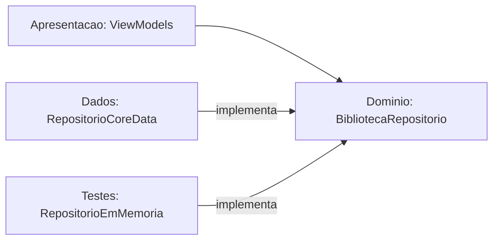

Ganhos: trocar Core Data por um falso em memória nos testes e previews, ou por SwiftData no futuro, sem mexer em nenhuma tela.

**8. `async throws`.**
`throws` porque gravar em disco pode falhar e o chamador deve ser forçado a tratar (`try`). `async` porque o Core Data faz o trabalho num contexto de segundo plano (`perform`); um ViewModel `@MainActor` chama com `await`, suspendendo a função sem bloquear a thread principal (a tela continua respondendo). `async` não significa "outra thread" por si só: significa "pode suspender neste ponto".

**9. Normalização de texto.**
`Normalizacao.chave` faz `folding` com `.caseInsensitive` e `.diacriticInsensitive` (usando a localidade `pt_BR`), depois quebra em palavras por espaço em branco e junta com um espaço só. Resultado: `"  Direito   Tributário "` vira `"direito tributario"`. É a base tanto da unicidade de categorias quanto, na 2.3, da busca. Custo: O(n) no tamanho do texto, uma passada.

**10. Regra pura: `NomeDeCategoria.validar`.**
Função estática, sem estado e sem efeito colateral: mesma entrada, mesma saída. Devolve `Problema?` (`nil` = válido), com `.repetido(Categoria)` carregando a categoria conflitante para a interface poder dizer "já existe 'Direito Tributário'". O parâmetro `ignorando:` permite renomear mantendo o próprio nome. Note o idioma `repetida.map { .repetido($0) }`: `Optional.map` aplica a função só se houver valor, e propaga `nil` caso contrário.

**11. XCTest (para a próxima tarefa).**
Cada classe de teste herda de `XCTestCase`; cada método que começa com `test` roda isolado, com uma instância nova da classe. As asserções principais: `XCTAssertEqual(a, b)`, `XCTAssertNil`, `XCTAssertTrue`. `@testable import Estantes` dá acesso aos símbolos `internal` do app. O padrão é Arrange (montar entrada), Act (chamar), Assert (conferir). Para a `ValidacaoSumario`, o jeito natural é um teste por regra: nível zero, nível que pula de 1 para 3, título vazio, página que regride (aviso, não erro).

**12. `for ... enumerated()` (para a próxima tarefa).**
`for (indice, item) in itens.enumerated()` percorre a sequência produzindo pares (posição a partir de 0, elemento). Você precisará dele na `ValidacaoSumario` para dizer "o item da posição 3 está errado" e para comparar cada item com o anterior (`itens[indice - 1]`, cuidando do caso `indice == 0`, senão o programa trava com índice fora do limite).

### Por que assim
- **Struct em vez de classe/NSManagedObject**: segurança contra estado compartilhado, testes rápidos, Domínio sem dependências (regra do projeto).
- **UUID**: permite mesclar na importação sem coordenação central.
- **Livro como raiz de agregado, sem campo `ordem`**: uma verdade só sobre a ordem do sumário; salvar e importar em bloco.
- **`categoriaIds` em vez de `[Categoria]` dentro do livro**: renomear categoria não regrava livros.
- **Foto da capa fora da struct** (`fotoCapa(doLivro:)`, `salvarFotoCapa`): o índice da busca carrega todos os livros ao abrir; imagens pesariam na memória. No Core Data, será "Allows External Storage" (o Core Data guarda blobs grandes como arquivos fora do SQLite).
- **`numeracao` separada do `titulo`**: toda origem grava no mesmo formato, e o título limpo ajuda a busca. Preserva "Capítulo" versus "Título".
- **`pagina` opcional e `origem` por item**: "Parte I" não tem página; um sumário pode ser misto (LexML com correções manuais).
- **`ValidacaoSumario` única para todas as origens** (função pura devolvendo erros e avisos): o formulário (2.6) e o parser (Fase 3) usam a mesma regra, garantindo formato único. Página que regride é aviso, não erro, por causa de apêndices.
- **Nome de categoria validado no Domínio**: a restrição de unicidade do Core Data diferencia acentos e não dá mensagem útil.
- **`CorCategoria` como enum**: `Color` é SwiftUI (proibido no Domínio); um hex é um tom só, e cada cor precisa de versão clara e escura; paleta fixa permite conferir contraste uma vez; valor bruto estável.
- **Dois enums de origem**: um enum único permitiria combinações sem sentido (item vindo do Google Books). Tornar estados inválidos irrepresentáveis é melhor do que validá-los.
- **Um repositório só**: "substituir" na importação troca tudo numa transação.
- **Sem `Codable` nas entidades**: a exportação (2.8) terá um DTO próprio (`BibliotecaExportadaV1`) em Dados, para que o formato do arquivo não mude quando a struct mudar.
- **Inits com valores padrão**: `Livro(estanteId:titulo:)` basta em testes e previews.
- **Sem iPhone, `PhotosPicker` como alternativa a toda captura**: a câmera e o `VNDocumentCameraViewController` não funcionam no simulador (`isSupported` falso), mas Vision e `PhotosPicker` funcionam. Fotos entram no simulador arrastando ou com `xcrun simctl addmedia booted foto.jpg`.

### Alternativas descartadas
- `NSManagedObject` nas telas: acopla UI à persistência e à thread do contexto.
- Classes no Domínio: estado compartilhado.
- `NSManagedObjectID` ou inteiro sequencial como identidade: ver conceito 2.
- Numeração dentro do título ou descartá-la: ver "Por que assim".
- Enum único de origem: combinações sem sentido.
- Cor por hex ou por `Color`: ver acima.
- Restrição de unicidade do Core Data para categorias.
- `Repositorio<T>` genérico: parece elegante, mas esconde regras próprias de cada entidade (apagar estante com destino, substituir sumário em bloco, nullify em categoria).
- Um repositório por entidade: quebraria a transação única da importação.
- Campo `ordem` na struct: duas fontes da mesma verdade.

### Padrões e boas práticas
- **Repository + inversão de dependência**: use quando há mais de uma implementação plausível (produção, teste, preview). NÃO use quando só existe uma e nunca vai mudar; aí é cerimônia.
- **Injeção por `init`**, sem singletons (regra do projeto).
- **Tornar estados inválidos irrepresentáveis** (enums por origem, `Set` para categorias).
- **Funções puras para regras** (`NomeDeCategoria`, `ValidacaoSumario`): testáveis sem preparação.
- **Test de contrato para valores persistidos** (os valores brutos travados).
- **Quando NÃO usar struct**: quando a identidade do objeto importa mais que o valor (um serviço com conexão aberta, um cache compartilhado) ou quando é preciso herança.

### Armadilhas
- Renomear um caso de enum com valor bruto implícito muda o `rawValue` silenciosamente. Para valores persistidos, declare-os explicitamente (`case lexml = "lexml"`) ou mantenha o teste de contrato.
- `let id` em struct impede alterar a identidade depois de criada (bom), mas lembre que `var` em struct só funciona se a instância também for `var`.
- Comparar nomes sem normalizar: `"Tributário" == "tributario"` é falso em Swift. Sempre passe por `Normalizacao.chave`.
- `Equatable` sintetizado compara todos os campos, inclusive `adicionadoEm`. Para dois livros "iguais" em dados mas criados em momentos diferentes, `==` dá falso.
- Acessar `itens[indice - 1]` com `indice == 0` trava o app (crash em tempo de execução, não erro de compilação).
- Se um teste falhar só na CI, lembre que lá o Xcode é 26 e aqui é 14.2; o `folding` e a localidade podem ter diferenças sutis entre versões do sistema.

### Para ir além
- The Swift Programming Language (docs.swift.org): capítulos "Structures and Classes", "Enumerations" e "Optional Chaining".
- Eric Evans, *Domain-Driven Design* (agregados e repositórios) ou, mais curto, o texto de Martin Fowler "Repository" e "DDD_Aggregate" em martinfowler.com.
- Documentação da Apple: "XCTest" e "Concurrency" (async/await) no Swift book.

### Perguntas
1. Com suas palavras: por que `Livro` guarda `categoriaIds: Set<UUID>` e `itensSumario: [ItemSumario]` de maneiras tão diferentes (ids de um lado, os itens inteiros do outro)? O que isso muda ao renomear uma categoria e ao apagar um livro?
2. O que mudaria no desenho se o app precisasse sincronizar a biblioteca entre dois iPhones? Pense em identidade (UUID), no campo `ordem` e no que o DTO de exportação passaria a precisar guardar.
3. Preveja: `NomeDeCategoria.validar("Ação", existentes: [Categoria(nome: "acao", cor: .azul)])` devolve o quê? E `Normalizacao.chave("Ação")` comparado a `"ação"` (com o `ç` e o `ã` já decompostos em letra + acento)? Por que importa que o `folding` trate os dois igual?

### Minhas respostas
<!-- Ricardo responde aqui por escrito. O teacher corrige na próxima chamada. -->

## Tarefa 2.1b — ValidacaoSumario, o primeiro código Swift do Ricardo (2026-10-08)

### O que foi feito
Ricardo escreveu sozinho `ValidacaoSumario.validar` em `ios/Estantes/Dominio/.../ValidacaoSumario.swift` (tarefa `[eu escrevo]`). O Claude preparou o esqueleto (tipos `Problema` e `Resultado`) e 11 testes de especificação, escritos antes do código (TDD: vermelho, depois verde), e atuou como revisor. No fim há 25 testes verdes no Xcode 14.2 e o PR #19 está aberto. Um teste foi acrescentado pelo próprio Ricardo (`testComparaComAPaginaImediatamenteAnterior`) depois de descobrirmos um buraco na especificação.

### A regra
Percorrer os itens; para cada índice `i`:
1. Nível menor que 1 gera erro `nivelInvalido`. Senão, se o nível subiu mais de 1 em relação ao anterior (o anterior vale 0 para o primeiro item), gera erro `saltoDeNivel`. Descer qualquer quantidade é permitido.
2. Título vazio ou só com espaços gera erro `tituloVazio`.
3. Página menor que a do último item anterior COM página (itens `nil` são pulados) gera AVISO `paginaMenorQueAnterior`.

A ordem é por índice, e o nível vem antes do título. Avisos não impedem salvar: `valido` é `erros.isEmpty`.

### O percurso (a parte mais didática)

**Rodada 1: três problemas de uma vez.**

1. `return Resultado(erros: [], avisos: [])` devolvia literais vazios em vez das variáveis preenchidas no `for`. Resultado: TODOS os testes de erro falharam com mensagens do tipo `("[]") is not equal to ...`. Ricardo achou que o defeito estava só na página, mas a pista estava na mensagem: até os testes de nível e de título mostravam `[]`. **Lição: ler a mensagem do teste antes de diagnosticar.**

2. A memória da página estava errada: `var pagItemAnterior = itens.first(where: { $0.pagina != nil })` fixava a memória no PRIMEIRO item com página, e ela nunca era atualizada.

3. A tentativa de atualizar era `if var pagAtual = ..., var pagAnterior = pagItemAnterior?.pagina, ... { pagAnterior = pagAtual }`. O `if var` cria uma CÓPIA local, que morre no `}`. É a semântica de valor (a mesma ideia do `testStructsSaoValores` da 2.1): mexer na cópia não mexe no original. Além disso, a atualização só aconteceria quando houvesse aviso.

Rastreamento com páginas 10, 50, 20 (o que o código dele fazia versus o correto):

| Volta | Página | Código dele compara com | Resultado | Deveria comparar com |
| --- | --- | --- | --- | --- |
| 0 | 10 | 10 | 10<10? não | nada |
| 1 | 50 | 10 | 50<10? não | 10 |
| 2 | 20 | 10 | 20<10? não, sem aviso (errado) | 50, aviso (certo) |

**Achado importante: falha da especificação, não do aluno.** Corrigido o `return`, os 11 testes originais PASSARIAM mesmo com a lógica de página errada, porque nenhum deles tinha uma sequência em que o item anterior com página difere do primeiro item com página. **Teste verde não prova que o código está certo. Prova só que ele faz o que os testes perguntam.** Ricardo escreveu `testComparaComAPaginaImediatamenteAnterior` (10, 50, 20, com aviso esperado no índice 2), viu o teste falhar e depois passar. Estrutura de um teste: monta (cenário), chama (a função), confere (o resultado).

Pseudocódigo para a memória: `ultimaPagina: Int? = nil` declarada FORA do `for`. Se o item tem página, compara quando há memória e depois atualiza SEMPRE (com ou sem aviso). Item sem página não mexe na memória.

**Rodada 2: o compilador entra em cena.**
- `if pagItemAnterior != nil && element.pagina < pagItemAnterior` sem chaves. Swift exige `{}` em todo `if`, o que evita o erro clássico de a segunda linha "parecer" dentro do `if`.
- Comparar `Int?` com `<` não compila. Checar `!= nil` não muda o tipo: Swift não faz "smart cast" como Kotlin ou TypeScript. A solução é `if let`, que desembrulha e cria uma constante `Int`; a vírgula encadeia desembrulho e condição. Exemplo usado: `if let precoHoje = ..., let precoOntem = ..., precoHoje > precoOntem`.
- Novo erro: `return Resultado(erros: erros, avisos: erros)`. O compilador NÃO pega (os dois são `[Problema]`); os testes pegam. É o tipo de bug que tipos iguais escondem.

**Rodada 3 (correta):**
```swift
if let pagAtual = element.pagina {
    if let pagAnterior = pagItemAnterior, pagAtual < pagAnterior {
        avisos.append(.paginaMenorQueAnterior(indice: index))
    }
    pagItemAnterior = pagAtual   // atualiza SEMPRE que o item tem página
}
```
Ajuste aplicado na revisão: atribuir `pagAtual` (o `Int` já desembrulhado), não `element.pagina` (que é `Int?` e não encaixaria).

Ajustes de estilo aplicados: `.nivelInvalido(...)` com inferência de tipo em vez de `ValidacaoSumario.Problema.nivelInvalido`, e `trimmingCharacters(in: .whitespacesAndNewlines).isEmpty` em vez de `isEmpty || trimmed == ""`. Parênteses desnecessários no `if` foram removidos.

**Pendências leves, por escolha dele:** `for (indice, item)` em português em vez de `(index, element)`, e `{` na mesma linha do `if`/`for` (convenção Swift; ele usa a linha seguinte). Não afetam o comportamento, só a leitura por outros desenvolvedores. Vale reconsiderar quando o projeto crescer ou ganhar um linter (SwiftLint).

### Conceitos envolvidos

**Optional (`Int?`).** É um enum com dois casos, `.none` e `.some(valor)`. `Int?` e `Int` são tipos diferentes; por isso `<` não compila entre eles. `if let x = opcional` testa o caso e extrai o valor para uma constante de tipo `Int`, válida só dentro das chaves. Aqui: `element.pagina` é `Int?` porque "Parte I" não tem página.

**Semântica de valor.** `if var a = b` copia `b`. Alterar `a` não altera `b`. Para a memória sobreviver entre voltas do `for`, ela precisa ser declarada fora do laço e atribuída diretamente (`pagItemAnterior = pagAtual`).

**Escopo.** Variável declarada dentro do `for` nasce e morre a cada volta. A "memória entre iterações" tem de morar fora.

**Função pura.** `validar` recebe um array e devolve um `Resultado`, sem efeitos colaterais. Por isso o teste é só montar, chamar e conferir, sem banco, sem rede, sem tela.

**`enumerated()`.** Produz pares (posição, elemento). Evita `itens[i - 1]`, que travaria com `i == 0`. Aqui o "anterior" é guardado em variáveis (`itemAnteriorNivel`, `pagItemAnterior`), sem indexar o array.

**TDD e a limitação dos testes.** Vermelho, verde, refatorar. O teste é uma especificação executável, e uma especificação incompleta deixa passar código errado. O caso de teste novo nasce de um contraexemplo (10, 50, 20).

**Complexidade.** Uma passada pelo array: O(n) no tempo, O(1) de memória extra além da saída.

### Por que assim
- **Duas variáveis de memória** (`itemAnteriorNivel`, `pagItemAnterior`) em vez de olhar `itens[i-1]`: o nível compara com o item imediatamente anterior, mas a página compara com o último item que TEM página, e esses dois "anteriores" são diferentes.
- **Atualizar a memória sempre que há página**, mesmo sem aviso: o próximo item deve ser comparado com o mais recente, não com um valor antigo.
- **Nível: `if` / `else if`** porque nível inválido e salto são mutuamente exclusivos para um mesmo item (um nível 0 não é "salto"). Título é um `if` separado porque o mesmo item pode ter os dois problemas.
- **Página como aviso**, não erro: apêndices e anexos reiniciam a numeração.

### Alternativas descartadas
- **Guardar o índice do último item com página** e consultar `itens[ultimo]`: funciona, mas é mais indireto que guardar o próprio valor.
- **`reduce`**: possível, porém menos legível para quem está começando e sem ganho aqui.
- **`zip(itens, itens.dropFirst())`**: bom para comparar vizinhos, mas não cobre o "pula nil".
- **Lançar exceção no primeiro erro**: o usuário veria um problema por vez; devolver a lista completa permite mostrar tudo no formulário (2.6) e no parser (Fase 3).

### Padrões e boas práticas
- **Escrever o teste que falha antes de corrigir** (como no teste 10, 50, 20). NÃO vale a pena em código descartável.
- **Lista de problemas em vez de falhar no primeiro** (acumulador).
- **Enum com valores associados** (`.nivelInvalido(indice:)`): cada problema carrega o contexto.
- **Quando suspeitar de testes verdes:** ao corrigir um bug, pergunte "qual teste teria pegado isso?". Se nenhum, escreva-o primeiro.

### Armadilhas
- Literais no `return` (`[]`) em vez das variáveis: compila sem queixa.
- Campos do mesmo tipo trocados (`avisos: erros`): o compilador não vê. Só o teste vê.
- `if var` / `var` em ligação opcional: cria cópia, não altera o original.
- Nesta implementação, `itemAnteriorNivel = element.nivel` roda também quando o nível é inválido (por exemplo 0 ou negativo). Isso é coerente com o enunciado ("anterior" é o item anterior, seja ele válido ou não), mas vale um teste explícito se a regra mudar. Verifique nos testes se esse caso está coberto.

### Para ir além
- The Swift Programming Language (docs.swift.org): "The Basics" (Optionals e Optional Binding) e "Control Flow".
- Kent Beck, *Test-Driven Development: By Example*.
- Apple, documentação de XCTest (`XCTAssertEqual`) e "Structures and Classes" (semântica de valor).

### Perguntas
1. Com suas palavras: por que `if let pagAnterior = pagItemAnterior` resolve o erro de comparar `Int?` com `<`, e por que `!= nil` antes não resolveu? Por que `if var` NÃO atualizaria a memória?
2. Aplicação: se a regra mudasse para "página igual à anterior também é aviso", o que mudaria no código e qual teste você escreveria primeiro? E se itens sem página passassem a resetar a memória?
3. Raciocínio: com as páginas `[nil, 30, nil, 5, 40, 10]`, quais índices recebem aviso? Depois: se os testes originais passavam mesmo com a lógica errada, que outro tipo de entrada (além de 10, 50, 20) você acha que ainda não está coberta?

### Minhas respostas
<!-- Ricardo responde aqui por escrito. O teacher corrige na próxima chamada. -->

(sem respostas)


---

## Tarefa 2.2 — Core Data e BibliotecaRepositorioCoreData (2026-10-08)

### O que foi feito
Criamos a camada de persistência em `ios/Estantes/Dados/Persistencia/`: o modelo `Estantes.xcdatamodeld` (Estante, Livro, ItemSumario, Categoria), as classes `EntidadesMO.swift`, o `PersistenceController` e o `BibliotecaRepositorioCoreData`, que implementa a porta definida na 2.1. A conversão entre objetos do banco e structs do Domínio ficou em `Conversao.swift` (parte escrita pelo Ricardo). Foram 25 testes de Dados escritos antes da conversão (TDD), depois ampliados na revisão; tudo verde no Xcode 14.2.

### Conceitos envolvidos

**Que banco é esse?** O Ricardo perguntou, e a resposta organiza a arquitetura:

| | Banco local (Core Data), 2.2 | Supabase (Postgres), Fase 1 |
|---|---|---|
| Onde | dentro do iPhone, arquivo SQLite `Library/Application Support/Estantes.sqlite` | servidor na internet |
| Guarda | a biblioteca do usuário (estantes, livros, sumários, categorias, capas) | o catálogo LexML (83.612 livros) |
| Quem escreve | o app | só nós via psql; o app só lê |
| Internet | não precisa (a busca também é offline) | precisa |
| Para quê | memória do app | identificar livro novo pela foto (Fase 3) |

Os dois se encontram na Fase 3: o resultado do Supabase é COPIADO para o banco local. A cadeia de leitura é:

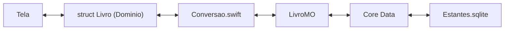

Nos testes o arquivo é `/dev/null`. O app ainda não usa o banco: a montagem em `App/Dependencias` vem na 2.4. A exportação JSON (2.8) será o backup contra a expiração de 7 dias do Sideloadly.

**Core Data não é um banco, é um grafo de objetos.** Ele gerencia objetos em memória (`NSManagedObject`) e, por baixo, usa SQLite para persisti-los. Peças: o modelo (`NSManagedObjectModel`, o esquema), o `NSPersistentContainer` (empacota modelo + armazenamento + contextos) e o `NSManagedObjectContext` (a "mesa de trabalho": você altera objetos nela e só `save()` grava). Cada contexto tem uma fila (`perform`) em que seus objetos podem ser tocados; fora dela é comportamento indefinido.

**Regras de exclusão (delete rules).** Definem o que acontece com os objetos relacionados quando um é apagado:
- Estante→livros: *cascade* (apagar a estante apaga os livros);
- Livro→estante: obrigatória, *nullify*;
- Livro→itensSumario: *cascade*;
- Livro↔Categoria: muitos-para-muitos, *nullify* nos dois lados (apagar uma categoria só desfaz o vínculo, não apaga livros).
Toda relação tem inversa: o Core Data mantém os dois lados consistentes sozinho, e isso evita relações "pela metade".

**Classes `@NSManaged` e `@objc(LivroMO)`.** `@NSManaged` diz ao compilador "o acesso a esta propriedade será implementado em tempo de execução pelo Core Data" (ele gera getter/setter dinamicamente). `@objc(LivroMO)` fixa o nome Objective-C da classe: o modelo localiza a classe por nome, e sem isso o nome real seria `Estantes.LivroMO` (com o módulo na frente), e a busca falharia.

**Opcionais numéricos.** `@NSManaged var ano: Int32` não pode ser nil. Para campos opcionais usamos `NSNumber?`. Para `nivel` e `ordem` (obrigatórios), `Int32` escalar. Por isso a conversão tem `Int(nivel)` de um lado e `pagina?.intValue` do outro.

**Upsert.** "Busca pelo id; se não existir, cria; depois preenche." É o `salvar` do repositório. Sem restrição de unicidade no banco, a garantia é só da lógica do código (ver Armadilhas).

**`prateleiras`: SELECT DISTINCT.** Usamos `dictionaryResultType` com `returnsDistinctResults`: o SQLite devolve só a coluna pedida, sem materializar objetos, sem repetidos. `quantidadeDeLivros` usa `count(for:)`, que vira `SELECT COUNT(*)`: O(n) no banco, sem trazer n objetos para a memória.

**Sumário em bloco.** Em vez de uma relação ordenada (`NSOrderedSet`), o item tem um atributo `ordem` igual à posição no array. Salvar um livro apaga os itens antigos e recria. Simples e previsível; a relação ordenada é frágil e não funciona com CloudKit.

**Conversão em duas direções.**
- `paraDominio()`: LER. Banco → struct nova; devolve valor.
- `preencher(com:)`: GRAVAR. Copia struct → objeto que o repositório já criou ou buscou; não devolve nada.

### O percurso do Ricardo (o que cada tropeço ensina)

**1. "Dentro da extension, `id` é de quem?"** A primeira tentativa foi `Estante(id: UUID(), nome: "", criadaEm: Date())`: inventava valores novos em vez de ler o objeto. O que faltava: dentro de `extension EstanteMO { }`, `id`, `nome` e `criadaEm` são propriedades do PRÓPRIO objeto (`self.id`), uma linha do banco já carregada. A forma certa é `Estante(id: id, nome: nome, criadaEm: criadaEm)`: em `id: id`, o da esquerda é o rótulo do parâmetro do init da struct; o da direita é o valor lido de `self`. Efeito: as falhas caíram de 16 para 13.

**2. Categoria, sozinho e certo.** `Categoria(id: id, nome: nome, cor: CorCategoria(rawValue: cor) ?? .cinza)` e `cor = categoria.cor.rawValue`. O `?? .cinza` é uma degradação silenciosa. Alternativas: `fatalError` (fecha o app por causa de uma cor) ou `throw` (obrigaria `try` em toda leitura). O que protege contra renomear uma cor sem perceber é o teste de contrato dos `rawValue` da 2.1. Detalhe do revisor: salvar de novo grava o padrão por cima do valor desconhecido; isso é intencional e ficou comentado no arquivo.

**3. ItemSumario: de FALHAR para TRAVAR.** O `paraDominio()` saiu perfeito (`Int(nivel)`, `pagina?.intValue`, `?? .manual`). No `preencher`, ele escreveu `id = id`, `nivel = Int32(nivel)`, `numeracao = numeracao`, `titulo = titulo` (faltava o `item.`) e não gravou a `ordem`. Resultado: 5 testes com "Restarting after unexpected exit, crash". Por quê? O objeto recém-criado tem `id` nil no armazenamento, mas a classe declara `@NSManaged var id: UUID` sem `?`, prometendo ao Swift que nunca é vazio. Ler `id` para copiá-lo a si mesmo encontra nil onde se prometeu que não haveria, e o app encerra. Com o corpo vazio de antes ninguém lia o campo, e o Core Data só recusava salvar ("Multiple validation errors occurred."). Lição: um crash é pior que um teste vermelho, mas aponta para uma violação de contrato de tipo, e o sintoma mudou porque o código passou a LER o campo.

**4. Sombreamento (shadowing) e `self`.** O parâmetro `ordem` tem o mesmo nome da propriedade. Dentro da função, `ordem` é o parâmetro (constante), então `ordem = Int32(ordem)` não compila. A solução é `self.ordem = Int32(ordem)`, o único lugar do arquivo onde `self.` é obrigatório. Regra: o nome mais interno vence; `self.` desfaz o sombreamento. Na rodada 2 ele corrigiu tudo, com zero travamentos.

**5. LivroMO (escrito pelo Claude a pedido dele).** Pontos novos:
- `estanteId: estante.id`: a relação é o objeto inteiro, não o id;
- `Set(categorias.map(\.id))`: `map` devolve array, `Set` converte;
- `itensSumario.sorted { $0.ordem < $1.ordem }.map { $0.paraDominio() }`: relações do Core Data são conjuntos SEM ordem, e a ordem vem do atributo `ordem`;
- `"".components(separatedBy: "\n")` devolve `[""]` (um item vazio), não `[]`. Daí a função `lista(_:separador:)` com `texto.isEmpty ? [] : ...`. O teste `testLivroMinimoMantemOpcionaisNil` pegaria isso.
Estilo pedido por ele: um argumento por linha em init longo; `.map { ... }` sem parênteses (closure final).

### Por que assim
1. **Sufixo MO e classes à mão.** O codegen automático criaria `Livro` e `Estante`, colidindo com as structs do Domínio e visíveis no app inteiro. Com `MO`, a fronteira Dados/Domínio fica visível no nome.
2. **`autores` como String com um nome por linha (`\n`)**, porque nomes têm vírgula ("Sobrenome, Nome"). `cddirCaminho` usa " > ".
3. **`ItemSumario` com `id` no Core Data**: sem ele, a ida e volta (struct → banco → struct) não preserva a igualdade.
4. **Modelo carregado uma vez (`static let modelo`).** Vários containers, cada um com seu modelo, fazem o Core Data reclamar de entidades disputando a mesma classe. Não é singleton: é uma constante imutável, e o controller continua recebendo tudo por `init`.
5. **`/dev/null` nos testes.** Mesmo motor SQLite da produção, nada gravado. O tipo `NSInMemoryStoreType` é outro motor (sem batch requests e com diferenças sutis).
6. **Um `newBackgroundContext()` por operação** com `try await contexto.perform { }`: a tela não trava; cada operação começa sem cache antigo; nenhum MO sai do `perform`, só structs (que são valores seguros de passar entre filas).
7. **TDD com conferência prévia.** O Claude validou os próprios testes com uma conversão de referência temporária (não commitada) antes de passar a vez ao Ricardo. Assim, se um teste falhasse, a culpa só poderia ser da conversão dele. Teste que nunca viu o verde não prova nada.

### Alternativas descartadas
- **Codegen automático**: colisão de nomes (acima).
- **Transformable para `autores`**: opaco no banco, não buscável, exige transformer seguro; texto simples basta.
- **Relação ordenada (`NSOrderedSet`) para o sumário**: frágil, difícil de substituir em bloco, sem CloudKit.
- **SwiftData**: proibido pela regra dos dois Xcodes (exige iOS 17 e macros).
- **`NSInMemoryStoreType` nos testes**: motor diferente da produção.
- **Contexto único `viewContext` para tudo**: a escrita travaria a interface.

### Padrões e boas práticas
- **Repository + porta** (protocolo no Domínio, implementação em Dados): a tela não sabe que existe Core Data. Não vale a pena para um app de uma tela só, mas aqui o ganho é testar com um repositório falso e trocar a persistência.
- **Anti-corruption layer / mapper** (`Conversao.swift`): nenhum `NSManagedObject` vaza para fora de `Dados/Persistencia/`.
- **Regra de concorrência do Core Data**: cada objeto e cada contexto só dentro da sua fila (`perform`).
- **Idempotência**: apagar algo que não existe não é erro. Já gravar apontando para algo inexistente LANÇA erro, porque aí o chamador cometeu um engano real. A regra ficou documentada na porta: apagar ignora; ler devolve vazio; gravar com referência inexistente lança.
- **Verificar pelo compilador em vez de texto**: `#keyPath(LivroMO.estante.id)` no lugar de `"estante.id"`.
- **Desempate nas ordenações**: títulos iguais ("Direito penal") sem critério secundário voltam em ordem não determinística.

### Armadilhas
- **Bug real encontrado na revisão (no código do Claude)**: `apagarEstante(id: X, moverLivrosPara: X)` pulava o "mover" (`destino != id`) e a cascata apagava todos os livros, uma perda silenciosa de dados. Agora lança `destinoInvalido` antes de tocar no banco, com teste. Lição: caso de borda dentro de um `if` com duas condições; sempre pergunte "e se os dois valores forem iguais?".
- **Teste usando `viewContext` fora da fila principal**: passava por sorte. Passou a usar `newBackgroundContext()` + `perform`.
- **`/dev/null` nunca prova persistência**: por isso entrou um teste que fecha e reabre um banco em ARQUIVO de verdade.
- **Condição de corrida no upsert (limitação conhecida)**: dois `salvar` simultâneos do mesmo id, em contextos diferentes, ambos fazem "busca" sem achar e ambos criam, duplicando. Registrado no PLANO.md; resolver na 2.8 com um contexto único de escrita ou uniqueness constraints. É o clássico TOCTOU (time-of-check to time-of-use).
- **Valores de `@NSManaged` não opcionais lidos antes de preenchidos** travam o app (item 3 acima).
- **`components(separatedBy:)` com texto vazio** devolve `[""]`.
- **Sem versionamento do modelo**: antes de existirem dados reais de usuário, mudar o modelo exige migração. Adiado de propósito, mas deve ser feito antes de qualquer dado real.
- Diagnóstico geral: crash com "Restarting after unexpected exit" no teste significa quase sempre acesso inválido (nil em tipo não opcional, ou objeto fora da sua fila); veja o relatório de crash, não só o resumo.

Recusados ou adiados, com motivo: unicidade do nome da categoria (é regra do Domínio, decidida na 2.1); tamanho das fotos dentro da linha do Livro (decidir na 2.4); limpar espaços da prateleira (formulário na 2.4).

### Para ir além
- Apple, *Core Data* (developer.apple.com/documentation/coredata), em especial "Using Core Data in the Background" e "Core Data Model Editor".
- Martin Fowler, *Patterns of Enterprise Application Architecture*: Repository, Data Mapper.
- *The Swift Programming Language*, capítulo "Properties" e a seção sobre `self` e nomes de parâmetros.

### Perguntas
1. Com suas palavras: qual a diferença entre `paraDominio()` e `preencher(com:)`? Por que, em `id: id`, os dois `id` são coisas diferentes? Por que `ordem = Int32(ordem)` não compila e `self.ordem = Int32(ordem)` compila?
2. Aplicação: se o app passasse a ter uma tela de "categorias" em que apagar uma categoria também apagasse os livros dela, o que mudaria no modelo? E se quiséssemos guardar a ordem dos autores de um livro, o formato "um por linha" continuaria servindo?
3. Raciocínio: (a) por que `id = id` TRAVA o app, enquanto um `preencher` de corpo vazio apenas faz o teste falhar? (b) Descreva uma sequência de duas chamadas simultâneas de `salvar` que duplica um livro. (c) Por que apagar um id inexistente é ignorado, mas salvar um livro numa estante inexistente lança erro?

### Minhas respostas
<!-- Ricardo responde aqui por escrito. O teacher corrige na próxima chamada. -->

---

**Lembrete:** as perguntas das entradas 2.1 e 2.1b continuam sem resposta. Vale respondê-las antes de seguir: as respostas a 2.1b (validação do sumário) e a 2.2 (conversão e concorrência) se apoiam em ideias que se acumulam.

---

## Tarefa 2.3a — Tokenizador da busca (2026-10-09)

### Correção das respostas (entradas anteriores)
(sem respostas) As perguntas das entradas 2.1, 2.1b e 2.2 continuam em branco. Nada a corrigir.

### O que foi feito
Primeiro passo da 2.3: `Dominio/Busca/Tokenizador.swift`, um `enum` sem casos com a função `termos(_:)`, que transforma um texto numa lista de termos prontos para o índice e para a consulta. Os testes estão em `EstantesTests/Dominio/Busca/TokenizadorTests.swift` (10 testes; a suíte inteira fechou em 60, 0 falhas, no Xcode 14.2). O comentário de `Normalizacao.swift` foi atualizado e o `PLANO.md` marcou o BM25F como `[eu escrevo]`. O Ricardo optou por não escrever o tokenizador e guardar o `[eu escrevo]` para a fórmula do BM25F, onde há mais a aprender.

### Conceitos envolvidos

**O mapa da 2.3.** O motor de busca local (offline, só Foundation) sai em cinco passos:

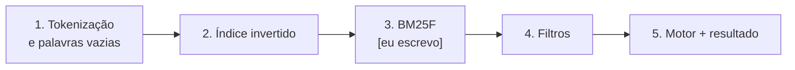

Começamos pela tokenização por dois motivos. Primeiro, índice e consulta precisam passar pela MESMA normalização. Se divergirem, "Ação" indexado nunca casa com "acao" digitado, e o erro é silencioso: a busca simplesmente não acha nada. Segundo, é a peça menor e não depende de nenhuma outra.

**Tokenização.** É quebrar um texto em unidades (tokens ou termos) que o índice sabe comparar. É a primeira etapa de qualquer motor de busca (Lucene, Elasticsearch, Postgres full-text). O que difere entre eles é o pipeline, e o nosso tem três etapas:

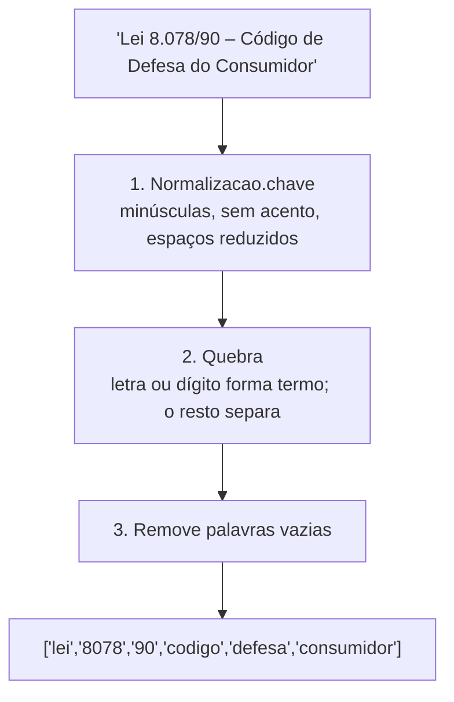

1. **Normalização (folding pt_BR).** Reaproveita `Normalizacao.chave`. Por baixo, é a decomposição Unicode (NFD): "ç" vira "c" + cedilha combinante, e o folding descarta as marcas combinantes. Assim "AÇÃO" vira "acao".
2. **Quebra.** O código percorre um `Array(Character)` com `enumerated()` e acumula o termo atual numa `String`. Cada caractere é de um destes tipos: parte de termo (letra ou dígito, que entra no acumulador), ou separador (que fecha o termo, se houver). Pontuação, hífen e travessão são separadores, então "pós-graduação" vira `pos` + `graduacao`. É uma passada só, O(n) no tamanho do texto. Um `Character` do Swift é um grapheme cluster (o que o usuário vê como um caractere), por isso o `Array(Character)` é seguro com acentos, e não é um array de bytes ou de escalares Unicode.
3. **Palavras vazias (stop words).** Artigos, preposições e contrações (de, da, do, em, no, para, por, com, ou, que, se...) aparecem em quase todo título e quase não distinguem um livro do outro. Ficam guardadas num `Set<String>`, cuja consulta é O(1) em média (tabela hash), contra O(k) de varrer um array. Termos jurídicos curtos (lei, art, cpc, stf) ficam de propósito, porque aqui tamanho curto não significa pouca informação. A lista já vem sem acento, porque a normalização roda antes: "à" chega ao filtro como "a".

**Por que a lista mantém ORDEM e REPETIÇÕES.** `termos` devolve `[String]`, e não `Set<String>`. O BM25F, que vem no passo 3, usa a *frequência do termo* em cada campo (tf): "prisão e prisão preventiva" deve pontuar mais para "prisao" do que um título que cita a palavra uma vez. Se o tokenizador devolvesse um conjunto, essa informação seria destruída antes de chegar ao índice, e não haveria como recuperá-la. Regra geral: perca informação o mais tarde possível. O teste `testPreservaRepeticoes` trava esse contrato.

**Indicadores ordinais º e ª.** Para o Unicode, "º" está na categoria Lo (Letter, other), então `Character.isLetter` é `true`. Sem tratamento, "5º" viraria o termo `5º` e nunca casaria com quem digita "5". `fazParteDeTermo` exclui os dois explicitamente, então "art. 5º" vira `["art","5"]`. É um exemplo de como categorias Unicode não coincidem com a intuição de quem fala português.

**Ponto entre dois dígitos não separa.** Esta foi uma mudança feita durante a implementação (o Ricardo foi avisado; é reversível). Antes, "Lei 8.078/90" daria `["lei","8","078","90"]` e quem digitasse "8078" não acharia. Agora o ponto, quando tem dígito dos dois lados (`pontoEntreDigitos`, com um `continue` que não fecha o termo), é engolido e dá `["lei","8078","90"]`. Quem digita "8078" ou "8.078" acha o livro, porque a consulta passa pelo mesmo caminho. Consequências aceitas:
- "1.2.3" vira `123`. Isso não atrapalha porque a numeração do sumário fica em `ItemSumario.numeracao`, que não é indexada, e o título fica limpo.
- Ponto no fim do número ("8.078. Comentários") continua separando, porque depois do segundo ponto vem espaço, e não dígito.
- Efeito colateral conhecido: "nº" vira o termo `n` (o "º" separa). Não foi tratado, porque `n` tem IDF baixo (aparece em muitos livros e pesa pouco).

**`enum` sem casos como namespace.** `enum Tokenizador { static func ... }` não pode ser instanciado, então não carrega estado e não é singleton. É o idioma do Swift para agrupar funções puras, e combina com a regra do projeto de "sem singletons". Uma função pura (mesma entrada, mesma saída, sem efeito colateral) é trivial de testar, e é isso que os 10 testes fazem.

### Por que assim
- **Pipeline único para índice e consulta**: garante que os dois lados falem a mesma língua.
- **Lista, e não conjunto**: o BM25F precisa do tf (veja acima).
- **Tratar º/ª e o ponto entre dígitos**: o público é jurídico, e "art. 5º" e "Lei 8.078/90" são os padrões mais comuns de busca.
- **`Set` para as palavras vazias**: consulta O(1) média.
- **Lista de palavras vazias curta**: só o que é claramente funcional em português. Cortar demais esconderia livros, e a perda seria silenciosa.

### Alternativas descartadas
- **Palavras vazias dentro de `Normalizacao`**: `Normalizacao.chave` também compara nomes de categoria (`NomeDeCategoria`). Ali "Direito do Trabalho" e "Direito Trabalho" precisam continuar DIFERENTES. Se a normalização removesse "do", as duas colapsariam na mesma chave e criariam uma duplicata falsa. Separação de responsabilidades: normalização *compara*, tokenizador *prepara para busca*.
- **Usar `NLTokenizer` / `String.components(separatedBy:)` / regex**: o `NLTokenizer` vem do framework NaturalLanguage, e o Domínio só importa Foundation. A passada manual é curta, previsível e testável sem depender de plataforma.
- **Devolver `Set<String>`**: perderia as repetições.
- **Deixar o ponto sempre separar**: "8.078" viraria dois termos e a busca por "8078" falharia.

### Decisões adiadas para o passo 5 (motor)
- **Prefixo enquanto o usuário digita** ("preve" achar "preventiva").
- **Plural e radical** ("prisão" × "prisões"). Exige stemming ou outra técnica; o tokenizador atual trata como termos distintos.
- **Consulta com OU × E**: "prisão preventiva" exige os dois termos, ou qualquer um? Isso muda a ordenação e o recall.

### Padrões e boas práticas
- **Funções puras no Domínio**: sem I/O, fáceis de testar. Quando NÃO usar o `enum` namespace: se a coisa tiver estado ou precisar ser trocada por um falso nos testes (aí vira protocolo + `struct`).
- **Testes de contrato com exemplos reais** (`"Lei 8.078/90"`), inclusive o teste de equivalência `termos("Lei 8.078/90") == termos("lei 8078/90")`, que documenta a promessa ao usuário.
- **Teste de borda**: entrada vazia, só pontuação e só palavras vazias devolvem `[]`.

### Armadilhas
- **Normalizar de um lado só**: se alguém indexar com o tokenizador e consultar com `Normalizacao.chave`, as buscas somem sem erro. Diagnóstico: um teste que indexa e busca o mesmo texto.
- **Classificação Unicode**: `isLetter`/`isNumber` incluem coisas inesperadas (º, ª, frações como "½", dígitos de outros alfabetos). Quando algo "não casa", imprima os escalares Unicode (`unicodeScalars`) em vez de confiar no que a tela mostra.
- **Hífen e apóstrofo**: aqui o hífen separa. Se um dia entrar um termo como "e-mail", ele vira `e` + `mail` (o `e` é removido). Aceito pelo domínio jurídico, mas vale saber.
- **Remover palavras vazias da CONSULTA**: se o usuário digitar só "de", a consulta fica vazia, e o motor precisa decidir o que devolver (tudo? nada?). Isso é do passo 5.

### Para ir além
- Manning, Raghavan e Schütze, *Introduction to Information Retrieval*, cap. 2 ("The term vocabulary and postings lists"): tokenização, stop words, normalização. Disponível online gratuitamente (nlp.stanford.edu/IR-book).
- Unicode Standard Annex #29 (Text Segmentation) e UAX #44 (categorias gerais, para entender Lo).
- Apple, documentação de `Character` e `String` (grapheme clusters) em *The Swift Programming Language*, capítulo "Strings and Characters".

### Perguntas
1. Com suas palavras: por que índice e consulta precisam passar exatamente pelo mesmo tokenizador? Dê um exemplo concreto de falha silenciosa se não passarem.
2. Aplicação: o que mudaria no resultado se o `Tokenizador` fosse reaproveitado para comparar nomes de categoria? Mostre um par de nomes que passaria a colidir. E, no outro sentido, o que mudaria se "nº" passasse a ser tratado como "numero": em que ponto do pipeline você colocaria essa regra?
3. Raciocínio (prepara o índice invertido e o BM25F): considere os títulos A = "prisão preventiva" e B = "prisão e prisão cautelar". (a) Escreva `termos` de cada um. (b) Se `termos` devolvesse um conjunto, o que A e B teriam de diferente para a palavra "prisao"? (c) Como você acha que um índice invertido (termo → lista de livros) deveria guardar a informação de repetição, para que o BM25F calcule a frequência por campo (título, autor, assunto) sem reler os textos? (d) Por que um termo que aparece em quase todos os livros deveria pesar menos no ranking?

### Minhas respostas
<!-- Ricardo responde aqui por escrito. O teacher corrige na próxima chamada. -->

#### Correção das respostas
(sem respostas)

---

## Tarefa 2.3b — Índice invertido da busca (2026-10-09)

### O que foi feito
Criamos `Dominio/Busca/IndiceInvertido.swift`: um `struct` só com Foundation que guarda, em memória, tudo que o BM25F (passo 3, que o Ricardo vai escrever) precisa consumir. Junto vieram o enum `CampoBusca` e o tipo `ItemSumarioIndexado`. Os 18 testes estão em `EstantesTests/Dominio/Busca/IndiceInvertidoTests.swift` (suíte completa: 78 testes, 0 falhas no Xcode 14.2). O `PLANO.md` ganhou uma linha dizendo que o índice grava os nomes das categorias. Este é o passo 2 de 5 da tarefa 2.3.

### Conceitos envolvidos

**Índice comum x índice invertido.** Um índice comum mapeia livro → palavras: para achar "prisão" você abre todos os livros e procura. O invertido mapeia palavra → livros:

```
"prisao" → { A: 2× no título, C: 1× no sumário }
```

A busca só toca os livros das listas dos termos digitados. É a estrutura clássica de recuperação de informação (a mesma ideia do índice remissivo no fim de um livro, o motivo do nome "invertido").

**O que o índice guarda é o que o BM25F consome.** Esta foi a ideia que guiou o desenho: primeiro listamos o que a fórmula precisa, depois escolhemos a estrutura.

| Dado | Para quê no BM25F |
| --- | --- |
| tf por campo de cada livro | frequência ponderada por campo |
| tamanho de cada campo em cada livro | normalização por tamanho (`b`) |
| tamanho médio de cada campo na biblioteca | idem: compara o livro com a média |
| df (em quantos livros o termo aparece, em qualquer campo) | IDF |
| N (total de livros) | IDF |

**Campos (`enum CampoBusca`).** Título, subtítulo, autores, nomes das categorias, `cddirCaminho` e sumário (os títulos de todos os itens, tratados como um campo só). Editora, ano, estante e código CDDir são filtros (passo 4), então ficam fora do índice: não são texto a ranquear. Usamos `enum` e não `String` para o campo porque o compilador impede o campo escrito errado (`"titullo"` compilaria; `.titullo` não). Além disso, `CaseIterable` permite o teste `testTodoCampoBuscaEIndexado`: se alguém criar um campo novo e esquecer de indexá-lo em `adicionar`, o teste acusa.

**A estrutura por dentro.**

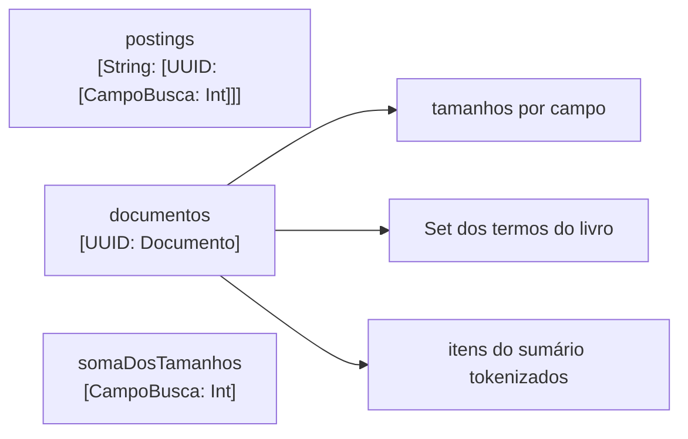

- `postings`: termo → livro → campo → frequência. Só aparecem os campos onde o termo ocorre (daí o contrato "campo ausente vale 0, use `?? 0`").
- `documentos`: o que o índice sabe de cada livro (tamanhos por campo, o `Set` de termos e os itens do sumário já tokenizados).
- `somaDosTamanhos` por campo: a média é `soma / N`, calculada em O(1) sem recontar a biblioteca. Somas são fáceis de manter: soma ao adicionar, subtrai ao remover.

**Por que `remover` precisa do `Set` de termos.** Sem ele, para tirar um livro seria preciso varrer o vocabulário inteiro (todas as chaves de `postings`) procurando o id: O(V). Com o Set, visitamos só as entradas daquele livro: O(termos do livro). Ao remover, os termos que ficam sem nenhum livro são apagados, senão `quantidadeDeLivros(contendo:)` ficaria com entradas vazias e o vocabulário só cresceria.

**Idempotência de `adicionar`.** `adicionar` de um id existente remove a versão antiga antes. Assim "reindexar" é só chamar `adicionar` de novo, e é impossível contar um livro duas vezes por ter esquecido o `remover`. Foi um ajuste anunciado ao Ricardo antes de codar. É o mesmo princípio de um `upsert` no banco: a operação expressa a intenção ("este é o estado do livro agora"), não o passo mecânico.

**Médias contam campos vazios.** Um livro sem subtítulo entra na média do subtítulo com tamanho 0, como no BM25F clássico (a média é sobre todos os documentos da coleção). Se só contássemos quem tem subtítulo, a média ficaria inflada e livros normais pareceriam curtos demais.

**Itens do sumário guardados tokenizados.** Cada livro guarda uma lista de `ItemSumarioIndexado(id, frequencias, tamanho)`. O motivo: o PLANO diz que o item exibido no resultado é o de melhor nota BM25 *entre os itens daquele livro*. Com os itens já tokenizados, o motor roda um BM25 simples só sobre os itens dos livros que entraram no resultado, sem tokenizar de novo. Há também `tamanhoMedioDosItens` (soma e contagem de itens mantidas à parte).

**`struct` com métodos `mutating`.** O índice é um valor: `var indice = IndiceInvertido()`, e `adicionar`/`remover` o modificam. Isso combina com a regra "Domínio só com Foundation, sem singletons": o dono do índice (o motor, no passo 5) é quem guarda o valor. Detalhe: dicionários e arrays do Swift são copy-on-write, então copiar o `struct` é barato até alguém modificar uma das cópias.

**Complexidade.**
- `adicionar`: O(T) no total de termos do livro (mais o custo de remover a versão antiga, se existir).
- `remover`: O(termos do livro).
- `ocorrencias(de:)`, `quantidadeDeLivros(contendo:)`, `tamanho(de:noLivro:)`, `tamanhoMedio(de:)`: O(1) em média (tabelas hash).

### Por que assim
- **Índice invertido em vez de varrer**: com centenas de livros, varrer tudo a cada tecla digitada também seria rápido. O índice foi decisão do PLANO porque escala e porque é a estrutura clássica que o projeto quer ensinar.
- **Dicionário em memória**: simples, rápido, reconstruído ao abrir o app (decisão do PLANO).
- **Guardar o mínimo que o BM25F consome**: nada de dado "para o caso de precisar".
- **O índice grava nomes de categoria, não ids**: o texto é o que se pesquisa. Consequência: se a categoria for renomeada ou apagada, o índice fica velho. Essa obrigação é de quem usa o índice (documentada em `adicionar` e no `PLANO.md`); o teste dela vem no passo 5 (motor), onde existe quem a cumpra.
- **Itens do sumário como `ItemSumarioIndexado`**: evita retokenizar na busca.

### Alternativas descartadas
- **Varrer todos os livros a cada busca**: funcionaria no tamanho esperado, mas não é a estrutura que o projeto quer aprender e não escala.
- **Posting lists ordenadas por id, como no Lucene**: compensam em disco e com milhões de documentos (união/interseção por merge, compressão de deltas). Em memória, com poucos livros, o dicionário aninhado é bem mais simples.
- **Retokenizar o sumário na hora da busca**: desperdício; o trabalho já foi feito ao indexar.
- **Um segundo índice invertido só de itens do sumário**: exagero. Um BM25 simples só entre os itens dos livros do resultado basta.
- **Busca por prefixo, plural e OU x E no índice**: não afetam a estrutura. O prefixo, por exemplo, pode varrer as chaves do vocabulário na hora da consulta.

### Padrões e boas práticas
- **Projetar a estrutura a partir de quem a consome** (a tabela acima).
- **Invariantes mantidas por quem as quebra**: `adicionar` garante sozinho que não há duplicata. Evite APIs em que o chamador precisa lembrar da ordem certa de chamadas.
- **Encapsulamento**: `postings`, `documentos` e as somas são `private`; o mundo vê só consultas. Quando NÃO fazer isso: se uma estrutura fosse apenas um pacote de dados sem invariantes, `private` só atrapalharia.
- **Teste que protege invariante** (a lição da revisão): o único teste de remoção zerava tudo, então um erro na subtração das somas dos itens passaria. Testes de remoção devem deixar *outro* livro no índice e conferir que ele não mudou. Testes de idempotência (reindexar com conteúdo idêntico) pegam acumuladores que "vazam".

### Armadilhas
- **Item de sumário sem termos** (ex.: "De", só palavra vazia) tem tamanho 0 e conta na média. É a decisão registrada no teste `testItemDoSumarioSemTermosContaNaMedia`.
- **Divisão por zero no passo 3**: tamanho 0 de um livro é inofensivo (fica no numerador de `b · tamanho / média`). Mas a *média* 0 (por exemplo, uma biblioteca sem nenhum sumário, ou nenhum subtítulo) vira `0/0` na fórmula de normalização, o que dá `NaN`, e um `NaN` na soma estraga a nota do livro silenciosamente. A fórmula precisa tratar média 0.
- **Contrato do `ocorrencias`**: campo ausente no dicionário significa 0. Quem escrever `campos[.titulo]!` trava; use `?? 0`.
- **Acumuladores desalinhados**: se `adicionar` somar algo que `remover` não subtrai (ou o contrário), as médias derivam com o uso, e nenhum teste de um livro só percebe. Diagnóstico: adicionar, remover e reindexar em sequência e comparar com um índice novo montado do zero.
- **Nome de categoria velho**: veja "Por que assim".

### Para ir além
- Manning, Raghavan e Schütze, *Introduction to Information Retrieval*, cap. 1 (índice invertido) e cap. 6 (tf-idf e ranking). Online em nlp.stanford.edu/IR-book.
- Robertson e Zaragoza, *The Probabilistic Relevance Framework: BM25 and Beyond* (2009): a seção sobre BM25F explica por que se combinam as frequências dos campos antes da saturação.
- Documentação da Apple sobre `Dictionary` e `Set` na Swift Standard Library (custos e copy-on-write).

### Preparação para o passo 3 (BM25F, escrito por você)
Antes de escrever código, faça a conta à mão uma vez. Cenário pequeno, com a API do índice:

- Livro A: título "Prisão preventiva e prisão temporária", sumário `["Prisão em flagrante"]`.
- Livro B: título "Processo penal", sumário `["Prisão preventiva", "Recursos"]`.
- Livro C: título "Direito civil", sem sumário.

(Lembre: "e" e "em" são palavras vazias e somem na tokenização.) O que o índice responde:

| Chamada | Resultado |
| --- | --- |
| `totalDeLivros` | 3 |
| `quantidadeDeLivros(contendo: "prisao")` | 2 (A e B) |
| `ocorrencias(de: "prisao")` | A: título 2, sumário 1; B: sumário 1 |
| `tamanho(de: .titulo, ...)` | A = 4, B = 2, C = 2 |
| `tamanhoMedio(de: .titulo)` | 8/3 ≈ 2,667 |
| `tamanho(de: .sumario, ...)` | A = 2, B = 3, C = 0 |
| `tamanhoMedio(de: .sumario)` | 5/3 ≈ 1,667 |

Forma da fórmula (confira com o PLANO, que fixa a decisão de combinar os campos antes da saturação):

```
para cada campo c:  tf'_c = tf_c / (1 - b_c + b_c * tamanho_c / média_c)
tf_ponderado       = Σ_c  peso_c * tf'_c
nota do termo      = IDF * tf_ponderado / (k1 + tf_ponderado)
IDF (variante Lucene) = ln(1 + (N - df + 0.5) / (df + 0.5))
```

Valores só para este exercício (não são os do projeto): `peso_título = 3`, `peso_sumário = 1`, `b = 0,75` nos dois, `k1 = 1,2`. Para o termo "prisao":

- IDF = ln(1 + (3 - 2 + 0,5) / (2 + 0,5)) = ln(1,6) ≈ 0,470.
- Livro A: título → norma = 0,25 + 0,75 · 4/2,667 = 1,375, então tf' = 2/1,375 ≈ 1,455 e, com peso 3, ≈ 4,364. Sumário → norma = 0,25 + 0,75 · 2/1,667 = 1,15, então tf' ≈ 0,870. Soma ≈ 5,233. Saturação: 5,233 / (1,2 + 5,233) ≈ 0,814. Nota ≈ 0,470 · 0,814 ≈ 0,382.
- Livro B: só sumário → norma = 0,25 + 0,75 · 3/1,667 = 1,6, então tf' = 0,625. Saturação: 0,625 / 1,825 ≈ 0,342. Nota ≈ 0,161.
- Livro C: não aparece em `ocorrencias`, então nem é visitado.

Note como A vence: o termo está no título (peso alto) e repetido. Note também que a fórmula usa o tamanho do campo *no próprio livro* contra a média: B tem um sumário maior que a média e é penalizado.

Casos de borda que a sua função precisa tratar: média 0 (veja Armadilhas), termo que não existe no índice (df = 0: o IDF ainda é definido nessa variante, mas não há livros para visitar), e consulta com vários termos (some as notas dos termos de cada livro).

### Perguntas
1. Com suas palavras: qual é a diferença entre um índice comum e um invertido, e por que `remover` precisa guardar o `Set` de termos de cada livro? O que aconteceria sem ele?
2. Aplicação: o que mudaria no índice (e no código) se quiséssemos que a editora também fosse pesquisável por texto? E se uma categoria "Penal" fosse renomeada para "Direito Penal": quais chamadas o motor teria de fazer, e para quais livros?
3. Raciocínio (passo 3), no cenário A/B/C acima: (a) calcule, com os mesmos parâmetros do exemplo, a nota de A e de B para o termo "preventiva" (df = 2: A tem 1 no título, B tem 1 no sumário). Quem vence e por quê? (b) Se a biblioteca inteira não tivesse nenhum subtítulo, o que `tamanhoMedio(de: .subtitulo)` devolveria, e em qual ponto da fórmula isso quebraria? Proponha uma proteção. (c) Por que somamos os `tf'` dos campos *antes* de aplicar `k1`, em vez de calcular um BM25 por campo e somar as notas?

### Minhas respostas
(sem respostas)


## Tarefa 2.3c — Ranking BM25F (2026-10-09)

### O que foi feito
Foi criado `Dominio/Busca/BM25F.swift` com `ParametrosBM25F` (k1, pesos e `b` por campo, validados no `init`) e o `enum BM25F`, que calcula `idf`, `notas` (nota de cada livro para uma lista de termos) e `notaDoItem` (nota de um item do sumário, usada depois para escolher qual item mostrar no resultado). Os testes estão em `EstantesTests/Dominio/Busca/BM25FTests.swift` (14 testes; a suíte toda ficou em 92 testes, 0 falhas no Xcode 14.2). O `PLANO.md` registra o passo 6 da 2.3 (conjunto de consultas de referência) e a decisão de 09/10.

Nota sobre a divisão do trabalho: este passo estava marcado `[eu escrevo]`. O Ricardo pediu antes o enunciado completo (o porquê, como funciona, um exemplo simples) e, depois de lê-lo, pediu que o Claude escrevesse o BM25F e os testes. A marcação foi retirada do PLANO. Esta entrada existe para que você entenda a fundo um código que não escreveu; leia-a com o arquivo `BM25F.swift` aberto ao lado.

### Conceitos envolvidos

#### 1. Por que BM25F (a explicação dada ao Ricardo)

Todos os métodos abaixo respondem à mesma pergunta: dado um termo da consulta e um livro, quanto esse livro "merece" aparecer?

| Método | Como pontua | Problema |
| --- | --- | --- |
| Contar termos que casam | Nota = quantos termos da consulta aparecem no livro | Não distingue termo raro de comum ("direito" vale o mesmo que "flagrante"), nem título de sumário |
| TF-IDF linear | tf × idf: o IDF resolve raro × comum | Sem saturação: repetir "direito" 50 vezes ganha 50 vezes. Fácil de "enganar" por repetição |
| BM25 no texto concatenado | Junta todos os campos num texto só e aplica BM25 | Satura e normaliza o tamanho, mas perde os campos: título e sumário valem igual |
| Somar um BM25 por campo | Um BM25 por campo, soma das notas | Satura por campo: um termo presente em 6 campos chega a cerca de 6 vezes o máximo de um termo só. Descartado no PLANO |
| **BM25F** | Pondera os campos, normaliza o tamanho de cada um e satura **uma vez por termo** | É léxico: "prisões" não acha "prisão" (decisão no passo 5) |

#### 2. As três ideias do BM25F

**(a) IDF: o quanto o termo é raro.**

`IDF = ln(1 + (N − df + 0,5) / (df + 0,5))`

`N` é o total de livros e `df` é em quantos livros o termo aparece. É a variante do Lucene: o `1 +` dentro do logaritmo garante que o resultado seja sempre positivo. Na fórmula clássica, um termo presente em mais da metade dos livros dava IDF negativo (um termo comum "punia" o livro). Aqui o pior caso é perto de zero, nunca negativo.

**(b) Frequência combinada entre campos.**

`B_c = (1 − b_c) + b_c · tamanho / média`
`tf~ = Σ_c peso_c · tf_c / B_c`

`tamanho` é o número de termos do campo naquele livro; `média` é o tamanho médio desse campo na biblioteca. `B_c` vale 1 quando o campo tem tamanho médio, é maior que 1 para campos mais longos (diluem o termo) e menor que 1 para os mais curtos. O parâmetro `b` regula isso: `b = 0` desliga a normalização, `b = 1` a aplica por inteiro. O `peso_c` diz quanto cada campo importa (título 3, autor 0,5). A soma acontece **antes** de qualquer saturação.

**(c) Saturação, uma vez por termo.**

`nota = Σ_termos IDF · tf~ / (k1 + tf~)`

A fração `tf~/(k1 + tf~)` é sempre menor que 1 e cresce cada vez mais devagar. Como a saturação vem depois da soma dos campos, **cada termo contribui, no máximo, com o seu IDF**, não importa em quantos campos apareça. Esse é o ponto do "F" do BM25F.

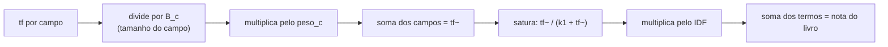

#### 3. O exemplo à mão (k1 = 1,2; título peso 3, b 0,5; sumário peso 1, b 0,75)

| Livro | Título (termos) | Sumário (termos) |
| --- | --- | --- |
| A | "Prisão preventiva" (2) | "Prisão em flagrante" (2; "em" é palavra vazia) |
| B | "Processo penal" (2) | "Prisão", "Recursos", "Provas" (3 itens, 3 termos) |
| C | "Direito civil" (2) | "Contratos" (1) |

N = 3. Média do título = (2+2+2)/3 = 2. Média do sumário = (2+3+1)/3 = 2.

**Termo "prisão"** (df = 2, aparece em A e B): IDF = ln(1 + 1,5/2,5) = ln 1,6 = **0,4700**.

| Livro | Cálculo de tf~ | Saturação | Nota |
| --- | --- | --- | --- |
| A | título: B = 1, 3·1/1 = 3; sumário: B = 1, 1·1/1 = 1; tf~ = **4** | 4/5,2 = 0,7692 | 0,4700 · 0,7692 = **0,3615** |
| B | só sumário: B = 0,25 + 0,75·(3/2) = 1,375; tf~ = 1/1,375 = 0,7273 | 0,7273/1,9273 = 0,3774 | 0,4700 · 0,3774 = **0,1774** |
| C | não aparece em `ocorrencias`, nem é visitado | | (fora) |

**Consulta "prisão flagrante"**: "flagrante" aparece só em A (df = 1), IDF = ln(1 + 2,5/1,5) = ln(8/3) = **0,9808**. No sumário de A, tf~ = 1 (B = 1), saturação 1/2,2 = 0,4545, contribuição 0,9808 · 0,4545 = 0,4458. Nota de A = 0,3615 + 0,4458 = **0,8074**. B continua em 0,1774. A vence com folga porque casa os dois termos, e o raro vale mais.

**Contraste com saturar por campo.** Se "prisão" em A fosse saturada em cada campo e depois somada: título 3/(1,2+3) = 0,714 e sumário 1/(1,2+1) = 0,455, total **1,17** (antes de multiplicar pelo IDF), contra **0,77** do BM25F. É a inflação que o PLANO quis evitar.

**Saturação na prática.** Se tf~ passasse de 4 para 8 (o dobro), a fração iria de 0,77 para 0,87. Não dobra: 8/9,2 = 0,87.

**Nota do item.** Há 5 itens no total (A: 1, B: 3, C: 1) e 6 termos entre eles, então a média dos itens é 6/5 = 1,2. O item único de A tem 2 termos: fator = 0,25 + 0,75·(2/1,2) = 1,5; tf~ = 1/1,5 = 0,6667; saturação 0,6667/1,8667 = 0,357; nota 0,4700 · 0,357 = **0,1679**. Os números calculados à mão bateram com o código.

#### 4. Os padrões escolhidos e as proteções

| Campo | Peso | b | Raciocínio |
| --- | --- | --- | --- |
| título | 3 | 0,5 | o que o usuário mais lembra |
| subtítulo | 2 | 0,5 | complementa o título |
| categorias | 1,5 | 0,3 | rótulo curto, escolhido pelo usuário |
| cddirCaminho | 1,5 | 0,3 | rótulo curto da classificação |
| sumário | 1 | 0,75 | campo longo: o tamanho mais distorce a contagem |
| autores | 0,5 | 0 | o tamanho de um nome não indica relevância |

`k1 = 1,2`. Estes são pontos de partida, e serão ajustados no passo 6.

Proteções no código (releia `BM25F.swift`):
- `fatorDeTamanho`: se a média é 0, devolve 1 (evita o `0/0` que a entrada 2.3b previu como armadilha).
- `saturar(0) = 0`: com `k1 = 0` e `tf = 0`, a fração seria `0/0 = NaN`. O `guard tf > 0` evita isso.
- Iterar só os campos onde o termo tem `tf > 0` (`guard let tf = frequencias[campo]`) garante que `tamanho > 0` e `média > 0` naquele campo, logo o fator nunca é 0/0. Não precisa checar de novo.

#### 5. O que acontece nos extremos de k1 (para você prever o comportamento)

`saturar(tf) = tf/(k1 + tf)`:
- **k1 → 0**: a fração tende a 1 para qualquer tf > 0. A nota vira "casou ou não": cada termo vale exatamente o seu IDF, não importa quantas vezes apareça. O teste `testExtremosValidosDosParametrosDaoNotaFinita` trava isso (B = 0,4700 e A = 0,4700 + 0,9808).
- **k1 → ∞**: o denominador é dominado por k1, a fração vira aproximadamente `tf/k1`, ou seja, **linear em tf~**. Volta o problema do TF-IDF linear (repetir ganha proporcionalmente).
- k1 típico (1,2 a 2) fica no meio: sobe rápido nas primeiras ocorrências e achata.

#### 6. Ordem de soma e determinismo

`Set` e `Dictionary` do Swift usam hash com semente aleatória por processo, então a ordem de iteração muda de uma execução para outra. Soma de `Double` **não é associativa**: em ponto flutuante, `(0,1 + 0,2) + 0,3` dá `0,6000000000000001`, mas `0,1 + (0,2 + 0,3)` dá `0,6`. Diferenças na última casa decimal podem mudar quem fica na frente num desempate, e o bug seria intermitente (passa num teste, falha no seguinte). A correção foi somar sempre em ordem fixa: `Set(termos).sorted()` para os termos e `CampoBusca.allCases` para os campos. Observação: a iteração sobre `ocorrencias` (um dicionário por livro) não afeta o resultado, porque cada livro acumula em chave própria; só importa a ordem das somas dentro do mesmo livro.

### Por que assim
- **`BM25F` como `enum` sem casos, só `static func`**: é uma função pura, sem estado. Um `struct` instanciável não acrescentaria nada, e `enum` impede criar instâncias por engano. O estado (contagens, médias) já mora no `IndiceInvertido`.
- **`ParametrosBM25F` como struct com `let` e `init` com `precondition`**: parâmetros fora de faixa (k1 negativo, b > 1, peso negativo) fazem a fórmula dividir por zero ou dar nota negativa. Validar na criação faz o erro aparecer no ponto onde o valor errado nasce, e `let` impede alterar depois e contornar a validação. Observação para prever: `precondition` continua ativo em builds -O (Release); só `assert` some. Um `NaN` também é barrado, porque `NaN >= 0` e `(0...1).contains(.nan)` são falsos.
- **Parâmetros injetáveis com padrão `.padrao`**: o passo 6 precisa trocar pesos e medir o efeito; os testes também precisam de valores próprios (`testCadaCampoUsaOProprioPesoEB`).
- **`notaDoItem` usa o IDF do livro inteiro**: o IDF é uma propriedade do termo na biblioteca, não do item; usar a mesma raridade mantém item e livro coerentes. Só `tf`, `k1`, `b` do sumário e a média dos itens mudam.
- **Livro com termo só em campo de peso 0 entra com nota 0**: é consequência direta da fórmula (peso 0 zera tf~). Foi documentado, e o motor (passo 5) decide se o mostra.
- **Pesos ajustados por conjunto de consultas de referência (passo 6), não olhando o app**: ver "Alternativas descartadas".

### Alternativas descartadas
- **Um BM25 por campo, somado**: infla notas de termos presentes em muitos campos (ver tabela). Descartado no PLANO.
- **BM25 no texto concatenado**: perde a ponderação por campo.
- **Ajustar os pesos só testando o app**: poucos casos, o julgamento é "parece bom", e consertar uma busca pode piorar outras sem ninguém ver. O método escolhido: 20 a 30 fichas reais (da estante do Ricardo ou do LexML com descrição/sumário), 15 a 20 consultas, cada uma com o livro esperado, e uma métrica calculada num teste XCTest. As métricas: **top 1** (o esperado é o primeiro?), **top 3** (está entre os três primeiros?) e **MRR** (*mean reciprocal rank*, a média de 1/posição do livro esperado; 1º vale 1, 2º vale 0,5, 3º vale 0,33...). Mudar um peso mostra o efeito em todas as consultas de uma vez. Será feito **depois do motor** (passo 6), porque o que se mede é o motor inteiro (normalização, filtros, desempate), não só a fórmula. O app (2.7) só confere a sensação de uso e sugere consultas novas para o conjunto. O mesmo método está previsto para a Fase 3. Registrado na tabela de decisões do PLANO (09/10).
- **Lematização/stemming para "prisões" achar "prisão"**: fora do escopo da fórmula; a decisão fica para o passo 5.
- **Cálculo de `Σ` tolerante a pesos negativos**: rejeitado em favor de impedir o valor inválido na criação.

### Padrões e boas práticas
- **Função pura + injeção de parâmetros**: facilita testar e ajustar. Quando não usar: se a função precisasse de estado entre chamadas (cache de IDFs, por exemplo), um tipo com estado seria mais adequado; aqui seria otimização prematura.
- **Validação de invariantes no `init` (fail fast)** com `precondition`. Quando não usar: para entrada vinda do usuário ou da rede, não se deve travar o app; aí o `init` deveria ser falível (`init?`) ou lançar erro. Aqui os valores vêm do código, então um valor inválido é erro de programação.
- **Teste com exemplo calculado à mão**: trava os números reais. Os testes de desigualdade (`GreaterThan`) travam propriedades (mais curto vence, repetição não dobra) e são complementares, não substitutos. A revisão sugeriu trocá-los por números e a sugestão foi rejeitada por esse motivo.
- **Testes que percorrem `allCases`**: se um campo novo entrar no enum, o teste o cobre sozinho (ou falha o `switch`, que precisa ser exaustivo).
- **`private lazy var` em `XCTestCase`**: seguro, porque o XCTest cria uma instância da classe por método de teste; `lazy` é necessário porque o inicializador usa `self` (`estanteId`).

### Armadilhas
- **Ordem de soma não determinística** (item 6 acima): bug intermitente na última casa decimal. Diagnóstico: rodar o mesmo teste várias vezes e comparar com `==` em vez de `accuracy`.
- **Nome de variável igual ao do método auxiliar** (`var indice = indice([...])`): compila, mas é frágil e confunde a leitura. Por isso o auxiliar se chama `montarIndice` e os livros `livroA/B/C`.
- **Média 0 e `tf = 0`**: `NaN` silencioso na nota; o `NaN` contamina a soma e some do radar. Diagnóstico: `XCTAssertTrue(nota.isFinite)`.
- **Nota 0 não é "sem resultado"**: um livro pode entrar com nota 0 (campos de peso 0). Quem consumir `notas` não pode assumir que todo valor é positivo.
- **Termos repetidos na consulta** contam uma vez (por causa do `Set`); se isso não fosse desejado, o comportamento mudaria.
- **Parâmetros ajustados no escuro**: mexer num peso sem medir é o erro que o passo 6 existe para evitar.

### Para ir além
- Robertson e Zaragoza, *The Probabilistic Relevance Framework: BM25 and Beyond* (2009): a seção de BM25F é a base do que foi implementado aqui.
- Manning, Raghavan e Schütze, *Introduction to Information Retrieval*, cap. 6 (ranking) e cap. 8 (avaliação: precisão, MRR). Online em nlp.stanford.edu/IR-book.
- Documentação do Swift sobre `precondition` e sobre `Set`/`Dictionary` (ordem de iteração não especificada). Para os números de ponto flutuante: Goldberg, *What Every Computer Scientist Should Know About Floating-Point Arithmetic*.

### Perguntas
1. Com suas palavras: o que a fórmula `tf~/(k1 + tf~)` faz com o valor de `tf~`? Explique por que ela precisa ser aplicada **depois** de somar os campos, e o que aconteceria se fosse aplicada em cada campo antes da soma (use o contraste 1,17 contra 0,77 do exemplo).
2. Aplicação: (a) o que acontece com a nota de cada termo se `k1 → 0`? E se `k1 → ∞`? Em qual dos dois a repetição de um termo conta mais? (b) Por que o `init` de `ParametrosBM25F` valida, e por que as propriedades são `let`? Que valor de entrada levaria a uma divisão por zero ou a uma nota negativa?
3. Raciocínio: (a) por que o código itera `Set(termos).sorted()` e `CampoBusca.allCases` em vez de `Set(termos)` e `parametros.pesos.keys`? Dê um exemplo concreto de dois resultados diferentes da mesma soma de `Double`. (b) Refaça à mão a nota de B para "prisão" se o `b` do sumário fosse 0 (B deixa de ser penalizado por ter 3 itens). A nota sobe ou desce em relação a 0,1774? (c) As perguntas da 2.3b (calcular à mão o "preventiva" no cenário A/B/C e a proteção para média 0) continuam valendo: o código agora mostra a resposta de (b) dessa entrada em `fatorDeTamanho`.

### Minhas respostas
<!-- Ricardo responde aqui por escrito. O teacher corrige na próxima chamada. -->

**Correção das respostas:** (sem respostas)

---

## Tarefa 2.3d — Filtros da busca (2026-10-09)

### O que foi feito
Criei `Dominio/Busca/FiltroBusca.swift`: uma `struct` só com Foundation que guarda as escolhas das chips (autor, editora, faixa de anos, estantes, prefixo de CDDir, categorias) e expõe o predicado puro `aceita(_ livro:) -> Bool` e `estaVazio`. Os testes estão em `EstantesTests/Dominio/Busca/FiltroBuscaTests.swift`. A suíte ficou em 112 testes, 0 falhas, no Xcode 14.2. O PLANO marcou os passos 3 e 4 da 2.3 e ganhou uma linha na tabela de decisões.

### Conceitos envolvidos

#### 1. Predicado puro e filtro vazio
Um predicado é uma função `Livro -> Bool`. Ele é "puro" porque a resposta depende só do filtro e do livro, sem rede, relógio nem estado escondido. Isso permite testar com exemplos pequenos e reaproveitar o filtro no motor, na tela e em testes. Regra de identidade: o filtro vazio aceita tudo, como o `true` do `&&`.

#### 2. Lógica E entre dimensões, OU dentro de uma dimensão
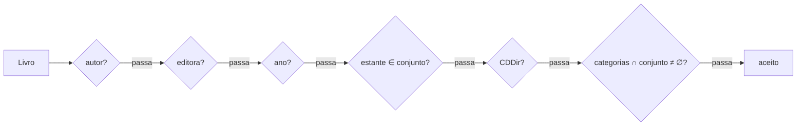
Entre dimensões vale E (cada `if ... return false` é uma barreira). Dentro de estantes e categorias vale OU: `estanteIds.contains(livro.estanteId)` e `!categoriaIds.isDisjoint(with:)`. `Set.contains` é O(1) em média; `isDisjoint(with:)` percorre o menor dos dois conjuntos.

#### 3. "Sem filtro" por convenção: nil, texto em branco, conjunto vazio
Cada dimensão tem um valor neutro. Isso evita um `enum` de "ligado/desligado" por chip, mas cria um risco: a regra "em branco = sem filtro" precisa ser a mesma em `estaVazio` e em `aceita`. Se uma dimensão nova entrar em um lugar e não no outro, o motor (que usará `estaVazio` como atalho) pularia um filtro ligado. O teste de propriedade (ver "Padrões") amarra as duas funções.

#### 4. Autor: casamento por prefixo de termos, em qualquer ordem
O problema: o dado vem como "Silva, José Afonso da" e o usuário digita "José Afonso Silva". Comparar o texto inteiro ("contém") falha. A solução usa o `Tokenizador` da 2.3a: o nome vira termos normalizados (`["silva","jose","afonso"]`, porque "da" é palavra vazia), e cada termo digitado precisa ser prefixo de algum termo do **mesmo** autor:
```swift
termosProcurados.allSatisfy { procurado in
    termosDoNome.contains { $0.hasPrefix(procurado) }
}
```
Complexidade: O(p · t) por autor (p termos procurados, t termos do nome), pequenos de verdade. Consequências:

| Digitado | Resultado | Por quê |
| --- | --- | --- |
| "silv" | acha | prefixo de "silva" |
| "ilva" | não acha | meio da palavra, não prefixo |
| "da" | filtro conta como vazio | palavra vazia, o tokenizador descarta |
| "antonio grinover" | não casa com Cintra, Antônio + Grinover, Ada | os termos têm de estar no mesmo autor |

O "mesmo autor" está em `livro.autores.contains(where: { autor($0, casaCom:) })`: o OU é entre autores do livro, o E é entre os termos dentro de um autor.

#### 5. Editora, ano e CDDir
- **Editora**: `Normalizacao.chave` (minúsculas, sem acento) nos dois lados e `contains`. Editora não tem ordem de nome, então o "contém" basta.
- **Ano**: limites inclusivos e opcionais. Livro sem ano sai quando há qualquer limite (não dá para afirmar que está na faixa). Faixa invertida (mínimo > máximo) não aceita ninguém.
- **CDDir**: `hasPrefix` depois de remover todo espaço. A classificação decimal é hierárquica: "341.1" é o assunto geral, "341.12" um subassunto, então prefixo de string coincide com a hierarquia. Armadilha da string: "34" também pega "341" e "3412", o que aqui é desejado, mas um prefixo de "341.1" não pega "341.2".

#### 6. Onde o filtro entra no pipeline
O filtro roda **depois** do BM25F, sobre os candidatos já pontuados. O IDF (raridade do termo) é calculado sobre a biblioteca inteira no índice; se filtrássemos antes, o IDF mudaria com o conjunto e o mesmo livro teria nota diferente ao ligar uma chip. Custo: O(n) linear nos candidatos (n pequeno: biblioteca pessoal).

### Por que assim
As decisões, numeradas como foram aprovadas:
1. **`struct FiltroBusca` com estado**, diferente do `BM25F` (enum sem casos, função pura sem estado). O filtro guarda as escolhas da tela, então precisa de valores; o BM25F só calcula. Filtro vazio aceita tudo.
2. **Campos**: autor, editora (`String?`), anoMinimo, anoMaximo (`Int?`), estanteIds, categoriaIds (`Set<UUID>`), prefixoCDDir (`String?`). `nil`, texto em branco e conjunto vazio significam "sem filtro". Esses dados ficaram fora do `CampoBusca` na 2.3b justamente para serem filtros, não texto pontuado.
3. **E entre dimensões; OU dentro de estantes e categorias.** Marcar "Penal" e "Processo" mostra livros de qualquer uma. E entre categorias foi descartado: quem marca duas chips quase sempre quer ampliar.
4. **Editora** por `Normalizacao.chave` + "contém". **Autor** começou como "contém" no texto inteiro; o revisor apontou que "José Afonso Silva" não acha "Silva, José Afonso da". A busca BM25F (campo autores tokenizado) já acha em qualquer ordem, só o filtro falhava. Opções: (a) comparar por termos do `Tokenizador`, cada termo digitado prefixo de algum termo de um mesmo autor; (b) manter e a tela 2.7 oferecer lista de autores. Ricardo escolheu (a). Consequências na tabela acima.
5. **Ano**: limites inclusivos e opcionais; livro sem ano sai quando há filtro de ano; faixa invertida não aceita nenhum, **sem `precondition`**. Entrada do usuário não pode travar o app (lição da 2.3c: `precondition` é para erro de programação, como os parâmetros do BM25F). A tela evita o caso.
6. **CDDir**: `hasPrefix` depois de tirar **todos** os espaços (pontas e meio: "341 .2" vira "341.2"; código CDDir não tem espaço significativo). A hierarquia decimal faz "341.1" pegar "341.12". Livro sem CDDir sai.
7. **O filtro roda depois do BM25F** (no motor, passo 5), pelo motivo do IDF. Consulta vazia + filtro preenchido fica para o passo 5.
8. **Custo O(n) linear**; índices por faceta (bitmaps) descartados como otimização prematura.

### Alternativas descartadas
- **Filtrar antes do ranking**: mudaria o IDF e as notas (ver acima). Só valeria se o objetivo fosse "ranquear dentro do subconjunto" como uma biblioteca nova.
- **E entre categorias**: restringe demais; contraria a intenção típica de quem marca várias chips.
- **Autor por "contém" no texto inteiro**: falha com a ordem "Sobrenome, Nome" (achado 4 da revisão).
- **Opção (b) para autor** (lista de autores na tela 2.7): empurra o problema para a interface e não ajuda quem digita livremente.
- **`precondition` na faixa de anos invertida**: travaria o app por entrada do usuário.
- **Índices por faceta/bitmaps**: complexidade sem medida que a justifique.

### Padrões e boas práticas
- **Predicado puro com valor neutro (identidade)**: filtro vazio = `true`. Quando não usar: se o filtro precisasse de dados externos (consultar o banco por categoria), deixaria de ser puro e iria para a camada de dados.
- **Teste de propriedade amarrando duas funções** (`testCadaDimensaoLigadaDeixaDeEstarVazioERecusaLivro`): um filtro por dimensão (7, conferido com `count` para o teste falhar se uma dimensão nova for esquecida), exigindo `estaVazio == false` e recusa do livro. Isso fecha o risco de `estaVazio` e `aceita` divergirem.
- **Testar o E uma dimensão por vez**: dicionário de closures `(inout FiltroBusca) -> Void`, cada uma estraga uma dimensão de um filtro que antes aceitava o livro. Pegaria uma troca de E por OU.
- **Nomes que dizem o papel** (Swift API Design Guidelines): `textoNormalizado`, `editoraProcurada`, `prefixoProcurado` em vez de nomes sombreados (um método `static chave` com `let chave` dentro; `if let autor` sombreando a propriedade). Sombrear compila, mas confunde a leitura.
- **`guard` dentro do `if`** nas dimensões ano/CDDir: deixa explícito o caso "livro sem ano/sem cddir". A revisão apontou a mistura de estilos, e a mistura foi mantida de propósito.
- **Faixa de anos inclusiva** com comentário de teste mostrando que 2014 está entre 2010 e 2020 mas mesmo assim sai na faixa invertida: o teste documenta o porquê.

### Armadilhas
- **Closures guardadas num dicionário são `@escaping`**: dentro de um `XCTestCase`, acessar propriedades exige `self.` explícito no Swift 5.7 (`self.estante2`); sem isso o compilador reclama de captura implícita.
- **`estaVazio` e `aceita` divergirem**: diagnóstico pelo teste de propriedade; sintoma no app seria uma chip ligada sem efeito.
- **Filtro só com "da"** vira vazio (palavra vazia): o usuário digita e nada muda. É consistente com o tokenizador, mas pode surpreender na tela.
- **"ilva" não acha "Silva"**: prefixo não é substring. Aceito por escolha.
- **Livro sem ano/CDDir some quando o filtro está ligado**: correto, mas na tela convém explicar.
- **Termos do filtro recalculados a cada livro** (normalização e tokenização do texto procurado): custo pequeno hoje, adiado ao passo 5 (pré-calcular uma vez por consulta, só depois de medir).
- **Passo 5**: conferir que o motor aplica o filtro depois do BM25F e que usa `estaVazio` só como atalho.

### Para ir além
- Manning, Raghavan e Schütze, *Introduction to Information Retrieval*, cap. 1 e 7 (combinação de restrições booleanas com ranking); online em nlp.stanford.edu/IR-book.
- Swift API Design Guidelines (swift.org/documentation/api-design-guidelines): seção sobre clareza e nomes que dizem o papel.
- Documentação do Swift sobre closures: "Escaping Closures" em *The Swift Programming Language*.

### Perguntas
1. Com suas palavras: por que "José Afonso Silva" acha "Silva, José Afonso da" no filtro agora, mas "antonio grinover" não casa com um livro de Cintra, Antônio e Grinover, Ada? Onde no código está a diferença entre "o mesmo autor" e "qualquer autor do livro"?
2. Aplicação: se o produto pedisse que marcar as categorias "Penal" e "Processo" mostrasse só livros que têm **as duas**, o que mudaria em `aceita`? E o que mudaria no teste de propriedade e na tela, sabendo que `estaVazio` ainda precisa fazer sentido?
3. Raciocínio: suponha que o filtro de estante rodasse **antes** do BM25F, restringindo o índice às estantes marcadas. Dê um exemplo concreto com duas estantes e um termo (por exemplo "prisão") em que o mesmo livro mudaria de nota ao ligar a chip, e explique por quê usando o IDF. Depois diga: o `Tokenizador` ignora "da"; o que `FiltroBusca(autor: "da")` devolve em `estaVazio` e em `aceita`?

### Minhas respostas
(sem respostas)

---

## Tarefa 2.3e — Motor de busca (passo 5a) (2026-10-09)

### O que foi feito
Criei `Dominio/Busca/MotorDeBusca.swift`, que junta o `IndiceInvertido`, o `BM25F` e o `FiltroBusca` numa única API (`buscar`), e `ResultadoBusca.swift`. Acrescentei `IndiceInvertido.termos(comPrefixo:)` e refatorei `FiltroBusca` para ter a forma `Preparado`. Testes em `EstantesTests/Dominio/Busca/MotorDeBuscaTests.swift`; suíte em 131 testes, 0 falhas, Xcode 14.2. O passo 5 foi dividido: este é o **5a (motor)**; o **5b** traz o item do sumário no resultado e `atualizar(categorias:)` reindexando os livros afetados.

### Conceitos envolvidos

#### 1. O pipeline da consulta
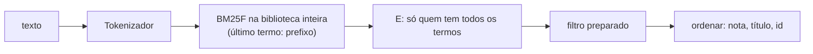
Cada etapa existe por um motivo. O BM25F roda antes do filtro porque o IDF depende do conjunto de livros (ver 2.3d). O E vem antes do filtro só por clareza; a ordem entre os dois não muda o resultado, só o custo.

#### 2. Struct com `mutating` em vez de classe
`MotorDeBusca` é um tipo-valor. `atualizar` e `remover` são `mutating`, e `buscar` não é (só lê). Em Swift, `let motor` impede mutação, `var motor` permite: o compilador diz quem pode alterar. O dono será o ViewModel (`@Published var motor`), sem singleton, como pede a arquitetura. Dicionários e arrays são copy-on-write: copiar o motor é barato até alguém alterar uma das cópias.

#### 3. Por que o motor guarda os livros
O índice só tem termos de texto (título, autores, categorias, sumário). O filtro precisa de editora, ano, estante e CDDir, que ficaram de fora do índice de propósito (2.3b). Então o motor mantém `[UUID: Livro]`: o índice responde "quem contém o termo", o dicionário responde "quem é esse livro" em O(1).

#### 4. E entre os termos, e o laço que o implementa
`BM25F.notas(termos: [t])` devolve só os livros que contêm `t`. Começamos com as notas do último termo e, para cada termo fixo, mantemos apenas os ids presentes em `notasDoTermo`, somando a nota:
```swift
for (id, nota) in notas {
    notas[id] = notasDoTermo[id].map { nota + $0 }   // nil remove a chave
}
```
Atribuir `nil` a uma chave de dicionário a remove. O `for` percorre uma **cópia** de `notas` (tipo-valor, copy-on-write: a primeira mutação dentro do laço duplica o armazenamento), por isso alterar o dicionário no laço é seguro. Em Swift, `Optional.map` aplica a função só se houver valor: `nil.map { ... }` continua `nil`. Complexidade: O(k · m), com k termos e m livros candidatos do último termo.

#### 5. Prefixo no último termo
O usuário ainda está digitando, então "prevent" deve achar "preventiva". Só o último termo expande, e só com 2 ou mais caracteres (com 1 letra, quase todo o vocabulário entraria). `termos(comPrefixo:)` filtra as chaves de `postings` com `hasPrefix` e ordena: O(V) mais a ordenação dos casados. Para cada expansão calculamos a nota e o livro fica com a **maior**, não a soma: um prefixo com muitas expansões não deve inflar a nota (a mesma ideia da saturação do BM25F). Consequência: como cada expansão traz seu IDF, costuma vencer a expansão mais rara na biblioteca.

#### 6. Ordenação determinística e "decorate-sort-undecorate"
O comparador precisa normalizar o título (`Normalizacao.chave`), operação cara. Uma ordenação faz O(n log n) comparações; normalizar dentro do comparador repete o trabalho. Em vez disso, `ordenar` calcula uma vez por resultado uma tupla `(resultado, tituloNormalizado, id)`, ordena as tuplas e descarta a decoração. É a **transformada de Schwartz** (decorate-sort-undecorate): O(n) normalizações em vez de O(n log n). Critérios: nota decrescente, título crescente, `uuidString` crescente. O último garante que duas execuções deem a mesma ordem, mesmo com notas e títulos iguais (o `sorted` do Swift não é garantidamente estável).

#### 7. `FiltroBusca.Preparado`
Antes, `aceita` normalizava a editora, tokenizava o autor e removia espaços do CDDir **a cada livro**. `preparado()` faz isso uma vez por consulta e devolve um valor com os textos já prontos; `estaVazio` e `aceita` de `FiltroBusca` só delegam. Efeito colateral bom: a regra "em branco = sem filtro" agora está num único lugar (`preparado()`), o que fecha o achado 1 da 2.3d.

### Por que assim
As decisões, numeradas como foram aprovadas (elas fecham as "decisões adiadas para o passo 5" da 2.3a e o achado 2 da revisão da 2.3d):
1. **`struct MotorDeBusca`** com `IndiceInvertido`, `[UUID: Livro]` e os nomes das categorias; `init(livros:categorias:)`, `atualizar(_:)`, `remover(livroId:)`, `buscar(_:filtro:parametros:)`. Struct com `mutating` porque o dono é o ViewModel, sem singleton. Guarda os livros porque o filtro precisa de editora, ano, estante e CDDir.
2. **`ResultadoBusca` = livro + nota** (o item do sumário vem na 5b). O nome da estante não entra: a tela resolve por `livro.estanteId`; senão renomear uma estante exigiria reindexar.
3. **E entre os termos.** "prisão" aparece em dezenas de livros jurídicos, e OU devolveria uma lista cheia de ruído. Custo: um erro de digitação zera o resultado. O passo 6 mede; se for frequente, a saída é "E, e se vazio, OU".
4. **Prefixo só no último termo**, mínimo 2 caracteres, **maior nota entre as expansões**. `termos(comPrefixo:)` varre o vocabulário em O(V).
5. **Plural/stemming adiado** ("prisão" × "prisões", algoritmo RSLP): o prefixo não resolve ("prisoes" não começa com "prisao"). Medir no passo 6; sinônimos na Fase 5.
6. **Consulta vazia** (em branco ou só palavras vazias, como "de"): sem filtro devolve `[]`; com filtro devolve os livros filtrados em ordem de título, nota 0.
7. **Ordem**: tokenizar, BM25F na biblioteca inteira, E, filtro (depois, para não mudar o IDF), ordenar. `FiltroBusca` ganhou `Preparado`.
8. **Ordenação**: nota decrescente, título normalizado crescente, id (`uuidString`), mantendo o determinismo da 2.3c.

Detalhe do E: `BM25F.notas` é chamado um termo por vez e a soma segue ordem fixa (último termo, depois os fixos em ordem alfabética). Soma de `Double` não é associativa, então a ordem pode mudar o último bit da nota; ordem fixa dá resultado reprodutível.

### Alternativas descartadas
- **OU entre os termos**: ruído demais em um domínio de vocabulário repetitivo.
- **Vocabulário ordenado + busca binária para prefixo**: acharia o intervalo em O(log V + r), mas manter o vocabulário ordenado custa a cada inclusão de livro. Só se a medição pedir.
- **Somar as notas das expansões do prefixo**: um prefixo curto como "pr" inflaria a nota de quem casa com várias palavras.
- **Nome da estante dentro do resultado**: obrigaria a reindexar ao renomear.
- **Remover o `.sorted()` de `termos(comPrefixo:)`** (sugestão da revisão, recusada): o custo é desprezível e a ordem fixa evita o bug intermitente da soma (ver acima).
- **Stemming agora**: sem medir, é complexidade especulativa.

### Padrões e boas práticas
- **Decorate-sort-undecorate**: use quando a chave de ordenação é cara de calcular. Não use quando a chave já é um campo guardado (ordenar por `nota` direto).
- **Preparar uma vez, usar muitas** (o `Preparado`): separar "interpretar a configuração" de "aplicá-la" evita trabalho repetido em laços. Não vale para filtros usados uma vez só.
- **Fonte única de verdade**: a regra "em branco = sem filtro" mora em `preparado()`; `FiltroBusca.estaVazio` e `aceita` apenas delegam.
- **Teste que distingue a versão certa da errada**: todo teste precisa de um caso em que o código errado daria resultado diferente.
- **Ler a falha antes de consertar**: o teste também pode estar errado.

### Armadilhas
- **O bug "penal penal"**: o último termo repetia um anterior e entrava duas vezes: nota 1,72 = 2 × 0,86. Correção: `anteriores.remove(ultimo) != nil` marca o repetido; repetido não expande (o usuário já passou dele) e conta uma vez só, como os repetidos no BM25F. `Set.remove` devolve o elemento removido (ou `nil`), então serve de teste de pertinência e remoção num só passo.
- **Teste que não protegia a correção**: "penal penal" passava mesmo sem o conserto, porque nada mais começa com "penal". O novo teste usa "prev" (acha A e D) e "prev prev" (devolve `[]`: o repetido vale como exato e "prev" não é um termo do vocabulário). Sem a correção, "prev prev" acharia A e D.
- **Erro do teste, não do motor**: esperei que "preve" achasse só "Prisão preventiva", mas "Prevenção" vira "prevencao" e também começa com "preve". Troquei por "prevent". Sintoma de diagnóstico: o motor retornava um livro "a mais" que, ao olhar o dado, estava certo.
- **Iterar e mutar o mesmo dicionário** é seguro em Swift por causa da cópia, mas em outras linguagens (Java, Python) é erro em tempo de execução. Não generalize.
- **Para a 5b**: `atualizar(categorias:)` precisa reindexar os livros afetados, porque os nomes das categorias entram no índice.

### Para ir além
- Manning, Raghavan e Schütze, *Introduction to Information Retrieval*, cap. 3 (dicionários e consultas por prefixo/curingas) e cap. 6 (ranking); nlp.stanford.edu/IR-book.
- Transformada de Schwartz (decorate-sort-undecorate): o nome vem de Randal Schwartz, que popularizou o padrão em Perl nos anos 1990; o verbete "Schwartzian transform" da Wikipédia resume a ideia e o custo.
- *The Swift Programming Language*, capítulo "Structures and Classes" (tipos-valor e copy-on-write) e a documentação de `Dictionary` e `Set.remove`.

### Perguntas
1. Com suas palavras: por que o motor guarda `[UUID: Livro]` além do índice, e por que o filtro roda depois do BM25F? O que mudaria na nota de um livro se rodasse antes?
2. Aplicação: o produto decide que, quando o E devolver lista vazia, a busca deve tentar OU. Onde em `buscar` você mexeria, o que precisa mudar na ordenação (as notas dos dois grupos são comparáveis?) e como o teste "prev prev" se comportaria?
3. Raciocínio: a biblioteca tem "Prisão preventiva" e "Prevenção do crime", e o usuário digita "prevent" (última palavra), depois "preven". Quais livros voltam em cada caso e por quê? Dica: pense em quais termos do vocabulário começam com cada prefixo e no que a regra "maior nota entre as expansões" faz.

### Minhas respostas
(sem respostas)

## Tarefa 2.3f — Item do sumário e categorias no motor (passo 5b) (2026-10-09)

### O que foi feito
`ResultadoBusca` ganhou `itemDoSumario: ItemSumario?`, e `MotorDeBusca` ganhou `melhorItem` (escolhe o item do sumário que mais casa com a consulta) e `atualizar(categorias:)` (reindexa só os livros afetados por renomear, apagar ou criar categorias). As expansões do prefixo agora são calculadas uma vez em `buscar`. Testes em `MotorDeBuscaTests.swift`; suíte em 144 testes, 0 falhas, Xcode 14.2. Com isso o passo 5 da 2.3 está fechado; falta o passo 6 (consultas de referência e ajuste dos pesos).

### Conceitos envolvidos

#### 1. Resultado em dois níveis: livro e item
A tela mostra "Livro · item do sumário, p. N · Estante X · prateleira". Cada pedaço vem de um lugar diferente:
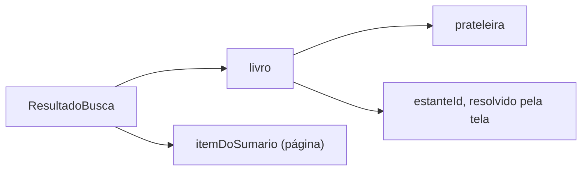
A página mora no item, a prateleira no livro, e o nome da estante é resolvido pela tela a partir de `estanteId`. Guardar o nome no resultado obrigaria a reindexar ao renomear uma estante.

#### 2. Escolher o melhor item: mesma regra do livro
`melhorItem` percorre `indice.itensSumario(doLivro:)` e dá a cada item uma nota com a mesma regra usada no livro: soma dos termos fixos mais a maior nota entre as expansões do prefixo do último termo. Guardar o máximo corrente é uma varredura O(n) sobre os itens. Detalhes que importam:
- Parte-se de 0 e compara-se com `>`. Item sem nenhum termo tem nota 0 e nunca vence; se nenhum vence, o resultado é `nil` (o livro casou pelo título ou autor).
- `>` e não `>=`: no empate fica o primeiro do sumário. O teste de empate pegaria a troca por `>=`, porque com `>=` ficaria o último.
- Só é calculado para os livros que passaram no filtro; quem sai não gasta cálculo.
- Listagem só por filtro (consulta vazia) devolve `nil`: não há termos para casar.

#### 3. Inverter quem dirige o laço (o ganho de desempenho)
Primeira versão: para cada expansão, para cada item, `notaDoItem`. Com o prefixo "pr" há centenas de expansões; multiplicadas por itens e por livros, a cada tecla digitada. Versão final: cria-se um `Set(expansoes)` uma vez por consulta e percorrem-se os termos **do item** (`item.frequencias.keys.filter(expansoes.contains)`).
- Antes: custo O(expansões) por item.
- Depois: O(tamanho do item), com cada consulta ao Set em O(1) esperado (tabela hash).

Regra geral: itere o conjunto pequeno e consulte o grande numa estrutura de busca O(1). Quem é "pequeno" aqui é o item (poucos termos), não o vocabulário expandido.

#### 4. Reindexar quando um dado derivado muda
O índice grava os **nomes** das categorias (decisão da 2.3b), não os ids. O nome é um dado derivado copiado para dentro do índice; se muda na fonte, a cópia fica velha. É o problema clássico de invalidação de cache/desnormalização: ou se reindexa quem foi afetado, ou se aceita resultado desatualizado. Aqui reindexa-se, e só os afetados.

A expressão central:
```swift
let afetadas = Set(antigos.keys).union(novos.keys).filter { antigos[$0] != novos[$0] }
```
`antigos[$0]` e `novos[$0]` são `String?`. Comparar opcionais cobre três casos numa única condição:
| Caso | antigo | novo | diferem? |
| --- | --- | --- | --- |
| renomeada | "A" | "B" | sim |
| apagada | "A" | nil | sim |
| nova | nil | "B" | sim |
| inalterada | "A" | "A" | não |

A "nova" conta porque um livro pode ter recebido o id da categoria antes de o motor conhecer seu nome (o índice teria gravado o livro sem aquele nome).

Das apagadas, o livro também **perde o id** (`livro.categoriaIds.subtract(apagadas)`). Isso espelha o `nullify` do Core Data (apagar a categoria remove a relação nos livros). Sem isso, o filtro por categoria ainda acharia o id antigo, que já não existe.

Ordem importa: `nomesDasCategorias = novos` é trocado **antes** do laço, porque `atualizar(livro)` consulta esse dicionário para montar o texto indexado e precisa dos nomes novos.

Iterar `livros.values` enquanto `atualizar` altera `livros` é seguro: `values` é copiada por valor (copy-on-write), como no laço do E na 2.3e. O `guard !afetadas.isEmpty` evita a varredura quando nada mudou. Complexidade: O(C) para comparar categorias, mais O(L) para varrer os livros, mais o custo de reindexar cada afetado.

### Por que assim
Decisões aprovadas, numeradas:
1. **`itemDoSumario: ItemSumario?` no resultado.** Página vem do item, prateleira do livro, nome da estante resolvido pela tela (renomear estante não reindexa).
2. **Item mostrado = maior `BM25.notaDoItem`** pela mesma regra do livro; empate vai para o primeiro do sumário (`>`, não `>=`); nenhum item com os termos dá `nil`; só para livros que passaram no filtro; consulta vazia dá `nil`. O item é localizado por **id** no livro. A revisão sugeriu guardar a posição; ficou o id, porque é correto mesmo se a ordem do índice divergir da do livro, e a busca linear num sumário é barata.
3. **`atualizar(categorias:)`** reindexa só os livros afetados (união de ids antigos e novos cujo nome difere), tira dos livros os ids apagados, troca `nomesDasCategorias` antes do laço. Ids que o motor nunca conheceu (nem antes nem agora) ficam no livro; está documentado.
4. **Refatoração:** as expansões do prefixo são calculadas uma vez em `buscar` e passadas a `notasDoUltimo` e `melhorItem`. A regra de "repetido não expande" e do mínimo de 2 letras fica num lugar só.

Revisão (Ricardo aprovou 1, 2, 4, 5, 6; recusou 3 e 7):
1. Aplicado (desempenho): `Set(expansoes)` e laço pelos termos do item (ver conceito 3).
2. Aplicado: comentário explicando que partir de 0 com `>` é o que gera `nil` quando nenhum item tem os termos.
4. Aplicado: documentação dos ids órfãos.
5. Aplicado: testes novos.
   - "prisao temporar": termo fixo mais prefixo juntos; só o item com os dois vence.
   - "pena": expansões "penal" (primeira alfabeticamente, presente nos 3 livros, IDF baixo, cerca de 0,13) e "penas" (só num item, IDF cerca de 0,98). Vence "Aplicação das penas". O teste falharia se o código usasse só a primeira expansão.
6. Aplicado: livro com duas categorias e uma apagada (só aquele id sai, a outra continua buscável); `atualizar(categorias:)` com a mesma lista não muda o resultado.
3 e 7, recusados: ver abaixo.

### Alternativas descartadas
- **Guardar a posição do item em vez do id** (achado 3, recusado): a posição seria mais rápida, mas quebra em silêncio se a ordem do índice e a do livro divergirem. Com sumários de dezenas de itens, a busca linear é irrelevante.
- **Renomear `atualizar(categorias:)` para `trocarCategorias`** (achado 7, recusado): o nome segue o padrão `atualizar(_ livro:)` e a documentação explica o efeito.
- **Reindexar todos os livros a cada mudança de categoria:** correto, mas O(L) reindexações; renomear uma categoria é raro, mas desnecessariamente caro.
- **Guardar ids de categoria no índice, resolvendo nomes na consulta:** evitaria reindexar, mas o BM25F precisa do texto dos nomes para ponderar o campo; foi decisão da 2.3b.
- **Nome da estante no resultado:** obrigaria reindexar ao renomear estante.

### Padrões e boas práticas
- **Inverter o laço / usar Set como índice de pertinência:** quando um lado é pequeno e o outro grande, itere o pequeno. Não vale a pena se ambos forem pequenos; legibilidade vence.
- **Calcular uma vez por consulta, usar muitas vezes:** o mesmo princípio do `Preparado` (2.3e).
- **Invalidar só o que mudou:** reindexação incremental. Não use quando a mudança é rara e a lista pequena: o ganho some e o código fica mais difícil de provar correto.
- **Fonte única de regra:** "como pontuar um termo" vale para livro e item.
- **Teste que distingue o certo do errado:** o teste do "penal/penas" falha se a implementação usar só a primeira expansão; o de empate falha se trocar `>` por `>=`.

### Armadilhas
- **`>=` no lugar de `>`:** o último item empatado vence e o resultado muda sem erro de compilação. Só um teste de empate pega.
- **Nota inicial 0 com item de nota 0:** sem a comparação estrita partindo de 0, um item sem nenhum termo viraria "melhor".
- **Trocar `nomesDasCategorias` depois do laço:** reindexaria com os nomes velhos e o bug só apareceria na busca por nome de categoria.
- **Comparar só ids antigos e novos** (sem comparar nomes) perde renomeações; comparar só nomes perde categorias novas com ids que livros já referenciam.
- **Esquecer de retirar os ids apagados do livro:** o filtro por categoria devolve livro de categoria que não existe.

### Para ir além
- Manning, Raghavan e Schütze, *Introduction to Information Retrieval*, cap. 4 e 5 (construção e atualização de índices).
- Documentação do Swift sobre `Set` e `Dictionary` (complexidade de `contains` e subscript) e sobre comparação de `Optional` (`Equatable`).
- Martin Kleppmann, *Designing Data-Intensive Applications*, cap. 3 (índices) e 11 (dados derivados e manutenção de visões).

### Perguntas
1. Com suas palavras: por que `melhorItem` só é chamado para os livros que passaram no filtro, e por que `atualizar(categorias:)` troca `nomesDasCategorias` antes do laço de reindexação? O que quebraria em cada caso se a ordem fosse inversa?
2. Aplicação: o usuário digita "pr". Explique quantas chamadas a `notaDoItem` a primeira versão fazia (em termos de E expansões, I itens, L livros) e quantas faz a versão final. E se o sumário de cada livro tivesse 2.000 itens com 200 termos cada, a mudança ainda valeria a pena? Justifique.
3. Raciocínio: a categoria "Penal" (id X) é renomeada para "Direito penal", e outra categoria "Civil" (id Y) é apagada. Em `atualizar(categorias:)`, quais ids entram em `afetadas`, quais em `apagadas`, e o que acontece com um livro que tinha X e Y? E o que acontece se a nova lista trouxer uma categoria Z que nenhum livro conhecido referencia?

### Minhas respostas
<!-- Ricardo responde aqui por escrito. O teacher corrige na próxima chamada. -->

(sem respostas)

## Tarefa 2.3g — Planejamento a partir das fotos reais: o plano muda (2026-10-09)

### O que foi feito
Sem código. Depois de fotografar 4 livros reais, `docs/PLANO.md` e `CLAUDE.md` foram atualizados: nova ordem de confiança das fontes de identificação, três parsers sobre uma struct `LinhaOCR`, modelo de `Livro` ampliado para obras em vários volumes (nova tarefa 2.3b, antes do passo 6 da busca), `pagina` como texto, hífen no tokenizador e `numeracao`/`parte` indexados. Fotos ficam fora do Git; o OCR é gravado em JSON e commitado.

### Conceitos envolvidos

**1. Validar o plano contra dados reais.** O plano de 03/10 supunha ISBN e ficha CIP na maioria dos livros. As fotos mostraram o contrário: nenhum dos 4 tem ISBN (o ISBN só existe desde ~1970 e se generalizou depois), 3 são de 1954–1972 e só têm folha de rosto. Quatro livros não são estatística, mas bastam para derrubar uma suposição. Por isso o plano passou a medir acerto num conjunto de avaliação em vez de confiar na intuição.

**2. Ordem de confiança.** Cada fonte tem uma taxa de erro diferente: código de barras (determinístico, dígito verificador) > ficha CIP (formato padronizado, ISBD) > folha de rosto (layout livre, mas semântico) > capa (decorativa) > Gemini (generativo, pode alucinar) > manual (sempre disponível). A ordem vai do mais verificável ao menos verificável; o Gemini fica depois dos algoritmos porque seu erro é silencioso.

**3. `LinhaOCR` e a porta do Domínio.** O Vision devolve `VNRecognizedTextObservation` com `boundingBox` (CGRect normalizado 0–1, origem no canto inferior esquerdo). O Domínio só importa Foundation, então ele define sua própria struct:

```swift
struct LinhaOCR { let texto: String; let x, y, largura, altura: Double; let confianca: Double }
```

`Dados/Visao` converte Vision para `LinhaOCR`. Isso é a mesma inversão de dependência do resto do projeto: a regra (parser) não conhece o detalhe (framework). Benefício concreto: o parser vira função pura `[LinhaOCR] -> Resultado`, testável com JSON gravado, inclusive na CI sem Vision nem fotos. Cuidado com o eixo y: no Vision, y=0 é a base da página; se o Domínio adotar "y cresce para baixo", a conversão tem de acontecer em um só lugar (a fronteira) e estar documentada.

**4. Geometria como sinal.** OCR puro devolve linhas de texto sem hierarquia. Mas a altura da caixa aproxima o tamanho da fonte, e na folha de rosto o tamanho da fonte diz o papel: maiores linhas = título; médias = subtítulo/parte; pequenas no rodapé = editora, local, ano. No sumário, a geometria resolve outro problema: uma entrada pode ocupar várias linhas e o número da página nem sempre está na última. A regra "a página é o número da coluna da direita (x > ~85%) cujo y cai dentro do bloco da entrada" substitui "número no fim da linha". Isso é uma troca de unidade de análise: da linha para o bloco (entrada), definido por âncoras ("§ 5.108.", "Art. 1.710 —", "1.", "I"). Fica mais robusto, mas depende de calibrar limiares (85%, tolerância de y) com dados; daí o conjunto de avaliação.

**5. `rotulo` × `numeracao` (a discussão com o Ricardo).** Semanticamente diferem: "Capítulo II" ou "1.2.3" é posição estrutural no livro; "Art. 1.710" ou "§ 5.108" é referência externa (a lei), que é o que o advogado procura. Mas cada item impresso tem um único prefixo, então um campo não perde dado. A diferença real é de busca: antes, `numeracao` não era indexada (só o título do item). Opções:

| | Um campo indexado | Dois campos |
| --- | --- | --- |
| Ruído | pequeno: "1.2.3" vira o termo `123` | nenhum (só a âncora jurídica indexada) |
| Tipo explícito | não | sim |
| Custo | zero | campo extra em tela, Core Data, export, validação |

Escolhido um campo. Regra geral: não modele distinções que nenhum comportamento usa (YAGNI); se algum dia a interface precisar tratá-las diferente, separar é uma migração localizada.

**6. Página como `String?` e sequências.** Prefácios usam romanos ("XII"); o corpo, arábicos. `Int?` perde os romanos; só `String` perde a ordem (e o aviso "página menor que a anterior"). Solução: guardar o texto impresso e ter uma regra pura que converte romano/arábico em número. A `ValidacaoSumario` compara só dentro da mesma sequência: "XII" → "1" é troca de sequência, não regressão. Romano -> inteiro: percorre os símbolos somando; se um símbolo é menor que o seguinte, subtrai (IV = 5 - 1). É O(n) no tamanho da string. Descartado `Int` + flag `ehRomano`: não representa "XI-XII" nem "245-246".

**7. Tokenizador e o hífen.** Duas situações com o mesmo caractere:
- entre letras ("sub-rogação"): remover, juntando em `subrogacao`, para casar com quem digita sem hífen;
- entre dígitos ("1.710-1.779"): continua separando. Se fosse removido, o intervalo viraria um termo só (`17101779`) e "art 1710" nunca o acharia.

A proposta original ("remover hífens") teria introduzido esse bug. Já "art. 1.710" → `art 1710` funcionava porque o ponto entre dígitos some; e a ortografia antiga ("sôbre", "emprêsa") já casa com a atual porque o Tokenizador remove acentos (normalização Unicode NFD e descarte de marcas combinantes). A lição: antes de adicionar regra, testar o que a regra existente já faz.

**8. Mudar o esquema antes de haver dados.** Core Data exige migração (leve ou mapeada) quando o modelo muda com dados gravados. Como ainda não há dados em aparelho e o export v1 (2.8) não existe, editar o `.xcdatamodeld` direto é de graça; depois da 2.4 e do export, cada campo novo custaria migração e versão do JSON. Daí a ordem: 2.3b antes de tudo isso. Pela mesma lógica, a 2.3b vem antes do passo 6: o conjunto de consultas de referência precisa incluir "art 1710", parte e hífens, senão os pesos do BM25F seriam ajustados duas vezes.

**9. Dados de teste com direitos autorais.** Fotos de livros ficam fora do Git (direitos e tamanho de binários, que o Git guarda para sempre). O que se versiona é o OCR em JSON (texto, caixa, confiança) e o gabarito. É o padrão "golden files": entrada gravada, saída esperada anotada à mão. Limite: o JSON não testa o Vision em si, apenas os parsers; mudanças no OCR da Apple (iOS 16 no Xcode 14 × iOS 26 na CI) não aparecem aí, e isso é aceitável porque o JSON é determinístico.

### Por que assim
- Ordem de confiança refinada, não revertida: a decisão de 03/10 (algoritmo antes de IA) continua valendo; o "algoritmo" apenas virou três fontes.
- Parsers sobre `LinhaOCR`: testáveis e independentes do Vision.
- Modelo ampliado agora: custo de mudança mínimo hoje, alto depois.
- CDD e assuntos da ficha CIP fora do `Livro`: mantém a decisão de 03/10 (categorias no lugar de assuntos); os assuntos viram sugestão de categorias na confirmação.
- LexML: volume/edição/ano entram na pontuação como desempate de títulos iguais, mas só depois de conferir como o LexML registra volumes (pode ser no título ou um registro por tomo). Planejar sem verificar seria chute.

### Alternativas descartadas
- Dois campos `rotulo` e `numeracao`: ver conceito 5.
- `pagina` só `String` ou `Int` + flag: ver conceito 6.
- Fotos como recursos do alvo de testes (ideia anterior): pesadas, com direitos autorais, e obrigariam rodar Vision na CI.
- Remover todos os hífens: ver conceito 7.
- Parser por linha para o sumário: falha com entradas de várias linhas e página fora da última.
- Migrar o Core Data depois: custo evitável.

### Padrões e boas práticas
- Inversão de dependência na fronteira (`LinhaOCR`): use quando a regra é valiosa e o framework volátil; não vale para um detalhe de uso único.
- Golden files / gabarito: bom para parsers heurísticos; ruim se o gabarito for tão grande que ninguém o mantém.
- Decidir com métrica (acerto por campo) em vez de opinião.
- YAGNI no modelo de dados: só crie campos que mudam algum comportamento.
- Registrar a decisão com o motivo (tabela do PLANO), inclusive o que foi refinado e não revertido.

### Armadilhas
- Eixo y do Vision (origem embaixo) versus a lógica "topo da página" dos parsers: bug clássico que inverte título e rodapé.
- Limiares geométricos (85%, tolerâncias) calibrados em 4 livros: podem não generalizar; por isso ampliar para ~30.
- Foto com a página curva ou com transparência do verso: o OCR gera lixo; filtrar por confiança.
- Romano ambíguo: "MIX" ou "CIVIL" parecem romanos; só aplique a conversão em campos onde romano é esperado (volume, página).
- `edicao` guardando reimpressão: ao comparar edições, "3.ª ed., 2.ª reimpr." não é igual a "3.ª ed."; o gabarito separa para medir, o app junta.
- Indexar `numeracao` aumenta o índice com termos como `123`: ruído aceito, mas observe no passo 6.

### Para ir além
- Documentação Apple: `VNRecognizedTextObservation` e `VNRectangleObservation.boundingBox` (sistema de coordenadas normalizado).
- Manning, Raghavan e Schütze, *Introduction to Information Retrieval*, cap. 2 (tokenização e normalização).
- Documentação Apple, "Core Data Model Versioning and Data Migration".

### Perguntas
1. Com suas palavras: por que `LinhaOCR` é definida no Domínio em vez de usar `VNRecognizedTextObservation` direto no parser? O que se ganha nos testes?
2. Aplicação: o hífen entre letras é removido e entre dígitos separa. Como o `Tokenizador` trataria "sub-rogação nos arts. 1.710-1.779" e quais termos sairiam? E por que "remover todos os hífens" quebraria a busca por "art 1710"?
3. Raciocínio: um tomo tem as páginas "XI", "XII", "1", "2", ... "245". Descreva como a `ValidacaoSumario` por sequência trataria cada transição e o que aconteceria com `Int?` simples. Depois diga quando separar `rotulo` e `numeracao` em dois campos passaria a valer a pena.

### Minhas respostas
<!-- Ricardo responde aqui por escrito. O teacher corrige na próxima chamada. -->

(sem respostas)

---

## Tarefa 2.3b — Obras em vários volumes: modelo, página como texto, numeração/parte no índice e hífen (2026-10-09)

### O que foi feito
O modelo e a busca foram ajustados aos achados das fotos reais (tomos, páginas em romanos, âncoras como "Art. 1.710"), em cinco passos com um commit cada. Nasceu `Dominio/Regras/NumeroDePagina.swift`; `ItemSumario.pagina` virou `String?` e a `ValidacaoSumario` passou a comparar páginas por sequência; o `Livro` ganhou `local`, `volume`, `volumeRotulo`, `parte`, `serie`, `artigosInicio`/`artigosFim` (com Core Data e `Conversao.swift`); o `IndiceInvertido` passou a indexar `numeracao` e `parte`; o `Tokenizador` passou a juntar hífen entre letras. Testes: 144 → 171, todos verdes no Xcode 14.2.

### Conceitos envolvidos

**1. Ordem das mudanças: dependências, não gosto.** A sequência foi regra pura → tipo do Domínio que a usa → persistência → índice, e o hífen por último (mexe na busca, como o índice). Cada commit compila e passa nos testes; isso permite `git bisect` útil se algo quebrar depois. Trocar o tipo de `pagina` no Domínio quebra a compilação de `Conversao.swift`, por isso Domínio e Core Data entraram no mesmo commit: o critério é "cada commit deixa o projeto verde", não "uma camada por commit".

**2. Enum com valor associado como modelo de "sequência + número".**

```swift
enum NumeroDePagina: Equatable { case arabico(Int), romano(Int) }
```

O *caso* diz a sequência; o valor diz a posição nela. Compare com `Int` + `Bool ehRomano`: o enum não admite estados incoerentes e o compilador obriga a tratar os dois casos num `switch`. Na `ValidacaoSumario`, o padrão `case let (.arabico(a), .arabico(b)), let (.romano(a), .romano(b))` casa a tupla `(anterior, atual)` só quando as sequências são iguais; qualquer outra combinação cai no `default` (troca de sequência, sem aviso).

**3. Romano estrito: soma + ida e volta.**
- Conversão romano → inteiro, O(n): percorre da esquerda para a direita; se o símbolo é menor que o seguinte, subtrai (IV = −1 + 5), senão soma. "XLVIII" = −10 + 50 + 5 + 1 + 1 + 1 = 48.
- Só isso aceitaria lixo: "IIIII" daria 5, "IC" daria 99, "VX" daria 5. Em vez de uma lista de regras ("I só antes de V e X", "V nunca se repete"...), converte-se o total de volta para o romano canônico e compara-se com a entrada: se não for idêntica, não era um romano válido.
- A volta é um algoritmo guloso sobre a tabela ordenada `M, CM, D, CD, C, XC, L, XL, X, IX, V, IV, I`: enquanto o resto comporta o maior valor, anota o símbolo e subtrai. Funciona porque a tabela inclui os pares subtrativos como "moedas" próprias (é o problema do troco com um sistema de moedas em que o guloso é ótimo). Faixa 1–3999, o que sete símbolos representam.
- Vale como propriedade: o teste converte de 1 a 3999 e volta, e exige igualdade (teste "de ida e volta" é uma forma barata de teste de propriedade).
- Ao contrário de uma regex de romanos (correta, mas ilegível), a verificação reaproveita a função de conversão que já era necessária.

**4. Página como texto e valor derivado.** O dado persistido é o que está impresso ("XI", "245–246", "s/n"). O número é calculado (`numeroDaPagina`), não guardado. Dois campos com a mesma informação podem divergir (alguém muda um e esquece o outro); derivar custa O(tamanho do texto), irrelevante. Regra geral: guarde a fonte da verdade, derive o resto, a menos que a derivação seja cara.

**5. Comparar com o item anterior imediato.** A `ValidacaoSumario` compara cada página com a do item anterior que tenha página interpretável, e só avisa se for da mesma sequência e maior. "s/n" é pulado (nem avisa nem interrompe). Exemplo: `20, s/n, 10` avisa no índice 2, porque o "s/n" não conta. Alternativa descartada: comparar com o último item *da mesma sequência*. Num índice remissivo em romanos no fim do livro ("I"), isso avisaria contra o "XII" do prefácio, um falso alarme. Falso positivo em validação é pior do que parece: o usuário aprende a ignorar os avisos.

**6. Modelo plano.** Campos novos do `Livro`: `local`, `volume: Int?` (número, para ordenar tomos e desempatar no LexML), `volumeRotulo` (o texto impresso que a tela mostra), `parte` (texto médio da folha de rosto), `serie` (da ficha CIP), `artigosInicio`/`artigosFim`. Todos opcionais, com padrão `nil` no `init`: por isso as chamadas existentes não mudaram (parâmetros com valor padrão são a forma de evoluir um `init` sem quebrar quem o usa). `volume` e `volumeRotulo` parecem redundantes, mas têm papéis distintos: um é para a máquina ordenar, outro para a pessoa ler ("Tomo XLVIII"). No Core Data, `Int?` vira `Integer 32` com `NSNumber?`; é por isso que o repositório testa que o livro mínimo volta com `nil` e não `0` ou `""`: o Core Data confunde fácil "ausente" e "zero".

**7. Sem migração, mas com uma armadilha.** Como não há dados gravados, o `.xcdatamodel` foi editado direto, sem criar versão de modelo. Quem já rodou o app no simulador tem um banco com `pagina` Integer; o Core Data não abre esse arquivo com o modelo novo (falha ao carregar a store). Solução: apagar o app do simulador. Os testes usam store em memória e não sofrem. Isso só é aceitável antes da 2.4 e do export v1; depois, cada mudança custaria migração.

**8. O que entra em qual campo do índice.** O índice invertido guarda, por campo, a frequência de cada termo. Agora, os termos de cada item do sumário são `termos(numeracao) + termos(titulo)`, tanto no campo `sumario` do livro quanto nas frequências de cada `ItemSumarioIndexado` (de onde o motor tira o item mostrado no resultado). Assim, "art 1710" acha o livro e destaca o item "Art. 1.710" (e não o "Art. 1.709", que não tem o termo `1710`). A `parte` entra no campo `subtitulo`, com o mesmo peso: tem o papel de um subtítulo. O custo é ruído: "1.2.3" vira o termo `123`, aceito.

**9. Hífen no tokenizador.** A regra: hífen entre duas letras é pulado, como o ponto entre dígitos. "sub-rogação" → `subrogacao`, igual a quem digita "subrogacao". Em qualquer outra posição continua separando: "1.710-1.779" → `1710`, `1779`; "CPC-2015" → `cpc`, `2015`. Detalhes:
- Contam como hífen U+002D, U+2010 e U+2011 (o PDF/OCR traz variantes). O travessão (–, —) é pontuação entre palavras e continua separando.
- O hífen invisível U+00AD (*soft hyphen*) sempre some: é uma marca de onde quebrar a linha, que vem junto em texto copiado.
- O ponto e o hífen compartilham uma função `entre(caracteres, i, teste)`, chamada com `isNumber` ou `isLetter`: duas regras quase iguais viraram uma regra parametrizada pelo predicado.
- Como índice e consulta passam pelo mesmo tokenizador, "sub-rogação", "subrogação" e "sub-rogacao" produzem o mesmo termo. Essa simetria é o que torna qualquer normalização segura.

### Por que assim
- Mudar o modelo agora, antes das telas (2.4) e do export (2.8): é o momento de custo mínimo.
- Antes do passo 6: o conjunto de consultas de referência precisa conter "art 1710", parte e hífens, senão os pesos do BM25F seriam ajustados duas vezes.
- Derivar `numeroDaPagina` em vez de guardar: ver conceito 4.
- `parte` no campo `subtitulo` e `numeracao` no `sumario`: reaproveita os pesos existentes. Um `CampoBusca.parte` novo seria mais um parâmetro a calibrar no passo 6 sem comportamento diferente.
- Sem validar `artigosInicio ≤ artigosFim` ainda: nenhuma tela grava esses campos antes da 2.4 (YAGNI); a validação nasce junto com quem os grava.

### Alternativas descartadas
- `pagina: Int?`: perde romanos. `Int` + flag `ehRomano`: não representa "XI-XII" e exigiria dois atributos no Core Data e no export.
- Soma de romanos sem conferência: aceita "IIIII". Regex de romanos: correta, porém ilegível; a ida e volta reaproveita código.
- Struct `Volume` aninhada no `Livro`: Core Data e JSON são planos, a conversão ganharia um nível sem ganho de comportamento.
- Indexar `volumeRotulo` e `serie`: fica para o passo 6 se alguma consulta de referência pedir.
- Remover todos os hífens: criaria `17101779` e "art 1710" não acharia o intervalo.
- Indexar as duas formas (`sub`, `rogacao` e `subrogacao`): o BM25F contaria o conceito duas vezes e inflaria o comprimento do campo, distorcendo a normalização por comprimento.

### Padrões e boas práticas
- Tipos que tornam estados inválidos irrepresentáveis (enum com valor associado). Não vale quando as variantes não mudam o comportamento.
- Fonte da verdade + valor derivado (conceito 4).
- Teste como especificação: o teste antigo `testHifenETravessaoSeparam` ("Pós-graduação" → `pos`, `graduacao`) descrevia a regra anterior. Foi reescrito para `posgraduacao`, porque a decisão mudou. Se um teste antigo falha depois de uma decisão deliberada, o certo é atualizar a especificação, mas só depois de ter certeza de que a decisão é intencional (aqui, estava na explicação aprovada).
- Teste de ida e volta (round trip) para conversões e para persistência (tomo completo no repositório).
- Commits que compilam individualmente.

### Armadilhas
- Banco antigo no simulador não abre depois de mudar o tipo de um atributo: apague o app do simulador (sintoma: erro ao carregar a persistent store, ou crash na inicialização).
- `NSNumber?` no Core Data: `0` e ausente são coisas diferentes; teste o `nil`.
- Romano ambíguo: "MIX" e "CIVIL" parecem romanos; só interprete como romano em campos onde ele é esperado (página, volume).
- Limite aceito do hífen: "sub rogação" (com espaço) não casa com "sub-rogação"; e a quebra de linha com hífen do OCR ("sub-\nrogação") é problema do parser, na Fase 3, pois o tokenizador vê o caractere de nova linha e separa.
- O intervalo de página "245–246" usa travessão; por isso `interpretar` trata hífens e travessões como separadores de intervalo (e o tokenizador, não).
- Comparar sempre com o último item: um "s/n" no meio não pode quebrar a cadeia de comparação.

### Para ir além
- Manning, Raghavan e Schütze, *Introduction to Information Retrieval*, cap. 2 (tokenização e normalização; o trecho sobre hífens discute exatamente esse dilema).
- Documentação Apple, "Core Data Model Versioning and Data Migration" (o que seria necessário se já houvesse dados).
- *The Swift Programming Language*, capítulo "Enumerations" (valores associados) e "Patterns" (padrões em tuplas e `case let`).

### Perguntas
1. Com suas palavras: por que `NumeroDePagina.interpretar("IIIII")` devolve `nil`, se a soma dos símbolos dá 5? Descreva a conferência de ida e volta.
2. Aplicação: o advogado quer buscar "arts 1710 1779" e achar o tomo cujos artigos vão de 1.710 a 1.779. Que termos o tokenizador gera para "Arts. 1.710-1.779" e por que a busca funciona? O que mudaria se o hífen entre dígitos fosse removido?
3. Raciocínio: um sumário tem as páginas "XI", "XII", "s/n", "1", "2", "XIV". Quais avisos a `ValidacaoSumario` emite, e em que índice? Depois diga por que comparar com "o último item da mesma sequência" geraria um falso alarme num índice remissivo em romanos no fim do livro.

### Minhas respostas
(sem respostas)

## Tarefa 2.3h — Consultas de referência e ajuste dos pesos do BM25F (passo 6 da 2.3) (2026-10-09)

### O que foi feito
Foram criadas as métricas de qualidade da busca (`MetricasDeBusca.swift`, no alvo de testes), uma biblioteca de 22 fichas de livros (`BibliotecaDeReferencia.swift`) com 25 consultas (`ConsultasDeReferencia.swift`: 19 de ajuste e 6 sondas) e um relatório `[referencia]` que o `scripts/testar.sh` deixa no log. Depois, uma varredura de parâmetros (`testVarreduraDosParametros`) mostrou que só o peso e o `b` do sumário mudam algum resultado. O padrão do peso do sumário passou de 1,0 para 0,5 em `ParametrosBM25F.padrao` (`BM25F.swift`), e um teste de piso (`testMetricasNaoCaemAbaixoDoPiso`) impede regressões. A suíte foi de 171 para 185 testes.

### Conceitos envolvidos

**1. Por que medir a busca.** Até aqui os pesos do BM25F (título 3, sumário 1 etc.) eram palpites razoáveis. Ajustar um parâmetro "a olho" é perigoso: melhora uma consulta e piora outra sem que ninguém perceba. A solução da recuperação de informação é o *conjunto de avaliação*: consultas com a resposta certa conhecida, e métricas que resumem o ranking em um número. Mudar um parâmetro vira um experimento: o número subiu ou desceu? (Manning et al., cap. 8, descrevem o mesmo método, com o corpus de Cranfield como ancestral.)

**2. As métricas.** Seja p a posição do livro esperado no ranking.

| Métrica | Definição | O que mede | O que não vê |
| --- | --- | --- | --- |
| top 1 | fração das consultas com p = 1 | o "acerto de primeira" | 2º e 10º valem igual (zero) |
| top 3 | fração com p ≤ 3 | o livro está na tela sem rolar | diferença entre 1º e 3º |
| MRR | média de 1/p (0 se ausente) | qualidade média do ranking | quase tudo é dominado pelas primeiras posições |
| item certo | entre as consultas que esperam um item do sumário e acharam o livro no top 3, fração com o item mostrado certo | o destaque "página 245, § 5.153" | consultas sem item esperado |

O MRR (*mean reciprocal rank*) existe porque top 1 é cego a quase-acertos. 1/p vale 1; 0,5; 0,333; ...; 0,1 para o 10º. Assim ele separa o 2º do 10º, o que o top 1 e o top 3 não fazem. O custo: o MRR é uma média de frações, então a diferença entre p=2 e p=3 (0,5 → 0,333) pesa mais do que a entre p=9 e p=10 (0,111 → 0,1). Isso é desejado: o usuário olha o topo.

Exemplo: 4 consultas com posições 1, 1, 2, 4 dão top 1 = 0,5; top 3 = 0,75; MRR = (1 + 1 + 0,5 + 0,25)/4 = 0,6875.

**3. Empate pessimista.** O motor desempata notas iguais por título e depois por UUID. Se a métrica usasse a posição que o motor devolve, um livro empatado com outro ganharia o 1º lugar só porque o título vem antes no alfabeto, ou seja, pontos por sorte, e uma mudança de nome mudaria a métrica. A regra adotada: p = 1 + (número de outros livros com nota ≥ a do esperado). Num empate a dois, o esperado fica em 2º, nunca em 1º. A comparação usa tolerância de 1e-9 porque ponto flutuante não é exato: em Double, `0.1 + 0.2 != 0.3` (dá 0.30000000000000004). Há um teste com exatamente esse par. Sem tolerância, dois livros "empatados" matematicamente pareceriam desempatados por um erro de arredondamento.

**4. Por que testar o código de teste.** `MetricasDeBusca` não está no app: o app nunca calcula MRR. Por isso mora em `EstantesTests/`. Mas uma métrica errada é pior que nenhuma métrica: todo o ajuste dos pesos se apoiaria nela, sem nenhum sinal de que algo está errado. Daí os 10 testes. Regra geral: o instrumento de medição precisa ser mais confiável do que aquilo que ele mede.

**5. Uma biblioteca de referência precisa de vizinhos parecidos.** Se cada consulta só tem um candidato plausível, qualquer peso acerta tudo e a métrica não distingue nada (o teste é "fácil demais"). Por isso os 18 livros do LexML foram escolhidos em grupos que se confundem (processo penal e prisão, constituição, trabalho, civil), e os 4 livros fotografados entram com os dados reais transcritos (Lassale, Carvalho Santos vol. XXIV, Pontes de Miranda T48 e T1). Fichas inventadas foram descartadas por duas razões: é circular (você escreve o livro que seu algoritmo acha) e os tamanhos de campo seriam irreais, e o `b` do BM25F normaliza justamente por tamanho.

**6. Regra anti-sobreajuste.** Sobreajuste (*overfitting*) é ajustar os parâmetros até as consultas de teste passarem, sem que isso signifique melhoria em consultas novas. Com 19 consultas, é muito fácil. As defesas adotadas: as consultas foram escritas antes de ver o ranking; consulta existente nunca é reescrita para passar; e uma regra de parada (ver "Por que assim").

**7. Ajuste × sonda.** Uma consulta de ajuste pode mudar de resultado com algum peso. Uma sonda é um caso que *nenhum* peso conserta; ela mostra uma limitação da arquitetura. Ficam fora do MRR: se entrassem, baixariam a média de um jeito que nenhum parâmetro corrige, e o número perderia a capacidade de sinalizar. As 6 sondas:

| # | Consulta | Resultado | Causa |
| --- | --- | --- | --- |
| 20 | "arts 1710 1779" | nenhum resultado | o E é estrito e os artigos do tomo não estão no índice |
| 21 | "tratado 48" | nenhum | o volume não está indexado |
| 22 | "tratado direito privado" | T48 2,236 × T1 2,232 | não empatou: "direito" está no subtítulo e no sumário do T48 |
| 23 | "prisoes cautelares" | nenhum | plural; falta stemming (RSLP) |
| 24 | "procesos penal" | nenhum | erro de digitação |
| 25 | "lassalle" | nenhum | a ficha CIP grafa "Lassale" |

**8. Linha de base e os dois erros.** Com os pesos antigos (sumário 1,0; `b` do sumário 0,75): top 1 = 0,895 (17/19), top 3 = 1,000, MRR = 0,939, item certo = 1,000 (5/5). Todos os casos da 2.3b ("art 1710", "§ 5.108", parte, hífen, "dissídios") já saíam em 1º com o item certo. Os dois erros:

- **#1 "processo penal"**: Badaró ficou em 2º (Rosa 2,075 × Badaró 2,052). O título exato do Badaró perde porque o Rosa ("Teoria dos jogos e processo penal") tem "processo penal" em 3 itens do sumário. Diagnóstico: problema de *peso* (o sumário vale demais perto do título).
- **#11 "prisao caut"**: Fernandes em 3º (Capez 3,444 · Maluf 3,310 · Fernandes 3,250). Caso *misto*: Maluf tem "prisão cautelar" em 3 itens (peso), mas Capez vence porque a expansão do prefixo `cautelares`, que só existe nele, tem IDF maior, e o livro fica com a MAIOR nota entre as expansões do prefixo (regra da 2.3e). Parte do problema é estrutural, não de peso.

**9. Descida por coordenadas e dependência do caminho.** A varredura (`testVarreduraDosParametros`) faz *coordinate descent*: um parâmetro por vez, variando numa grade e mantendo os outros fixos, repetindo por até 2 voltas, em 9 passos: peso do sumário, `b` do sumário, peso do subtítulo, das categorias, do `cddirCaminho`, dos autores, `k1`, `b` do título, `b` do subtítulo. O título fica fixo em 3 como âncora. Por quê: multiplicar todos os pesos por c equivale a dividir `k1` por c (a nota do BM25F depende de peso × frequência / (k1 + ...)), então peso e `k1` são redundantes na escala; sem uma âncora haveria infinitas soluções equivalentes.

O algoritmo só garante um ótimo *local*. Prova prática: com a grade do sumário começando em 0,5, a descida parou em (peso 0,5, `b` 0), com MRR 0,974 mas item certo 0,800; começando em 0,25 parou em (0,25, `b` 0,75), MRR 0,974 e item 1,000. O ponto de partida e a ordem das coordenadas mudam o destino. A superfície de erro tem vales; o `b` e o peso do sumário interagem (um muda o efeito do outro), e é exatamente isso que a descida por coordenadas trata mal.

**10. O furo do critério de otimização.** Com `b` do sumário = 0, a #11 subiu do 3º para o 2º, mas a #19 passou a mostrar o item errado: o título longo da "Parte VII … dissídios coletivos …" venceu "§ 5.153 Dissídios coletivos", porque `notaDoItem` usa o mesmo `b` do sumário (sem normalização por comprimento, itens longos deixam de ser penalizados). O critério "subir o MRR e depois o top 1" não via isso. Correção, aprovada pelo Ricardo: o *item certo* virou uma **restrição** (nenhuma troca que o piore é aceita). Foi registrado com transparência que essa regra nasceu *depois* de ver o resultado. Isso importa: regra criada após o fato é exatamente o tipo de ajuste que se deve declarar.

**11. "Não discriminado" não é "validado".** Subtítulo, categorias, CDDir, autor, `k1` e `b` do subtítulo: nenhuma consulta mudou em nenhum valor da grade. Isso não prova que os valores de partida estão certos. Prova que *este conjunto de consultas* não os distingue. Eles ficam como estão, rotulados "não discriminados". O único com evidência contrária foi o `b` do título: abaixo de 0,5 piora #1 e #11, o que confirma 0,5.

### Por que assim
Resultado dos candidatos:

| | peso sumário | b sumário | top 1 | MRR | item | #1 | #11 |
| --- | --- | --- | --- | --- | --- | --- | --- |
| linha de base | 1,0 | 0,75 | 0,895 | 0,939 | 1,000 | 2º | 3º |
| **A (escolhido)** | **0,5** | **0,75** | 0,947 | 0,965 | 1,000 | 1º | 3º |
| B (descartado) | 0,25 | 0,75 | 0,947 | 0,974 | 1,000 | 1º | 2º |
| (b = 0, descartado) | 0,5 | 0 | 0,947 | 0,974 | 0,800 | 1º | 2º |

Grade do peso do sumário a partir da linha de base: 0,25 → MRR 0,974 (#1 e #11 sobem); 0,5 → 0,965 (#1 sobe); de 0,75 a 2,0 → 0,939 (nada muda).

- **Por que A e não B.** A conserta o caso de peso puro (#1). O ganho extra de B vem só da #11, que é um caso misto (parte do erro é a regra do IDF das expansões, não o peso). Além disso, 0,25 está na ponta da grade (o sumário passaria a valer 1/12 do título) e nenhuma consulta mede o risco inverso: um termo que só aparece no sumário de um livro perder para categoria ou CDDir de outro. Regra de parada: **não perseguir uma consulta com valor extremo**. Um parâmetro no limite da grade costuma indicar que o modelo está compensando outro problema.
- **Por que o código de varredura só imprime.** A varredura "recomenda" 0,25 no relatório, e continuará recomendando. A decisão é humana: um otimizador automático só enxerga o MRR; quem decide enxerga também o risco.
- **Por que Swift e não JSON** para a biblioteca: o `Livro` ainda muda até a 2.8; no Swift, mudar o modelo vira *erro de compilação* e não erro em execução; e não é preciso tornar o `Livro` `Codable` só por causa de testes. UUIDs fixos (`00000000-…-%012d`) porque o desempate do motor usa título e depois id: com UUIDs aleatórios a ordem em empates mudaria a cada execução e os testes ficariam instáveis.
- **Por que testes de exemplo à mão mudaram.** `testExemploPrisao` e `testExemploPrisaoFlagrante` (BM25FTests) passaram a usar `parametrosDoExemplo` com os valores do enunciado: testam a *fórmula*, não o valor calibrado. Os números esperados não foram mexidos. Se o teste usasse `.padrao`, toda calibração futura quebraria um teste que não tem relação com ela. `MotorDeBuscaTests` passou sem mudança.
- **Pisos como snapshot.** `testMetricasNaoCaemAbaixoDoPiso`: top 1 ≥ 0,94; top 3 ≥ 1,00; MRR ≥ 0,96; item certo = 1. Se cair: reverter, ou baixar o piso num commit explicado. A mensagem lista quem piorou em relação às posições gravadas. Verificado de verdade: com o peso antigo o teste reprova com "top 1 … pioraram: #1 "processo penal" 1º→2º". (Um teste que nunca falhou não foi provado.)

### Alternativas descartadas
- **Um assert por consulta** ("a #1 tem que ser 1º"): qualquer troca 1º↔2º entre consultas legítimas reprovaria, tornando o teste frágil e fazendo as pessoas o desligarem. O piso agregado tolera trocas que se compensam.
- **Só imprimir o relatório**: a regressão passaria silenciosa na CI.
- **Busca em grade completa** (todas as combinações dos 9 parâmetros): custo exponencial (com as grades usadas na varredura, 6 · 5⁴ · 4⁴ = 960 mil combinações, cada uma rodando as 25 consultas; a descida por coordenadas testou 42 por volta) e mais sobreajuste, pois testar muitas combinações contra 19 consultas quase sempre acha uma que "acerta tudo" por acaso.
- **Fichas inventadas**: ver conceito 5.
- **Escolher B pelo MRR mais alto**: ver "Por que assim".
- **Encadear `+` no T48**: o T48 usa `Array([[...], paragrafo(...), ...].joined())` em vez de uma cadeia longa de `+`, porque o verificador de tipos do Swift 5.7 (Xcode 14.2) estoura com "expression too complex to be solved in reasonable time" em expressões grandes com tipos inferidos. Construir com `joined()` dá ao compilador tipos explícitos para resolver.

### Padrões e boas práticas
- **Conjunto de avaliação + métricas antes de otimizar**: não se melhora o que não se mede. Não vale a pena quando não há alguém para decidir o que é "certo" (aqui o Ricardo e as fotos são a verdade).
- **Separar conjunto de ajuste e de sondas**: separa o que o parâmetro pode consertar do que exige mudar o algoritmo.
- **Restrição além do objetivo**: otimizar uma métrica sob uma restrição (item certo = 1) é mais seguro do que otimizar um escalar único. Cuidado: quanto mais restrições você inventa depois de ver os resultados, mais seu processo se parece com o sobreajuste que queria evitar. Declarar a ordem dos fatos mitiga isso.
- **Helpers de dados de teste** (`uuid`, `item`, `paragrafo`, `lexml`): constroem fichas com poucas linhas por livro. O dado fica legível e o ruído de construção, escondido.
- **Teste de snapshot com piso**: bom para propriedades agregadas que podem variar um pouco; ruim para saídas exatas que você quer congelar.
- Não vale aplicar isto sem sentido para um corpus de 22 livros: com tão poucos dados, a conclusão é "indícios", não "prova" (ver armadilhas).

### Armadilhas
- **Amostra pequena**: 19 consultas. Uma única consulta vale 1/19 ≈ 5,3 pontos de top 1. A diferença entre 0,947 e 0,895 é *uma* consulta. Não se conclua demais.
- **Parâmetro na ponta da grade**: sinal de que o ótimo pode estar além, ou de que você está compensando outro defeito.
- **Variar um parâmetro e ver "nada mudou"** não significa que ele é inútil: significa que nenhuma consulta o exercita. Cobrir isso exige novas consultas (escritas antes de ver o resultado).
- **Dependência do caminho** na descida por coordenadas: sempre rode a partir de mais de um ponto inicial e compare.
- **Empate e ponto flutuante**: comparar `Double` com `==` em métricas (ver conceito 3).
- **`descricao` do LexML cortada em 400 caracteres**: no Supabase, 10.145 dos 24.118 registros têm a descrição truncada (`MAX_DESCRICAO_CSV` em `data/extrair_livros_lexml.py`). Isso afeta o pré-preenchimento do sumário na Fase 4: o sumário que vem da `descricao` pode estar incompleto. Registrado no PLANO.
- **Leitor do /urn** às vezes devolve a hierarquia da CDDir repetida (também registrado).
- **Sondas em aberto** a decidir antes da 2.7: E estrito com fallback para OU quando o resultado é vazio (4 das 6 sondas dão "nenhum resultado"), indexar volume/artigos, plural via stemmer RSLP.

### Para ir além
- Manning, Raghavan e Schütze, *Introduction to Information Retrieval*, cap. 8 ("Evaluation in information retrieval"): conjuntos de teste, precisão, MRR, e por que a avaliação precisa de julgamentos humanos.
- Robertson e Zaragoza, "The Probabilistic Relevance Framework: BM25 and Beyond" (2009): a derivação do BM25F e a discussão sobre `k1`, `b` e os pesos por campo.
- Nocedal e Wright, *Numerical Optimization*, ou qualquer texto sobre *coordinate descent*: por que converge para ótimos locais e quando funciona bem.

### Perguntas
1. Com suas palavras: por que a métrica usa o empate pessimista (p = 1 + quantos outros têm nota ≥ à do esperado) em vez da posição que o motor devolve? Dê um exemplo concreto de "pontos por sorte".
2. Aplicação: multiplicar todos os pesos de campo por 2 e dividir `k1` por 2 muda o ranking? E se multiplicar só o peso do sumário por 2? Explique o papel do título fixo em 3 na varredura.
3. Raciocínio: a varredura mostrou que o peso do subtítulo, as categorias e o CDDir não mudam nenhuma consulta. Alguém propõe escrever em `ConsultasDeReferencia.swift` uma consulta nova que faça o peso das categorias "importar" e depois escolher o valor que a conserta. O que há de errado nisso, e qual é a ordem correta dos passos? Depois explique por que o ótimo (peso 0,5, `b` 0) foi rejeitado apesar de MRR 0,974, e por que a escolha do candidato A em vez do B também é uma decisão sobre risco, não só sobre número.

### Minhas respostas
(sem respostas)

---

## Tarefa 2.3i — Sondas da busca: plural, volume/artigos, correção de digitação, OU de reserva e peso do sumário 0,25 (2026-10-09)

### O que foi feito
Seis commits atacaram as seis sondas que a 2.3h deixou (#20 "arts 1710 1779", #21 "tratado 48", #22 "tratado direito privado", #23 "prisoes cautelares", #24 "procesos penal", #25 "lassalle"). Criaram `Singular.swift` (plural), `DistanciaDeEdicao.swift` (correção de digitação), passaram volume, rótulo e artigos para o campo subtítulo, deram ao `MotorDeBusca` o OU de reserva e a `RespostaBusca` (resultados, correções, modo), e baixaram o peso do sumário de 0,5 para 0,25. Os testes foram de 185 para 224, e as 29 consultas de ajuste ficaram todas em 1º lugar (Xcode 14.2, 0 falhas).

### Conceitos envolvidos

**1. Diagnóstico: por que "nenhum resultado"?** As quatro sondas vazias tinham a mesma causa. O motor usa **E estrito**: um livro só entra se tiver *todos* os termos. Basta um termo que não existe no vocabulário do índice (ou que existe em outra forma, como `prisoes` × `prisao`) para a interseção ficar vazia. Há duas frentes possíveis: fazer o termo existir (plural, volume/artigos, correção) ou relaxar o E (OU de reserva). A ordem escolhida foi o vocabulário primeiro e o OU por último, como rede de segurança: consertar a causa é melhor que esconder o sintoma.

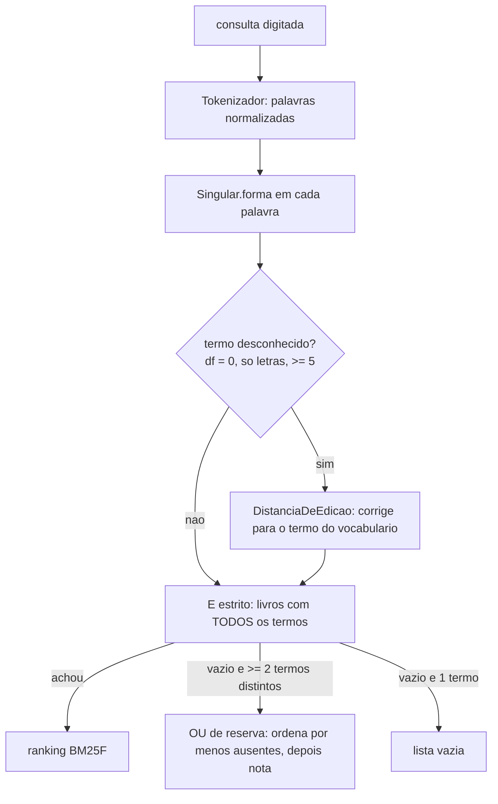

**2. Stemming mínimo de plural (`Singular.swift`).** *Stemming* é reduzir palavras flexionadas a uma forma comum para que consulta e documento casem. Aqui o escopo é só plural, com regras da mais específica para a mais geral, aplicadas apenas a termos só de letras com 4 ou mais caracteres:

| Regra | Exemplos | Guarda |
| --- | --- | --- |
| oes -> ao | prisoes -> prisao, obrigacoes -> obrigacao | nenhuma |
| ais -> al | penais -> penal, reais -> real | exceções: mais, demais, jamais, pais (país), cais |
| eis -> el | imoveis -> imovel, papeis -> papel | 5 letras ou mais ("leis" não vira "lel": cai na regra geral e vira "lei") |
| ns -> m | ordens -> ordem, bens -> bem | nenhuma |
| vogal+res -> vogal+r | cautelares -> cautelar, credores -> credor | só depois de vogal ("livres" -> livre, "padres" -> padre) |
| zes -> z | juizes -> juiz, vezes -> vez | nenhuma |
| vogal+s -> tira o s | direitos -> direito, partes -> parte, leis -> lei | exceções: onus (viraria "onu", a ONU), virus, bonus, lapis |
| exceções fixas | arts -> art, civis -> civil | tabela testada |

Por que a ordem importa: "oes" tem de vir antes da regra geral de "s", senão "prisoes" viraria "prisoe". É o mesmo raciocínio de uma cadeia de `if` com casos mais específicos primeiro (como o *longest match* em tokenizadores).

A função entra **só no Tokenizador**: `termos(texto) = palavras(texto).map(Singular.forma)`. `palavras` continua sendo a forma escrita, já normalizada (minúscula, sem acento).

**A pergunta do Ricardo e a resposta.** Durante o planejamento ele perguntou: "a modificação acontece só ao tokenizar, sem alterar o que é armazenado? Isso não poderia produzir livros incorretos e incapacitar buscas, ou o plural força um padrão para todos?" A resposta, em partes:
- O texto gravado (Core Data, exportação, o que a tela mostra) **nunca muda**. O singular existe só nos *termos do índice em memória* (que é refeito ao abrir o app) e nos *termos da consulta*.
- Tem de valer **nos dois lados**. Se só a consulta virasse singular, "prisoes" -> `prisao` não casaria com o `prisoes` do índice, e a busca ficaria pior que antes. É a mesma ideia dos acentos: "Ação" vira `acao` no índice e na consulta.
- "Livro incorreto" não acontece: o índice é descartável e derivado, não há migração de dados. "Busca incapacitada" só ocorreria se índice e consulta usassem regras diferentes, o que é impossível usando a mesma função.
- O risco real é outro: o **falso positivo**, duas palavras diferentes caindo no mesmo termo (ex.: "ônus" -> `onu` colidiria com ONU). Por isso existe a tabela de exceções. Sim, o plural impõe um padrão a todos os termos; esse é o preço (aceito) de qualquer normalização.

**3. O problema do prefixo.** A busca "enquanto digita" usa prefixo no último termo. Com o vocabulário já no singular, quem digita "cautelare" não acharia nada, porque "cautelare" não é prefixo de `cautelar`: o resultado piscaria e sumiria no meio da palavra. Solução: o `IndiceInvertido` guarda também as **palavras escritas**, com contagem por livro (a contagem permite remover um livro sem apagar uma palavra que outro ainda usa). `termos(comPrefixo:)` procura o prefixo nas palavras escritas e devolve o termo já no singular: "caut" -> {cautelar, cautelares} -> {cautelar}. Se o prefixo já é um plural completo ("prisoes") e só o singular existe no índice, o singular volta também. O motor usa a palavra digitada para o prefixo e o termo singular para o resto.

**4. Distância de edição (`DistanciaDeEdicao.swift`).** Distância de Levenshtein = menor número de inserções, remoções e trocas de caractere para transformar uma palavra em outra. Aqui usa-se **Damerau-Levenshtein restrita** (OSA, *optimal string alignment*), que acrescenta a **transposição de vizinhas** como 1 operação, porque é o erro de digitação mais comum: "porcesso" -> "processo" = 1 (Levenshtein puro daria 2). "Restrita" significa que nenhuma substring é editada duas vezes: "ca" -> "abc" dá 3, enquanto a Damerau-Levenshtein completa daria 2. Para correção ortográfica a diferença quase nunca importa.

Implementação por programação dinâmica: `d[i][j]` = distância entre os i primeiros caracteres de A e os j primeiros de B. Guarda-se **três linhas** (atual, anterior e a de antes, necessária para a transposição) em vez da matriz inteira: memória O(m) em vez de O(n·m). Dois cortes (*early exit*):
- se os tamanhos diferem mais que o limite, nem calcula (não dá para consertar com menos edições que a diferença de tamanho);
- se o mínimo de uma linha passa do limite, para. Isso é seguro porque o mínimo de uma linha nunca é menor que o da anterior, nem com a transposição.

Custo total por termo desconhecido: O(V·n·m), com V o tamanho do vocabulário, e com os cortes na prática bem menor.

**5. Quando corrigir (no motor).**
- Só termo **desconhecido** (df = 0), só de letras, com 5 ou mais letras.
- Limite: 1 erro até 8 letras, 2 a partir de 9 (palavra curta com 2 erros vira qualquer outra palavra).
- O **último termo** só é corrigido se o prefixo não achou nada: "lassal" ainda está sendo digitado e não é erro.
- Desempate do candidato: menor distância, depois maior df, depois ordem alfabética. Em Swift, comparação de tuplas `(distancia, -df, termo)`; o `-df` inverte o sentido só dessa componente.
- Exemplos: "lassalle" -> `lassale` (1 remoção); "procesos" -> singular `proceso` -> `processo` (1 inserção), ou seja, o singular roda antes da correção.
- Se o termo corrigido repete um termo anterior ("processo procesos"), conta uma vez só.
- `buscar` agora devolve `RespostaBusca` (resultados + `correcoes: [Correcao(digitado, usado)]`) e tem `corrigir: Bool = true`: a tela poderá oferecer "buscar exatamente" (o "Você quis dizer" dos buscadores, no sentido inverso). As ~70 chamadas nos testes ganharam `.resultados` por script.

**Por que corrigir só termo desconhecido não piora consulta que funciona.** Um termo com df = 0 já fazia o E ficar vazio, então a consulta já não funcionava. Corrigir só pode transformar "vazio" em "algo". Nenhuma consulta que já retornava resultados é tocada, porque nenhum termo dela é desconhecido. Isso foi confirmado na medição: só #24 e #25 mudaram (ambas para 1º), todas as outras ficaram idênticas. Já corrigir também termos existentes ("pena" -> "penal") mudaria consultas certas, e por isso foi descartado.

**6. Volume, rótulo e artigos no campo subtítulo.** `volume` ("48"), `volumeRotulo` ("Tomo XLVIII" vira `tomo`, `xlviii`) e **só as pontas** dos artigos (1710 e 1779) entram no campo `subtitulo`, o mesmo papel da `parte`: texto de peso médio da folha de rosto, sem peso novo. Isso revisa a decisão de 09/10 que deixava `volumeRotulo` de fora. O intervalo inteiro foi descartado: seriam dezenas de números de ruído por livro, e "art 1750 -> vol XXIV" é busca por faixa, outro recurso. Ruído de "48": só bate com "48" isolado, pois "8.048" vira `8048` no tokenizador. Resultado: #20 e #21 em 1º; #13 "art 1710" subiu de nota (2,285 -> 3,068) com o item certo (o `melhorItem` olha só o sumário). Nova consulta #27 "tomo xlviii" -> T48, em 1º.

**7. OU de reserva e nível de coordenação.** Só dispara quando o E (já com filtro) devolve lista vazia **e** há 2 ou mais termos distintos. Entram os livros com pelo menos um termo. Nota = soma dos termos que o livro tem (na mesma ordem fixa do E, para a soma de `Double` ser reproduzível). Ordem: primeiro **menos palavras ausentes** (o *coordination level*, `coord` do Lucene antigo: premia quem cobre mais da consulta), depois nota, título, id. No modo E a chave "ausentes" vale 0 para todos, então a mesma função `ordenar` serve aos dois modos. Sem multiplicar a nota por fator de penalidade: E e OU nunca aparecem na mesma lista, então as notas só se comparam dentro do grupo. `RespostaBusca.modo` é `.todosOsTermos` ou `.parteDosTermos`; `ResultadoBusca.palavrasAusentes` traz a palavra **como o usuário escreveu**, na ordem da consulta ("prisões" aparece como "prisoes", não como o termo `prisao`), para a tela dizer "sem: stf". "prev prev" continua `[]` (só um termo distinto), o que responde a pergunta 2 da 2.3e.

### Por que assim
- **Vocabulário antes do OU:** o OU relaxa a precisão para todos; consertar o vocabulário só ajuda. O OU fica como rede.
- **Singular no Tokenizador, nos dois lados:** é o único ponto por onde texto vira termo; uma só função garante simetria.
- **Corrigir só df = 0:** garante por construção que não há regressão em consulta que já funcionava.
- **`corrigir: Bool` e `correcoes` na resposta:** a correção automática nunca deve ser silenciosa; a UI precisa mostrar o que foi feito e poder desfazer.
- **Nível de coordenação como primeira chave do OU:** com a soma de BM25 pura, um livro com um termo raro muito forte ganharia de um livro que tem todos os termos menos um.
- **Helper `comTodos` nos testes:** 4 testes do motor esperavam `[]` em consulta de 2 termos. Com o OU eles passariam a receber resultados. O helper devolve `[]` quando o modo é `parteDosTermos`, mantendo a intenção original do teste ("o E não achou nada"), e o OU tem testes próprios.
- **Testes cujas expectativas mudaram (intencional):** "Arts." -> `art`, comentarios -> `comentario`, vezes -> `vez`, obrigacoes -> `obrigacao`, recursos -> `recurso`, contratos -> `contrato`. No `BM25FTests`, o teste passava o termo cru "lopes" (agora o termo do índice é `lope`; sobrenomes também são singularizados, coerente nos dois lados) e passou a usar `Tokenizador.termos("Lopes")`.

**O conflito dos pisos e a decisão do peso (decisão do Ricardo).** Antes de medir o OU, foi escrita a consulta de risco #28 "prisao cautelar stf" -> fernandes ("stf" não existe no vocabulário e é curto demais para corrigir). Ela saiu em 2º, no mesmo padrão de #11 e #23: o Maluf ("Terrorismo e prisão cautelar": o termo em 3 itens do sumário) vence o título exato do Fernandes. O piso falhou (top1 0,923 < 0,94), o ponto combinado de parar e consultar. Varredura com 26 consultas de ajuste:

| peso do sumário | top1 | MRR | item | o que muda |
| --- | --- | --- | --- | --- |
| 0,5 (atual) | 0,923 | 0,962 | 1,000 | #11 e #28 em 2º (e a sonda #23) |
| 0,25 | 1,000 | 1,000 | 1,000 | #11, #23, #28 -> 1º |
| 1,5 ou mais | 0,846 | 0,923 | 1,000 | #1 e #24 caem |

Baixar o `b` do sumário abaixo de 0,75 de novo piorava o item da #19: a restrição do "item certo" funcionando como desenhada.

Por que a decisão da 2.3h mudou de figura: dos três motivos para descartar 0,25 lá, um (a #11 ser "caso misto") **caiu** com o plural, e os outros dois (ponta da grade; risco inverso não medido) continuavam. E #11, #23 e #28 são o **mesmo par** Fernandes × Maluf, não três evidências independentes: ganhar "três consultas" seria contar a mesma observação três vezes. A #23 deixa de ser sonda de qualquer jeito, porque a definição de sonda é "nenhum peso conserta", e agora um peso conserta.

Opções oferecidas ao Ricardo: (1, recomendada e escolhida) escrever **antes** 2 consultas de risco inverso, medir, e adotar 0,25 se não piorarem; senão manter 0,5 e baixar o piso num commit explicado. (2) manter 0,5 e baixar o piso. (3) adotar 0,25 já. As consultas de risco inverso, escritas antes de medir:
- #29 "direito fundamental liberdade" -> capez, item "O direito fundamental de liberdade" ("liberdade" também aparece no CDDir do Fernandes, e o Fernandes tem "direitos fundamentais" no sumário: baixar o sumário favorece o Fernandes).
- #30 "contrato individual" -> mello (sumário "contrato individual de trabalho"; o subtítulo do T48, peso 2, tem "Contrato..." e "dissídios coletivos e individuais").

Com 0,25, #29 e #30 continuam em 1º com o item certo, então 0,25 foi adotado. Varredura a partir de 0,25: nenhuma troca (ponto estacionário). Continua na ponta da grade, mas a grade **não** foi estendida: perseguir ganho além da ponta seria o sobreajuste que a 2.3h evitou. Os commits mostram a ordem honesta: o OU foi commitado sem a #28; a #28 entrou junto com a decisão do peso.

**Resultado final.** 29 consultas de ajuste, todas em 1º: top1 1,000, top3 1,000, MRR 1,000, item certo 1,000. Só a #22 continua sonda: é ambígua por natureza (os dois tomos são respostas certas); o conserto é a tela mostrar `volumeRotulo` na linha. Pisos novos: top1 >= 0,96 e MRR >= 0,98, um pouco abaixo de 1 para tolerar uma troca 1º <-> 2º (28/29 = 0,966; (28 + 0,5)/29 = 0,983), coerente com a rejeição do "um assert por consulta" da 2.3h, e nunca abaixo dos antigos (0,94 e 0,96).

### Alternativas descartadas
- **RSLP** (Orengo e Huyck, 2001; 8 etapas, ~200 regras): corta também derivação e junta "constitucional" com "constituição"; não dá para explicar por que duas palavras casaram; e quebra o prefixo (o radical nem sempre é prefixo do que o usuário digita).
- **Indexar as duas formas** (escrita e singular): dobraria a frequência dos termos e distorceria o IDF e o BM25.
- **Trigramas para correção:** exige um segundo índice; só compensa com vocabulário de milhões. Aqui o vocabulário é pequeno e a varredura com corte basta.
- **Deixar a correção para a Fase 5:** a Fase 5 é de sinônimos, outro problema.
- **Corrigir também termos existentes:** mudaria consultas que estavam certas.
- **Intervalo inteiro de artigos:** ruído; faixa é outro recurso.
- **OU sempre:** ruído em toda consulta. **Só ignorar termos desconhecidos:** não cobre "todos existem, mas ninguém tem todos". **Misturar E e OU com penalidade:** exige calibrar um fator e compara notas de grupos diferentes.
- **Adotar 0,25 de imediato (opção 3) ou manter 0,5 baixando o piso (opção 2):** a primeira decide sem medir o risco inverso; a segunda aceita uma regressão conhecida sem testar se havia custo em corrigi-la.
- **Estender a grade abaixo de 0,25:** sobreajuste.

### Padrões e boas práticas
- **Normalização simétrica:** tudo que se aplica ao índice deve ser aplicado à consulta pela mesma função. Quebra-se isso quando se transforma só um lado.
- **Derivado descartável:** o índice é derivação em memória de dados persistidos; por isso mudar a regra do plural não exige migração. Se o índice fosse persistido, mudar a regra exigiria reindexar.
- **Escrever o teste antes de medir (consulta de risco):** a consulta que pode refutar a sua hipótese precisa existir antes de você ver o número. Escrita depois, ela vira racionalização.
- **Parar no gatilho combinado:** o piso falhou e a execução parou para consultar. Piso sem consequência não é piso.
- **Interfaces de erro explícitas:** `RespostaBusca` com `correcoes` e `modo` em vez de o motor "adivinhar" calado.
- **Quando NÃO usar:** stemming por regras simples não serve para idiomas com morfologia mais rica sem tabela de exceções testada; correção automática não serve para vocabulário com muitos nomes próprios curtos (por isso o limite de 5 letras); OU de reserva não serve onde precisão importa mais que revocação (busca de documento específico).

### Armadilhas
- **Falso positivo do stemming:** duas palavras diferentes no mesmo termo ("ônus"/"onu"). Diagnóstico: um teste por exceção na tabela, e examinar o vocabulário quando o ranking surpreender.
- **Cadeia de regras fora de ordem:** colocar a regra geral de "s" antes de "oes" dá "prisoe". Os testes por regra pegam isso.
- **Expectativa de teste que "muda de significado":** os testes do E que passaram a receber resultados do OU teriam passado silenciosamente se o helper `comTodos` não existisse. Cuidado ao alterar o contrato de uma função sem rever quem testava o caso vazio.
- **Mudança de IDF por stemming:** `cautelares` (raro, só no Capez) virou `cautelar` (mais comum) e perdeu IDF; por isso a #11 foi do 3º para o 2º (Capez caiu para 3º: maluf 3,134 | fernandes 3,108 | capez 2,832). A parte "estrutural" prevista no caso misto da 2.3h se confirmou. Moral: normalizar o vocabulário altera as estatísticas globais, não só o casamento.
- **Contar três vezes a mesma evidência** (#11, #23, #28).
- **Ponta da grade:** 0,25 continua lá. Uma amostra de 29 consultas (1 consulta = 1/29, cerca de 3,4 pontos de top1) com "tudo 1,000" é sinal de que o conjunto ficou fácil para este motor, **não prova**. Novas consultas devem vir do uso real, na tarefa 2.7.
- **Transposição e linhas de DP:** confundir qual das três linhas guarda `i-2` é o bug clássico da OSA com memória reduzida.

### Para ir além
- Manning, Raghavan e Schütze, *Introduction to Information Retrieval*, cap. 3 (tolerant retrieval: distância de edição, k-gramas) e cap. 2.2.4 (stemming e lematização), disponível online no site da Stanford.
- Orengo e Huyck, "A Stemming Algorithm for the Portuguese Language" (2001): o RSLP, para entender o que foi descartado e por quê.
- Damerau (1964) e Wagner e Fischer (1974): origem da distância de edição por programação dinâmica; para o `coord` e a pontuação por termos presentes, a documentação do `ClassicSimilarity` do Lucene (verifique a versão que usar).

### Perguntas
1. Com suas palavras: por que o singular precisa ser aplicado nos dois lados (índice e consulta), e por que o prefixo exige guardar também as palavras escritas? Dê o exemplo de "cautelare".
2. Aplicação: hoje só se corrige termo com df = 0. Se alguém propusesse corrigir também termos existentes quando o resultado fosse "fraco", que consulta do conjunto atual poderia piorar e como você testaria a hipótese sem sobreajustar? E o que mudaria no motor se o limite de 5 letras caísse para 3?
3. Raciocínio: por que #11, #23 e #28 não contam como três evidências a favor do peso 0,25? Por que as consultas de risco inverso (#29 e #30) tinham de ser escritas **antes** de medir? E "tudo em 1,000" é motivo para comemorar ou para desconfiar? Justifique.

### Minhas respostas
<!-- Ricardo responde aqui por escrito. O teacher corrige na próxima chamada. -->

(sem respostas)

---

## Tarefa 2.4a — Montagem das dependências e tela inicial com as estantes (2026-10-09)

### O que foi feito
Criamos `App/Dependencias.swift` (a montagem: escolhe a implementação da porta), o `InicioViewModel` com seu `enum Estado` e a `InicioView` (grade de estantes, criar e renomear). `EstantesApp` passou a guardar um `Result` para não travar se o banco não abrir. Para ver as telas no simulador, há exemplos só em DEBUG (`App/Exemplos.swift`), o `scripts/capturar.sh` e um repositório falso nos testes (`BibliotecaRepositorioEmMemoria`). Antes disso, o PLANO registrou a forma de trabalho das telas: primeiro a lógica (2.4a-e) com componentes nativos, depois o estilo tela por tela.

### Conceitos envolvidos
**Raiz de composição e injeção de dependência.** Em vez de cada tela criar o que precisa, um único lugar (`Dependencias`) decide "a porta `BibliotecaRepositorio` é o Core Data". As telas recebem o ViewModel pronto, e o ViewModel recebe o repositório pelo `init`. Isso é a *composition root*: só ali o código concreto é conhecido, e o resto depende do protocolo. Ganho prático: nos testes entra o falso; nos previews e nas capturas, o Core Data em memória; em produção, o disco. Nada muda nas telas.

**Estado como `enum` com valores associados.** `Estado` tem quatro casos (`carregando`, `vazio`, `pronto([...])`, `erro(String)`). Com `Bool`s (`carregando`, `temErro`, `lista`) haveria 2^n combinações, e a maioria seria absurda ("carregando e com erro"). O enum torna os estados impossíveis **irrepresentáveis**: o compilador obriga o `switch` da View a tratar todos. Princípio: "make illegal states unrepresentable".

**`@StateObject` e ciclo de vida.** A View é um valor barato que o SwiftUI recria muitas vezes; o que precisa sobreviver é o ViewModel. `@StateObject` guarda o objeto fora da View e só executa a expressão de criação na primeira vez. Por isso o `init` recebe `@autoclosure`: `InicioView(viewModel: deps.fazerInicioViewModel())` não cria nada na hora; vira um closure que o `StateObject` chama uma vez. Com `@ObservedObject` o ViewModel seria recriado a cada reconstrução da View e o estado se perderia.

**`@MainActor`.** `@Published` alimenta a UI, então só pode mudar na thread principal. Marcar o ViewModel como `@MainActor` faz o compilador garantir isso. O custo apareceu no Xcode 14.2: *"call to main actor-isolated instance method ... in a synchronous nonisolated context"*. Naquele SDK só o `body` da `View` é `@MainActor`; propriedades auxiliares da View não são. Quem cria um objeto `@MainActor` precisa estar no main actor também, então a solução foi `@MainActor` na `RaizView` e no tipo do closure (`@MainActor (Dependencias) -> Conteudo`). Em SDKs mais novos a `View` inteira é `@MainActor`, então isso é uma diferença entre os dois Xcodes que o projeto precisa suportar. Esta é uma observação do que o compilador disse; para detalhes de versão confirme nas notas de lançamento do SDK.

**`Binding` derivado.** O alerta precisa de `Binding<Bool>`, mas o estado real é `pedido: PedidoDeNome?` (nil = fechado). Construímos o `Binding` a partir do opcional (`get: pedido != nil`, `set: se false, pedido = nil`). Assim há **uma só fonte de verdade**; guardar também um `Bool` obrigaria a mantê-los sincronizados.

**Tela derivada do banco.** Depois de gravar, o ViewModel chama `carregar()` de novo. Não há `@FetchRequest` nem lista editada na mão. O custo é reler; o ganho é que a tela nunca diverge do que está salvo. Com poucas estantes, o custo é desprezível.

**Contagem: N+1 consultas.** `carregar()` faz 1 consulta de estantes + 1 `quantidadeDeLivros` por estante (N+1). É o padrão que costuma ser um problema com milhares de linhas ou rede. Aqui é aceitável porque N é pequeno, a consulta é um `COUNT` no SQLite local (não carrega livros) e não há latência de rede. Uma consulta agregada (`GROUP BY`) só valeria com muitas estantes.

**Argumentos de lançamento e `UserDefaults`.** O iOS registra argumentos do tipo `-chave valor` no domínio de argumentos do `UserDefaults`. Então `-captura Inicio` é lido com `UserDefaults.standard.string(forKey: "captura")`, sem parser. Isso, mais `#if DEBUG`, permite abrir qualquer tela já preenchida (o `simctl` não toca na tela).

**Dublê de teste (fake).** `BibliotecaRepositorioEmMemoria` é um *fake*: implementação funcional simplificada (dicionários) com chaves `falharAoLer`/`falharAoGravar` para forçar erros. Difere de um *mock* (que verifica chamadas). Precisa seguir o **contrato** da porta (cascata, mover, destino inválido), senão os testes passam contra um comportamento que o repositório real não tem.

### Por que assim
- `Dependencias` como `struct` criada uma vez, com `producao()` e `emMemoria()`: é visível e testável, e a injeção ocorre pelo `init`, como pede o PLANO.
- `Result { try Dependencias.producao() }` no `EstantesApp`: se o banco falha (disco cheio, migração quebrada), mostra `MensagemDeErroView` em vez de `try!` (que derruba o app sem explicação).
- `EstanteResumo` na Apresentação: a contagem é dado da tela; pôr `quantidade` em `Estante` poluiria o Domínio com algo derivado.
- Erro de gravação em `mensagemDeErro`, separado de `estado`: se virasse `.erro`, a lista sumiria por causa de uma falha que não a invalida.
- `nomeValido` estático, usado pelo ViewModel **e** pela View: uma regra, dois usos; a View só desabilita o botão, o ViewModel é quem de fato recusa.
- Exemplos em `App/` e só em DEBUG: montar um repositório concreto é papel da montagem, e o código de exemplo não deve ir para o `.ipa` de produção.
- Previews com o Core Data em memória real: um segundo falso dentro do app seria código a manter só para previews.

### Alternativas descartadas
- **Singleton `.shared`:** esconde de quem depende de quê, e testes compartilham estado global.
- **`.environmentObject`:** funciona, mas a dependência fica implícita (falta de um objeto só aparece em tempo de execução, com crash); o PLANO pede injeção pelo `init`.
- **`@FetchRequest`:** acopla a View ao `NSManagedObject`, o que o projeto proíbe fora de `Dados/Persistencia/`.
- **Vários `Bool` no estado:** estados impossíveis possíveis.
- **Consulta agregada de contagens:** otimização prematura aqui.
- **Override da barra de status (9:41) nas capturas:** tentado; o simulador do iOS 16 ignorou o `--time`. Retirado em vez de mantido como código morto.

### Padrões e boas práticas
- **Composition root + injeção por construtor.** Não use quando o objeto não tem variação nenhuma e é puro (uma função utilitária estática não precisa de injeção).
- **MVVM com estado em enum.** Quando o estado é realmente independente (dois alertas sem relação), campos separados são mais honestos que um enum forçado.
- **Fake com contrato** em vez de mock verificador, para testar comportamento e não implementação.
- **Trabalhar em duas passadas (lógica, depois estilo):** evita retrabalho de estilo sobre uma lógica que ainda muda. Cada captura tem versão (0.x lógica, 1.x+ estilo) para comparar.
- **Parar com margem de uso:** registrar o estado no PLANO antes de acabar o limite, para que a próxima sessão retome sem contexto.

### Armadilhas
- **Isolamento de ator diferente entre SDKs:** compila no Xcode 26 e falha no 14.2 (ou o contrário). Sempre rode `./scripts/testar.sh` no Mac e olhe a CI.
- **`@StateObject` sem `@autoclosure`:** se o init avaliar `InicioViewModel(...)` direto, cria-se um ViewModel descartado a cada reconstrução da View (o `StateObject` ignora, mas o custo de criação ocorre).
- **`.task` repetido:** `.task` roda quando a View aparece; se ela reaparecer, recarrega. Aqui é benigno, mas em telas pesadas vale controlar.
- **Banco em memória é assíncrono para preencher:** por isso `ComExemplos` espera os dados antes de mostrar a tela; senão a captura sai vazia (condição de corrida).
- **Argumento de lançamento perdido:** configurado no Edit Scheme do Xcode, some quando o `xcodegen generate` recria o projeto.
- **Fake que diverge do real:** se o contrato mudar no repositório Core Data e o fake não acompanhar, os testes do ViewModel mentem. Idealmente os mesmos testes de contrato rodariam nos dois.

### Para ir além
- Documentação da Apple: *Managing model data in your app* e *StateObject* (developer.apple.com/documentation/swiftui), para o ciclo de vida de `@StateObject` vs `@ObservedObject`.
- Mark Seemann, *Dependency Injection: Principles, Practices, and Patterns* (capítulo sobre Composition Root).
- Yaron Minsky, "Effective ML" (a ideia de "make illegal states unrepresentable"), disponível como palestra e artigo.

### Perguntas
1. Com suas palavras: por que o `InicioViewModel` recebe o repositório pelo `init` e quem o monta é `Dependencias`? O que você ganha nos testes e nos previews?
2. Aplicação: o PLANO pede que a tela de uma estante mostre os livros. Se `InicioViewModel.carregar()` precisasse também do total de livros "sem estante", em que ponto do código você faria isso e o que mudaria no `enum Estado`? Quando a estratégia N+1 deixaria de ser aceitável?
3. Raciocínio: por que uma falha ao gravar vira `mensagemDeErro` e não `.erro(...)` no estado? Que comportamento ruim o usuário veria se fosse `.erro`? E por que o `@autoclosure` no `init` da View evita o ViewModel ser recriado?

### Minhas respostas
<!-- Ricardo responde aqui por escrito. O teacher corrige na próxima chamada. -->

(sem respostas)

---

## Tarefa 2.4b — Exclusão de estante com confirmação (e correção do botão Salvar) (2026-10-09)

### O que foi feito
Dois commits. O primeiro (76c8289) corrige o alerta "Nova estante", que só mostrava "Cancelar". O segundo (bf36e14) adiciona "Apagar" ao menu de contexto da estante: o `InicioViewModel` monta um `PedidoDeExclusao` (estante, quantidade atual de livros, destinos possíveis) e a `InicioView` o apresenta em um `confirmationDialog` com até duas folhas (confirmar; escolher a estante de destino). Foram 7 testes novos (242 verdes no Xcode 14.2), e o `capturar.sh` ganhou `EXTRA="-chave valor"`.

### Conceitos envolvidos
**Defeito de componente do sistema que o teste de ViewModel não vê.** No iOS 16, o `.alert` do SwiftUI *esconde* (não acinzenta) um botão com `.disabled(true)` e não reavalia os botões enquanto o usuário digita. O campo começava vazio, então o Salvar nascia desabilitado e sumia. Ao renomear, o campo já vinha preenchido e o botão aparecia. O ViewModel estava correto; o defeito estava na camada de apresentação, onde só olhar a tela (e o caso "começa vazio") revela. A correção foi remover o `.disabled` e deixar a proteção contra nome vazio só no ViewModel (`nomeValido`), que já tinha teste. Isso é coerente com a regra: a View é só uma casca; a regra mora onde é testável.

**Estado de interface vs. estado de ViewModel.** Um `confirmationDialog` com `presenting:` amarra a visibilidade a um valor. Quando o usuário toca numa ação, o SwiftUI fecha a folha e zera o binding dela. Se o `PedidoDeExclusao` estivesse nesse binding, sumiria antes da segunda folha (escolher destino) abrir. Por isso o ViewModel *devolve* o pedido (`pedidoDeExclusao(de:) async -> PedidoDeExclusao?`) e a tela guarda `exclusao` + dois `Bool` (`confirmandoExclusao`, `escolhendoDestino`). A pergunta "qual folha está aberta?" é estado de apresentação; "o que será apagado e para onde podem ir os livros?" é dado do pedido. Separar os dois evita o acoplamento ao ciclo de vida da folha.

**Dado fresco em ação destrutiva.** A quantidade de livros é relida do banco ao preparar o pedido, não tomada do cartão da grade (que pode estar desatualizado). Numa confirmação do tipo "apagar a estante e os 3 livros", o número mostrado precisa ser o real naquele instante, senão o usuário consente com informação errada.

**Defesa em profundidade.** `destinosPossiveis` nunca inclui a própria estante (a interface nem oferece a opção), e o repositório mantém a trava `destinoInvalido` (já existente desde a 2.2). Duas camadas independentes: se uma tiver um bug, a outra segura. Não é redundância gratuita: a primeira serve ao usuário (não oferecer opção inválida), a segunda protege os dados.

**Modelar os casos como propriedade derivada.** `podeMover` = há livros *e* há outra estante. Os três casos do diálogo (vazia; com livros e com destino; com livros sem destino) saem de duas informações simples, e o texto muda de acordo. `textoDaQuantidade(_:comArtigo:)` usa `switch` sobre tupla `(quantidade, comArtigo)` para produzir "1 livro", "3 livros", "o livro", "os 3 livros". Pluralização é uma tabela pequena; o `switch` sobre tupla deixa o compilador conferir a exaustividade.

**Ação de lançamento só para captura.** `InicioView.AcaoInicial` (novaEstante, apagar, escolherDestino) roda no `.task` depois de carregar. O `simctl` não toca na tela, então é a forma de fotografar um alerta aberto. Fica atrás de `#if DEBUG` com o resto dos exemplos.

### Por que assim
- **ViewModel devolve o pedido em vez de guardá-lo em `@Published`:** o ciclo de vida da folha é da tela (ver acima).
- **Menu de contexto com `role: .destructive`:** o sistema pinta de vermelho e sinaliza a ação perigosa sem estilo próprio.
- **Mover vs. apagar tudo como escolhas explícitas:** o usuário nunca perde livros sem ler o número no botão vermelho.
- **Sem teste para "Cancelar":** Cancelar não chama o ViewModel; não há comportamento nosso para verificar. Testar o nada só criaria falsa confiança.
- **Corrigir o Salvar removendo `.disabled`, e não trocando o alerta por sheet:** a sheet com `Form` é decisão de estilo, adiada para a etapa de estilo (o PLANO separa lógica de estilo).

### Alternativas descartadas
- **Swipe para apagar:** não existe em grade (só em `List`).
- **Modo "Editar" com ✕ em cada cartão:** um passo a mais para uma ação rara.
- **Diálogo único com um botão por destino:** fica enorme com muitas estantes.
- **Guardar o pedido num `@Published` do ViewModel:** zerado pelo binding antes da segunda folha.
- **Usar a quantidade do cartão:** pode estar defasada.

### Padrões e boas práticas
- **Confirmação proporcional ao dano:** estante vazia pede só confirmação simples; com livros, mostra o número. Não use confirmação para ações reversíveis (melhor oferecer "desfazer").
- **Defesa em profundidade** em operações destrutivas. Não duplique regra complexa nas duas camadas: aqui a segunda é uma checagem simples de invariante.
- **Reproduzir o bug antes de corrigir** (aqui, abrindo o alerta via argumento de lançamento): confirma a causa em vez de supor.

### Armadilhas
- **Teste verde não significa tela correta:** o bug do Salvar passou por 235 testes verdes. Casos que começam vazios, estados iniciais e transições entre folhas precisam ser vistos.
- **Comportamento muda entre versões do iOS:** o `.alert` do iOS 16 pode se comportar diferente do iOS 26 (a CI). Não assuma; veja nos dois quando importar. Confirme o comportamento exato nas notas do SDK, pois aqui só observamos o simulador.
- **Estado zerado ao tocar uma ação:** em `confirmationDialog`/`alert`, o binding é zerado ao fechar. Qualquer dado necessário depois deve ficar fora dele.
- **A captura estática não prova a transição** entre as duas folhas; foi preciso o teste manual do Ricardo.

### Para ir além
- Documentação da Apple: `confirmationDialog(_:isPresented:titleVisibility:presenting:actions:message:)` e *Human Interface Guidelines: Alerts / Action sheets*.
- Martin Fowler, "Test Double" (martinfowler.com/bliki/TestDouble.html), para fake vs. mock já usado nos testes do ViewModel.

### Perguntas
1. Com suas palavras: por que o `PedidoDeExclusao` não fica num `@Published` do ViewModel, e quem guarda "qual folha está aberta"?
2. Aplicação: se o app passasse a permitir mover livros para uma estante *dentro* de outra (estantes aninhadas), o que mudaria em `destinosPossiveis` e na trava `destinoInvalido`? Haveria um novo caso inválido?
3. Raciocínio: o bug do Salvar tinha 235 testes verdes por cima. Por que nenhum o pegou, e que tipo de teste (ou prática) pegaria? Por que o caso "renomear" funcionava e o "criar" não?

### Minhas respostas
<!-- Ricardo responde aqui por escrito. O teacher corrige na próxima chamada. -->

(sem respostas)

---

## Tarefa 2.4c — Estante → livros agrupados por prateleira → detalhe (2026-10-09)

### O que foi feito
Nasceu a regra pura `AgrupamentoPorPrateleira` (`Dominio/Regras`, 9 testes), que transforma a lista de livros de uma estante em grupos por prateleira. Sobre ela vieram `EstanteViewModel` + `EstanteView` (lista com uma `Section` por prateleira) e `LivroDetalheViewModel` + tela de detalhe (com apagar). A navegação foi movida da `InicioView` para `App/NavegacaoView.swift`, usando `NavigationLink(value:)` e `navigationDestination(for:)`. Foram 24 testes novos (266 verdes no Xcode 14.2) e o idioma do app passou a ser pt-BR.

### Conceitos envolvidos

**Agrupar por chave canônica, exibir a grafia mais comum.** "Caixa azul", "caixa azul " e "Cáixa Azul" são a mesma prateleira para o usuário. O agrupamento usa `Normalizacao.chave` (a mesma normalização da busca: minúsculas, sem acento, sem espaços nas pontas) como chave de um dicionário. É o padrão *group by* clássico: uma passada, O(n) para montar os grupos com hash, depois O(g log g) para ordenar os g grupos. O título exibido é a grafia mais usada dentro do grupo (uma contagem por grafia); no empate vale a menor na ordem dos caracteres. Sem esse desempate, o resultado dependeria da ordem de iteração do dicionário, que em Swift é aleatória entre execuções (hash seeding por processo), e o teste ficaria intermitente. Regra geral: **toda ordenação precisa de critério total**, senão o resultado não é determinístico.

**Comparar `String` em Swift.** `String` compara por escalares Unicode canonicamente equivalentes, mas a ordem não é a "do dicionário": "C" < "c" (maiúsculas vêm antes) e "a" < "á". Foi o erro que apareceu na escrita do teste: o valor esperado precisa ser calculado à mão, não deduzido por intuição. Para ordem que o usuário percebe como natural, usa-se `localizedStandardCompare`, que é o mesmo comparador do Finder: trata números dentro do texto como números ("2ª de cima" < "10ª de cima"), ignora diferenças de caixa/acento de forma sensível ao idioma. Cuidado: ele depende do *locale*, então testes que o usam herdam esse comportamento.

**Ordenação com chave composta e `Int.min`.** Dentro do grupo: título normalizado, volume, ano, id. Para "sem volume primeiro", usa-se `volume ?? Int.min` (um `nil` vira o menor inteiro possível). É um truque comum para ordenar opcionais; funciona porque nenhum volume real vale `Int.min`. O `id` fecha o critério só para ser determinístico (ordem total), não por significado.

**Inversão de dependência na navegação.** Esta é a decisão arquitetural central da tarefa. As telas de destino precisam de ViewModels, que precisam de repositórios, que são montados no `Dependencias` (camada App). Se a `InicioView` (Apresentação) construísse a `EstanteView`, Apresentação passaria a conhecer a montagem, invertendo a direção das camadas. Solução: as telas só emitem *valores* (`NavigationLink(value: estante)`), e quem conhece as fábricas (`NavegacaoView`) declara `navigationDestination(for: Estante.self) { ... }`. A tela diz "quero ir para esta estante"; a raiz de composição decide *como* construir o destino. É o mesmo princípio da composition root: só um lugar conhece as classes concretas.

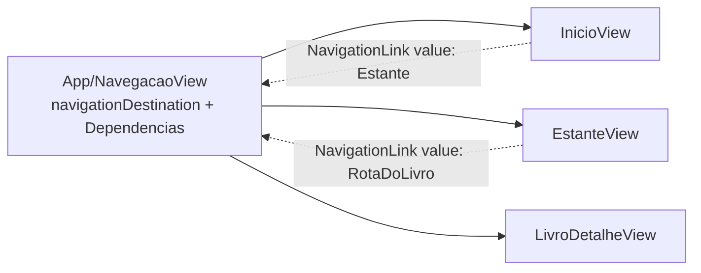

**Navegação por valor (iOS 16).** A `NavigationStack` mantém um *caminho* (lista de valores `Hashable`). `NavigationLink(destination:)` constrói o destino de cada linha ao desenhar a lista (trabalho e inicializações desperdiçados, inclusive `init` de ViewModels). `NavigationLink(value:)` guarda só o valor; o destino é construído quando se navega. Bônus: o caminho é dado, então pode-se abrir já empurrado (`NavigationPath` inicial), o que as capturas usam. Exige `Hashable`, por isso `Estante` deixou de ser só `Equatable`: `Hashable` implica `Equatable` e a conformidade sintetizada funciona quando todos os campos são `Hashable`.

**Tipo de rota próprio.** `RotaDoLivro(livroId:)` em vez de `UUID`: `navigationDestination(for: UUID.self)` capturaria qualquer `UUID` empurrado na pilha, de qualquer tela. Um tipo-rota dá um canal tipado e sem ambiguidade. E leva só o id: se a rota carregasse o `Livro` inteiro, a cópia ficaria velha após uma edição (structs são valores copiados). O detalhe relê do banco, então a fonte da verdade é uma só.

**`.onAppear` × `.task` na pilha.** Ao voltar de uma tela filha, a tela de baixo reaparece, mas o `.task` não roda de novo (a view nunca saiu da hierarquia). O `.aoVoltar { }` é um `ViewModifier` com uma flag `jaApareceu`: ignora o primeiro `onAppear` (que já é coberto pelo `.task`) e executa nos seguintes. Exige `@State` para a flag, pois a struct da View é recriada e só `@State` sobrevive.

**Estado de tela como enum.** Os dois ViewModels expõem `carregando / vazia / pronta / erro` (e `naoEncontrado` no detalhe). Um enum torna estados impossíveis impossíveis de representar (carregando e com erro ao mesmo tempo), ao contrário de três `Bool`.

**Mapeamento Modelo → seções de exibição.** `secoes(de:)` (estático e puro) monta `SecaoDoLivro/CampoDoLivro` só com campos preenchidos; vazio ou só espaços some, e seção sem campos some. A decisão "o que mostrar" fica testável sem SwiftUI. `textoDosArtigos` usa `switch` sobre tupla de opcionais, em que o compilador verifica exaustividade. `LabeledContent` (iOS 16) dá o par rótulo/valor padrão do sistema.

**Idioma de desenvolvimento.** A captura mostrou "Back". O iOS escolhe a localização do sistema (botão Voltar, "Cancelar" da busca etc.) comparando os idiomas do usuário com as localizações que o *bundle* declara. Sem `CFBundleDevelopmentRegion` explícito, o app caía em inglês. `developmentLanguage: pt-BR` no XcodeGen e `CFBundleDevelopmentRegion: pt-BR` no Info.plist resolveram. Quem aprende: o idioma dos textos *do sistema* é decisão do app, não só dos textos que você escreve.

### Por que assim
- **Agrupamento no Domínio:** sem SwiftUI, testa em milissegundos; reaproveitável (futura exportação, outra tela).
- **Navegação na raiz de composição:** mantém a regra "Apresentação não conhece montagem".
- **`apagar() -> Bool` e a tela chama `dismiss()`:** o ViewModel não conhece o ambiente de navegação; ele informa o resultado, a View decide como reagir.
- **Reler o banco ao voltar:** custa milissegundos num banco local e elimina a sincronização entre telas.
- **Botões "+" e "Editar" desabilitados:** o escopo vai até o 2.4d, sem funcionalidade pela metade.

### Alternativas descartadas
- **`NavigationLink(destination:)`:** constrói destinos cedo e acopla a tela à fábrica.
- **Closures ou notificações para avisar a tela anterior de mudanças:** acoplam telas entre si; reler é mais simples.
- **Passar o `Livro` na rota:** cópia desatualizada.
- **Arquivo `Navegacao.swift` em App:** já existe `Componentes/Navegacao.swift`; o Xcode recusa dois arquivos com o mesmo nome no mesmo alvo (os produtos `.o` colidem). Por isso `NavegacaoView.swift`.
- **Ordenar prateleiras com `<` simples:** colocaria "10ª" antes de "2ª".

### Padrões e boas práticas
- **Composition root** e **inversão de dependência**: a montagem em um só lugar. Não vale a pena em apps minúsculos; aqui compensa porque há testes e camadas.
- **Ordem total determinística** em toda ordenação; teste com dados que provoquem empate.
- **Função estática pura para formatar/mapear** e testar sem a View.
- **Reproduzir visualmente**: a captura achou o "Back" que nenhum teste acharia.

### Armadilhas
- **Ordem de iteração de `Dictionary`/`Set`** é indefinida: nunca deixe o resultado depender dela.
- **`localizedStandardCompare` depende do locale** do processo; teste na CI (Xcode 26) pode divergir se o locale for outro.
- **`navigationDestination` dentro de uma `List` preguiçosa** ou fora da pilha pode não ser registrado; o lugar seguro é perto da raiz (como aqui). Confirme na documentação da Apple se mudar.
- **`onAppear` roda mais de uma vez** (reaparição, voltar de sheet); ações com efeito colateral precisam de proteção.
- **Captura com toque simultâneo no simulador** gera imagem errada; refaça, não interprete.

### Para ir além
- Documentação Apple: *NavigationStack*, *navigationDestination(for:destination:)* e *NavigationPath*.
- Mark Seemann, *Dependency Injection: Principles, Practices, and Patterns* (capítulo sobre Composition Root).
- Documentação Apple: *String Comparison* (`localizedStandardCompare`) e *Internationalization and Localization Guide* (idioma de desenvolvimento do bundle).

### Perguntas
1. Com suas palavras: por que a `InicioView` não constrói a `EstanteView` diretamente, e o que a `NavegacaoView` faz que ela não pode fazer?
2. Aplicação: se o usuário pudesse ter duas prateleiras "Direito Civil" e "Direito civil" e quisesse que fossem *distintas*, o que mudaria no agrupamento? Que efeito isso teria na busca, que usa a mesma `Normalizacao.chave`?
3. Raciocínio: o que aconteceria na ordem dos grupos se o desempate da grafia exibida fosse "a primeira encontrada" e a lista de livros viesse do banco em ordem não garantida? E por que `.aoVoltar` ignora o primeiro `onAppear`?

### Minhas respostas
<!-- Ricardo responde aqui por escrito. O teacher corrige na próxima chamada. -->
