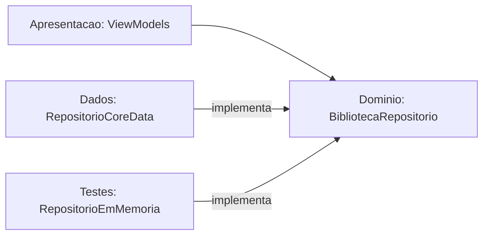

# Fase 2 — App

Objetivo da fase: construir o app iOS (SwiftUI + Core Data) em camadas: entidades e regras puras no Domínio, persistência em Dados, telas em Apresentação, e a busca local (índice invertido + BM25F) sobre a biblioteca do usuário.

## Tarefa 2.1 — Entidades do Domínio e a porta BibliotecaRepositorio (2026-10-08)

### O que foi feito
Criamos as entidades puras em `ios/Estantes/Dominio/Entidades/` (`Estante`, `Livro`, `ItemSumario`, `Categoria`, mais os enums `OrigemLivro`, `OrigemItemSumario` e `CorCategoria`), a regra `NomeDeCategoria` e a função `Normalizacao.chave` em `Dominio/Regras/`, e a porta `BibliotecaRepositorio` em `Dominio/Portas/`. Há 13 testes XCTest verdes no Xcode 14.2. A `ValidacaoSumario` ficou de fora de propósito: é a próxima tarefa e quem escreve é você.

### Conceitos envolvidos

**1. Struct versus classe versus NSManagedObject (semântica de valor).**
Em Swift, `struct` é tipo de valor: atribuir ou passar para uma função cria uma cópia independente. `class` é tipo de referência: duas variáveis apontam para o mesmo objeto. O teste `testStructsSaoValores` mostra isso:

```swift
var original = Livro(estanteId: UUID(), titulo: "Original")
let copia = original          // cópia
original.titulo = "Alterado"
// copia.titulo continua "Original"
```

Consequência prática: se a tela de detalhes recebe um `Livro` e o ViewModel da tela de edição altera o dele, uma tela não muda o livro da outra por acidente. Com uma classe, as duas veriam a mesma mudança (estado compartilhado, a fonte clássica de bugs de UI).

`NSManagedObject` é pior ainda para as telas: é uma referência presa a um `NSManagedObjectContext` e à thread (ou fila) desse contexto. Tocar nele de outra thread é comportamento indefinido, e ele "se atualiza sozinho" quando o contexto muda. Já uma struct com `import Foundation` apenas permite testes que rodam em milissegundos, sem Core Data, sem simulador de banco, sem nada.

**2. Identidade: UUID gerado no aparelho.**
Cada entidade tem `id: UUID`. Um UUID v4 tem 122 bits aleatórios; a chance de colisão é desprezível sem precisar de coordenação central. Isso permite MESCLAR na importação: "mesmo UUID = mesmo livro". Por que não as alternativas: o `NSManagedObjectID` é temporário até o primeiro save (vira permanente depois) e é específico daquele armazenamento, então não sobrevive a uma exportação; um número sequencial (1, 2, 3...) colide entre duas bibliotecas diferentes, que começam ambas do 1.

**3. Relações: a chave estrangeira fica no lado "muitos".**
`Livro.estanteId` aponta para a estante; a `Estante` não guarda a lista de livros. É o mesmo desenho do SQL da Fase 1 (`livro.estante_id REFERENCES estante`). Guardar nos dois lados criaria duas fontes da mesma verdade, que precisariam ser mantidas em sincronia.

**4. Agregado (Domain-Driven Design).**
Um agregado é um grupo de objetos tratados como uma unidade de consistência, com uma raiz pela qual tudo passa. Aqui, `Livro` é a raiz e contém `itensSumario`: o sumário vive, morre e é salvo junto com o livro, e na importação é substituído em bloco. `Categoria`, ao contrário, tem vida própria (existe sem livros, é compartilhada por vários), então o livro guarda só `categoriaIds: Set<UUID>`. Renomear uma categoria muda um registro só, sem regravar nenhum livro. Um `Set` (e não `[UUID]`) porque a ordem não importa e não há repetição.

Decorrência importante: **a posição no array É a ordem do sumário**. Não existe campo `ordem` na struct. O repositório (2.2) gravará o índice no atributo `ordem` do Core Data e ordenará ao ler. Se a struct também tivesse `ordem`, haveria duas verdades possíveis (array diz uma coisa, campo diz outra).

**5. Opcionais.**
`String?` é açúcar para `Optional<String>`, um enum com dois casos: `.none` (escrito `nil`) e `.some(valor)`. O compilador obriga a tratar a ausência antes de usar o valor, o que elimina uma classe inteira de erros de ponteiro nulo. Usamos opcional onde a ausência é um estado legítimo do mundo (livro manual sem ISBN, item "Parte I" sem página), e não opcional onde a ausência seria bug (`titulo`, `id`). Você vai usar muito:

```swift
if let p = item.pagina { ... }      // desembrulha com segurança
item.pagina ?? 0                     // valor padrão
item.numeracao?.isEmpty              // encadeamento: resultado também é opcional
```

**6. Enum com valor bruto (`enum X: String`) e `CaseIterable`.**
Em Swift, enums são tipos soma: um valor é exatamente um dos casos. `enum OrigemLivro: String` associa a cada caso uma `String` (por padrão, o próprio nome do caso): `OrigemLivro.lexml.rawValue == "lexml"`, e `OrigemLivro(rawValue: "gemini")` devolve um opcional (pode não existir). `CaseIterable` gera `allCases`, um array com todos os casos, na ordem de declaração. Os testes usam isso para travar os valores: `OrigemLivro.allCases.map(\.rawValue)`. O `\.rawValue` é um key path usado como função.

Por que travar por teste: o valor bruto vai para o Core Data e para o arquivo exportado. Se alguém renomear `googlebooks` para `googleBooks`, os arquivos antigos deixam de decodificar. O teste transforma uma regra "de cabeça" em falha de build.

**7. Protocolo + inversão de dependência (a porta).**
`BibliotecaRepositorio` é um `protocol`: um contrato de métodos, sem implementação. O Domínio declara do que precisa; a camada Dados implementa com Core Data. A seta de dependência no código aponta de Dados para Domínio (Dados importa o protocolo), o inverso do que seria o caminho "ingênuo" em que o Domínio chamaria o Core Data. Esse é o "D" do SOLID.



Ganhos: trocar Core Data por um falso em memória nos testes e previews, ou por SwiftData no futuro, sem mexer em nenhuma tela.

**8. `async throws`.**
`throws` porque gravar em disco pode falhar e o chamador deve ser forçado a tratar (`try`). `async` porque o Core Data faz o trabalho num contexto de segundo plano (`perform`); um ViewModel `@MainActor` chama com `await`, suspendendo a função sem bloquear a thread principal (a tela continua respondendo). `async` não significa "outra thread" por si só: significa "pode suspender neste ponto".

**9. Normalização de texto.**
`Normalizacao.chave` faz `folding` com `.caseInsensitive` e `.diacriticInsensitive` (usando a localidade `pt_BR`), depois quebra em palavras por espaço em branco e junta com um espaço só. Resultado: `"  Direito   Tributário "` vira `"direito tributario"`. É a base tanto da unicidade de categorias quanto, na 2.3, da busca. Custo: O(n) no tamanho do texto, uma passada.

**10. Regra pura: `NomeDeCategoria.validar`.**
Função estática, sem estado e sem efeito colateral: mesma entrada, mesma saída. Devolve `Problema?` (`nil` = válido), com `.repetido(Categoria)` carregando a categoria conflitante para a interface poder dizer "já existe 'Direito Tributário'". O parâmetro `ignorando:` permite renomear mantendo o próprio nome. Note o idioma `repetida.map { .repetido($0) }`: `Optional.map` aplica a função só se houver valor, e propaga `nil` caso contrário.

**11. XCTest (para a próxima tarefa).**
Cada classe de teste herda de `XCTestCase`; cada método que começa com `test` roda isolado, com uma instância nova da classe. As asserções principais: `XCTAssertEqual(a, b)`, `XCTAssertNil`, `XCTAssertTrue`. `@testable import Estantes` dá acesso aos símbolos `internal` do app. O padrão é Arrange (montar entrada), Act (chamar), Assert (conferir). Para a `ValidacaoSumario`, o jeito natural é um teste por regra: nível zero, nível que pula de 1 para 3, título vazio, página que regride (aviso, não erro).

**12. `for ... enumerated()` (para a próxima tarefa).**
`for (indice, item) in itens.enumerated()` percorre a sequência produzindo pares (posição a partir de 0, elemento). Você precisará dele na `ValidacaoSumario` para dizer "o item da posição 3 está errado" e para comparar cada item com o anterior (`itens[indice - 1]`, cuidando do caso `indice == 0`, senão o programa trava com índice fora do limite).

### Por que assim
- **Struct em vez de classe/NSManagedObject**: segurança contra estado compartilhado, testes rápidos, Domínio sem dependências (regra do projeto).
- **UUID**: permite mesclar na importação sem coordenação central.
- **Livro como raiz de agregado, sem campo `ordem`**: uma verdade só sobre a ordem do sumário; salvar e importar em bloco.
- **`categoriaIds` em vez de `[Categoria]` dentro do livro**: renomear categoria não regrava livros.
- **Foto da capa fora da struct** (`fotoCapa(doLivro:)`, `salvarFotoCapa`): o índice da busca carrega todos os livros ao abrir; imagens pesariam na memória. No Core Data, será "Allows External Storage" (o Core Data guarda blobs grandes como arquivos fora do SQLite).
- **`numeracao` separada do `titulo`**: toda origem grava no mesmo formato, e o título limpo ajuda a busca. Preserva "Capítulo" versus "Título".
- **`pagina` opcional e `origem` por item**: "Parte I" não tem página; um sumário pode ser misto (LexML com correções manuais).
- **`ValidacaoSumario` única para todas as origens** (função pura devolvendo erros e avisos): o formulário (2.6) e o parser (Fase 3) usam a mesma regra, garantindo formato único. Página que regride é aviso, não erro, por causa de apêndices.
- **Nome de categoria validado no Domínio**: a restrição de unicidade do Core Data diferencia acentos e não dá mensagem útil.
- **`CorCategoria` como enum**: `Color` é SwiftUI (proibido no Domínio); um hex é um tom só, e cada cor precisa de versão clara e escura; paleta fixa permite conferir contraste uma vez; valor bruto estável.
- **Dois enums de origem**: um enum único permitiria combinações sem sentido (item vindo do Google Books). Tornar estados inválidos irrepresentáveis é melhor do que validá-los.
- **Um repositório só**: "substituir" na importação troca tudo numa transação.
- **Sem `Codable` nas entidades**: a exportação (2.8) terá um DTO próprio (`BibliotecaExportadaV1`) em Dados, para que o formato do arquivo não mude quando a struct mudar.
- **Inits com valores padrão**: `Livro(estanteId:titulo:)` basta em testes e previews.
- **Sem iPhone, `PhotosPicker` como alternativa a toda captura**: a câmera e o `VNDocumentCameraViewController` não funcionam no simulador (`isSupported` falso), mas Vision e `PhotosPicker` funcionam. Fotos entram no simulador arrastando ou com `xcrun simctl addmedia booted foto.jpg`.

### Alternativas descartadas
- `NSManagedObject` nas telas: acopla UI à persistência e à thread do contexto.
- Classes no Domínio: estado compartilhado.
- `NSManagedObjectID` ou inteiro sequencial como identidade: ver conceito 2.
- Numeração dentro do título ou descartá-la: ver "Por que assim".
- Enum único de origem: combinações sem sentido.
- Cor por hex ou por `Color`: ver acima.
- Restrição de unicidade do Core Data para categorias.
- `Repositorio<T>` genérico: parece elegante, mas esconde regras próprias de cada entidade (apagar estante com destino, substituir sumário em bloco, nullify em categoria).
- Um repositório por entidade: quebraria a transação única da importação.
- Campo `ordem` na struct: duas fontes da mesma verdade.

### Padrões e boas práticas
- **Repository + inversão de dependência**: use quando há mais de uma implementação plausível (produção, teste, preview). NÃO use quando só existe uma e nunca vai mudar; aí é cerimônia.
- **Injeção por `init`**, sem singletons (regra do projeto).
- **Tornar estados inválidos irrepresentáveis** (enums por origem, `Set` para categorias).
- **Funções puras para regras** (`NomeDeCategoria`, `ValidacaoSumario`): testáveis sem preparação.
- **Test de contrato para valores persistidos** (os valores brutos travados).
- **Quando NÃO usar struct**: quando a identidade do objeto importa mais que o valor (um serviço com conexão aberta, um cache compartilhado) ou quando é preciso herança.

### Armadilhas
- Renomear um caso de enum com valor bruto implícito muda o `rawValue` silenciosamente. Para valores persistidos, declare-os explicitamente (`case lexml = "lexml"`) ou mantenha o teste de contrato.
- `let id` em struct impede alterar a identidade depois de criada (bom), mas lembre que `var` em struct só funciona se a instância também for `var`.
- Comparar nomes sem normalizar: `"Tributário" == "tributario"` é falso em Swift. Sempre passe por `Normalizacao.chave`.
- `Equatable` sintetizado compara todos os campos, inclusive `adicionadoEm`. Para dois livros "iguais" em dados mas criados em momentos diferentes, `==` dá falso.
- Acessar `itens[indice - 1]` com `indice == 0` trava o app (crash em tempo de execução, não erro de compilação).
- Se um teste falhar só na CI, lembre que lá o Xcode é 26 e aqui é 14.2; o `folding` e a localidade podem ter diferenças sutis entre versões do sistema.

### Para ir além
- The Swift Programming Language (docs.swift.org): capítulos "Structures and Classes", "Enumerations" e "Optional Chaining".
- Eric Evans, *Domain-Driven Design* (agregados e repositórios) ou, mais curto, o texto de Martin Fowler "Repository" e "DDD_Aggregate" em martinfowler.com.
- Documentação da Apple: "XCTest" e "Concurrency" (async/await) no Swift book.

### Perguntas
1. Com suas palavras: por que `Livro` guarda `categoriaIds: Set<UUID>` e `itensSumario: [ItemSumario]` de maneiras tão diferentes (ids de um lado, os itens inteiros do outro)? O que isso muda ao renomear uma categoria e ao apagar um livro?
2. O que mudaria no desenho se o app precisasse sincronizar a biblioteca entre dois iPhones? Pense em identidade (UUID), no campo `ordem` e no que o DTO de exportação passaria a precisar guardar.
3. Preveja: `NomeDeCategoria.validar("Ação", existentes: [Categoria(nome: "acao", cor: .azul)])` devolve o quê? E `Normalizacao.chave("Ação")` comparado a `"ação"` (com o `ç` e o `ã` já decompostos em letra + acento)? Por que importa que o `folding` trate os dois igual?

### Minhas respostas
<!-- Ricardo responde aqui por escrito. O teacher corrige na próxima chamada. -->

## Tarefa 2.1b — ValidacaoSumario, o primeiro código Swift do Ricardo (2026-10-08)

### O que foi feito
Ricardo escreveu sozinho `ValidacaoSumario.validar` em `ios/Estantes/Dominio/.../ValidacaoSumario.swift` (tarefa `[eu escrevo]`). O Claude preparou o esqueleto (tipos `Problema` e `Resultado`) e 11 testes de especificação, escritos antes do código (TDD: vermelho, depois verde), e atuou como revisor. No fim há 25 testes verdes no Xcode 14.2 e o PR #19 está aberto. Um teste foi acrescentado pelo próprio Ricardo (`testComparaComAPaginaImediatamenteAnterior`) depois de descobrirmos um buraco na especificação.

### A regra
Percorrer os itens; para cada índice `i`:
1. Nível menor que 1 gera erro `nivelInvalido`. Senão, se o nível subiu mais de 1 em relação ao anterior (o anterior vale 0 para o primeiro item), gera erro `saltoDeNivel`. Descer qualquer quantidade é permitido.
2. Título vazio ou só com espaços gera erro `tituloVazio`.
3. Página menor que a do último item anterior COM página (itens `nil` são pulados) gera AVISO `paginaMenorQueAnterior`.

A ordem é por índice, e o nível vem antes do título. Avisos não impedem salvar: `valido` é `erros.isEmpty`.

### O percurso (a parte mais didática)

**Rodada 1: três problemas de uma vez.**

1. `return Resultado(erros: [], avisos: [])` devolvia literais vazios em vez das variáveis preenchidas no `for`. Resultado: TODOS os testes de erro falharam com mensagens do tipo `("[]") is not equal to ...`. Ricardo achou que o defeito estava só na página, mas a pista estava na mensagem: até os testes de nível e de título mostravam `[]`. **Lição: ler a mensagem do teste antes de diagnosticar.**

2. A memória da página estava errada: `var pagItemAnterior = itens.first(where: { $0.pagina != nil })` fixava a memória no PRIMEIRO item com página, e ela nunca era atualizada.

3. A tentativa de atualizar era `if var pagAtual = ..., var pagAnterior = pagItemAnterior?.pagina, ... { pagAnterior = pagAtual }`. O `if var` cria uma CÓPIA local, que morre no `}`. É a semântica de valor (a mesma ideia do `testStructsSaoValores` da 2.1): mexer na cópia não mexe no original. Além disso, a atualização só aconteceria quando houvesse aviso.

Rastreamento com páginas 10, 50, 20 (o que o código dele fazia versus o correto):

| Volta | Página | Código dele compara com | Resultado | Deveria comparar com |
| --- | --- | --- | --- | --- |
| 0 | 10 | 10 | 10<10? não | nada |
| 1 | 50 | 10 | 50<10? não | 10 |
| 2 | 20 | 10 | 20<10? não, sem aviso (errado) | 50, aviso (certo) |

**Achado importante: falha da especificação, não do aluno.** Corrigido o `return`, os 11 testes originais PASSARIAM mesmo com a lógica de página errada, porque nenhum deles tinha uma sequência em que o item anterior com página difere do primeiro item com página. **Teste verde não prova que o código está certo. Prova só que ele faz o que os testes perguntam.** Ricardo escreveu `testComparaComAPaginaImediatamenteAnterior` (10, 50, 20, com aviso esperado no índice 2), viu o teste falhar e depois passar. Estrutura de um teste: monta (cenário), chama (a função), confere (o resultado).

Pseudocódigo para a memória: `ultimaPagina: Int? = nil` declarada FORA do `for`. Se o item tem página, compara quando há memória e depois atualiza SEMPRE (com ou sem aviso). Item sem página não mexe na memória.

**Rodada 2: o compilador entra em cena.**
- `if pagItemAnterior != nil && element.pagina < pagItemAnterior` sem chaves. Swift exige `{}` em todo `if`, o que evita o erro clássico de a segunda linha "parecer" dentro do `if`.
- Comparar `Int?` com `<` não compila. Checar `!= nil` não muda o tipo: Swift não faz "smart cast" como Kotlin ou TypeScript. A solução é `if let`, que desembrulha e cria uma constante `Int`; a vírgula encadeia desembrulho e condição. Exemplo usado: `if let precoHoje = ..., let precoOntem = ..., precoHoje > precoOntem`.
- Novo erro: `return Resultado(erros: erros, avisos: erros)`. O compilador NÃO pega (os dois são `[Problema]`); os testes pegam. É o tipo de bug que tipos iguais escondem.

**Rodada 3 (correta):**
```swift
if let pagAtual = element.pagina {
    if let pagAnterior = pagItemAnterior, pagAtual < pagAnterior {
        avisos.append(.paginaMenorQueAnterior(indice: index))
    }
    pagItemAnterior = pagAtual   // atualiza SEMPRE que o item tem página
}
```
Ajuste aplicado na revisão: atribuir `pagAtual` (o `Int` já desembrulhado), não `element.pagina` (que é `Int?` e não encaixaria).

Ajustes de estilo aplicados: `.nivelInvalido(...)` com inferência de tipo em vez de `ValidacaoSumario.Problema.nivelInvalido`, e `trimmingCharacters(in: .whitespacesAndNewlines).isEmpty` em vez de `isEmpty || trimmed == ""`. Parênteses desnecessários no `if` foram removidos.

**Pendências leves, por escolha dele:** `for (indice, item)` em português em vez de `(index, element)`, e `{` na mesma linha do `if`/`for` (convenção Swift; ele usa a linha seguinte). Não afetam o comportamento, só a leitura por outros desenvolvedores. Vale reconsiderar quando o projeto crescer ou ganhar um linter (SwiftLint).

### Conceitos envolvidos

**Optional (`Int?`).** É um enum com dois casos, `.none` e `.some(valor)`. `Int?` e `Int` são tipos diferentes; por isso `<` não compila entre eles. `if let x = opcional` testa o caso e extrai o valor para uma constante de tipo `Int`, válida só dentro das chaves. Aqui: `element.pagina` é `Int?` porque "Parte I" não tem página.

**Semântica de valor.** `if var a = b` copia `b`. Alterar `a` não altera `b`. Para a memória sobreviver entre voltas do `for`, ela precisa ser declarada fora do laço e atribuída diretamente (`pagItemAnterior = pagAtual`).

**Escopo.** Variável declarada dentro do `for` nasce e morre a cada volta. A "memória entre iterações" tem de morar fora.

**Função pura.** `validar` recebe um array e devolve um `Resultado`, sem efeitos colaterais. Por isso o teste é só montar, chamar e conferir, sem banco, sem rede, sem tela.

**`enumerated()`.** Produz pares (posição, elemento). Evita `itens[i - 1]`, que travaria com `i == 0`. Aqui o "anterior" é guardado em variáveis (`itemAnteriorNivel`, `pagItemAnterior`), sem indexar o array.

**TDD e a limitação dos testes.** Vermelho, verde, refatorar. O teste é uma especificação executável, e uma especificação incompleta deixa passar código errado. O caso de teste novo nasce de um contraexemplo (10, 50, 20).

**Complexidade.** Uma passada pelo array: O(n) no tempo, O(1) de memória extra além da saída.

### Por que assim
- **Duas variáveis de memória** (`itemAnteriorNivel`, `pagItemAnterior`) em vez de olhar `itens[i-1]`: o nível compara com o item imediatamente anterior, mas a página compara com o último item que TEM página, e esses dois "anteriores" são diferentes.
- **Atualizar a memória sempre que há página**, mesmo sem aviso: o próximo item deve ser comparado com o mais recente, não com um valor antigo.
- **Nível: `if` / `else if`** porque nível inválido e salto são mutuamente exclusivos para um mesmo item (um nível 0 não é "salto"). Título é um `if` separado porque o mesmo item pode ter os dois problemas.
- **Página como aviso**, não erro: apêndices e anexos reiniciam a numeração.

### Alternativas descartadas
- **Guardar o índice do último item com página** e consultar `itens[ultimo]`: funciona, mas é mais indireto que guardar o próprio valor.
- **`reduce`**: possível, porém menos legível para quem está começando e sem ganho aqui.
- **`zip(itens, itens.dropFirst())`**: bom para comparar vizinhos, mas não cobre o "pula nil".
- **Lançar exceção no primeiro erro**: o usuário veria um problema por vez; devolver a lista completa permite mostrar tudo no formulário (2.6) e no parser (Fase 3).

### Padrões e boas práticas
- **Escrever o teste que falha antes de corrigir** (como no teste 10, 50, 20). NÃO vale a pena em código descartável.
- **Lista de problemas em vez de falhar no primeiro** (acumulador).
- **Enum com valores associados** (`.nivelInvalido(indice:)`): cada problema carrega o contexto.
- **Quando suspeitar de testes verdes:** ao corrigir um bug, pergunte "qual teste teria pegado isso?". Se nenhum, escreva-o primeiro.

### Armadilhas
- Literais no `return` (`[]`) em vez das variáveis: compila sem queixa.
- Campos do mesmo tipo trocados (`avisos: erros`): o compilador não vê. Só o teste vê.
- `if var` / `var` em ligação opcional: cria cópia, não altera o original.
- Nesta implementação, `itemAnteriorNivel = element.nivel` roda também quando o nível é inválido (por exemplo 0 ou negativo). Isso é coerente com o enunciado ("anterior" é o item anterior, seja ele válido ou não), mas vale um teste explícito se a regra mudar. Verifique nos testes se esse caso está coberto.

### Para ir além
- The Swift Programming Language (docs.swift.org): "The Basics" (Optionals e Optional Binding) e "Control Flow".
- Kent Beck, *Test-Driven Development: By Example*.
- Apple, documentação de XCTest (`XCTAssertEqual`) e "Structures and Classes" (semântica de valor).

### Perguntas
1. Com suas palavras: por que `if let pagAnterior = pagItemAnterior` resolve o erro de comparar `Int?` com `<`, e por que `!= nil` antes não resolveu? Por que `if var` NÃO atualizaria a memória?
2. Aplicação: se a regra mudasse para "página igual à anterior também é aviso", o que mudaria no código e qual teste você escreveria primeiro? E se itens sem página passassem a resetar a memória?
3. Raciocínio: com as páginas `[nil, 30, nil, 5, 40, 10]`, quais índices recebem aviso? Depois: se os testes originais passavam mesmo com a lógica errada, que outro tipo de entrada (além de 10, 50, 20) você acha que ainda não está coberta?

### Minhas respostas
<!-- Ricardo responde aqui por escrito. O teacher corrige na próxima chamada. -->
