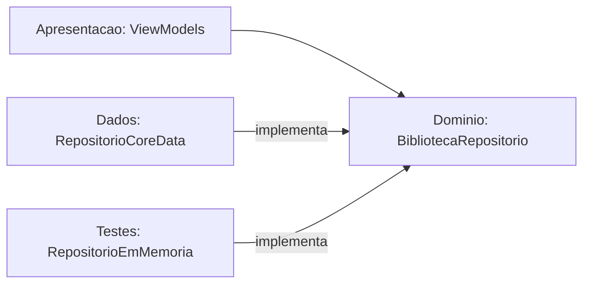
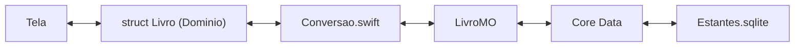
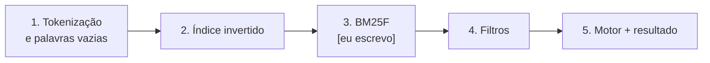
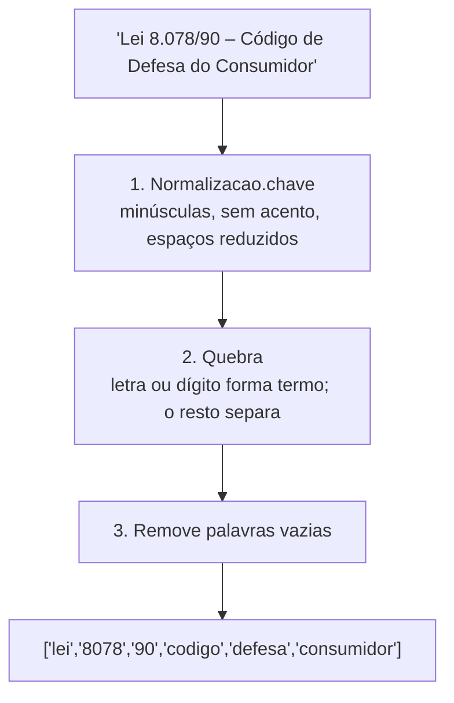
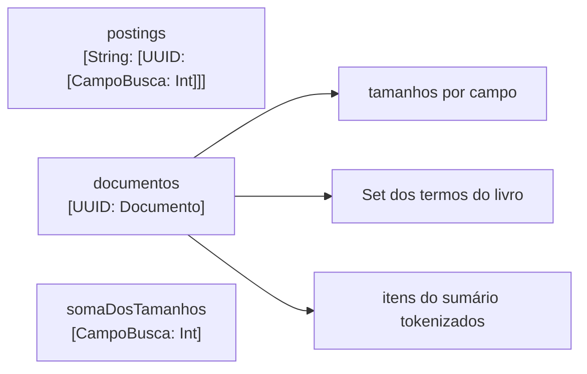
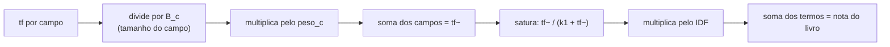

# Fase 2 — App

Objetivo da fase: construir o app iOS (SwiftUI + Core Data) em camadas: entidades e regras puras no Domínio, persistência em Dados, telas em Apresentação, e a busca local (índice invertido + BM25F) sobre a biblioteca do usuário.

## Tarefa 2.1 — Entidades do Domínio e a porta BibliotecaRepositorio (2026-10-08)

### O que foi feito
Criamos as entidades puras em `ios/Estantes/Dominio/Entidades/` (`Estante`, `Livro`, `ItemSumario`, `Categoria`, mais os enums `OrigemLivro`, `OrigemItemSumario` e `CorCategoria`), a regra `NomeDeCategoria` e a função `Normalizacao.chave` em `Dominio/Regras/`, e a porta `BibliotecaRepositorio` em `Dominio/Portas/`. Há 13 testes XCTest verdes no Xcode 14.2. A `ValidacaoSumario` ficou de fora de propósito: é a próxima tarefa e quem escreve é você.

### Conceitos envolvidos

**1. Struct versus classe versus NSManagedObject (semântica de valor).**
Em Swift, `struct` é tipo de valor: atribuir ou passar para uma função cria uma cópia independente. `class` é tipo de referência: duas variáveis apontam para o mesmo objeto. O teste `testStructsSaoValores` mostra isso:

```swift
var original = Livro(estanteId: UUID(), titulo: "Original")
let copia = original          // cópia
original.titulo = "Alterado"
// copia.titulo continua "Original"
```

Consequência prática: se a tela de detalhes recebe um `Livro` e o ViewModel da tela de edição altera o dele, uma tela não muda o livro da outra por acidente. Com uma classe, as duas veriam a mesma mudança (estado compartilhado, a fonte clássica de bugs de UI).

`NSManagedObject` é pior ainda para as telas: é uma referência presa a um `NSManagedObjectContext` e à thread (ou fila) desse contexto. Tocar nele de outra thread é comportamento indefinido, e ele "se atualiza sozinho" quando o contexto muda. Já uma struct com `import Foundation` apenas permite testes que rodam em milissegundos, sem Core Data, sem simulador de banco, sem nada.

**2. Identidade: UUID gerado no aparelho.**
Cada entidade tem `id: UUID`. Um UUID v4 tem 122 bits aleatórios; a chance de colisão é desprezível sem precisar de coordenação central. Isso permite MESCLAR na importação: "mesmo UUID = mesmo livro". Por que não as alternativas: o `NSManagedObjectID` é temporário até o primeiro save (vira permanente depois) e é específico daquele armazenamento, então não sobrevive a uma exportação; um número sequencial (1, 2, 3...) colide entre duas bibliotecas diferentes, que começam ambas do 1.

**3. Relações: a chave estrangeira fica no lado "muitos".**
`Livro.estanteId` aponta para a estante; a `Estante` não guarda a lista de livros. É o mesmo desenho do SQL da Fase 1 (`livro.estante_id REFERENCES estante`). Guardar nos dois lados criaria duas fontes da mesma verdade, que precisariam ser mantidas em sincronia.

**4. Agregado (Domain-Driven Design).**
Um agregado é um grupo de objetos tratados como uma unidade de consistência, com uma raiz pela qual tudo passa. Aqui, `Livro` é a raiz e contém `itensSumario`: o sumário vive, morre e é salvo junto com o livro, e na importação é substituído em bloco. `Categoria`, ao contrário, tem vida própria (existe sem livros, é compartilhada por vários), então o livro guarda só `categoriaIds: Set<UUID>`. Renomear uma categoria muda um registro só, sem regravar nenhum livro. Um `Set` (e não `[UUID]`) porque a ordem não importa e não há repetição.

Decorrência importante: **a posição no array É a ordem do sumário**. Não existe campo `ordem` na struct. O repositório (2.2) gravará o índice no atributo `ordem` do Core Data e ordenará ao ler. Se a struct também tivesse `ordem`, haveria duas verdades possíveis (array diz uma coisa, campo diz outra).

**5. Opcionais.**
`String?` é açúcar para `Optional<String>`, um enum com dois casos: `.none` (escrito `nil`) e `.some(valor)`. O compilador obriga a tratar a ausência antes de usar o valor, o que elimina uma classe inteira de erros de ponteiro nulo. Usamos opcional onde a ausência é um estado legítimo do mundo (livro manual sem ISBN, item "Parte I" sem página), e não opcional onde a ausência seria bug (`titulo`, `id`). Você vai usar muito:

```swift
if let p = item.pagina { ... }      // desembrulha com segurança
item.pagina ?? 0                     // valor padrão
item.numeracao?.isEmpty              // encadeamento: resultado também é opcional
```

**6. Enum com valor bruto (`enum X: String`) e `CaseIterable`.**
Em Swift, enums são tipos soma: um valor é exatamente um dos casos. `enum OrigemLivro: String` associa a cada caso uma `String` (por padrão, o próprio nome do caso): `OrigemLivro.lexml.rawValue == "lexml"`, e `OrigemLivro(rawValue: "gemini")` devolve um opcional (pode não existir). `CaseIterable` gera `allCases`, um array com todos os casos, na ordem de declaração. Os testes usam isso para travar os valores: `OrigemLivro.allCases.map(\.rawValue)`. O `\.rawValue` é um key path usado como função.

Por que travar por teste: o valor bruto vai para o Core Data e para o arquivo exportado. Se alguém renomear `googlebooks` para `googleBooks`, os arquivos antigos deixam de decodificar. O teste transforma uma regra "de cabeça" em falha de build.

**7. Protocolo + inversão de dependência (a porta).**
`BibliotecaRepositorio` é um `protocol`: um contrato de métodos, sem implementação. O Domínio declara do que precisa; a camada Dados implementa com Core Data. A seta de dependência no código aponta de Dados para Domínio (Dados importa o protocolo), o inverso do que seria o caminho "ingênuo" em que o Domínio chamaria o Core Data. Esse é o "D" do SOLID.



Ganhos: trocar Core Data por um falso em memória nos testes e previews, ou por SwiftData no futuro, sem mexer em nenhuma tela.

**8. `async throws`.**
`throws` porque gravar em disco pode falhar e o chamador deve ser forçado a tratar (`try`). `async` porque o Core Data faz o trabalho num contexto de segundo plano (`perform`); um ViewModel `@MainActor` chama com `await`, suspendendo a função sem bloquear a thread principal (a tela continua respondendo). `async` não significa "outra thread" por si só: significa "pode suspender neste ponto".

**9. Normalização de texto.**
`Normalizacao.chave` faz `folding` com `.caseInsensitive` e `.diacriticInsensitive` (usando a localidade `pt_BR`), depois quebra em palavras por espaço em branco e junta com um espaço só. Resultado: `"  Direito   Tributário "` vira `"direito tributario"`. É a base tanto da unicidade de categorias quanto, na 2.3, da busca. Custo: O(n) no tamanho do texto, uma passada.

**10. Regra pura: `NomeDeCategoria.validar`.**
Função estática, sem estado e sem efeito colateral: mesma entrada, mesma saída. Devolve `Problema?` (`nil` = válido), com `.repetido(Categoria)` carregando a categoria conflitante para a interface poder dizer "já existe 'Direito Tributário'". O parâmetro `ignorando:` permite renomear mantendo o próprio nome. Note o idioma `repetida.map { .repetido($0) }`: `Optional.map` aplica a função só se houver valor, e propaga `nil` caso contrário.

**11. XCTest (para a próxima tarefa).**
Cada classe de teste herda de `XCTestCase`; cada método que começa com `test` roda isolado, com uma instância nova da classe. As asserções principais: `XCTAssertEqual(a, b)`, `XCTAssertNil`, `XCTAssertTrue`. `@testable import Estantes` dá acesso aos símbolos `internal` do app. O padrão é Arrange (montar entrada), Act (chamar), Assert (conferir). Para a `ValidacaoSumario`, o jeito natural é um teste por regra: nível zero, nível que pula de 1 para 3, título vazio, página que regride (aviso, não erro).

**12. `for ... enumerated()` (para a próxima tarefa).**
`for (indice, item) in itens.enumerated()` percorre a sequência produzindo pares (posição a partir de 0, elemento). Você precisará dele na `ValidacaoSumario` para dizer "o item da posição 3 está errado" e para comparar cada item com o anterior (`itens[indice - 1]`, cuidando do caso `indice == 0`, senão o programa trava com índice fora do limite).

### Por que assim
- **Struct em vez de classe/NSManagedObject**: segurança contra estado compartilhado, testes rápidos, Domínio sem dependências (regra do projeto).
- **UUID**: permite mesclar na importação sem coordenação central.
- **Livro como raiz de agregado, sem campo `ordem`**: uma verdade só sobre a ordem do sumário; salvar e importar em bloco.
- **`categoriaIds` em vez de `[Categoria]` dentro do livro**: renomear categoria não regrava livros.
- **Foto da capa fora da struct** (`fotoCapa(doLivro:)`, `salvarFotoCapa`): o índice da busca carrega todos os livros ao abrir; imagens pesariam na memória. No Core Data, será "Allows External Storage" (o Core Data guarda blobs grandes como arquivos fora do SQLite).
- **`numeracao` separada do `titulo`**: toda origem grava no mesmo formato, e o título limpo ajuda a busca. Preserva "Capítulo" versus "Título".
- **`pagina` opcional e `origem` por item**: "Parte I" não tem página; um sumário pode ser misto (LexML com correções manuais).
- **`ValidacaoSumario` única para todas as origens** (função pura devolvendo erros e avisos): o formulário (2.6) e o parser (Fase 3) usam a mesma regra, garantindo formato único. Página que regride é aviso, não erro, por causa de apêndices.
- **Nome de categoria validado no Domínio**: a restrição de unicidade do Core Data diferencia acentos e não dá mensagem útil.
- **`CorCategoria` como enum**: `Color` é SwiftUI (proibido no Domínio); um hex é um tom só, e cada cor precisa de versão clara e escura; paleta fixa permite conferir contraste uma vez; valor bruto estável.
- **Dois enums de origem**: um enum único permitiria combinações sem sentido (item vindo do Google Books). Tornar estados inválidos irrepresentáveis é melhor do que validá-los.
- **Um repositório só**: "substituir" na importação troca tudo numa transação.
- **Sem `Codable` nas entidades**: a exportação (2.8) terá um DTO próprio (`BibliotecaExportadaV1`) em Dados, para que o formato do arquivo não mude quando a struct mudar.
- **Inits com valores padrão**: `Livro(estanteId:titulo:)` basta em testes e previews.
- **Sem iPhone, `PhotosPicker` como alternativa a toda captura**: a câmera e o `VNDocumentCameraViewController` não funcionam no simulador (`isSupported` falso), mas Vision e `PhotosPicker` funcionam. Fotos entram no simulador arrastando ou com `xcrun simctl addmedia booted foto.jpg`.

### Alternativas descartadas
- `NSManagedObject` nas telas: acopla UI à persistência e à thread do contexto.
- Classes no Domínio: estado compartilhado.
- `NSManagedObjectID` ou inteiro sequencial como identidade: ver conceito 2.
- Numeração dentro do título ou descartá-la: ver "Por que assim".
- Enum único de origem: combinações sem sentido.
- Cor por hex ou por `Color`: ver acima.
- Restrição de unicidade do Core Data para categorias.
- `Repositorio<T>` genérico: parece elegante, mas esconde regras próprias de cada entidade (apagar estante com destino, substituir sumário em bloco, nullify em categoria).
- Um repositório por entidade: quebraria a transação única da importação.
- Campo `ordem` na struct: duas fontes da mesma verdade.

### Padrões e boas práticas
- **Repository + inversão de dependência**: use quando há mais de uma implementação plausível (produção, teste, preview). NÃO use quando só existe uma e nunca vai mudar; aí é cerimônia.
- **Injeção por `init`**, sem singletons (regra do projeto).
- **Tornar estados inválidos irrepresentáveis** (enums por origem, `Set` para categorias).
- **Funções puras para regras** (`NomeDeCategoria`, `ValidacaoSumario`): testáveis sem preparação.
- **Test de contrato para valores persistidos** (os valores brutos travados).
- **Quando NÃO usar struct**: quando a identidade do objeto importa mais que o valor (um serviço com conexão aberta, um cache compartilhado) ou quando é preciso herança.

### Armadilhas
- Renomear um caso de enum com valor bruto implícito muda o `rawValue` silenciosamente. Para valores persistidos, declare-os explicitamente (`case lexml = "lexml"`) ou mantenha o teste de contrato.
- `let id` em struct impede alterar a identidade depois de criada (bom), mas lembre que `var` em struct só funciona se a instância também for `var`.
- Comparar nomes sem normalizar: `"Tributário" == "tributario"` é falso em Swift. Sempre passe por `Normalizacao.chave`.
- `Equatable` sintetizado compara todos os campos, inclusive `adicionadoEm`. Para dois livros "iguais" em dados mas criados em momentos diferentes, `==` dá falso.
- Acessar `itens[indice - 1]` com `indice == 0` trava o app (crash em tempo de execução, não erro de compilação).
- Se um teste falhar só na CI, lembre que lá o Xcode é 26 e aqui é 14.2; o `folding` e a localidade podem ter diferenças sutis entre versões do sistema.

### Para ir além
- The Swift Programming Language (docs.swift.org): capítulos "Structures and Classes", "Enumerations" e "Optional Chaining".
- Eric Evans, *Domain-Driven Design* (agregados e repositórios) ou, mais curto, o texto de Martin Fowler "Repository" e "DDD_Aggregate" em martinfowler.com.
- Documentação da Apple: "XCTest" e "Concurrency" (async/await) no Swift book.

### Perguntas
1. Com suas palavras: por que `Livro` guarda `categoriaIds: Set<UUID>` e `itensSumario: [ItemSumario]` de maneiras tão diferentes (ids de um lado, os itens inteiros do outro)? O que isso muda ao renomear uma categoria e ao apagar um livro?
2. O que mudaria no desenho se o app precisasse sincronizar a biblioteca entre dois iPhones? Pense em identidade (UUID), no campo `ordem` e no que o DTO de exportação passaria a precisar guardar.
3. Preveja: `NomeDeCategoria.validar("Ação", existentes: [Categoria(nome: "acao", cor: .azul)])` devolve o quê? E `Normalizacao.chave("Ação")` comparado a `"ação"` (com o `ç` e o `ã` já decompostos em letra + acento)? Por que importa que o `folding` trate os dois igual?

### Minhas respostas
<!-- Ricardo responde aqui por escrito. O teacher corrige na próxima chamada. -->

## Tarefa 2.1b — ValidacaoSumario, o primeiro código Swift do Ricardo (2026-10-08)

### O que foi feito
Ricardo escreveu sozinho `ValidacaoSumario.validar` em `ios/Estantes/Dominio/.../ValidacaoSumario.swift` (tarefa `[eu escrevo]`). O Claude preparou o esqueleto (tipos `Problema` e `Resultado`) e 11 testes de especificação, escritos antes do código (TDD: vermelho, depois verde), e atuou como revisor. No fim há 25 testes verdes no Xcode 14.2 e o PR #19 está aberto. Um teste foi acrescentado pelo próprio Ricardo (`testComparaComAPaginaImediatamenteAnterior`) depois de descobrirmos um buraco na especificação.

### A regra
Percorrer os itens; para cada índice `i`:
1. Nível menor que 1 gera erro `nivelInvalido`. Senão, se o nível subiu mais de 1 em relação ao anterior (o anterior vale 0 para o primeiro item), gera erro `saltoDeNivel`. Descer qualquer quantidade é permitido.
2. Título vazio ou só com espaços gera erro `tituloVazio`.
3. Página menor que a do último item anterior COM página (itens `nil` são pulados) gera AVISO `paginaMenorQueAnterior`.

A ordem é por índice, e o nível vem antes do título. Avisos não impedem salvar: `valido` é `erros.isEmpty`.

### O percurso (a parte mais didática)

**Rodada 1: três problemas de uma vez.**

1. `return Resultado(erros: [], avisos: [])` devolvia literais vazios em vez das variáveis preenchidas no `for`. Resultado: TODOS os testes de erro falharam com mensagens do tipo `("[]") is not equal to ...`. Ricardo achou que o defeito estava só na página, mas a pista estava na mensagem: até os testes de nível e de título mostravam `[]`. **Lição: ler a mensagem do teste antes de diagnosticar.**

2. A memória da página estava errada: `var pagItemAnterior = itens.first(where: { $0.pagina != nil })` fixava a memória no PRIMEIRO item com página, e ela nunca era atualizada.

3. A tentativa de atualizar era `if var pagAtual = ..., var pagAnterior = pagItemAnterior?.pagina, ... { pagAnterior = pagAtual }`. O `if var` cria uma CÓPIA local, que morre no `}`. É a semântica de valor (a mesma ideia do `testStructsSaoValores` da 2.1): mexer na cópia não mexe no original. Além disso, a atualização só aconteceria quando houvesse aviso.

Rastreamento com páginas 10, 50, 20 (o que o código dele fazia versus o correto):

| Volta | Página | Código dele compara com | Resultado | Deveria comparar com |
| --- | --- | --- | --- | --- |
| 0 | 10 | 10 | 10<10? não | nada |
| 1 | 50 | 10 | 50<10? não | 10 |
| 2 | 20 | 10 | 20<10? não, sem aviso (errado) | 50, aviso (certo) |

**Achado importante: falha da especificação, não do aluno.** Corrigido o `return`, os 11 testes originais PASSARIAM mesmo com a lógica de página errada, porque nenhum deles tinha uma sequência em que o item anterior com página difere do primeiro item com página. **Teste verde não prova que o código está certo. Prova só que ele faz o que os testes perguntam.** Ricardo escreveu `testComparaComAPaginaImediatamenteAnterior` (10, 50, 20, com aviso esperado no índice 2), viu o teste falhar e depois passar. Estrutura de um teste: monta (cenário), chama (a função), confere (o resultado).

Pseudocódigo para a memória: `ultimaPagina: Int? = nil` declarada FORA do `for`. Se o item tem página, compara quando há memória e depois atualiza SEMPRE (com ou sem aviso). Item sem página não mexe na memória.

**Rodada 2: o compilador entra em cena.**
- `if pagItemAnterior != nil && element.pagina < pagItemAnterior` sem chaves. Swift exige `{}` em todo `if`, o que evita o erro clássico de a segunda linha "parecer" dentro do `if`.
- Comparar `Int?` com `<` não compila. Checar `!= nil` não muda o tipo: Swift não faz "smart cast" como Kotlin ou TypeScript. A solução é `if let`, que desembrulha e cria uma constante `Int`; a vírgula encadeia desembrulho e condição. Exemplo usado: `if let precoHoje = ..., let precoOntem = ..., precoHoje > precoOntem`.
- Novo erro: `return Resultado(erros: erros, avisos: erros)`. O compilador NÃO pega (os dois são `[Problema]`); os testes pegam. É o tipo de bug que tipos iguais escondem.

**Rodada 3 (correta):**
```swift
if let pagAtual = element.pagina {
    if let pagAnterior = pagItemAnterior, pagAtual < pagAnterior {
        avisos.append(.paginaMenorQueAnterior(indice: index))
    }
    pagItemAnterior = pagAtual   // atualiza SEMPRE que o item tem página
}
```
Ajuste aplicado na revisão: atribuir `pagAtual` (o `Int` já desembrulhado), não `element.pagina` (que é `Int?` e não encaixaria).

Ajustes de estilo aplicados: `.nivelInvalido(...)` com inferência de tipo em vez de `ValidacaoSumario.Problema.nivelInvalido`, e `trimmingCharacters(in: .whitespacesAndNewlines).isEmpty` em vez de `isEmpty || trimmed == ""`. Parênteses desnecessários no `if` foram removidos.

**Pendências leves, por escolha dele:** `for (indice, item)` em português em vez de `(index, element)`, e `{` na mesma linha do `if`/`for` (convenção Swift; ele usa a linha seguinte). Não afetam o comportamento, só a leitura por outros desenvolvedores. Vale reconsiderar quando o projeto crescer ou ganhar um linter (SwiftLint).

### Conceitos envolvidos

**Optional (`Int?`).** É um enum com dois casos, `.none` e `.some(valor)`. `Int?` e `Int` são tipos diferentes; por isso `<` não compila entre eles. `if let x = opcional` testa o caso e extrai o valor para uma constante de tipo `Int`, válida só dentro das chaves. Aqui: `element.pagina` é `Int?` porque "Parte I" não tem página.

**Semântica de valor.** `if var a = b` copia `b`. Alterar `a` não altera `b`. Para a memória sobreviver entre voltas do `for`, ela precisa ser declarada fora do laço e atribuída diretamente (`pagItemAnterior = pagAtual`).

**Escopo.** Variável declarada dentro do `for` nasce e morre a cada volta. A "memória entre iterações" tem de morar fora.

**Função pura.** `validar` recebe um array e devolve um `Resultado`, sem efeitos colaterais. Por isso o teste é só montar, chamar e conferir, sem banco, sem rede, sem tela.

**`enumerated()`.** Produz pares (posição, elemento). Evita `itens[i - 1]`, que travaria com `i == 0`. Aqui o "anterior" é guardado em variáveis (`itemAnteriorNivel`, `pagItemAnterior`), sem indexar o array.

**TDD e a limitação dos testes.** Vermelho, verde, refatorar. O teste é uma especificação executável, e uma especificação incompleta deixa passar código errado. O caso de teste novo nasce de um contraexemplo (10, 50, 20).

**Complexidade.** Uma passada pelo array: O(n) no tempo, O(1) de memória extra além da saída.

### Por que assim
- **Duas variáveis de memória** (`itemAnteriorNivel`, `pagItemAnterior`) em vez de olhar `itens[i-1]`: o nível compara com o item imediatamente anterior, mas a página compara com o último item que TEM página, e esses dois "anteriores" são diferentes.
- **Atualizar a memória sempre que há página**, mesmo sem aviso: o próximo item deve ser comparado com o mais recente, não com um valor antigo.
- **Nível: `if` / `else if`** porque nível inválido e salto são mutuamente exclusivos para um mesmo item (um nível 0 não é "salto"). Título é um `if` separado porque o mesmo item pode ter os dois problemas.
- **Página como aviso**, não erro: apêndices e anexos reiniciam a numeração.

### Alternativas descartadas
- **Guardar o índice do último item com página** e consultar `itens[ultimo]`: funciona, mas é mais indireto que guardar o próprio valor.
- **`reduce`**: possível, porém menos legível para quem está começando e sem ganho aqui.
- **`zip(itens, itens.dropFirst())`**: bom para comparar vizinhos, mas não cobre o "pula nil".
- **Lançar exceção no primeiro erro**: o usuário veria um problema por vez; devolver a lista completa permite mostrar tudo no formulário (2.6) e no parser (Fase 3).

### Padrões e boas práticas
- **Escrever o teste que falha antes de corrigir** (como no teste 10, 50, 20). NÃO vale a pena em código descartável.
- **Lista de problemas em vez de falhar no primeiro** (acumulador).
- **Enum com valores associados** (`.nivelInvalido(indice:)`): cada problema carrega o contexto.
- **Quando suspeitar de testes verdes:** ao corrigir um bug, pergunte "qual teste teria pegado isso?". Se nenhum, escreva-o primeiro.

### Armadilhas
- Literais no `return` (`[]`) em vez das variáveis: compila sem queixa.
- Campos do mesmo tipo trocados (`avisos: erros`): o compilador não vê. Só o teste vê.
- `if var` / `var` em ligação opcional: cria cópia, não altera o original.
- Nesta implementação, `itemAnteriorNivel = element.nivel` roda também quando o nível é inválido (por exemplo 0 ou negativo). Isso é coerente com o enunciado ("anterior" é o item anterior, seja ele válido ou não), mas vale um teste explícito se a regra mudar. Verifique nos testes se esse caso está coberto.

### Para ir além
- The Swift Programming Language (docs.swift.org): "The Basics" (Optionals e Optional Binding) e "Control Flow".
- Kent Beck, *Test-Driven Development: By Example*.
- Apple, documentação de XCTest (`XCTAssertEqual`) e "Structures and Classes" (semântica de valor).

### Perguntas
1. Com suas palavras: por que `if let pagAnterior = pagItemAnterior` resolve o erro de comparar `Int?` com `<`, e por que `!= nil` antes não resolveu? Por que `if var` NÃO atualizaria a memória?
2. Aplicação: se a regra mudasse para "página igual à anterior também é aviso", o que mudaria no código e qual teste você escreveria primeiro? E se itens sem página passassem a resetar a memória?
3. Raciocínio: com as páginas `[nil, 30, nil, 5, 40, 10]`, quais índices recebem aviso? Depois: se os testes originais passavam mesmo com a lógica errada, que outro tipo de entrada (além de 10, 50, 20) você acha que ainda não está coberta?

### Minhas respostas
<!-- Ricardo responde aqui por escrito. O teacher corrige na próxima chamada. -->

(sem respostas)


---

## Tarefa 2.2 — Core Data e BibliotecaRepositorioCoreData (2026-10-08)

### O que foi feito
Criamos a camada de persistência em `ios/Estantes/Dados/Persistencia/`: o modelo `Estantes.xcdatamodeld` (Estante, Livro, ItemSumario, Categoria), as classes `EntidadesMO.swift`, o `PersistenceController` e o `BibliotecaRepositorioCoreData`, que implementa a porta definida na 2.1. A conversão entre objetos do banco e structs do Domínio ficou em `Conversao.swift` (parte escrita pelo Ricardo). Foram 25 testes de Dados escritos antes da conversão (TDD), depois ampliados na revisão; tudo verde no Xcode 14.2.

### Conceitos envolvidos

**Que banco é esse?** O Ricardo perguntou, e a resposta organiza a arquitetura:

| | Banco local (Core Data), 2.2 | Supabase (Postgres), Fase 1 |
|---|---|---|
| Onde | dentro do iPhone, arquivo SQLite `Library/Application Support/Estantes.sqlite` | servidor na internet |
| Guarda | a biblioteca do usuário (estantes, livros, sumários, categorias, capas) | o catálogo LexML (83.612 livros) |
| Quem escreve | o app | só nós via psql; o app só lê |
| Internet | não precisa (a busca também é offline) | precisa |
| Para quê | memória do app | identificar livro novo pela foto (Fase 3) |

Os dois se encontram na Fase 3: o resultado do Supabase é COPIADO para o banco local. A cadeia de leitura é:



Nos testes o arquivo é `/dev/null`. O app ainda não usa o banco: a montagem em `App/Dependencias` vem na 2.4. A exportação JSON (2.8) será o backup contra a expiração de 7 dias do Sideloadly.

**Core Data não é um banco, é um grafo de objetos.** Ele gerencia objetos em memória (`NSManagedObject`) e, por baixo, usa SQLite para persisti-los. Peças: o modelo (`NSManagedObjectModel`, o esquema), o `NSPersistentContainer` (empacota modelo + armazenamento + contextos) e o `NSManagedObjectContext` (a "mesa de trabalho": você altera objetos nela e só `save()` grava). Cada contexto tem uma fila (`perform`) em que seus objetos podem ser tocados; fora dela é comportamento indefinido.

**Regras de exclusão (delete rules).** Definem o que acontece com os objetos relacionados quando um é apagado:
- Estante→livros: *cascade* (apagar a estante apaga os livros);
- Livro→estante: obrigatória, *nullify*;
- Livro→itensSumario: *cascade*;
- Livro↔Categoria: muitos-para-muitos, *nullify* nos dois lados (apagar uma categoria só desfaz o vínculo, não apaga livros).
Toda relação tem inversa: o Core Data mantém os dois lados consistentes sozinho, e isso evita relações "pela metade".

**Classes `@NSManaged` e `@objc(LivroMO)`.** `@NSManaged` diz ao compilador "o acesso a esta propriedade será implementado em tempo de execução pelo Core Data" (ele gera getter/setter dinamicamente). `@objc(LivroMO)` fixa o nome Objective-C da classe: o modelo localiza a classe por nome, e sem isso o nome real seria `Estantes.LivroMO` (com o módulo na frente), e a busca falharia.

**Opcionais numéricos.** `@NSManaged var ano: Int32` não pode ser nil. Para campos opcionais usamos `NSNumber?`. Para `nivel` e `ordem` (obrigatórios), `Int32` escalar. Por isso a conversão tem `Int(nivel)` de um lado e `pagina?.intValue` do outro.

**Upsert.** "Busca pelo id; se não existir, cria; depois preenche." É o `salvar` do repositório. Sem restrição de unicidade no banco, a garantia é só da lógica do código (ver Armadilhas).

**`prateleiras`: SELECT DISTINCT.** Usamos `dictionaryResultType` com `returnsDistinctResults`: o SQLite devolve só a coluna pedida, sem materializar objetos, sem repetidos. `quantidadeDeLivros` usa `count(for:)`, que vira `SELECT COUNT(*)`: O(n) no banco, sem trazer n objetos para a memória.

**Sumário em bloco.** Em vez de uma relação ordenada (`NSOrderedSet`), o item tem um atributo `ordem` igual à posição no array. Salvar um livro apaga os itens antigos e recria. Simples e previsível; a relação ordenada é frágil e não funciona com CloudKit.

**Conversão em duas direções.**
- `paraDominio()`: LER. Banco → struct nova; devolve valor.
- `preencher(com:)`: GRAVAR. Copia struct → objeto que o repositório já criou ou buscou; não devolve nada.

### O percurso do Ricardo (o que cada tropeço ensina)

**1. "Dentro da extension, `id` é de quem?"** A primeira tentativa foi `Estante(id: UUID(), nome: "", criadaEm: Date())`: inventava valores novos em vez de ler o objeto. O que faltava: dentro de `extension EstanteMO { }`, `id`, `nome` e `criadaEm` são propriedades do PRÓPRIO objeto (`self.id`), uma linha do banco já carregada. A forma certa é `Estante(id: id, nome: nome, criadaEm: criadaEm)`: em `id: id`, o da esquerda é o rótulo do parâmetro do init da struct; o da direita é o valor lido de `self`. Efeito: as falhas caíram de 16 para 13.

**2. Categoria, sozinho e certo.** `Categoria(id: id, nome: nome, cor: CorCategoria(rawValue: cor) ?? .cinza)` e `cor = categoria.cor.rawValue`. O `?? .cinza` é uma degradação silenciosa. Alternativas: `fatalError` (fecha o app por causa de uma cor) ou `throw` (obrigaria `try` em toda leitura). O que protege contra renomear uma cor sem perceber é o teste de contrato dos `rawValue` da 2.1. Detalhe do revisor: salvar de novo grava o padrão por cima do valor desconhecido; isso é intencional e ficou comentado no arquivo.

**3. ItemSumario: de FALHAR para TRAVAR.** O `paraDominio()` saiu perfeito (`Int(nivel)`, `pagina?.intValue`, `?? .manual`). No `preencher`, ele escreveu `id = id`, `nivel = Int32(nivel)`, `numeracao = numeracao`, `titulo = titulo` (faltava o `item.`) e não gravou a `ordem`. Resultado: 5 testes com "Restarting after unexpected exit, crash". Por quê? O objeto recém-criado tem `id` nil no armazenamento, mas a classe declara `@NSManaged var id: UUID` sem `?`, prometendo ao Swift que nunca é vazio. Ler `id` para copiá-lo a si mesmo encontra nil onde se prometeu que não haveria, e o app encerra. Com o corpo vazio de antes ninguém lia o campo, e o Core Data só recusava salvar ("Multiple validation errors occurred."). Lição: um crash é pior que um teste vermelho, mas aponta para uma violação de contrato de tipo, e o sintoma mudou porque o código passou a LER o campo.

**4. Sombreamento (shadowing) e `self`.** O parâmetro `ordem` tem o mesmo nome da propriedade. Dentro da função, `ordem` é o parâmetro (constante), então `ordem = Int32(ordem)` não compila. A solução é `self.ordem = Int32(ordem)`, o único lugar do arquivo onde `self.` é obrigatório. Regra: o nome mais interno vence; `self.` desfaz o sombreamento. Na rodada 2 ele corrigiu tudo, com zero travamentos.

**5. LivroMO (escrito pelo Claude a pedido dele).** Pontos novos:
- `estanteId: estante.id`: a relação é o objeto inteiro, não o id;
- `Set(categorias.map(\.id))`: `map` devolve array, `Set` converte;
- `itensSumario.sorted { $0.ordem < $1.ordem }.map { $0.paraDominio() }`: relações do Core Data são conjuntos SEM ordem, e a ordem vem do atributo `ordem`;
- `"".components(separatedBy: "\n")` devolve `[""]` (um item vazio), não `[]`. Daí a função `lista(_:separador:)` com `texto.isEmpty ? [] : ...`. O teste `testLivroMinimoMantemOpcionaisNil` pegaria isso.
Estilo pedido por ele: um argumento por linha em init longo; `.map { ... }` sem parênteses (closure final).

### Por que assim
1. **Sufixo MO e classes à mão.** O codegen automático criaria `Livro` e `Estante`, colidindo com as structs do Domínio e visíveis no app inteiro. Com `MO`, a fronteira Dados/Domínio fica visível no nome.
2. **`autores` como String com um nome por linha (`\n`)**, porque nomes têm vírgula ("Sobrenome, Nome"). `cddirCaminho` usa " > ".
3. **`ItemSumario` com `id` no Core Data**: sem ele, a ida e volta (struct → banco → struct) não preserva a igualdade.
4. **Modelo carregado uma vez (`static let modelo`).** Vários containers, cada um com seu modelo, fazem o Core Data reclamar de entidades disputando a mesma classe. Não é singleton: é uma constante imutável, e o controller continua recebendo tudo por `init`.
5. **`/dev/null` nos testes.** Mesmo motor SQLite da produção, nada gravado. O tipo `NSInMemoryStoreType` é outro motor (sem batch requests e com diferenças sutis).
6. **Um `newBackgroundContext()` por operação** com `try await contexto.perform { }`: a tela não trava; cada operação começa sem cache antigo; nenhum MO sai do `perform`, só structs (que são valores seguros de passar entre filas).
7. **TDD com conferência prévia.** O Claude validou os próprios testes com uma conversão de referência temporária (não commitada) antes de passar a vez ao Ricardo. Assim, se um teste falhasse, a culpa só poderia ser da conversão dele. Teste que nunca viu o verde não prova nada.

### Alternativas descartadas
- **Codegen automático**: colisão de nomes (acima).
- **Transformable para `autores`**: opaco no banco, não buscável, exige transformer seguro; texto simples basta.
- **Relação ordenada (`NSOrderedSet`) para o sumário**: frágil, difícil de substituir em bloco, sem CloudKit.
- **SwiftData**: proibido pela regra dos dois Xcodes (exige iOS 17 e macros).
- **`NSInMemoryStoreType` nos testes**: motor diferente da produção.
- **Contexto único `viewContext` para tudo**: a escrita travaria a interface.

### Padrões e boas práticas
- **Repository + porta** (protocolo no Domínio, implementação em Dados): a tela não sabe que existe Core Data. Não vale a pena para um app de uma tela só, mas aqui o ganho é testar com um repositório falso e trocar a persistência.
- **Anti-corruption layer / mapper** (`Conversao.swift`): nenhum `NSManagedObject` vaza para fora de `Dados/Persistencia/`.
- **Regra de concorrência do Core Data**: cada objeto e cada contexto só dentro da sua fila (`perform`).
- **Idempotência**: apagar algo que não existe não é erro. Já gravar apontando para algo inexistente LANÇA erro, porque aí o chamador cometeu um engano real. A regra ficou documentada na porta: apagar ignora; ler devolve vazio; gravar com referência inexistente lança.
- **Verificar pelo compilador em vez de texto**: `#keyPath(LivroMO.estante.id)` no lugar de `"estante.id"`.
- **Desempate nas ordenações**: títulos iguais ("Direito penal") sem critério secundário voltam em ordem não determinística.

### Armadilhas
- **Bug real encontrado na revisão (no código do Claude)**: `apagarEstante(id: X, moverLivrosPara: X)` pulava o "mover" (`destino != id`) e a cascata apagava todos os livros, uma perda silenciosa de dados. Agora lança `destinoInvalido` antes de tocar no banco, com teste. Lição: caso de borda dentro de um `if` com duas condições; sempre pergunte "e se os dois valores forem iguais?".
- **Teste usando `viewContext` fora da fila principal**: passava por sorte. Passou a usar `newBackgroundContext()` + `perform`.
- **`/dev/null` nunca prova persistência**: por isso entrou um teste que fecha e reabre um banco em ARQUIVO de verdade.
- **Condição de corrida no upsert (limitação conhecida)**: dois `salvar` simultâneos do mesmo id, em contextos diferentes, ambos fazem "busca" sem achar e ambos criam, duplicando. Registrado no PLANO.md; resolver na 2.8 com um contexto único de escrita ou uniqueness constraints. É o clássico TOCTOU (time-of-check to time-of-use).
- **Valores de `@NSManaged` não opcionais lidos antes de preenchidos** travam o app (item 3 acima).
- **`components(separatedBy:)` com texto vazio** devolve `[""]`.
- **Sem versionamento do modelo**: antes de existirem dados reais de usuário, mudar o modelo exige migração. Adiado de propósito, mas deve ser feito antes de qualquer dado real.
- Diagnóstico geral: crash com "Restarting after unexpected exit" no teste significa quase sempre acesso inválido (nil em tipo não opcional, ou objeto fora da sua fila); veja o relatório de crash, não só o resumo.

Recusados ou adiados, com motivo: unicidade do nome da categoria (é regra do Domínio, decidida na 2.1); tamanho das fotos dentro da linha do Livro (decidir na 2.4); limpar espaços da prateleira (formulário na 2.4).

### Para ir além
- Apple, *Core Data* (developer.apple.com/documentation/coredata), em especial "Using Core Data in the Background" e "Core Data Model Editor".
- Martin Fowler, *Patterns of Enterprise Application Architecture*: Repository, Data Mapper.
- *The Swift Programming Language*, capítulo "Properties" e a seção sobre `self` e nomes de parâmetros.

### Perguntas
1. Com suas palavras: qual a diferença entre `paraDominio()` e `preencher(com:)`? Por que, em `id: id`, os dois `id` são coisas diferentes? Por que `ordem = Int32(ordem)` não compila e `self.ordem = Int32(ordem)` compila?
2. Aplicação: se o app passasse a ter uma tela de "categorias" em que apagar uma categoria também apagasse os livros dela, o que mudaria no modelo? E se quiséssemos guardar a ordem dos autores de um livro, o formato "um por linha" continuaria servindo?
3. Raciocínio: (a) por que `id = id` TRAVA o app, enquanto um `preencher` de corpo vazio apenas faz o teste falhar? (b) Descreva uma sequência de duas chamadas simultâneas de `salvar` que duplica um livro. (c) Por que apagar um id inexistente é ignorado, mas salvar um livro numa estante inexistente lança erro?

### Minhas respostas
<!-- Ricardo responde aqui por escrito. O teacher corrige na próxima chamada. -->

---

**Lembrete:** as perguntas das entradas 2.1 e 2.1b continuam sem resposta. Vale respondê-las antes de seguir: as respostas a 2.1b (validação do sumário) e a 2.2 (conversão e concorrência) se apoiam em ideias que se acumulam.

---

## Tarefa 2.3a — Tokenizador da busca (2026-10-09)

### Correção das respostas (entradas anteriores)
(sem respostas) As perguntas das entradas 2.1, 2.1b e 2.2 continuam em branco. Nada a corrigir.

### O que foi feito
Primeiro passo da 2.3: `Dominio/Busca/Tokenizador.swift`, um `enum` sem casos com a função `termos(_:)`, que transforma um texto numa lista de termos prontos para o índice e para a consulta. Os testes estão em `EstantesTests/Dominio/Busca/TokenizadorTests.swift` (10 testes; a suíte inteira fechou em 60, 0 falhas, no Xcode 14.2). O comentário de `Normalizacao.swift` foi atualizado e o `PLANO.md` marcou o BM25F como `[eu escrevo]`. O Ricardo optou por não escrever o tokenizador e guardar o `[eu escrevo]` para a fórmula do BM25F, onde há mais a aprender.

### Conceitos envolvidos

**O mapa da 2.3.** O motor de busca local (offline, só Foundation) sai em cinco passos:



Começamos pela tokenização por dois motivos. Primeiro, índice e consulta precisam passar pela MESMA normalização. Se divergirem, "Ação" indexado nunca casa com "acao" digitado, e o erro é silencioso: a busca simplesmente não acha nada. Segundo, é a peça menor e não depende de nenhuma outra.

**Tokenização.** É quebrar um texto em unidades (tokens ou termos) que o índice sabe comparar. É a primeira etapa de qualquer motor de busca (Lucene, Elasticsearch, Postgres full-text). O que difere entre eles é o pipeline, e o nosso tem três etapas:



1. **Normalização (folding pt_BR).** Reaproveita `Normalizacao.chave`. Por baixo, é a decomposição Unicode (NFD): "ç" vira "c" + cedilha combinante, e o folding descarta as marcas combinantes. Assim "AÇÃO" vira "acao".
2. **Quebra.** O código percorre um `Array(Character)` com `enumerated()` e acumula o termo atual numa `String`. Cada caractere é de um destes tipos: parte de termo (letra ou dígito, que entra no acumulador), ou separador (que fecha o termo, se houver). Pontuação, hífen e travessão são separadores, então "pós-graduação" vira `pos` + `graduacao`. É uma passada só, O(n) no tamanho do texto. Um `Character` do Swift é um grapheme cluster (o que o usuário vê como um caractere), por isso o `Array(Character)` é seguro com acentos, e não é um array de bytes ou de escalares Unicode.
3. **Palavras vazias (stop words).** Artigos, preposições e contrações (de, da, do, em, no, para, por, com, ou, que, se...) aparecem em quase todo título e quase não distinguem um livro do outro. Ficam guardadas num `Set<String>`, cuja consulta é O(1) em média (tabela hash), contra O(k) de varrer um array. Termos jurídicos curtos (lei, art, cpc, stf) ficam de propósito, porque aqui tamanho curto não significa pouca informação. A lista já vem sem acento, porque a normalização roda antes: "à" chega ao filtro como "a".

**Por que a lista mantém ORDEM e REPETIÇÕES.** `termos` devolve `[String]`, e não `Set<String>`. O BM25F, que vem no passo 3, usa a *frequência do termo* em cada campo (tf): "prisão e prisão preventiva" deve pontuar mais para "prisao" do que um título que cita a palavra uma vez. Se o tokenizador devolvesse um conjunto, essa informação seria destruída antes de chegar ao índice, e não haveria como recuperá-la. Regra geral: perca informação o mais tarde possível. O teste `testPreservaRepeticoes` trava esse contrato.

**Indicadores ordinais º e ª.** Para o Unicode, "º" está na categoria Lo (Letter, other), então `Character.isLetter` é `true`. Sem tratamento, "5º" viraria o termo `5º` e nunca casaria com quem digita "5". `fazParteDeTermo` exclui os dois explicitamente, então "art. 5º" vira `["art","5"]`. É um exemplo de como categorias Unicode não coincidem com a intuição de quem fala português.

**Ponto entre dois dígitos não separa.** Esta foi uma mudança feita durante a implementação (o Ricardo foi avisado; é reversível). Antes, "Lei 8.078/90" daria `["lei","8","078","90"]` e quem digitasse "8078" não acharia. Agora o ponto, quando tem dígito dos dois lados (`pontoEntreDigitos`, com um `continue` que não fecha o termo), é engolido e dá `["lei","8078","90"]`. Quem digita "8078" ou "8.078" acha o livro, porque a consulta passa pelo mesmo caminho. Consequências aceitas:
- "1.2.3" vira `123`. Isso não atrapalha porque a numeração do sumário fica em `ItemSumario.numeracao`, que não é indexada, e o título fica limpo.
- Ponto no fim do número ("8.078. Comentários") continua separando, porque depois do segundo ponto vem espaço, e não dígito.
- Efeito colateral conhecido: "nº" vira o termo `n` (o "º" separa). Não foi tratado, porque `n` tem IDF baixo (aparece em muitos livros e pesa pouco).

**`enum` sem casos como namespace.** `enum Tokenizador { static func ... }` não pode ser instanciado, então não carrega estado e não é singleton. É o idioma do Swift para agrupar funções puras, e combina com a regra do projeto de "sem singletons". Uma função pura (mesma entrada, mesma saída, sem efeito colateral) é trivial de testar, e é isso que os 10 testes fazem.

### Por que assim
- **Pipeline único para índice e consulta**: garante que os dois lados falem a mesma língua.
- **Lista, e não conjunto**: o BM25F precisa do tf (veja acima).
- **Tratar º/ª e o ponto entre dígitos**: o público é jurídico, e "art. 5º" e "Lei 8.078/90" são os padrões mais comuns de busca.
- **`Set` para as palavras vazias**: consulta O(1) média.
- **Lista de palavras vazias curta**: só o que é claramente funcional em português. Cortar demais esconderia livros, e a perda seria silenciosa.

### Alternativas descartadas
- **Palavras vazias dentro de `Normalizacao`**: `Normalizacao.chave` também compara nomes de categoria (`NomeDeCategoria`). Ali "Direito do Trabalho" e "Direito Trabalho" precisam continuar DIFERENTES. Se a normalização removesse "do", as duas colapsariam na mesma chave e criariam uma duplicata falsa. Separação de responsabilidades: normalização *compara*, tokenizador *prepara para busca*.
- **Usar `NLTokenizer` / `String.components(separatedBy:)` / regex**: o `NLTokenizer` vem do framework NaturalLanguage, e o Domínio só importa Foundation. A passada manual é curta, previsível e testável sem depender de plataforma.
- **Devolver `Set<String>`**: perderia as repetições.
- **Deixar o ponto sempre separar**: "8.078" viraria dois termos e a busca por "8078" falharia.

### Decisões adiadas para o passo 5 (motor)
- **Prefixo enquanto o usuário digita** ("preve" achar "preventiva").
- **Plural e radical** ("prisão" × "prisões"). Exige stemming ou outra técnica; o tokenizador atual trata como termos distintos.
- **Consulta com OU × E**: "prisão preventiva" exige os dois termos, ou qualquer um? Isso muda a ordenação e o recall.

### Padrões e boas práticas
- **Funções puras no Domínio**: sem I/O, fáceis de testar. Quando NÃO usar o `enum` namespace: se a coisa tiver estado ou precisar ser trocada por um falso nos testes (aí vira protocolo + `struct`).
- **Testes de contrato com exemplos reais** (`"Lei 8.078/90"`), inclusive o teste de equivalência `termos("Lei 8.078/90") == termos("lei 8078/90")`, que documenta a promessa ao usuário.
- **Teste de borda**: entrada vazia, só pontuação e só palavras vazias devolvem `[]`.

### Armadilhas
- **Normalizar de um lado só**: se alguém indexar com o tokenizador e consultar com `Normalizacao.chave`, as buscas somem sem erro. Diagnóstico: um teste que indexa e busca o mesmo texto.
- **Classificação Unicode**: `isLetter`/`isNumber` incluem coisas inesperadas (º, ª, frações como "½", dígitos de outros alfabetos). Quando algo "não casa", imprima os escalares Unicode (`unicodeScalars`) em vez de confiar no que a tela mostra.
- **Hífen e apóstrofo**: aqui o hífen separa. Se um dia entrar um termo como "e-mail", ele vira `e` + `mail` (o `e` é removido). Aceito pelo domínio jurídico, mas vale saber.
- **Remover palavras vazias da CONSULTA**: se o usuário digitar só "de", a consulta fica vazia, e o motor precisa decidir o que devolver (tudo? nada?). Isso é do passo 5.

### Para ir além
- Manning, Raghavan e Schütze, *Introduction to Information Retrieval*, cap. 2 ("The term vocabulary and postings lists"): tokenização, stop words, normalização. Disponível online gratuitamente (nlp.stanford.edu/IR-book).
- Unicode Standard Annex #29 (Text Segmentation) e UAX #44 (categorias gerais, para entender Lo).
- Apple, documentação de `Character` e `String` (grapheme clusters) em *The Swift Programming Language*, capítulo "Strings and Characters".

### Perguntas
1. Com suas palavras: por que índice e consulta precisam passar exatamente pelo mesmo tokenizador? Dê um exemplo concreto de falha silenciosa se não passarem.
2. Aplicação: o que mudaria no resultado se o `Tokenizador` fosse reaproveitado para comparar nomes de categoria? Mostre um par de nomes que passaria a colidir. E, no outro sentido, o que mudaria se "nº" passasse a ser tratado como "numero": em que ponto do pipeline você colocaria essa regra?
3. Raciocínio (prepara o índice invertido e o BM25F): considere os títulos A = "prisão preventiva" e B = "prisão e prisão cautelar". (a) Escreva `termos` de cada um. (b) Se `termos` devolvesse um conjunto, o que A e B teriam de diferente para a palavra "prisao"? (c) Como você acha que um índice invertido (termo → lista de livros) deveria guardar a informação de repetição, para que o BM25F calcule a frequência por campo (título, autor, assunto) sem reler os textos? (d) Por que um termo que aparece em quase todos os livros deveria pesar menos no ranking?

### Minhas respostas
<!-- Ricardo responde aqui por escrito. O teacher corrige na próxima chamada. -->

#### Correção das respostas
(sem respostas)

---

## Tarefa 2.3b — Índice invertido da busca (2026-10-09)

### O que foi feito
Criamos `Dominio/Busca/IndiceInvertido.swift`: um `struct` só com Foundation que guarda, em memória, tudo que o BM25F (passo 3, que o Ricardo vai escrever) precisa consumir. Junto vieram o enum `CampoBusca` e o tipo `ItemSumarioIndexado`. Os 18 testes estão em `EstantesTests/Dominio/Busca/IndiceInvertidoTests.swift` (suíte completa: 78 testes, 0 falhas no Xcode 14.2). O `PLANO.md` ganhou uma linha dizendo que o índice grava os nomes das categorias. Este é o passo 2 de 5 da tarefa 2.3.

### Conceitos envolvidos

**Índice comum x índice invertido.** Um índice comum mapeia livro → palavras: para achar "prisão" você abre todos os livros e procura. O invertido mapeia palavra → livros:

```
"prisao" → { A: 2× no título, C: 1× no sumário }
```

A busca só toca os livros das listas dos termos digitados. É a estrutura clássica de recuperação de informação (a mesma ideia do índice remissivo no fim de um livro, o motivo do nome "invertido").

**O que o índice guarda é o que o BM25F consome.** Esta foi a ideia que guiou o desenho: primeiro listamos o que a fórmula precisa, depois escolhemos a estrutura.

| Dado | Para quê no BM25F |
| --- | --- |
| tf por campo de cada livro | frequência ponderada por campo |
| tamanho de cada campo em cada livro | normalização por tamanho (`b`) |
| tamanho médio de cada campo na biblioteca | idem: compara o livro com a média |
| df (em quantos livros o termo aparece, em qualquer campo) | IDF |
| N (total de livros) | IDF |

**Campos (`enum CampoBusca`).** Título, subtítulo, autores, nomes das categorias, `cddirCaminho` e sumário (os títulos de todos os itens, tratados como um campo só). Editora, ano, estante e código CDDir são filtros (passo 4), então ficam fora do índice: não são texto a ranquear. Usamos `enum` e não `String` para o campo porque o compilador impede o campo escrito errado (`"titullo"` compilaria; `.titullo` não). Além disso, `CaseIterable` permite o teste `testTodoCampoBuscaEIndexado`: se alguém criar um campo novo e esquecer de indexá-lo em `adicionar`, o teste acusa.

**A estrutura por dentro.**



- `postings`: termo → livro → campo → frequência. Só aparecem os campos onde o termo ocorre (daí o contrato "campo ausente vale 0, use `?? 0`").
- `documentos`: o que o índice sabe de cada livro (tamanhos por campo, o `Set` de termos e os itens do sumário já tokenizados).
- `somaDosTamanhos` por campo: a média é `soma / N`, calculada em O(1) sem recontar a biblioteca. Somas são fáceis de manter: soma ao adicionar, subtrai ao remover.

**Por que `remover` precisa do `Set` de termos.** Sem ele, para tirar um livro seria preciso varrer o vocabulário inteiro (todas as chaves de `postings`) procurando o id: O(V). Com o Set, visitamos só as entradas daquele livro: O(termos do livro). Ao remover, os termos que ficam sem nenhum livro são apagados, senão `quantidadeDeLivros(contendo:)` ficaria com entradas vazias e o vocabulário só cresceria.

**Idempotência de `adicionar`.** `adicionar` de um id existente remove a versão antiga antes. Assim "reindexar" é só chamar `adicionar` de novo, e é impossível contar um livro duas vezes por ter esquecido o `remover`. Foi um ajuste anunciado ao Ricardo antes de codar. É o mesmo princípio de um `upsert` no banco: a operação expressa a intenção ("este é o estado do livro agora"), não o passo mecânico.

**Médias contam campos vazios.** Um livro sem subtítulo entra na média do subtítulo com tamanho 0, como no BM25F clássico (a média é sobre todos os documentos da coleção). Se só contássemos quem tem subtítulo, a média ficaria inflada e livros normais pareceriam curtos demais.

**Itens do sumário guardados tokenizados.** Cada livro guarda uma lista de `ItemSumarioIndexado(id, frequencias, tamanho)`. O motivo: o PLANO diz que o item exibido no resultado é o de melhor nota BM25 *entre os itens daquele livro*. Com os itens já tokenizados, o motor roda um BM25 simples só sobre os itens dos livros que entraram no resultado, sem tokenizar de novo. Há também `tamanhoMedioDosItens` (soma e contagem de itens mantidas à parte).

**`struct` com métodos `mutating`.** O índice é um valor: `var indice = IndiceInvertido()`, e `adicionar`/`remover` o modificam. Isso combina com a regra "Domínio só com Foundation, sem singletons": o dono do índice (o motor, no passo 5) é quem guarda o valor. Detalhe: dicionários e arrays do Swift são copy-on-write, então copiar o `struct` é barato até alguém modificar uma das cópias.

**Complexidade.**
- `adicionar`: O(T) no total de termos do livro (mais o custo de remover a versão antiga, se existir).
- `remover`: O(termos do livro).
- `ocorrencias(de:)`, `quantidadeDeLivros(contendo:)`, `tamanho(de:noLivro:)`, `tamanhoMedio(de:)`: O(1) em média (tabelas hash).

### Por que assim
- **Índice invertido em vez de varrer**: com centenas de livros, varrer tudo a cada tecla digitada também seria rápido. O índice foi decisão do PLANO porque escala e porque é a estrutura clássica que o projeto quer ensinar.
- **Dicionário em memória**: simples, rápido, reconstruído ao abrir o app (decisão do PLANO).
- **Guardar o mínimo que o BM25F consome**: nada de dado "para o caso de precisar".
- **O índice grava nomes de categoria, não ids**: o texto é o que se pesquisa. Consequência: se a categoria for renomeada ou apagada, o índice fica velho. Essa obrigação é de quem usa o índice (documentada em `adicionar` e no `PLANO.md`); o teste dela vem no passo 5 (motor), onde existe quem a cumpra.
- **Itens do sumário como `ItemSumarioIndexado`**: evita retokenizar na busca.

### Alternativas descartadas
- **Varrer todos os livros a cada busca**: funcionaria no tamanho esperado, mas não é a estrutura que o projeto quer aprender e não escala.
- **Posting lists ordenadas por id, como no Lucene**: compensam em disco e com milhões de documentos (união/interseção por merge, compressão de deltas). Em memória, com poucos livros, o dicionário aninhado é bem mais simples.
- **Retokenizar o sumário na hora da busca**: desperdício; o trabalho já foi feito ao indexar.
- **Um segundo índice invertido só de itens do sumário**: exagero. Um BM25 simples só entre os itens dos livros do resultado basta.
- **Busca por prefixo, plural e OU x E no índice**: não afetam a estrutura. O prefixo, por exemplo, pode varrer as chaves do vocabulário na hora da consulta.

### Padrões e boas práticas
- **Projetar a estrutura a partir de quem a consome** (a tabela acima).
- **Invariantes mantidas por quem as quebra**: `adicionar` garante sozinho que não há duplicata. Evite APIs em que o chamador precisa lembrar da ordem certa de chamadas.
- **Encapsulamento**: `postings`, `documentos` e as somas são `private`; o mundo vê só consultas. Quando NÃO fazer isso: se uma estrutura fosse apenas um pacote de dados sem invariantes, `private` só atrapalharia.
- **Teste que protege invariante** (a lição da revisão): o único teste de remoção zerava tudo, então um erro na subtração das somas dos itens passaria. Testes de remoção devem deixar *outro* livro no índice e conferir que ele não mudou. Testes de idempotência (reindexar com conteúdo idêntico) pegam acumuladores que "vazam".

### Armadilhas
- **Item de sumário sem termos** (ex.: "De", só palavra vazia) tem tamanho 0 e conta na média. É a decisão registrada no teste `testItemDoSumarioSemTermosContaNaMedia`.
- **Divisão por zero no passo 3**: tamanho 0 de um livro é inofensivo (fica no numerador de `b · tamanho / média`). Mas a *média* 0 (por exemplo, uma biblioteca sem nenhum sumário, ou nenhum subtítulo) vira `0/0` na fórmula de normalização, o que dá `NaN`, e um `NaN` na soma estraga a nota do livro silenciosamente. A fórmula precisa tratar média 0.
- **Contrato do `ocorrencias`**: campo ausente no dicionário significa 0. Quem escrever `campos[.titulo]!` trava; use `?? 0`.
- **Acumuladores desalinhados**: se `adicionar` somar algo que `remover` não subtrai (ou o contrário), as médias derivam com o uso, e nenhum teste de um livro só percebe. Diagnóstico: adicionar, remover e reindexar em sequência e comparar com um índice novo montado do zero.
- **Nome de categoria velho**: veja "Por que assim".

### Para ir além
- Manning, Raghavan e Schütze, *Introduction to Information Retrieval*, cap. 1 (índice invertido) e cap. 6 (tf-idf e ranking). Online em nlp.stanford.edu/IR-book.
- Robertson e Zaragoza, *The Probabilistic Relevance Framework: BM25 and Beyond* (2009): a seção sobre BM25F explica por que se combinam as frequências dos campos antes da saturação.
- Documentação da Apple sobre `Dictionary` e `Set` na Swift Standard Library (custos e copy-on-write).

### Preparação para o passo 3 (BM25F, escrito por você)
Antes de escrever código, faça a conta à mão uma vez. Cenário pequeno, com a API do índice:

- Livro A: título "Prisão preventiva e prisão temporária", sumário `["Prisão em flagrante"]`.
- Livro B: título "Processo penal", sumário `["Prisão preventiva", "Recursos"]`.
- Livro C: título "Direito civil", sem sumário.

(Lembre: "e" e "em" são palavras vazias e somem na tokenização.) O que o índice responde:

| Chamada | Resultado |
| --- | --- |
| `totalDeLivros` | 3 |
| `quantidadeDeLivros(contendo: "prisao")` | 2 (A e B) |
| `ocorrencias(de: "prisao")` | A: título 2, sumário 1; B: sumário 1 |
| `tamanho(de: .titulo, ...)` | A = 4, B = 2, C = 2 |
| `tamanhoMedio(de: .titulo)` | 8/3 ≈ 2,667 |
| `tamanho(de: .sumario, ...)` | A = 2, B = 3, C = 0 |
| `tamanhoMedio(de: .sumario)` | 5/3 ≈ 1,667 |

Forma da fórmula (confira com o PLANO, que fixa a decisão de combinar os campos antes da saturação):

```
para cada campo c:  tf'_c = tf_c / (1 - b_c + b_c * tamanho_c / média_c)
tf_ponderado       = Σ_c  peso_c * tf'_c
nota do termo      = IDF * tf_ponderado / (k1 + tf_ponderado)
IDF (variante Lucene) = ln(1 + (N - df + 0.5) / (df + 0.5))
```

Valores só para este exercício (não são os do projeto): `peso_título = 3`, `peso_sumário = 1`, `b = 0,75` nos dois, `k1 = 1,2`. Para o termo "prisao":

- IDF = ln(1 + (3 - 2 + 0,5) / (2 + 0,5)) = ln(1,6) ≈ 0,470.
- Livro A: título → norma = 0,25 + 0,75 · 4/2,667 = 1,375, então tf' = 2/1,375 ≈ 1,455 e, com peso 3, ≈ 4,364. Sumário → norma = 0,25 + 0,75 · 2/1,667 = 1,15, então tf' ≈ 0,870. Soma ≈ 5,233. Saturação: 5,233 / (1,2 + 5,233) ≈ 0,814. Nota ≈ 0,470 · 0,814 ≈ 0,382.
- Livro B: só sumário → norma = 0,25 + 0,75 · 3/1,667 = 1,6, então tf' = 0,625. Saturação: 0,625 / 1,825 ≈ 0,342. Nota ≈ 0,161.
- Livro C: não aparece em `ocorrencias`, então nem é visitado.

Note como A vence: o termo está no título (peso alto) e repetido. Note também que a fórmula usa o tamanho do campo *no próprio livro* contra a média: B tem um sumário maior que a média e é penalizado.

Casos de borda que a sua função precisa tratar: média 0 (veja Armadilhas), termo que não existe no índice (df = 0: o IDF ainda é definido nessa variante, mas não há livros para visitar), e consulta com vários termos (some as notas dos termos de cada livro).

### Perguntas
1. Com suas palavras: qual é a diferença entre um índice comum e um invertido, e por que `remover` precisa guardar o `Set` de termos de cada livro? O que aconteceria sem ele?
2. Aplicação: o que mudaria no índice (e no código) se quiséssemos que a editora também fosse pesquisável por texto? E se uma categoria "Penal" fosse renomeada para "Direito Penal": quais chamadas o motor teria de fazer, e para quais livros?
3. Raciocínio (passo 3), no cenário A/B/C acima: (a) calcule, com os mesmos parâmetros do exemplo, a nota de A e de B para o termo "preventiva" (df = 2: A tem 1 no título, B tem 1 no sumário). Quem vence e por quê? (b) Se a biblioteca inteira não tivesse nenhum subtítulo, o que `tamanhoMedio(de: .subtitulo)` devolveria, e em qual ponto da fórmula isso quebraria? Proponha uma proteção. (c) Por que somamos os `tf'` dos campos *antes* de aplicar `k1`, em vez de calcular um BM25 por campo e somar as notas?

### Minhas respostas
(sem respostas)


## Tarefa 2.3c — Ranking BM25F (2026-10-09)

### O que foi feito
Foi criado `Dominio/Busca/BM25F.swift` com `ParametrosBM25F` (k1, pesos e `b` por campo, validados no `init`) e o `enum BM25F`, que calcula `idf`, `notas` (nota de cada livro para uma lista de termos) e `notaDoItem` (nota de um item do sumário, usada depois para escolher qual item mostrar no resultado). Os testes estão em `EstantesTests/Dominio/Busca/BM25FTests.swift` (14 testes; a suíte toda ficou em 92 testes, 0 falhas no Xcode 14.2). O `PLANO.md` registra o passo 6 da 2.3 (conjunto de consultas de referência) e a decisão de 09/10.

Nota sobre a divisão do trabalho: este passo estava marcado `[eu escrevo]`. O Ricardo pediu antes o enunciado completo (o porquê, como funciona, um exemplo simples) e, depois de lê-lo, pediu que o Claude escrevesse o BM25F e os testes. A marcação foi retirada do PLANO. Esta entrada existe para que você entenda a fundo um código que não escreveu; leia-a com o arquivo `BM25F.swift` aberto ao lado.

### Conceitos envolvidos

#### 1. Por que BM25F (a explicação dada ao Ricardo)

Todos os métodos abaixo respondem à mesma pergunta: dado um termo da consulta e um livro, quanto esse livro "merece" aparecer?

| Método | Como pontua | Problema |
| --- | --- | --- |
| Contar termos que casam | Nota = quantos termos da consulta aparecem no livro | Não distingue termo raro de comum ("direito" vale o mesmo que "flagrante"), nem título de sumário |
| TF-IDF linear | tf × idf: o IDF resolve raro × comum | Sem saturação: repetir "direito" 50 vezes ganha 50 vezes. Fácil de "enganar" por repetição |
| BM25 no texto concatenado | Junta todos os campos num texto só e aplica BM25 | Satura e normaliza o tamanho, mas perde os campos: título e sumário valem igual |
| Somar um BM25 por campo | Um BM25 por campo, soma das notas | Satura por campo: um termo presente em 6 campos chega a cerca de 6 vezes o máximo de um termo só. Descartado no PLANO |
| **BM25F** | Pondera os campos, normaliza o tamanho de cada um e satura **uma vez por termo** | É léxico: "prisões" não acha "prisão" (decisão no passo 5) |

#### 2. As três ideias do BM25F

**(a) IDF: o quanto o termo é raro.**

`IDF = ln(1 + (N − df + 0,5) / (df + 0,5))`

`N` é o total de livros e `df` é em quantos livros o termo aparece. É a variante do Lucene: o `1 +` dentro do logaritmo garante que o resultado seja sempre positivo. Na fórmula clássica, um termo presente em mais da metade dos livros dava IDF negativo (um termo comum "punia" o livro). Aqui o pior caso é perto de zero, nunca negativo.

**(b) Frequência combinada entre campos.**

`B_c = (1 − b_c) + b_c · tamanho / média`
`tf~ = Σ_c peso_c · tf_c / B_c`

`tamanho` é o número de termos do campo naquele livro; `média` é o tamanho médio desse campo na biblioteca. `B_c` vale 1 quando o campo tem tamanho médio, é maior que 1 para campos mais longos (diluem o termo) e menor que 1 para os mais curtos. O parâmetro `b` regula isso: `b = 0` desliga a normalização, `b = 1` a aplica por inteiro. O `peso_c` diz quanto cada campo importa (título 3, autor 0,5). A soma acontece **antes** de qualquer saturação.

**(c) Saturação, uma vez por termo.**

`nota = Σ_termos IDF · tf~ / (k1 + tf~)`

A fração `tf~/(k1 + tf~)` é sempre menor que 1 e cresce cada vez mais devagar. Como a saturação vem depois da soma dos campos, **cada termo contribui, no máximo, com o seu IDF**, não importa em quantos campos apareça. Esse é o ponto do "F" do BM25F.



#### 3. O exemplo à mão (k1 = 1,2; título peso 3, b 0,5; sumário peso 1, b 0,75)

| Livro | Título (termos) | Sumário (termos) |
| --- | --- | --- |
| A | "Prisão preventiva" (2) | "Prisão em flagrante" (2; "em" é palavra vazia) |
| B | "Processo penal" (2) | "Prisão", "Recursos", "Provas" (3 itens, 3 termos) |
| C | "Direito civil" (2) | "Contratos" (1) |

N = 3. Média do título = (2+2+2)/3 = 2. Média do sumário = (2+3+1)/3 = 2.

**Termo "prisão"** (df = 2, aparece em A e B): IDF = ln(1 + 1,5/2,5) = ln 1,6 = **0,4700**.

| Livro | Cálculo de tf~ | Saturação | Nota |
| --- | --- | --- | --- |
| A | título: B = 1, 3·1/1 = 3; sumário: B = 1, 1·1/1 = 1; tf~ = **4** | 4/5,2 = 0,7692 | 0,4700 · 0,7692 = **0,3615** |
| B | só sumário: B = 0,25 + 0,75·(3/2) = 1,375; tf~ = 1/1,375 = 0,7273 | 0,7273/1,9273 = 0,3774 | 0,4700 · 0,3774 = **0,1774** |
| C | não aparece em `ocorrencias`, nem é visitado | | (fora) |

**Consulta "prisão flagrante"**: "flagrante" aparece só em A (df = 1), IDF = ln(1 + 2,5/1,5) = ln(8/3) = **0,9808**. No sumário de A, tf~ = 1 (B = 1), saturação 1/2,2 = 0,4545, contribuição 0,9808 · 0,4545 = 0,4458. Nota de A = 0,3615 + 0,4458 = **0,8074**. B continua em 0,1774. A vence com folga porque casa os dois termos, e o raro vale mais.

**Contraste com saturar por campo.** Se "prisão" em A fosse saturada em cada campo e depois somada: título 3/(1,2+3) = 0,714 e sumário 1/(1,2+1) = 0,455, total **1,17** (antes de multiplicar pelo IDF), contra **0,77** do BM25F. É a inflação que o PLANO quis evitar.

**Saturação na prática.** Se tf~ passasse de 4 para 8 (o dobro), a fração iria de 0,77 para 0,87. Não dobra: 8/9,2 = 0,87.

**Nota do item.** Há 5 itens no total (A: 1, B: 3, C: 1) e 6 termos entre eles, então a média dos itens é 6/5 = 1,2. O item único de A tem 2 termos: fator = 0,25 + 0,75·(2/1,2) = 1,5; tf~ = 1/1,5 = 0,6667; saturação 0,6667/1,8667 = 0,357; nota 0,4700 · 0,357 = **0,1679**. Os números calculados à mão bateram com o código.

#### 4. Os padrões escolhidos e as proteções

| Campo | Peso | b | Raciocínio |
| --- | --- | --- | --- |
| título | 3 | 0,5 | o que o usuário mais lembra |
| subtítulo | 2 | 0,5 | complementa o título |
| categorias | 1,5 | 0,3 | rótulo curto, escolhido pelo usuário |
| cddirCaminho | 1,5 | 0,3 | rótulo curto da classificação |
| sumário | 1 | 0,75 | campo longo: o tamanho mais distorce a contagem |
| autores | 0,5 | 0 | o tamanho de um nome não indica relevância |

`k1 = 1,2`. Estes são pontos de partida, e serão ajustados no passo 6.

Proteções no código (releia `BM25F.swift`):
- `fatorDeTamanho`: se a média é 0, devolve 1 (evita o `0/0` que a entrada 2.3b previu como armadilha).
- `saturar(0) = 0`: com `k1 = 0` e `tf = 0`, a fração seria `0/0 = NaN`. O `guard tf > 0` evita isso.
- Iterar só os campos onde o termo tem `tf > 0` (`guard let tf = frequencias[campo]`) garante que `tamanho > 0` e `média > 0` naquele campo, logo o fator nunca é 0/0. Não precisa checar de novo.

#### 5. O que acontece nos extremos de k1 (para você prever o comportamento)

`saturar(tf) = tf/(k1 + tf)`:
- **k1 → 0**: a fração tende a 1 para qualquer tf > 0. A nota vira "casou ou não": cada termo vale exatamente o seu IDF, não importa quantas vezes apareça. O teste `testExtremosValidosDosParametrosDaoNotaFinita` trava isso (B = 0,4700 e A = 0,4700 + 0,9808).
- **k1 → ∞**: o denominador é dominado por k1, a fração vira aproximadamente `tf/k1`, ou seja, **linear em tf~**. Volta o problema do TF-IDF linear (repetir ganha proporcionalmente).
- k1 típico (1,2 a 2) fica no meio: sobe rápido nas primeiras ocorrências e achata.

#### 6. Ordem de soma e determinismo

`Set` e `Dictionary` do Swift usam hash com semente aleatória por processo, então a ordem de iteração muda de uma execução para outra. Soma de `Double` **não é associativa**: em ponto flutuante, `(0,1 + 0,2) + 0,3` dá `0,6000000000000001`, mas `0,1 + (0,2 + 0,3)` dá `0,6`. Diferenças na última casa decimal podem mudar quem fica na frente num desempate, e o bug seria intermitente (passa num teste, falha no seguinte). A correção foi somar sempre em ordem fixa: `Set(termos).sorted()` para os termos e `CampoBusca.allCases` para os campos. Observação: a iteração sobre `ocorrencias` (um dicionário por livro) não afeta o resultado, porque cada livro acumula em chave própria; só importa a ordem das somas dentro do mesmo livro.

### Por que assim
- **`BM25F` como `enum` sem casos, só `static func`**: é uma função pura, sem estado. Um `struct` instanciável não acrescentaria nada, e `enum` impede criar instâncias por engano. O estado (contagens, médias) já mora no `IndiceInvertido`.
- **`ParametrosBM25F` como struct com `let` e `init` com `precondition`**: parâmetros fora de faixa (k1 negativo, b > 1, peso negativo) fazem a fórmula dividir por zero ou dar nota negativa. Validar na criação faz o erro aparecer no ponto onde o valor errado nasce, e `let` impede alterar depois e contornar a validação. Observação para prever: `precondition` continua ativo em builds -O (Release); só `assert` some. Um `NaN` também é barrado, porque `NaN >= 0` e `(0...1).contains(.nan)` são falsos.
- **Parâmetros injetáveis com padrão `.padrao`**: o passo 6 precisa trocar pesos e medir o efeito; os testes também precisam de valores próprios (`testCadaCampoUsaOProprioPesoEB`).
- **`notaDoItem` usa o IDF do livro inteiro**: o IDF é uma propriedade do termo na biblioteca, não do item; usar a mesma raridade mantém item e livro coerentes. Só `tf`, `k1`, `b` do sumário e a média dos itens mudam.
- **Livro com termo só em campo de peso 0 entra com nota 0**: é consequência direta da fórmula (peso 0 zera tf~). Foi documentado, e o motor (passo 5) decide se o mostra.
- **Pesos ajustados por conjunto de consultas de referência (passo 6), não olhando o app**: ver "Alternativas descartadas".

### Alternativas descartadas
- **Um BM25 por campo, somado**: infla notas de termos presentes em muitos campos (ver tabela). Descartado no PLANO.
- **BM25 no texto concatenado**: perde a ponderação por campo.
- **Ajustar os pesos só testando o app**: poucos casos, o julgamento é "parece bom", e consertar uma busca pode piorar outras sem ninguém ver. O método escolhido: 20 a 30 fichas reais (da estante do Ricardo ou do LexML com descrição/sumário), 15 a 20 consultas, cada uma com o livro esperado, e uma métrica calculada num teste XCTest. As métricas: **top 1** (o esperado é o primeiro?), **top 3** (está entre os três primeiros?) e **MRR** (*mean reciprocal rank*, a média de 1/posição do livro esperado; 1º vale 1, 2º vale 0,5, 3º vale 0,33...). Mudar um peso mostra o efeito em todas as consultas de uma vez. Será feito **depois do motor** (passo 6), porque o que se mede é o motor inteiro (normalização, filtros, desempate), não só a fórmula. O app (2.7) só confere a sensação de uso e sugere consultas novas para o conjunto. O mesmo método está previsto para a Fase 3. Registrado na tabela de decisões do PLANO (09/10).
- **Lematização/stemming para "prisões" achar "prisão"**: fora do escopo da fórmula; a decisão fica para o passo 5.
- **Cálculo de `Σ` tolerante a pesos negativos**: rejeitado em favor de impedir o valor inválido na criação.

### Padrões e boas práticas
- **Função pura + injeção de parâmetros**: facilita testar e ajustar. Quando não usar: se a função precisasse de estado entre chamadas (cache de IDFs, por exemplo), um tipo com estado seria mais adequado; aqui seria otimização prematura.
- **Validação de invariantes no `init` (fail fast)** com `precondition`. Quando não usar: para entrada vinda do usuário ou da rede, não se deve travar o app; aí o `init` deveria ser falível (`init?`) ou lançar erro. Aqui os valores vêm do código, então um valor inválido é erro de programação.
- **Teste com exemplo calculado à mão**: trava os números reais. Os testes de desigualdade (`GreaterThan`) travam propriedades (mais curto vence, repetição não dobra) e são complementares, não substitutos. A revisão sugeriu trocá-los por números e a sugestão foi rejeitada por esse motivo.
- **Testes que percorrem `allCases`**: se um campo novo entrar no enum, o teste o cobre sozinho (ou falha o `switch`, que precisa ser exaustivo).
- **`private lazy var` em `XCTestCase`**: seguro, porque o XCTest cria uma instância da classe por método de teste; `lazy` é necessário porque o inicializador usa `self` (`estanteId`).

### Armadilhas
- **Ordem de soma não determinística** (item 6 acima): bug intermitente na última casa decimal. Diagnóstico: rodar o mesmo teste várias vezes e comparar com `==` em vez de `accuracy`.
- **Nome de variável igual ao do método auxiliar** (`var indice = indice([...])`): compila, mas é frágil e confunde a leitura. Por isso o auxiliar se chama `montarIndice` e os livros `livroA/B/C`.
- **Média 0 e `tf = 0`**: `NaN` silencioso na nota; o `NaN` contamina a soma e some do radar. Diagnóstico: `XCTAssertTrue(nota.isFinite)`.
- **Nota 0 não é "sem resultado"**: um livro pode entrar com nota 0 (campos de peso 0). Quem consumir `notas` não pode assumir que todo valor é positivo.
- **Termos repetidos na consulta** contam uma vez (por causa do `Set`); se isso não fosse desejado, o comportamento mudaria.
- **Parâmetros ajustados no escuro**: mexer num peso sem medir é o erro que o passo 6 existe para evitar.

### Para ir além
- Robertson e Zaragoza, *The Probabilistic Relevance Framework: BM25 and Beyond* (2009): a seção de BM25F é a base do que foi implementado aqui.
- Manning, Raghavan e Schütze, *Introduction to Information Retrieval*, cap. 6 (ranking) e cap. 8 (avaliação: precisão, MRR). Online em nlp.stanford.edu/IR-book.
- Documentação do Swift sobre `precondition` e sobre `Set`/`Dictionary` (ordem de iteração não especificada). Para os números de ponto flutuante: Goldberg, *What Every Computer Scientist Should Know About Floating-Point Arithmetic*.

### Perguntas
1. Com suas palavras: o que a fórmula `tf~/(k1 + tf~)` faz com o valor de `tf~`? Explique por que ela precisa ser aplicada **depois** de somar os campos, e o que aconteceria se fosse aplicada em cada campo antes da soma (use o contraste 1,17 contra 0,77 do exemplo).
2. Aplicação: (a) o que acontece com a nota de cada termo se `k1 → 0`? E se `k1 → ∞`? Em qual dos dois a repetição de um termo conta mais? (b) Por que o `init` de `ParametrosBM25F` valida, e por que as propriedades são `let`? Que valor de entrada levaria a uma divisão por zero ou a uma nota negativa?
3. Raciocínio: (a) por que o código itera `Set(termos).sorted()` e `CampoBusca.allCases` em vez de `Set(termos)` e `parametros.pesos.keys`? Dê um exemplo concreto de dois resultados diferentes da mesma soma de `Double`. (b) Refaça à mão a nota de B para "prisão" se o `b` do sumário fosse 0 (B deixa de ser penalizado por ter 3 itens). A nota sobe ou desce em relação a 0,1774? (c) As perguntas da 2.3b (calcular à mão o "preventiva" no cenário A/B/C e a proteção para média 0) continuam valendo: o código agora mostra a resposta de (b) dessa entrada em `fatorDeTamanho`.

### Minhas respostas
<!-- Ricardo responde aqui por escrito. O teacher corrige na próxima chamada. -->
