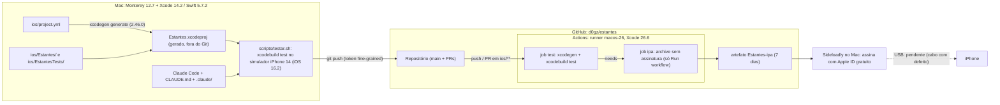
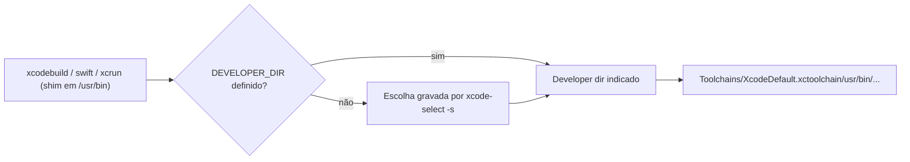
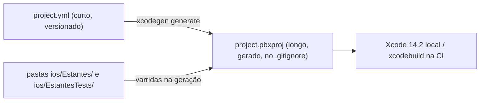
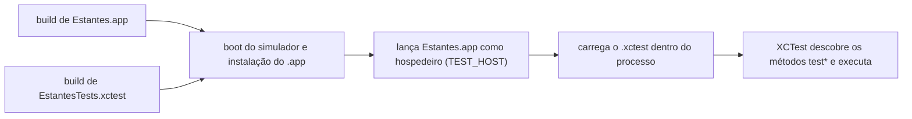
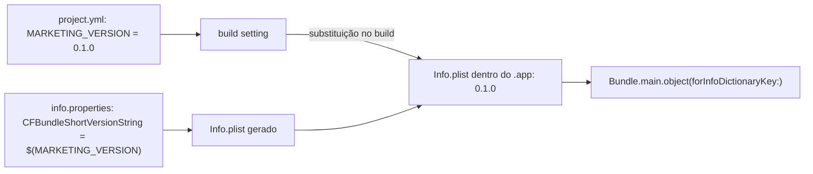
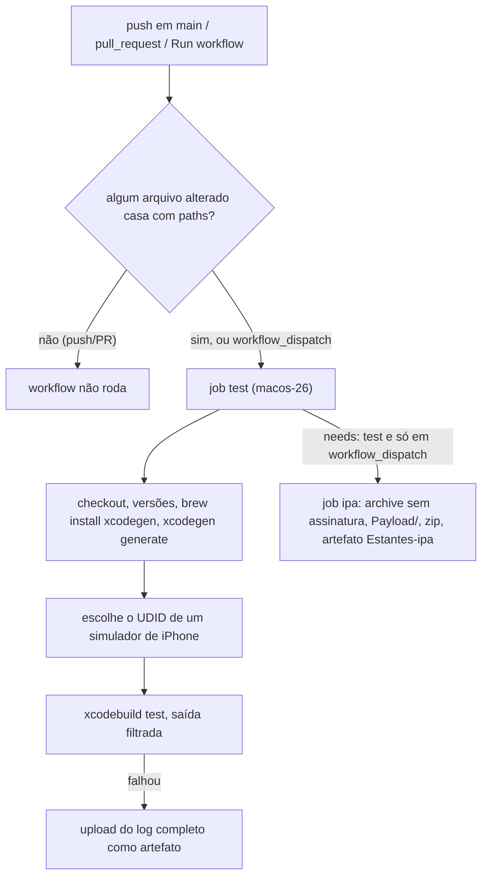
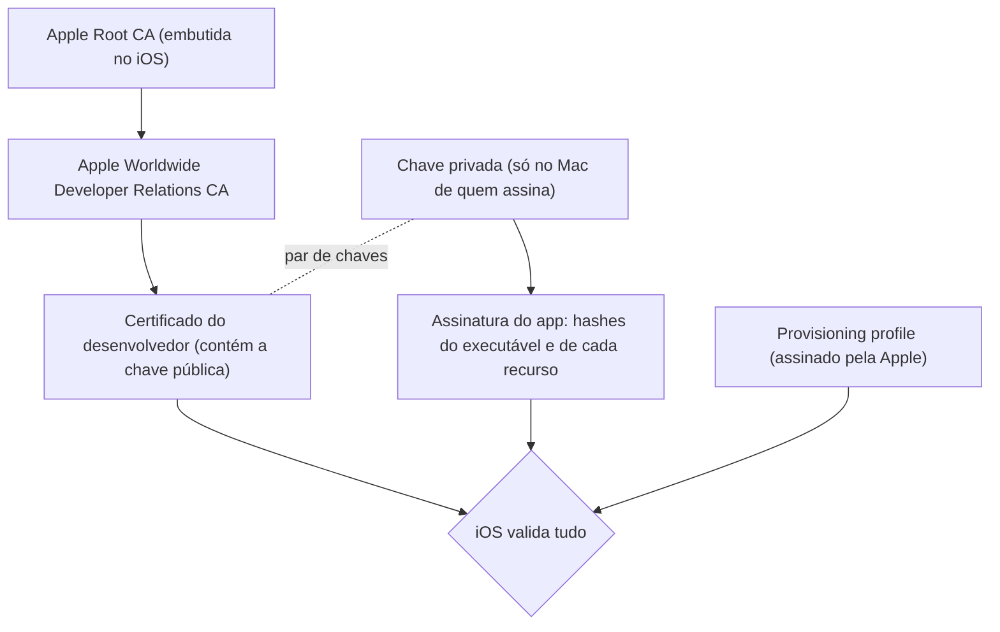
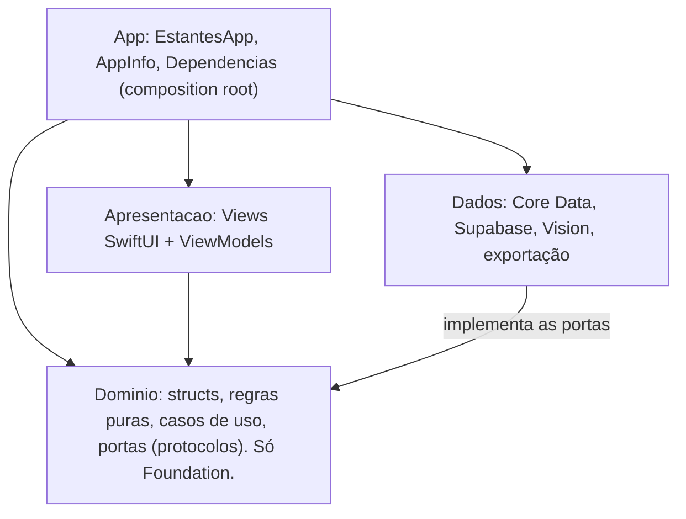

# Guia da Fase 0 — Ambiente

> Guia consolidado a partir de `docs/aprendizado/fase-0.md` (tarefas 0.1 a 0.11), de
> `docs/PLANO.md` e do código do repositório em 03/10/2026. Foi escrito para ser relido sem o
> código aberto: os trechos citados são cópias do que está no repositório.

## 1. Resumo

A Fase 0 não entregou funcionalidade: ela montou **a esteira por onde todo o resto vai passar**.
Um MacBook Pro 2015 preso ao macOS Monterey passou a compilar para iOS 16 com o Xcode 14.2
(Swift 5.7.2, SDK iOS 16.2). O projeto Xcode deixou de ser um arquivo editado à mão e passou a ser
**gerado** pelo XcodeGen 2.46.0 a partir de `ios/project.yml`. O código foi para o Git e o GitHub
(depois de dois tropeços: pastas ocultas que o upload pelo site deixou de fora e um repositório
aninhado em `ios/`). Uma CI no GitHub Actions (`macos-26`, Xcode 26.6) passou a testar cada PR e a
gerar, sob demanda, um `.ipa` sem assinatura para o Sideloadly. A arquitetura **MVVM em camadas**
ficou decidida e materializada em pastas antes da primeira linha de regra de negócio. Por fim, o
fluxo com o Claude Code ganhou um script de testes que filtra o ruído do `xcodebuild` e regras para
economizar contexto. O que se aprendeu atravessa quatro áreas: como a Apple compila e assina apps,
como o Git guarda dados, como uma CI decide o que rodar, e como uma arquitetura protege o código
de detalhes de plataforma.

**Pendência aberta:** o app ainda **não foi instalado no iPhone**. O Sideloadly está instalado, mas
o cabo USB usado estava com defeito. É preciso refazer a instalação com outro cabo (ver seção 6).

## 2. Mapa da fase



As setas sólidas já funcionam; a tracejada é a pendência. Repare que o Mac e a CI fazem o
**mesmo** trabalho (gerar o projeto e testar), cada um com um Xcode diferente: é isso que garante
que o código compila nos dois.

## 3. Conceitos, do geral ao específico

### 3.1 Como a Apple transforma código em app: toolchain, SDK e deployment target

Três coisas costumam ser confundidas sob o nome "versão do Xcode":

| Conceito | O que é | Neste projeto |
| --- | --- | --- |
| **Toolchain** | Os programas: compilador (`swiftc`, `swift-frontend`, clang), linker, depurador | Swift 5.7.2 (Xcode 14.2) no Mac; Swift 6.x (Xcode 26.6) na CI |
| **SDK** | As interfaces dos frameworks (UIKit, SwiftUI, CoreData, Vision) de uma versão do sistema: arquivos `.swiftinterface` e `.tbd` | iPhoneOS 16.2 SDK no Mac |
| **Deployment target** | A versão mínima do iOS em que o app promete rodar; fica gravada no binário (`LC_BUILD_VERSION`, campo `minos`) | iOS 16.0 (`project.yml`) |

Compilar é: o toolchain lê o código e, a cada `import SwiftUI`, consulta o **SDK** para saber
que tipos existem. O deployment target decide quais APIs são "garantidas": usar uma API do iOS 17
com target 16 é erro de disponibilidade, a menos que se proteja com `if #available(iOS 17, *)`.

**Por que o Xcode 13.2.1 não servia.** Ele traz o SDK do iOS 15. O deployment target não pode
passar do SDK, e `NavigationStack` (iOS 16), usado em `ContentView.swift`, simplesmente não existe
para ele. O Swift 5.7 e o SDK do iOS 16 vêm juntos no Xcode 14; o 14.2 é a última versão que roda
no Monterey.

**Modo de linguagem não é versão do compilador.** `SWIFT_VERSION = 5.0` no `project.yml` vira
`-swift-version 5`: diz ao compilador *qual dialeto* aceitar. O compilador do Xcode 26 é Swift 6,
mas em modo 5 não impõe a checagem estrita de concorrência do modo 6; o compilador 5.7 do Mac
também aceita o modo 5. Assim o mesmo código serve aos dois. Mas o modo de linguagem **não dá ao
compilador antigo recursos que ele não tem**: se o código usar uma macro, o 5.7 falha de qualquer
jeito. Daí a lista de proibições do projeto, que tem dois motivos independentes:

| Recurso proibido | Motivo de ferramenta (compilador/Xcode) | Motivo de plataforma (runtime) |
| --- | --- | --- |
| Macros em geral, `#Preview` | Macros chegaram no Swift 5.9 / Xcode 15 | — |
| `@Observable` | É uma macro (Swift 5.9) | Framework Observation exige iOS 17 |
| SwiftData (`@Model`) | É macro | Exige iOS 17 |
| Swift Testing (`import Testing`, `@Test`) | Chegou com o Xcode 16 e usa macros | — |

> Correção em relação ao log: a entrada 0.1 agrupa o Swift Testing com o Swift 5.9 / Xcode 15.
> Ele foi lançado com o **Xcode 16** (como diz o comentário em `AppInfoTests.swift` e a entrada 0.3).

**Como o terminal escolhe um Xcode.** `xcodebuild`, `swift`, `xcrun` e outros em `/usr/bin` são
*shims*: binários pequenos que só descobrem qual Xcode está ativo e repassam a chamada.



`sudo xcode-select -s /Applications/Xcode.app/Contents/Developer` muda a escolha para a máquina
toda (por isso exige `sudo`); `DEVELOPER_DIR=... comando` muda só para aquele processo. Para
conferir: `xcode-select -p`, `xcodebuild -version`, `swift --version`. O log cita
`/var/db/xcode_select_link` como local da escolha; os detalhes exatos estão em `man xcode-select`.

### 3.2 O projeto como artefato gerado: XcodeGen e o `project.pbxproj`

Um `.xcodeproj` é uma pasta cujo coração é o `project.pbxproj`: um texto em formato de property
list antigo, com uma lista de objetos identificados por IDs hexadecimais de 24 caracteres
(`PBXFileReference`, `PBXGroup`, `PBXNativeTarget`, `PBXSourcesBuildPhase`,
`XCBuildConfiguration`) que se referenciam por ID. Cada `.swift` aparece em vários lugares: como
referência de arquivo, como filho de um grupo e como item da fase "Compile Sources".

**Por que isso gera conflito de merge.** Dois branches que adicionam um arquivo cada editam as
mesmas regiões do arquivo (lista de referências, grupo-pai, fase de compilação). O Git faz merge
por linhas, e linhas vizinhas editadas dos dois lados conflitam. Resolver exige entender IDs sem
significado, e um erro produz um projeto que o Xcode recusa abrir.

**A solução adotada:** tratar o `.xcodeproj` como `.o` ou `.class`, um derivado reproduzível.



Consequências práticas:

- A fonte da verdade sobre *quais arquivos existem* é o sistema de arquivos (`sources: - path: Estantes`).
  Criar `Dominio/Estante.swift` é só criar o arquivo, e por isso o Claude Code consegue fazê-lo sem
  conhecer o formato do `pbxproj`.
- O `pbxproj` é um **instantâneo**: o XcodeGen não observa o disco. Arquivo criado sem regenerar
  não entra no target (sintoma: "Cannot find 'X' in scope"); arquivo apagado sem regenerar vira
  referência vermelha.
- **Grupos do Xcode × pastas.** No Xcode clássico, grupos são só organização visual e podem
  divergir do disco. O XcodeGen gera os grupos a partir das pastas, então os dois sempre coincidem.

**`projectFormat` e `objectVersion`.** O cabeçalho do `pbxproj` declara `objectVersion`, a versão
do *esquema* do arquivo. Formatos são compatíveis num sentido só: o Xcode novo lê o antigo, o
antigo recusa o novo. `projectFormat: xcode14_0` fixa a saída no formato do Xcode 14; o projeto
gerado aqui traz `objectVersion = 56` (conferido). Essa opção existe a partir do XcodeGen 2.45, por
isso a versão 2.46.0 importa. (O log menciona, sem conferir, que Xcode 15 e 16 usariam 60 e 77.)

**Build phases.** "Compile Sources" passa arquivos ao compilador; "Copy Bundle Resources" copia
arquivos byte a byte para dentro do `.app`. Um arquivo que cai por engano em Resources viaja dentro
do `.ipa` (que é só um zip) e pode ser lido por qualquer um. Na tarefa 0.8 foi conferido que os
`.gitkeep` não entraram em Resources (0 ocorrências de `gitkeep in Resources` no `pbxproj`).

**Bottle × compilar do código-fonte.** O Homebrew instala uma fórmula baixando um *bottle*
(binário pré-compilado para um par macOS/arquitetura) ou, se não houver bottle, compilando do
código-fonte. O Homebrew só gera bottles para os macOS que ainda suporta; o macOS 12 está no nível
de suporte mais baixo (Tier 3, segundo o registro em `docs/PLANO.md`). Sem bottle, compilar exige
um toolchain mais novo do que o Monterey consegue ter. O binário pronto do release do XcodeGen
funciona porque o mantenedor já o compilou com um deployment target baixo o bastante para rodar
no macOS 12. Na CI (macOS 26) o bottle existe e `brew install xcodegen` é uma linha.

### 3.3 Executar e testar: simulador, `xcodebuild test` e o Info.plist

**Simulador não é emulador.** Um emulador interpreta instruções de outra CPU. O simulador do
Xcode compila o app para a CPU do próprio Mac (x86_64 neste MacBook) e o roda como processo nativo,
ligado a uma versão "simulada" dos frameworks do iOS (o runtime iOS 16.2).

| | Simulador | iPhone |
| --- | --- | --- |
| Destino de build | `iphonesimulator` | `iphoneos` |
| Arquitetura | a do Mac (x86_64 aqui) | arm64 |
| Assinatura | não exige | exige |
| Câmera | não existe | existe |

A ausência de câmera tem consequência de arquitetura para as fases de Vision: o código de leitura
deve receber **uma imagem** (`CGImage`/`Data`), não a câmera, para ser testável no simulador com
imagens de arquivo ou do `PhotosPicker`.

**O que `xcodebuild test` faz por dentro.**



O `.xctest` é um bundle carregado **dentro** do processo do app. Por isso `Bundle.main`, no teste,
é o `Estantes.app`, e `AppInfo.versao` funciona. O XcodeGen gera essa ligação a partir de
`dependencies: - target: Estantes` (conferido no `pbxproj`:
`TEST_HOST = "$(BUILT_PRODUCTS_DIR)/Estantes.app/Estantes"` e `BUNDLE_LOADER = "$(TEST_HOST)"`).

**`@testable import`.** O nível de acesso padrão do Swift é `internal` (visível só no módulo).
`AppInfo` é `internal` ao módulo `Estantes`, e os testes são outro módulo. `@testable import
Estantes` abre os símbolos `internal`, mas só se o módulo foi compilado com testabilidade
(`ENABLE_TESTABILITY`, ligado por padrão em Debug). Não abre `private` nem `fileprivate`.

**Info.plist e a cadeia da versão.** O Info.plist traz metadados que o sistema lê antes de
executar o código (nome, identificador, versão, textos de permissão como `NSCameraUsageDescription`;
sem esse texto, acessar a câmera derruba o app).



`CFBundleShortVersionString` é a versão de marketing (0.1.0); `CFBundleVersion` é o número do
build (1). Ambos vêm do `project.yml`: um só lugar para mudar.

### 3.4 Git por dentro

**Três lugares e três objetos.** O Git trabalha com **HEAD** (último commit da branch), **índice**
(o que irá no próximo commit) e **diretório de trabalho** (arquivos no disco). No banco de objetos
há *blobs* (conteúdo de arquivo), *trees* (listas `modo nome -> hash`) e *commits* (apontam para uma
tree raiz). Três consequências apareceram nesta fase:

1. **Pastas vazias não existem para o Git.** O índice é uma lista de *arquivos*; trees são
   derivadas dos caminhos. Uma pasta sem arquivo não gera entrada. O `.gitkeep` é só uma convenção
   (um arquivo vazio de nome arbitrário), não um recurso do Git. Todos os blobs vazios têm o mesmo
   hash, então os 15 `.gitkeep` do projeto ocupam um único objeto.
2. **Renomeações não são gravadas.** `git mv a b` equivale a `mv` + `git rm` + `git add`. Cada
   commit é um snapshot completo; o Git *infere* renomeações ao exibir o histórico, comparando
   arquivos removidos e adicionados (idênticos, ou com similaridade acima de 50% por padrão,
   ajustável com `-M<n>%`).
3. **`reset` move ponteiros**, e o modo decide até onde a mudança se propaga:

| Modo | Move HEAD/branch | Atualiza o índice | Atualiza os arquivos |
| --- | --- | --- | --- |
| `--soft` | sim | não | não |
| `--mixed` (padrão) | sim | sim | não |
| `--hard` | sim | sim | sim (descarta mudanças locais) |

`fetch` baixa objetos e atualiza `origin/main` sem tocar em branch local, índice ou arquivos; é
sempre seguro. `pull` = `fetch` + merge (ou rebase), e mexe nos arquivos.

**Como o Git acha o repositório.** Ele sobe do diretório atual pelos pais até achar uma pasta
`.git`; a primeira vence. Um `.git` dentro de `ios/` "sequestra" todos os comandos rodados ali.
Visto da raiz, `ios/` vira um único item de modo `160000` (um *gitlink*, que aponta para um commit
de outro repositório) e o conteúdo não é guardado. Um submódulo usa o mesmo mecanismo, porém
declarado num `.gitmodules` com a URL; um repositório embutido por acidente não tem isso, e quem
clonar vê uma pasta vazia. Diagnóstico: `git rev-parse --show-toplevel` (qual raiz está em uso) e
`ls -a ios/` (o `.git` sobrando).

**Arquivos ocultos.** No Unix, "oculto" é só convenção: nome começando com `.` é pulado por `ls` e
por globs como `*`. Quem esconde é o programa. `git add` e `git push` não fazem distinção, mas um
upload por arrastar no navegador pode filtrar essas pastas (a causa exata varia; o ponto é que o
upload web não é confiável para elas). Pastas como `.github/` e `.claude/` são lidas em caminhos
fixos: sem `.github/workflows/` no remoto, a CI simplesmente **não existe**, sem erro algum.

**Como o `.gitignore` decide.** As regras são lidas em ordem e **a última que casa vence**. Uma
regra `!` só tem efeito se algo antes ignorou o caminho. Se uma *pasta* está ignorada, o Git nem
entra nela, então `!pasta/arquivo` não funciona; o certo é ignorar `pasta/*` e então negar.
`git check-ignore -v caminho` mostra qual regra decidiu. Arquivos já rastreados não são afetados
(é preciso `git rm --cached`). A tarefa 0.11 removeu `!data/livros_lexml.csv.gz`, uma negação sem
efeito porque nenhuma regra anterior ignorava `.gz`.

### 3.5 Integração contínua no GitHub Actions

**Runner hospedado** é uma VM efêmera criada para cada job e destruída no fim. `runs-on: macos-26`
pede macOS 26 com Xcode 26 (na execução conferida, Xcode 26.6, build 17F113). Como a máquina nasce
limpa, tudo é instalado a cada execução, e o que precisa sobreviver vira **artefato**.



Peças do `ios.yml` e o motivo de cada uma:

- **`paths`** (`ios/**` e o próprio `ios.yml`, tanto em `push` quanto em `pull_request`): mudanças
  só em `docs/` ou `supabase/` não gastam minutos de macOS. `paths` não se aplica a
  `workflow_dispatch`, que não tem arquivos alterados: o disparo manual sempre roda.
  (Correção ao log: a entrada 0.5 diz "qualquer PR"; o filtro `paths` vale para PRs também.)
- **`concurrency`** com `cancel-in-progress: true`: um push novo no mesmo ref cancela a execução
  anterior, que já está obsoleta.
- **`defaults.run.working-directory: ios`**: todos os `run` partem de onde está o `project.yml`.
- **`xcodegen generate` na CI**: como o `.xcodeproj` não é versionado, a CI o gera igual ao Mac.
- **Dois jobs**: `test` dá feedback rápido em cada PR; `ipa` tem `needs: test` (só empacota código
  testado) e `if: github.event_name == 'workflow_dispatch'` (só sob demanda, pois minutos de macOS
  custam mais). Num PR, o `ipa` aparece como *skipped*, o que não é falha.
- **Retenção de 7 dias** no artefato: coincide com a validade do app assinado com Apple ID gratuito.

**Actions JavaScript e o runtime embutido.** Uma action como `actions/checkout` declara no seu
`action.yml` algo como `runs.using: node24` e `main: dist/index.js`. O runner executa esse código
com o **Node embutido no próprio runner**, não com um Node instalado no sistema. Quando o GitHub
aposenta um runtime (Node 20), a action precisa de uma versão nova, e trocar o runtime pode quebrar
consumidores; pelo versionamento semântico, isso é *major*. Daí o salto `@v4` → `@v7` em
`checkout` e `upload-artifact` (ambas v7.0.1, `node24`, conferido no `action.yml` da tag).

**Tag móvel × SHA fixo.** `@v7` é uma tag que o mantenedor move a cada release 7.x: recebe
correções sem esforço, mas confia no mantenedor. `@<sha de 40 caracteres>` aponta para um commit
imutável, a defesa contra ataque de cadeia de suprimentos (em março de 2025, a action de terceiros
`tj-actions/changed-files` teve as tags reescritas, CVE-2025-30066). O custo do SHA é manutenção,
que o Dependabot reduz. Para actions oficiais `actions/*`, a tag foi considerada suficiente por ora.

**Credenciais: token fine-grained.** Desde agosto de 2021 o GitHub não aceita a senha da conta em
Git por HTTPS. Um *personal access token fine-grained* limita repositórios e permissões e tem
expiração obrigatória: é o **princípio do menor privilégio**. Aqui: só `d0gz/estantes`, com
"Contents: read/write" e "Workflows: write". "Workflows" é separado porque um workflow é código
que roda com acesso aos *secrets* do repositório; sem essa separação, um token "só de código"
poderia adicionar um workflow que vaza os secrets. O token fica no Keychain do macOS através do
*credential helper* `osxkeychain`, nunca no repositório.

### 3.6 Assinatura de código e distribuição

**Por que o iOS só executa código assinado.** Antes de executar páginas de código de um app, o
iOS confere uma assinatura feita por uma identidade que a Apple reconhece. Isso dá
**autenticidade** (quem assinou) e **integridade** (nada mudou depois).



- O **certificado** diz *quem* assinou. A **chave privada** é o que permite assinar; nunca sai da
  máquina. O **provisioning profile** (`embedded.mobileprovision`) diz *o que pode rodar onde*:
  App ID (bundle id), certificados aceitos, UDIDs dos aparelhos, entitlements e validade.
- Dentro do `.app`, o executável carrega hashes de cada página de código, e
  `_CodeSignature/CodeResources` guarda o hash de cada arquivo. Mudar um byte invalida a assinatura.
- Com **Apple ID gratuito** o perfil vale **7 dias** e as capacidades são limitadas; o Developer
  Program (US$ 99/ano) dá 1 ano, TestFlight e App Store. Os limites exatos da conta gratuita
  (apps ativos, App IDs por semana) mudam com o tempo e não foram conferidos.

**Separar build de assinatura.** A CI gera o `.ipa` com `CODE_SIGNING_ALLOWED=NO`,
`CODE_SIGNING_REQUIRED=NO` e `CODE_SIGN_IDENTITY=""`. Assinar na CI exigiria guardar certificado,
chave privada (`.p12`) e perfil como secrets num runner de terceiros. Sem assinatura, a CI não tem
segredo algum. Um `.ipa` é só um zip com `Payload/Estantes.app`, e é exatamente o que o passo
"Empacotar o .ipa" monta à mão.

**O que o Sideloadly faz.** Com o Apple ID do Ricardo, registra o UDID do iPhone, obtém
certificado e perfil de desenvolvimento, **re-assina** o `.app` e o instala por USB. No iPhone é
preciso confiar no perfil (Ajustes → Geral → VPN e Gerenciamento de Dispositivos) e, a partir do
iOS 16, ativar o **Modo de Desenvolvedor**. Ao re-assinar depois de 7 dias, manter o mesmo bundle
id preserva os dados; se ele mudar, o sandbox (com o banco Core Data) é outro. Esse é um dos
motivos da exportação/importação em JSON planejada para a Fase 2.

### 3.7 Arquitetura: MVVM em camadas

**Por que não MVC.** No UIKit, o `UIViewController` é dono da view, recebe o ciclo de vida, é
`delegate` de tabelas, chama a rede e navega. Tudo converge para ele, e o resultado conhecido é o
*Massive View Controller*: milhares de linhas, difícil de testar. No SwiftUI a view é uma struct
cujo `body` é função do estado (`UI = f(estado)`): não há objeto de view para um controller
manipular. O que sobra é a pergunta "onde mora o estado da tela e a lógica que o muda?", e a
resposta é o **ViewModel**.

**Binding no SwiftUI (sem macros).** O ViewModel é um `ObservableObject`. Cada propriedade
`@Published`, antes de gravar o novo valor, chama `objectWillChange.send()`. A view inscrita
(`@StateObject` para o dono, `@ObservedObject` para quem recebe) invalida o `body` e o SwiftUI o
reavalia. O aviso é **por objeto**, não por propriedade, por isso um ViewModel por tela. `@MainActor`
garante que as mutações aconteçam na thread principal.

**Camadas e regra de dependência.**



As setas são de **código-fonte** (quem importa/nomeia quem) e todas apontam para o Domínio, que
não conhece ninguém. Em execução, porém, um caso de uso *chama* o Core Data para salvar. Isso é
possível pela **inversão de dependência** (o "D" do SOLID): o Domínio declara o que precisa como
protocolo (uma "porta") e a camada de Dados o implementa (um "adaptador"). É a ideia de *Ports and
Adapters* (arquitetura hexagonal, Alistair Cockburn). Exemplo ilustrativo do log, **ainda não
existe no repositório**:

```swift
// Dominio/Portas/BibliotecaRepositorio.swift (só Foundation)
protocol BibliotecaRepositorio {
    func estantes() async throws -> [Estante]
    func salvar(_ livro: Livro, em estanteID: UUID) async throws
}
// Dados/Persistencia/BibliotecaRepositorioCoreData.swift implementa o protocolo;
// nos testes, uma BibliotecaFalsa em memória implementa o mesmo protocolo.
```

**Structs no domínio, `NSManagedObject` confinado.** Struct é tipo de valor: cópias independentes,
sem mutação à distância, segura entre threads, com `Equatable`/`Codable` sintetizados. Um
`NSManagedObject` é uma classe presa a um `NSManagedObjectContext`: só pode ser tocado na fila do
contexto, e usa *faulting* (atributos carregados sob demanda; após o contexto sumir, o acesso pode
falhar). A conversão entre os dois acontece **num único ponto**, `BibliotecaRepositorioCoreData`,
e por isso não se usa `@FetchRequest` (que só funciona dentro de uma View e a prenderia ao Core
Data). O custo aceito: o ViewModel recarrega o estado após cada alteração.

**Injeção pelo `init` × singleton.** Um singleton (`Banco.shared`) é estado global: a dependência
fica escondida, a ordem de inicialização surpreende e um teste contamina o próximo. Com injeção pelo
`init`, a dependência aparece na assinatura e cada teste monta seu mundo. A montagem real fica num
lugar só, `App/Dependencias` (a *composition root*).

**Caso de uso só onde há orquestração real** (`IdentificarLivro`, `ExportarBiblioteca`,
`ImportarBiblioteca`): ações triviais vão do ViewModel direto ao repositório, para não criar
classes que só repassam chamadas.

### 3.8 Trabalhar com um agente: contexto, filtros e documentação viva

**Janela de contexto.** Um LLM recebe, a cada resposta, todo o contexto de novo (instruções,
conversa, saídas de ferramentas). O volume custa dinheiro e atenção: milhares de linhas do
`xcodebuild` diluem o único `error:` que importa. Regra: o que entra no contexto deve ser
informação, não volume. Quando o contexto enche, ele é **compactado** (resumido); a seção
"Compact instructions" do `CLAUDE.md` diz o que preservar.

**O script como filtro** (`scripts/testar.sh`): "ruído para o arquivo, sinal para a tela", e o
código de saída preservado. Detalhes de shell que ele usa:

- `> "$LOG" 2>&1`: stdout para o arquivo e, *depois*, stderr para onde o stdout aponta (a ordem
  inversa mandaria o stderr ao terminal).
- `STATUS=$?` logo após o comando: qualquer comando seguinte sobrescreve `$?`.
- `${DESTINO:-"padrão"}`: usa a variável de ambiente se existir e não for vazia.
- `cd "$(dirname "$0")/../ios" || exit 1`: caminho relativo ao script, não a quem o chamou.
- `awk '!visto[$0]++'`: deduplicação em uma passada, O(n), mantendo a ordem (`sort | uniq`
  reordena; `uniq` sozinho só remove repetições adjacentes).
- `head -80`: teto de segurança.

**Defesa em profundidade.** `.claude/settings.json` nega à ferramenta `Read` os arquivos grandes de
`data/` e o `Estantes.xcodeproj`. Não é um cofre (um `cat` via Bash segue outras regras), e por isso
se combina com a instrução no `CLAUDE.md` e com o script: barreiras imperfeitas e independentes.
O fato de o modo automático ter impedido o agente de editar `.claude/settings.json` e `CLAUDE.md`
é o comportamento correto: quem define os limites do agente não deve ser o próprio agente.

**Documentação como fonte da verdade.** O `CLAUDE.md` entra em toda sessão e é obedecido como
instrução: uma instrução desatualizada vira comportamento errado, em silêncio (ex.: "o Claude Code
não roda Xcode nesta máquina", corrigido na 0.11). Daí três práticas: docs mudam no mesmo PR que a
mudança que descrevem; documentos apontam para a fonte única (o `CLAUDE.md` manda rodar
`./scripts/testar.sh` em vez de copiar o comando, DRY); e nomes batem com o código
(`PilhaCoreData` virou `PersistenceController`). O "Histórico de decisões" do PLANO é um
*Architecture Decision Record* leve (Michael Nygard): o código mostra o quê; só o texto guarda o
porquê e o que foi descartado.

## 4. Decisões de arquitetura

| Decisão | Alternativas | Motivo |
| --- | --- | --- |
| Monterey + Xcode 14.2 no Mac; Xcode 26 na CI | OCLP + Sequoia + Xcode 26 no Mac (plano B); continuar no Xcode 13.2.1 com target iOS 15; desenvolver só pela CI | Não mexer no macOS de um hardware 2015; o 14.2 é o teto do Monterey e tem SDK iOS 16; a Apple exige SDK atual para envio, verificado pela CI |
| iOS 16 mínimo, `SWIFT_VERSION = 5.0`, lista de recursos proibidos | Exigir iOS 17 / usar macros | O Xcode 14.2 é o menor denominador comum e dita o que se pode usar |
| Core Data | SwiftData | SwiftData exige iOS 17 e Xcode 15 |
| XcodeGen (`projectFormat: xcode14_0`), `.xcodeproj` fora do Git | Commitar o `.xcodeproj`; Tuist; SwiftPM puro | Sem conflitos no `pbxproj`; arquivos novos entram sozinhos; formato que o Xcode 14.2 abre |
| XcodeGen 2.46.0 por binário pronto no Mac; `brew` na CI | `brew`/Mint no Mac (compilam do fonte e falham no macOS 12) | Único caminho que funciona no Monterey; `projectFormat: xcode14_0` exige ≥ 2.45 |
| XCTest | Swift Testing | Swift Testing não existe no Xcode 14.2 |
| Token fine-grained de um repositório (Contents + Workflows) | Token clássico `repo`+`workflow`; SSH; `gh auth login` | Menor privilégio; HTTPS + token é o mais simples para começar e expõe o mecanismo |
| CI: job `test` em push/PR com `paths`; job `ipa` só em `workflow_dispatch` com `needs: test` | Gerar `.ipa` a cada push; testar sem filtro | Minutos de macOS são caros; só se empacota código testado |
| `.ipa` sem assinatura na CI, assinado pelo Sideloadly | Assinar na CI com `.p12` e perfil como secrets | Zero segredos de assinatura num runner de terceiros |
| Sideloadly com Apple ID gratuito (7 dias) | Developer Program (US$ 99/ano); Xcode direto no iPhone; AltStore | Custo zero; independe da versão do Xcode local |
| Actions `@v7` (Node 24), por tag | Fixar por SHA; ignorar o aviso; forçar Node 24 por variável | Node 20 será desligado; actions oficiais; SHA só compensa com rotina (Dependabot) |
| MVVM em camadas, structs no domínio, nomes em português | MVC; Clean "de livro"; `NSManagedObject` nas telas com `@FetchRequest` | Algoritmos testáveis sem simulador; telas independentes do Core Data; pouca cerimônia para duas entidades |
| Injeção pelo `init`, montagem em `App/Dependencias` | Singletons | Dependências explícitas e testes isolados |
| Pastas das camadas criadas já, com `.gitkeep` | Criar pastas só quando houver arquivo | O mapa das camadas fica visível desde o início |
| `scripts/testar.sh` antes de cada commit, Claude Code no Mac | Rodar `xcodebuild` cru; `xcpretty`/`xcbeautify`; testar só pela CI | Testa no Xcode 14.2 antes da CI; saída curta; sem dependências extras |
| Guias de fase só em Markdown com Mermaid | PDF via Pandoc + Typst | O Homebrew no macOS 12 (Tier 3) compilaria GHC/LLVM/Rust do fonte; o GitHub já renderiza `.md` e Mermaid |

## 5. Padrões usados

### 5.1 Fonte única e declarativa (infraestrutura como código)

O projeto inteiro cabe num YAML revisável; o `.xcodeproj` é derivado. Trecho de `ios/project.yml`:

```yaml
options:
  bundleIdPrefix: com.ricardo
  deploymentTarget:
    iOS: "16.0"
  # Formato que o Xcode 14.2 (seu Mac) consegue abrir; o Xcode 26 da CI também abre.
  projectFormat: xcode14_0
  createIntermediateGroups: true

settings:
  base:
    SWIFT_VERSION: "5.0"
    MARKETING_VERSION: "0.1.0"
    CURRENT_PROJECT_VERSION: "1"
```

O mesmo princípio aparece na versão do app (um só `MARKETING_VERSION`) e no workflow (o pipeline
vive versionado no repositório).

### 5.2 Compatibilidade por mínimo denominador comum

Usar só o que os dois Xcodes entendem, e deixar o motivo escrito no próprio código.
`ios/Estantes/Apresentacao/Inicio/ContentView.swift`:

```swift
// PreviewProvider em vez de #Preview: a macro #Preview só existe a partir do Xcode 15.
struct ContentView_Previews: PreviewProvider {
    static var previews: some View {
        ContentView()
    }
}
```

`NavigationStack`, no mesmo arquivo, é iOS 16: exatamente o limite do deployment target.

### 5.3 Teste de fumaça (smoke test)

Um teste trivial que valida a infraestrutura (o target de teste compila, carrega no hospedeiro, lê
o Info.plist gerado) antes de existir lógica. `ios/EstantesTests/App/AppInfoTests.swift`:

```swift
import XCTest
@testable import Estantes

/// Teste mínimo da Fase 0: prova que a CI compila, roda o simulador e executa testes.
/// XCTest em vez de Swift Testing: o Swift Testing só existe a partir do Xcode 16.
final class AppInfoTests: XCTestCase {
    func testVersaoDoAppEstaDefinida() {
        XCTAssertFalse(AppInfo.versao.isEmpty)
    }
}
```

Limite conhecido: a asserção também passaria com `"$(MARKETING_VERSION)"` não expandido ou com o
fallback `"?"`. Ver seção 6.

### 5.4 Detalhe de plataforma fora do domínio

Ler o `Bundle` é infraestrutura, não regra de negócio; por isso `AppInfo` mora em `App/`, e o
comentário registra o motivo. `ios/Estantes/App/AppInfo.swift`:

```swift
/// Informações do app lidas do Info.plist.
/// Fica em App/ e não no Dominio/: ler o bundle é detalhe de montagem do app, não regra de negócio.
enum AppInfo {
    static var versao: String {
        Bundle.main.object(forInfoDictionaryKey: "CFBundleShortVersionString") as? String ?? "?"
    }
}
```

Um `enum` sem casos serve de *namespace*: não pode ser instanciado por engano.

### 5.5 Composition root (preparada, ainda não implementada)

O ponto de entrada já descreve onde a montagem vai acontecer e, de propósito, **não** sugere o
atalho do template da Apple. `ios/Estantes/App/EstantesApp.swift`:

```swift
/// Ponto de entrada do app.
/// Fase 2: `App/Dependencias` monta PersistenceController → BibliotecaRepositorioCoreData → ViewModels,
/// injetados pelo init (sem `.environment(\.managedObjectContext)` nem `@FetchRequest`; ver docs/PLANO.md).
@main
struct EstantesApp: App {
    var body: some Scene {
        WindowGroup {
            ContentView()
        }
    }
}
```

Trocar este comentário (antes, ele sugeria `.environment(\.managedObjectContext)`) foi tratado como
decisão de arquitetura: um comentário errado é um convite a desviar da regra.

### 5.6 Sinal para a tela, ruído para o arquivo, código de saída preservado

`scripts/testar.sh`:

```bash
xcodebuild test \
  -project Estantes.xcodeproj \
  -scheme Estantes \
  -destination "$DESTINO" \
  CODE_SIGNING_ALLOWED=NO > "$LOG" 2>&1
STATUS=$?

# Só as linhas úteis, sem repetição, no máximo 80.
grep -E "error:|Test Case .* failed|TEST (SUCCEEDED|FAILED)|Executed [0-9]+ test|BUILD FAILED" "$LOG" \
  | awk '!visto[$0]++' | head -80

if [ $STATUS -ne 0 ]; then
  echo "Falhou (código $STATUS). Log completo: $LOG"
fi
exit $STATUS
```

O texto é para humanos; o código de saída é a verdade para máquinas (CI, `&&`, o agente). A mesma
ideia aparece no `ios.yml` com `&& STATUS=0 || STATUS=$?` e, no job `ipa`, com `set -o pipefail`
antes de `| tail -n 30`.

### 5.7 Pipeline econômico: gatilho filtrado, cancelamento e dependência entre jobs

`.github/workflows/ios.yml` (trechos):

```yaml
on:
  push:
    branches: [main]
    paths:
      - "ios/**"
      - ".github/workflows/ios.yml"
  pull_request:
    paths:
      - "ios/**"
      - ".github/workflows/ios.yml"
  workflow_dispatch:

concurrency:
  group: ios-${{ github.ref }}
  cancel-in-progress: true
```

```yaml
  ipa:
    name: Gerar .ipa sem assinatura
    needs: test
    if: github.event_name == 'workflow_dispatch'
```

E o log só sobe quando algo quebra:

```yaml
      - name: Guardar o log se falhar
        if: failure()
        uses: actions/upload-artifact@v7
```

### 5.8 Descobrir em vez de fixar

Em vez de fixar "iPhone 16", a CI pergunta ao runner quais simuladores existem
(`.github/workflows/ios.yml`):

```python
devices = json.load(sys.stdin)["devices"]
for runtime, lista in sorted(devices.items(), reverse=True):
    if "iOS" in runtime:
        for d in lista:
            if d["name"].startswith("iPhone"):
                print(d["udid"]); sys.exit(0)
```

Sobrevive à troca de imagem do runner. Limite: a ordenação é por *string* (ver seção 6). No Mac, o
script local faz o oposto e fixa "iPhone 14", porque ali o ambiente é conhecido e estável.

## 6. Erros e aprendizados

O Ricardo optou por não responder às perguntas das entradas da Fase 0, então **não há respostas
nem correções registradas**; esta seção trata só dos erros reais que aconteceram na fase.

| # | O que deu errado | Causa | Correção | Lição |
| --- | --- | --- | --- | --- |
| 1 | O Xcode instalado (13.2.1) não servia | Traz o SDK do iOS 15; sem SDK iOS 16 não há `NavigationStack` nem simulador iOS 16 | Instalar o Xcode 14.2 e `sudo xcode-select -s .../Contents/Developer` | "Compila Swift" não basta: o que falta pode ser o SDK, não o compilador |
| 2 | `brew install xcodegen` falhou no macOS 12 | Sem bottle para o Monterey, o `brew` tenta compilar do fonte com um toolchain velho demais | Binário pronto do release 2.46.0 em `/usr/local/bin/xcodegen` | Em sistema sem suporte, prefira binários pré-compilados |
| 3 | O mesmo problema com `pandoc` e `typst` para gerar PDFs dos guias | Homebrew no macOS 12 é Tier 3; instalar exigiria compilar GHC (Haskell), LLVM e Rust | Guias só em Markdown + Mermaid, renderizados pelo GitHub | Antes de adicionar uma ferramenta, pergunte se a plataforma onde o resultado será lido já resolve |
| 4 | O upload por arrastar no site do GitHub deixou de fora `.github/` e `.claude/` | Pastas de nome iniciado por `.` podem ser filtradas no caminho navegador/sistema | Subir com `git add`/`push`, que não distinguem ocultos | Use o Git, não o site, para mais de um arquivo; uma CI ausente não dá erro, apenas não existe |
| 5 | Um `git init` em `ios/` criou um repositório aninhado | O Git usa o primeiro `.git` que encontra subindo pelos pais; da raiz, `ios/` viraria um gitlink vazio | Na raiz: `git init`, `remote add`, `fetch`, `git reset origin/main` (misto), `add` e commit do que faltava (`bcfc61a`); remover o `.git` de `ios/` | `git rev-parse --show-toplevel` antes de comandos que mudam estado. O `--mixed` alinhou branch e índice ao remoto sem tocar no disco; `--hard` teria apagado o que só existia localmente |
| 6 | `git log --follow` perdeu o histórico de `EstantesApp.swift` | O arquivo foi movido **e** editado no mesmo commit (`8c43381`); sendo minúsculo, a similaridade caiu abaixo de 50% e o Git viu "apagado + criado" | Nada se perdeu; só a inferência. Conferido: `--follow` mostra só `8c43381` para `EstantesApp.swift`, mas `8c43381` e `bcfc61a` para `ContentView.swift` | Faça o commit de **mover** separado do de **editar**; `git diff -M30%` testa limiares menores |
| 7 | A instalação no iPhone não aconteceu | Cabo USB com defeito: o Mac não fala com o aparelho | **Pendente** (abaixo) | Cabo só de carga ou defeituoso é a primeira suspeita quando o Sideloadly não vê o iPhone |
| 8 | Um PR que mudasse só o `ios.yml` não rodava a CI | O `push` listava o próprio workflow em `paths`, mas o `pull_request` não; a mudança só seria testada depois do merge | O `pull_request.paths` ganhou `.github/workflows/ios.yml` (tarefa 0.9, PR #2) | Mudança na CI precisa ser exercitada no próprio PR; mantenha os gatilhos simétricos |

Um erro latente também foi evitado na 0.9: o keepalive consultava `livros?select=id`, tabela que
não existirá. Com os secrets configurados na Fase 1, o `curl -f` falharia e o job que existe para
manter o Supabase vivo quebraria sozinho. Passou a consultar `lexml_livros?select=lexml_id`.

### Pendência: instalar no iPhone com outro cabo

1. Trocar o cabo (de preferência original ou certificado MFi, com linhas de dados) e tocar em
   "Confiar neste computador" no iPhone.
2. GitHub → Actions → **iOS** → **Run workflow**; baixar o artefato **Estantes-ipa** e descompactar.
3. No Sideloadly: arrastar o `.ipa`, entrar com o Apple ID, Start.
4. No iPhone: confiar no perfil (Ajustes → Geral → VPN e Gerenciamento de Dispositivos) e ativar o
   Modo de Desenvolvedor (Privacidade e Segurança; exige reiniciar).
5. Anotar a data: o app para de abrir em 7 dias e precisa ser re-assinado, com o mesmo bundle id.

### Limitações conhecidas (não são erros, mas merecem atenção)

- **Teste da versão fraco:** `XCTAssertFalse(AppInfo.versao.isEmpty)` passa com o literal
  `"$(MARKETING_VERSION)"` e com o fallback `"?"`.
- **XcodeGen local × CI:** o Mac usa 2.46.0 fixo; a CI instala a versão mais recente do `brew`.
  Uma versão futura pode gerar projetos diferentes nos dois ambientes.
- **Ordenação por string** na escolha do simulador: `"iOS-9"` viria antes de `"iOS-26"` em ordem
  decrescente. Hoje não há runtimes antigos no runner, então funciona.
- **Deny-list só vale para a ferramenta `Read`:** não impede um `cat` pelo Bash.

## 7. Glossário

| Termo | Definição |
| --- | --- |
| Toolchain | Conjunto de programas que compila e liga o código (compilador, linker, depurador). |
| SDK | Interfaces dos frameworks de uma versão do sistema, consultadas pelo compilador. |
| Deployment target | Versão mínima do sistema em que o app promete rodar. |
| Modo de linguagem (`SWIFT_VERSION`) | Dialeto do Swift que o compilador aplica; não é a versão do compilador. |
| `xcode-select` | Ferramenta que define qual Xcode os comandos de `/usr/bin` usam. |
| `DEVELOPER_DIR` | Variável que escolhe o Xcode só para um processo. |
| Macro (Swift) | Código que gera código em tempo de compilação; existe desde o Swift 5.9. |
| XcodeGen | Ferramenta que gera o `.xcodeproj` a partir de um YAML e das pastas. |
| `project.pbxproj` | Arquivo que descreve o projeto Xcode como um grafo de objetos com IDs. |
| `objectVersion` | Versão do esquema do `pbxproj`; define quais Xcodes o abrem. |
| Bottle | Pacote pré-compilado do Homebrew para um macOS e uma arquitetura. |
| Build phase | Etapa do build de um target (ex.: Compile Sources, Copy Bundle Resources). |
| Simulador | Executa o app compilado para a CPU do Mac com frameworks do iOS simulados. |
| `TEST_HOST` / `BUNDLE_LOADER` | Configurações que carregam o bundle de testes dentro do app. |
| `@testable import` | Importação que expõe símbolos `internal` de um módulo compilado com testabilidade. |
| Info.plist | Metadados do app lidos pelo sistema antes de executar o código. |
| Blob / tree / commit | Objetos do Git: conteúdo de arquivo, listagem de diretório, snapshot com metadados. |
| Índice (staging area) | Lista de arquivos que formará o próximo commit. |
| `reset --mixed` | Move a branch e o índice para um commit sem tocar nos arquivos do disco. |
| Gitlink | Entrada de modo `160000` que aponta para um commit de outro repositório. |
| Submódulo | Gitlink declarado em `.gitmodules`, com a URL de origem. |
| `.gitkeep` | Convenção (não recurso do Git) para versionar uma pasta vazia. |
| Runner hospedado | VM efêmera do GitHub que executa um job. |
| `paths` | Filtro de gatilho por arquivos alterados em `push`/`pull_request`. |
| `concurrency` | Agrupa execuções e, com `cancel-in-progress`, cancela as obsoletas. |
| `workflow_dispatch` | Gatilho manual ("Run workflow"). |
| Artefato | Arquivo guardado por uma execução da CI para download posterior. |
| Tag móvel × SHA fixo | Referência a uma action que pode mudar × que é imutável. |
| Token fine-grained | Credencial do GitHub limitada a repositórios e permissões, com validade. |
| Menor privilégio | Dar a cada credencial ou componente só o acesso que a tarefa exige. |
| Credential helper | Componente que guarda credenciais do Git (no macOS, o Keychain). |
| Assinatura de código | Hash do app assinado com chave privada, verificável pelo certificado. |
| Provisioning profile | Arquivo assinado pela Apple que autoriza um app, certificados e aparelhos. |
| `.ipa` | Zip com `Payload/App.app`, o pacote de instalação do iOS. |
| Sideloadly | Ferramenta que re-assina um `.ipa` com um Apple ID e o instala no iPhone. |
| Modo de Desenvolvedor | Opção do iOS 16+ exigida para rodar apps com certificado de desenvolvimento. |
| MVVM | Padrão em que o ViewModel guarda o estado da tela e a View é função desse estado. |
| `ObservableObject` / `@Published` | Mecanismo do Combine/SwiftUI que avisa a view antes de o estado mudar. |
| Regra de dependência | Dependências de código-fonte apontam só para dentro, para o domínio. |
| Inversão de dependência | O domínio define um protocolo e a camada externa o implementa. |
| Porta / adaptador | Protocolo do domínio / implementação concreta dele (arquitetura hexagonal). |
| Composition root | Único lugar onde as dependências concretas são montadas. |
| Faulting | Carregamento sob demanda dos atributos de um `NSManagedObject`. |
| Smoke test | Teste mínimo que valida a infraestrutura antes de haver lógica. |
| Janela de contexto | Quantidade máxima de tokens que o modelo processa por vez. |
| Defesa em profundidade | Várias barreiras independentes em vez de uma só. |
| ADR | Registro de decisão de arquitetura, com contexto, motivo e alternativas. |

## 8. Autoavaliação

Perguntas novas (não repetem as do log). Tente responder por escrito antes de olhar o gabarito.

1. **(Compreensão)** O Xcode 26 da CI compila em modo `SWIFT_VERSION = 5.0`. Por que isso não
   torna seguro usar `#Preview` no projeto, já que a CI passaria?
2. **(Aplicação)** Você quer saber, sem abrir o Xcode, para qual versão mínima do iOS um binário
   foi compilado e qual SDK o terminal está usando. Que informações procuraria e com quais
   ferramentas?
3. **(Raciocínio)** Você troca de branch e o Xcode passa a acusar "Cannot find 'X' in scope" para
   um tipo cujo arquivo existe no disco. A CI do mesmo commit está verde. Qual a hipótese mais
   provável e a correção?
4. **(Compreensão)** Por que o teste `AppInfoTests` depende de rodar dentro do `Estantes.app`
   (com `TEST_HOST`), e o que isso sugere sobre como os testes do `Dominio/` poderão ser organizados?
5. **(Aplicação)** Você fez `git add` de vários arquivos por engano e quer tirá-los do índice sem
   perder as alterações no disco e sem mexer no histórico. Qual modo de `reset` usar e com qual
   alvo? E se quisesse desfazer o último commit mantendo tudo no índice?
6. **(Raciocínio)** Você vai mover `ContentView.swift` para `Apresentacao/Estante/` e também
   reescrever metade dele. Como organizaria os commits, e por quê?
7. **(Aplicação)** Você quer ignorar todos os arquivos de `data/cache_urn/` mas versionar
   `data/cache_urn/LEIAME.md`. Escreva as regras e explique como confirmaria o resultado.
8. **(Raciocínio)** Um PR muda só `scripts/testar.sh`. A CI roda? Isso é um problema? Leve em
   conta o que o script faz e o que a CI faz.
9. **(Compreensão)** Por que o job `ipa` usa `set -o pipefail` mas o passo de testes não precisa
   dele?
10. **(Raciocínio)** Alguém propõe, para economizar uma etapa, que a tela de estantes use
    `@FetchRequest` e mostre `NSManagedObject` diretamente. Liste duas consequências concretas
    para este projeto, ligando cada uma a uma regra do PLANO.
11. **(Aplicação)** No futuro, a CI precisará da `SUPABASE_ANON_KEY` para um teste de integração.
    Onde a chave fica e que permissão do seu token fine-grained protege essa chave contra um
    workflow malicioso enviado por push?
12. **(Raciocínio)** Você re-assinou o app no Sideloadly e ele abriu vazio, sem as estantes. Qual a
    causa mais provável e como o projeto pretende se proteger disso?

### Gabarito

1. O modo de linguagem não acrescenta recursos ao compilador. `#Preview` é uma macro (Xcode 15+);
   o Xcode 26 a entende, mas o compilador 5.7 do Xcode 14.2 não sabe expandir macros. A CI verde
   não prova compatibilidade com o Mac; por isso o `scripts/testar.sh` roda localmente antes do
   commit. Os dois ambientes juntos é que cobrem o intervalo.
2. A versão mínima está gravada no binário (comando de carga `LC_BUILD_VERSION`, campo `minos`),
   visível com `otool -l` ou `vtool -show` no executável. O SDK em uso: `xcrun --show-sdk-path
   --sdk iphoneos` (e `xcode-select -p` / `xcodebuild -version` para saber qual Xcode). Os comandos
   `otool`/`vtool` não foram usados na fase; confira na `man` deles.
3. O projeto gerado é um instantâneo da branch anterior: o arquivo existe no disco mas não no
   `pbxproj`. A CI gera o projeto do zero a cada execução, por isso passa. Correção: `xcodegen
   generate` (ou `./scripts/testar.sh`, que já gera) depois de cada troca de branch ou pull.
4. `AppInfo.versao` lê `Bundle.main`; só dentro do app hospedeiro o `Bundle.main` é o
   `Estantes.app` com o Info.plist gerado. O Domínio, que só usa Foundation e funções puras, não
   precisa de hospedeiro: poderia ir para um bundle de testes "lógico", sem app, mais rápido (o log
   cita isso como possibilidade não avaliada a fundo).
5. `git reset` (misto, o padrão) com alvo `HEAD`: o índice volta a ser igual ao último commit e o
   disco fica intacto (`git restore --staged` faz o mesmo). Para desfazer o último commit mantendo
   tudo no índice: `git reset --soft HEAD~1`.
6. Dois commits: primeiro só o `git mv` (renomeação exata, 100% de similaridade), depois a
   reescrita. Assim `git log --follow` e `git show` mostram a renomeação, em vez de "apagado +
   criado", como aconteceu com `EstantesApp.swift` em `8c43381`.
7. `data/cache_urn/*` seguido de `!data/cache_urn/LEIAME.md` (ignorar a pasta inteira com
   `data/cache_urn/` impediria a negação, porque o Git não desce em pasta ignorada). Confirmação:
   `git check-ignore -v data/cache_urn/LEIAME.md` não deve apontar regra que ignore, e `git status`
   deve listar o arquivo. Atenção: o `.gitignore` atual já tem `data/cache_urn/`, que precisaria
   ser substituída.
8. Não roda: `scripts/**` não está em `paths`. Hoje não é grave, porque a CI não usa o script (ela
   tem seus próprios passos de `xcodegen` e `xcodebuild`), e o script é exercitado localmente. Mas
   é um ponto cego: se a CI passar a chamar o script, `scripts/**` deve entrar em `paths` dos dois
   gatilhos.
9. Num pipeline, o código de saída é o do último comando. O `archive` é seguido de `| tail`, então
   sem `pipefail` uma falha do `xcodebuild` seria mascarada pelo sucesso do `tail`. O passo de
   testes não usa pipe no `xcodebuild`: redireciona para arquivo, guarda o código em `STATUS` e
   termina com `exit $STATUS`.
10. (a) A tela passaria a depender do Core Data, quebrando "`NSManagedObject` só existe em
    `Dados/Persistencia/`" e o ponto único de conversão; testar a tela exigiria um banco. (b)
    Trocar o Core Data (por SwiftData no futuro, ou por JSON) deixaria de ser mudança restrita ao
    repositório e passaria a tocar telas. Também se exporia faulting e regras de thread do contexto
    na camada de apresentação.
11. Em *secrets* do repositório (Settings → Secrets and variables → Actions), lida no workflow por
    `${{ secrets.SUPABASE_ANON_KEY }}` (como já faz o `supabase-keepalive.yml`). A permissão
    **Workflows** do token: sem ela, um push não pode criar ou alterar arquivos em
    `.github/workflows/`, que é onde um código malicioso precisaria estar para ler os secrets.
12. O bundle id mudou na re-assinatura (ou o app foi removido): para o iOS é outro app, com outro
    sandbox, e o banco Core Data antigo não é visto. Proteção: re-assinar antes dos 7 dias com o
    mesmo Apple ID e bundle id, e a exportação/importação em JSON da Fase 2 como backup.

## 9. Referências

Fontes internas (conferidas):

- `docs/aprendizado/fase-0.md` — log das tarefas 0.1 a 0.11.
- `docs/PLANO.md` — seções "Ambiente (Fase 0)", "Arquitetura do código" e "Histórico de decisões".
- `ios/project.yml`, `.github/workflows/ios.yml`, `scripts/testar.sh`, `.claude/settings.json`,
  `README.md` ("Instalar no iPhone").

Ferramentas Apple:

- `man xcode-select`, `man xcrun` (no próprio Mac).
- Apple, "Testing your apps in Xcode" e "Running your app in Simulator or on a device" (developer.apple.com/documentation/xcode).
- Apple, "Information Property List Key Reference" (developer.apple.com/documentation/bundleresources).
- Apple, *Code Signing Guide* e "Enabling Developer Mode on a device" (developer.apple.com).
- Apple, tabela de requisitos de Xcode × macOS (developer.apple.com/support/xcode).
- The Swift Programming Language, capítulo "Access Control" (docs.swift.org); Swift Evolution SE-0382 (Expression Macros).

XcodeGen e Homebrew:

- XcodeGen: `Docs/ProjectSpec.md` e `CHANGELOG.md` (github.com/yonaskolb/XcodeGen).
- Homebrew: "Support Tiers" e "Bottles" (docs.brew.sh).

Git:

- Chacon e Straub, *Pro Git* (git-scm.com/book): "Git Internals", "Reset Demystified", "Submodules".
- `man git-reset`, `man gitignore`, documentação de `git diff -M` (git-scm.com/docs).

GitHub Actions e segurança:

- GitHub Docs: "Workflow syntax for GitHub Actions", "Metadata syntax for GitHub Actions",
  "Security hardening for GitHub Actions", "Managing your personal access tokens", Dependabot para `github-actions`.
- Saltzer e Schroeder, "The Protection of Information in Computer Systems" (1975), sobre o menor privilégio.

Arquitetura:

- Robert C. Martin, *Clean Architecture* (2017): regra de dependência e inversão de dependência.
- Alistair Cockburn, "Hexagonal Architecture" (alistair.cockburn.us).
- Michael Nygard, "Documenting Architecture Decisions" (2011).
- Apple, documentação de Core Data (concorrência) e "Managing model data in your app" (SwiftUI).

Shell e agente:

- GNU Bash Reference Manual: "Redirections", "Shell Parameter Expansion", "Exit Status".
- Aho, Kernighan e Weinberger, *The AWK Programming Language*.
- Documentação do Claude Code: permissões (settings), `CLAUDE.md` e gerenciamento de contexto.
