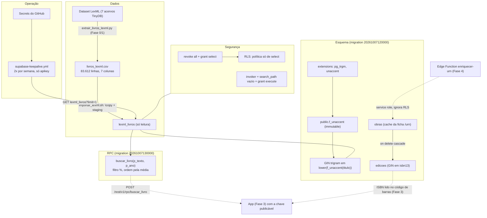
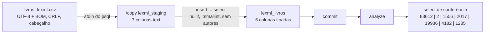
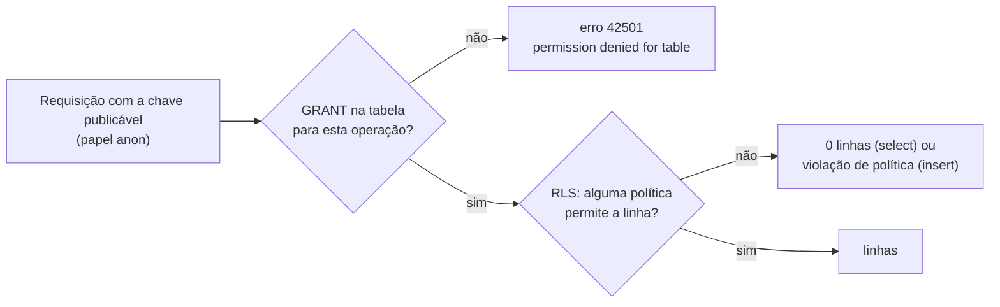
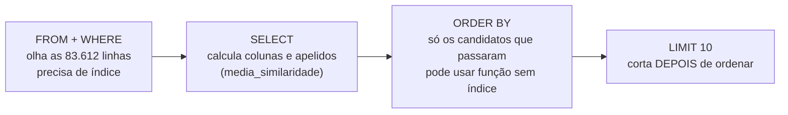
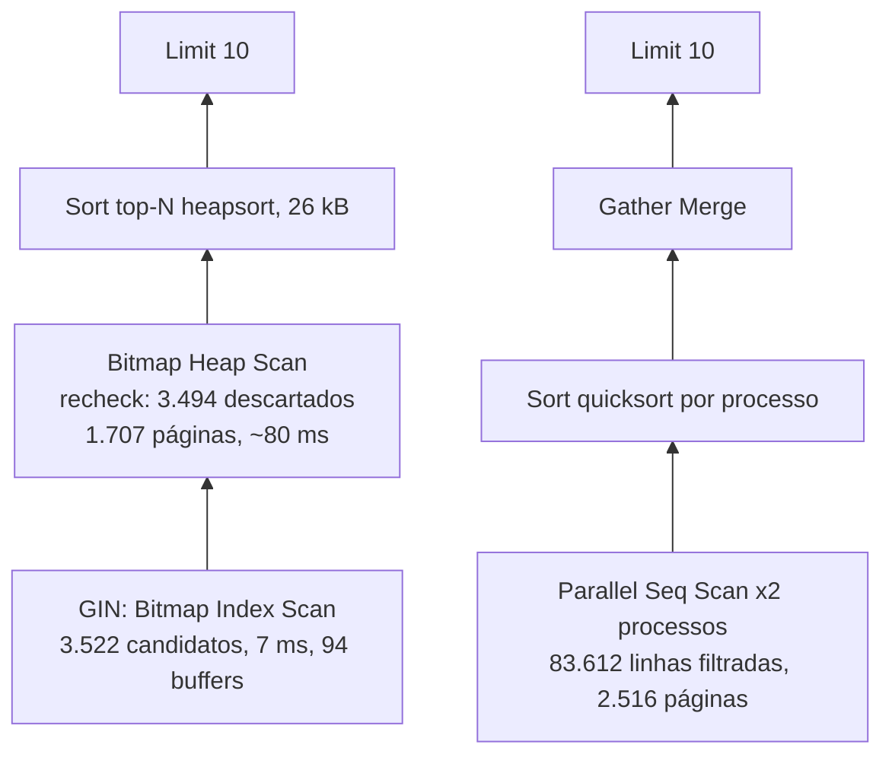
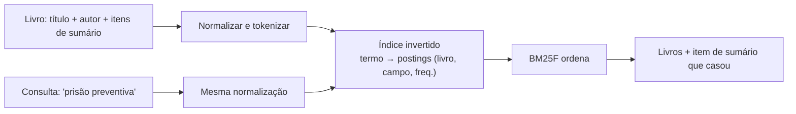

# Guia da Fase 1 — Dados

> Guia consolidado a partir de `docs/aprendizado/fase-1.md` (tarefas 1.0 a 1.7), de
> `docs/PLANO.md` (seções "Dados (Fase 1)" e "Histórico de decisões"), das migrations em
> `supabase/migrations/`, de `data/importar_lexml.sh`, de `.github/workflows/supabase-keepalive.yml`
> e do histórico do Git, em 08/10/2026. Foi escrito para ser relido sem o código aberto: os trechos
> citados são cópias do que está no repositório. Onde algo não pôde ser conferido, isso está dito.

## 1. Resumo

A Fase 1 montou **o catálogo que o app vai consultar para identificar um livro**. Um projeto
Supabase (PostgreSQL 17) recebeu, por uma migration versionada, as extensões `pg_trgm` e `unaccent`,
a função `f_unaccent`, três tabelas (`lexml_livros`, `obras`, `edicoes`) com seus índices, e uma
segurança em duas camadas (GRANT + RLS) que deixa o app só ler. Um script carregou **83.612 livros**
do LexML por `\copy`, numa transação única, com tabela de staging e conferência no fim. A RPC
`buscar_livro`, escrita pelo Ricardo, devolve os 10 títulos mais parecidos com o texto lido: filtra
com o operador `%` (que usa o índice GIN de trigramas) e ordena pela **média** entre
`word_similarity` e `similarity`, uma escolha feita por medição, com uma correção de rota no meio.
O `EXPLAIN ANALYZE` mostrou o índice a 87 ms contra 582–757 ms sem ele, e explicou por que o ganho é
de ~7–8x e não de 100x. Um workflow agendado mantém o projeto acordado. Em paralelo, a fase fixou no
plano o algoritmo da busca por assunto **local** (índice invertido + BM25F), que será implementado na
Fase 2. O que se aprendeu atravessa quatro áreas: como o Postgres guarda, protege e encontra dados;
como medir similaridade de textos; como ler um plano de execução; e como uma métrica mal escolhida
esconde defeitos.

## 2. Mapa da fase



As setas sólidas já funcionam. As tracejadas são das próximas fases: o app chamará a RPC e lerá
`edicoes` pelo ISBN; a Edge Function `enriquecer-urn` é a única que escreverá em `obras`/`edicoes`.

**O que a fase entregou, em uma tabela:**

| Área | Entrega | Onde |
| --- | --- | --- |
| Esquema | extensões, `f_unaccent`, 3 tabelas, 3 índices explícitos (GIN trigram, GIN `isbn13`, B-tree `obra_id`) | `supabase/migrations/20261007120000_esquema_inicial.sql` |
| Dados | 83.612 livros (1556–2017), 19.936 com sumário, 4.182 com resumo | `data/importar_lexml.sh` |
| RPC | `buscar_livro`, opção (c″) | `supabase/migrations/20261007130000_buscar_livro.sql` |
| Segurança | GRANT mínimo + RLS + função `invoker`; testado com `set role anon` e pela API | as duas migrations |
| Operação | keepalive com secrets, falha quando não configurado | `.github/workflows/supabase-keepalive.yml` |
| Plano | BM25F para a busca local; medições do EXPLAIN | `docs/PLANO.md` |

## 3. Conceitos, do geral ao específico

### 3.1 Duas buscas, dois lugares

O projeto tem duas buscas que é fácil confundir:

| | Identificação (esta fase) | Busca por assunto (Fase 2) |
| --- | --- | --- |
| Pergunta | "Que livro é este que estou fotografando?" | "Em quais dos **meus** livros se fala de prisão preventiva?" |
| Onde roda | Postgres no Supabase | No iPhone, no `Dominio/Busca/` |
| Sobre o quê | 83.612 títulos do LexML | Centenas ou poucos milhares de livros do usuário + sumários |
| Técnica | trigramas (`pg_trgm`), tolerante a erro de OCR | índice invertido + BM25F, com ranking por relevância |
| Por que ali | o catálogo é grande e compartilhado | a biblioteca é pessoal, cabe em memória e precisa funcionar offline |

A busca por assunto **não** vai ao servidor: isso exigiria enviar a biblioteca do usuário e perderia o
offline. A identificação **não** fica no aparelho: o catálogo é grande e muda pouco, mas não é do
usuário. Ter claro "quem é dono do dado" decide onde o algoritmo mora.

### 3.2 Conhecer os dados antes de carregar

**Perfilar** é medir o arquivo antes de confiar nele. O perfil do CSV, feito em Python antes da carga,
mostrou:

| Medida | Resultado | Consequência |
| --- | --- | --- |
| `lexml_id` e `urn` únicos | 83.612 de 83.612 | PK e `unique` não vão falhar |
| `ano` | todos numéricos, 1556 a 2017 | o cast para `smallint` é seguro |
| sem título | 2 | `titulo` precisa aceitar NULL |
| com `descricao` | 24.118 | ... mas veja abaixo |
| com `outros_tipos` | 1.235 | |

**O achado mais valioso:** o `PLANO.md` dizia "24.118 livros com sumário". Medido, a `descricao` é de
dois tipos: **19.936** começam com `Sumário: ...` e **4.182** com `Resumo: ...` (uma sinopse; 1.749
destas também têm a palavra "Sumário" no meio). Se a Fase 4 extraísse itens de sumário de todas as
24.118, processaria sinopses como se fossem sumários. A lição é de método: **uma afirmação sobre dados
só vale depois de medida**. O número no plano era uma suposição que virou "fato" por estar escrita.
A correção entrou como **linha nova** no histórico do PLANO, sem apagar a antiga, para preservar o
rastro do erro.

Outros fatos sobre o LexML que vêm da Fase 0/início da 1 e continuam valendo (conferidos no PLANO):
o dataset **não traz autor, ISBN nem editora**; isso vem da ficha `https://www.lexml.gov.br/urn/<URN>`,
que o `robots.txt` permite com 5 s entre pedidos (enriquecimento **sob demanda**, nunca em massa).
Não se fundem registros por título + ano: há 1.683 pares repetidos de livros diferentes (por exemplo,
vários "Direito penal" de 2009; há 138 livros titulados exatamente "Direito penal").

**NULL não é string vazia.** No CSV, campo vazio chega como `''`. "Não sabemos o título" e "o título é
um texto vazio" são coisas diferentes, e `NULL` é o jeito do SQL de dizer "ausência de dado". Com
`nullif(x, '')`, `count(titulo)` ignora os ausentes, `titulo is null` acha os 2 sem título e
`coalesce` funciona. Com `''`, essas consultas mentiriam. Atenção à precedência:
`nullif(ano,'')::smallint` converte **o resultado** do `nullif`; `''::smallint` daria
"invalid input syntax" e desfaria a transação inteira.

### 3.3 O Postgres do Supabase: conexão, schemas e extensões

**IPv4 × IPv6 e o pooler.** A conexão direta (`db.<ref>.supabase.co:5432`) só tem endereço IPv6, e a
rede do Ricardo não alcança IPv6. O **Supavisor**, pooler do Supabase, tem IPv4 e fica na frente do
Postgres. Poolers existem porque o Postgres usa **um processo do sistema operacional por conexão**
(caro em memória); centenas de clientes esgotariam o servidor. O pooler multiplexa muitos clientes em
poucas conexões reais.

| | Session mode (porta 5432) | Transaction mode (porta 6543) |
| --- | --- | --- |
| Conexão real | dedicada enquanto o cliente está conectado | emprestada só durante uma transação |
| `SET`, prepared statements, `LISTEN`, tabelas temporárias | funcionam | podem quebrar: a próxima transação pode cair em outra conexão real |
| Bom para | `psql`, migrations, `\copy` | serverless, muitas conexões curtas |

O projeto usa **session mode** porque a importação depende de uma tabela temporária, que vive na
sessão.

**Schemas.** Um schema é um *namespace* dentro do banco. O PostgREST (a API REST do Supabase) expõe o
schema `public`. Extensões instaladas em `public` despejariam suas funções lá, visíveis pela API; por
isso `create extension ... with schema extensions`, que é também o padrão que o linter do Supabase
cobra. O `pg_trgm` traz `similarity`, `word_similarity`, os operadores `%` e `<%`, `show_trgm` e a
classe de operadores `gin_trgm_ops`. O `unaccent` traz a função e o dicionário de troca (á → a).

**`.env` e `.env.example`.** A connection string (com senha) fica em `.env`, ignorado pelo Git; o
`.env.example` versionado documenta as variáveis com valores de molde. Duas armadilhas vistas:
- senha com `@`, `/` ou `#` precisa de *percent-encoding* na URL, ou o `psql` lê o host errado;
- `source .env` **sem** `set -a` não exporta as variáveis, e o `psql` recebe `$SUPABASE_DB_URL` vazia.
  Diagnóstico sem expor o valor: `echo ${SUPABASE_DB_URL:+definida}`.

### 3.4 Migrations e transações

**Migration** é um arquivo SQL versionado que muda o esquema, aplicado uma vez e em ordem. A analogia
jurídica: não se reescreve lei publicada, edita-se por emenda (outra migration). O nome
`AAAAMMDDHHMMSS_nome.sql` dá a ordem pela ordenação lexicográfica e já segue o padrão do Supabase CLI,
que só entra na Fase 4. O banco é um **estado**; as migrations são o **histórico** que reconstrói esse
estado do zero em qualquer ambiente. Por isso a importação de 83 mil linhas **não** é migration: dado
não é esquema.

**DDL transacional.** No Postgres, `create table` pode ser desfeito por `rollback` (no MySQL, não).
Isso permite duas coisas:
- a migration inteira entre `begin;` e `commit;`: ou o esquema todo nasce, ou nada;
- o **ensaio com rollback**: aplicar tudo, conferir e desfazer.

```bash
sed 's/^commit;$/rollback;/' arquivo.sql | psql "$SUPABASE_DB_URL" -v ON_ERROR_STOP=1
```

O Postgres para no primeiro erro, por isso corrigir um revela o próximo.

**A armadilha do `ON_ERROR_STOP`.** Sem `-v ON_ERROR_STOP=1`, quando um comando falha dentro da
transação, o Postgres a marca como abortada, os seguintes falham com "current transaction is
aborted", o `commit` vira `rollback` silenciosamente **e o `psql` sai com código 0**. Um script de
deploy acharia que deu certo. Com a opção, ele para no primeiro erro e sai com código 3.

| Código de saída do `psql` | Significado |
| --- | --- |
| 0 | ok |
| 1 | erro fatal do próprio `psql` (ex.: falta de memória) |
| 2 | falha de conexão |
| 3 | erro num script com `ON_ERROR_STOP` ligado |

**Migration imutável depois de publicada.** Na 1.3, a política foi renomeada com `alter policy ...
rename` no banco e no arquivo, porque a migration já estava aplicada mas **ainda não commitada**: banco
e arquivo ficaram idênticos. Depois do commit e do merge, qualquer mudança seria uma migration nova.

### 3.5 Carga em massa: `COPY`, `\copy` e staging

**`COPY` × `\copy`.**

| | `COPY t FROM '/arquivo'` | `\copy t from arquivo` |
| --- | --- | --- |
| O que é | comando SQL | comando do `psql` (cliente), não é SQL |
| Quem lê o arquivo | o processo do **servidor**, no disco do servidor | o `psql`, no Mac |
| Como chega ao banco | já está lá | pela conexão, como `COPY ... FROM STDIN` |
| Permissão exigida | superusuário ou `pg_read_server_files` | INSERT na tabela |
| No Supabase | falhou: "Only roles with privileges of pg_read_server_files may COPY from a file" | funciona |

Os dois terminam numa operação `COPY` no servidor; a diferença é **de onde vem o arquivo**, e é isso
que a permissão controla. O `COPY` usa um protocolo de *streaming*, muito mais rápido que 83 mil
`insert` (83 mil idas e voltas pela rede).

**Staging e ELT.** O CSV tem 7 colunas (inclusive `autores`, sempre vazia) e a tabela tem 6. O `\copy`
exige que as colunas casem, então os dados vão primeiro para uma **tabela temporária** com as 7
colunas, todas `text` (nada falha na leitura por tipo), e só depois um `insert ... select` converte e
leva as 6 úteis. Carregar bruto e transformar dentro do banco é o padrão **ELT** (extract, load,
transform), oposto ao ETL (transformar antes). O erro de conversão, se houver, aparece num comando SQL
fácil de localizar. `on commit drop` apaga a temporária sozinha.



**Transação única.** Se qualquer comando falhar, nada fica pela metade: sem a transação, uma falha na
linha 60.000 deixaria 59.999 livros no banco. O Postgres garante isso via MVCC e WAL: as linhas
inseridas só ficam visíveis aos outros no `commit`.

**Idempotência × guarda explícita.** Idempotente é a operação que, repetida, produz o mesmo estado. O
caminho comum seria `insert ... on conflict do nothing`. Foi descartado porque **esconde** um problema:
com um CSV diferente, as linhas novas entram, as antigas ficam, e o banco vira uma mistura que ninguém
planejou, sem erro. Em vez disso, um bloco `do $$ ... raise exception` recusa a carga se a tabela já
tiver linhas (fail-fast). Verificado: a segunda execução foi recusada com código 3.

**O shell do script** (cada linha tem um motivo):
- `set -euo pipefail`: para no primeiro erro (`-e`), em variável não definida (`-u`), e faz um pipeline
  falhar se **qualquer** etapa falhar (`pipefail`). Sem ele, em `cmd | tail` o `$?` é o do `tail`.
- `-f <(cat <<'SQL' ... SQL)`: *process substitution*. O shell cria um descritor (algo como
  `/dev/fd/63`) com o SQL; o `psql` o lê como arquivo, e a entrada padrão fica livre para o CSV
  (`< "$csv"`), que o `\copy ... from pstdin` consome. É recurso do bash/zsh, não do `sh` POSIX; daí o
  `#!/usr/bin/env bash`.
- `<<'SQL'` **com aspas**: impede o shell de expandir `$$` (que é o PID do shell!) dentro do `do $$`.
- mensagens de erro em `>&2` e código de saída diferente de 0.

**BOM e CRLF.** O BOM (bytes `EF BB BF`) fica no começo do arquivo, portanto na linha de cabeçalho,
que `header true` descarta; numa linha de dados, grudaria no primeiro valor. O modo CSV do Postgres
aceita CRLF; foi conferido que não sobrou `\r` nos dados e que não há mojibake ("Ã"), o que confirma
`encoding 'UTF8'`.

**Índice antes ou depois da carga.** O GIN já existia e a carga levou ~1 minuto, boa parte mantendo
o índice. Em cargas grandes costuma ser mais rápido criar o índice depois (constrói de uma vez, a
partir de dados ordenados). Para 83 mil linhas, a simplicidade ganhou: `drop` + `create` seria mais
um passo capaz de deixar a tabela sem índice.

**`ANALYZE`.** Coleta estatísticas (distribuição de valores, número de linhas) em `pg_statistic`, que o
planner usa para estimar quantas linhas cada filtro devolve e escolher entre índice e varredura. O
autovacuum faria isso sozinho, mas só depois de algum tempo. A prova de que valeu está na 1.7: o
planner estimou `rows=8` e vieram 28, uma boa estimativa.

### 3.6 Segurança em camadas

#### GRANT × RLS: duas portas independentes

Para ler uma linha, um papel precisa passar por **duas** portas:
1. **GRANT** (privilégio de objeto): pode usar a tabela? SELECT, INSERT, TRUNCATE...
2. **RLS** (Row Level Security): quais linhas? Política avaliada linha a linha.



Analogia: a política RLS é a autorização escrita na portaria; o GRANT é o crachá que deixa você chegar
até a portaria.

**O que o projeto tinha de verdade.** Consultando `pg_default_acl`, verificou-se que neste projeto as
tabelas criadas pelo papel `postgres` dão ao `anon` só **`Dxtm`**:

| Letra | Privilégio | Problema |
| --- | --- | --- |
| `D` | TRUNCATE | **TRUNCATE não é controlado por RLS**: o `anon` poderia esvaziar a tabela |
| `x` | REFERENCES | desnecessário |
| `t` | TRIGGER | desnecessário |
| `m` | MAINTAIN | desnecessário |
| (falta `r`) | SELECT | sem ele, "permission denied" mesmo com a política correta |

Ou seja, o default tinha **duas** falhas: não deixava ler o que devia e deixava apagar o que não
devia. A correção na migration fecha as duas:

```sql
-- Grants explícitos: o padrão do Supabase dá TRUNCATE ao anon e não dá SELECT.
revoke all on lexml_livros, obras, edicoes from anon, authenticated;
grant select on lexml_livros, obras, edicoes to anon, authenticated;
```

Os defaults variam por projeto e por papel criador; **confira com `\ddp` ou `pg_default_acl`** em vez
de presumir. E teste com o papel real (`set role anon` e tentar `select`, `insert`, `truncate`):
testar como superusuário não prova nada sobre permissões.

**Prova pela API (1.6).** `POST` (insert) e `DELETE` em `lexml_livros` com a chave publicável
devolveram HTTP 401 com `42501 permission denied for table lexml_livros`, e o total seguiu em 83.612.
O código `42501` vem da **primeira** porta: o `anon` nem tem INSERT/DELETE, então o Postgres recusa
antes de olhar qualquer política. Se o GRANT existisse e a RLS barrasse, o resultado seria outro
(violação de política, ou zero linhas afetadas).

**A política.** `create policy "leitura_publica" on lexml_livros for select to anon, authenticated
using (true)`. `using` filtra as linhas visíveis (`true` = todas). Sem política de
`insert/update/delete`, escrever é negado por padrão. A service role tem `BYPASSRLS`: só ela (nas Edge
Functions) escreverá. Desligar o RLS e confiar só no GRANT funcionaria hoje, mas o RLS é a defesa que
continua valendo se alguém conceder um privilégio a mais por engano.

#### Chaves e PostgREST

| Chave | Pode ir no app? | Papel no Postgres | Formato |
| --- | --- | --- | --- |
| `sb_publishable_...` | sim | `anon` | não é JWT |
| `sb_secret_...` | nunca (painel e Edge Functions) | privilegiado | não é JWT |
| `anon` legada | sim | `anon` | JWT `eyJ...` |

A chave publicável vai dentro do `.ipa` e qualquer um a extrai: **a segurança tem de estar no banco,
não no sigilo da chave**. Como não é JWT, vai só no cabeçalho `apikey`; em `Authorization: Bearer`,
o gateway tentaria validá-la como JWT.

O **PostgREST** transforma cada tabela em endpoint (`/rest/v1/lexml_livros`), filtros em query string
(`?lexml_id=eq.008040208&select=titulo&limit=1`) e funções em `POST /rest/v1/rpc/nome` com JSON dos
parâmetros. Ele troca para o papel indicado pela chave e executa SQL normal: as permissões são as do
banco.

#### Funções seguras: as três camadas

| Mecanismo | Responde a |
| --- | --- |
| `revoke`/`grant execute` | **QUEM** pode chamar |
| `security invoker` | **COM QUAIS** permissões ela roda |
| `set search_path = ''` | **QUAIS** objetos ela usa |

- **`invoker`** (padrão): roda com as permissões de quem chama; GRANT e RLS valem normalmente.
  **`definer`**: roda como o dono (`postgres`), que ignora RLS. É uma procuração com plenos poderes. O
  catálogo é público, então `definer` seria risco gratuito.
- **`search_path`**: se não for fixado, um nome sem schema (`f_unaccent`) é procurado nos schemas em
  ordem, e quem puder criar objetos poderia pôr uma função **impostora** num schema anterior. Somado a
  `definer`, a impostora rodaria com poderes do dono. Com `''`, nada é resolvido implicitamente e
  **tudo** precisa ser qualificado: `public.lexml_livros`, `public.f_unaccent`,
  `extensions.similarity`, e o operador vira `operator(extensions.%)`. O linter do Supabase avisa
  disso (`function_search_path_mutable`).
- **`revoke execute ... from public`**: por padrão o Postgres dá EXECUTE de toda função nova a
  `public` (todos os papéis); revoga-se e concede-se só a `anon` e `authenticated`.
- Efeito colateral do `set search_path`: funções `language sql` com cláusula `SET` não sofrem
  *inlining* (o corpo não é "colado" na consulta de quem chama). O revisor confirmou, com
  `plan_cache_mode = force_generic_plan`, que o índice continua sendo usado **de dentro** da função.

#### Segredos fora do repositório

- Secrets do GitHub criados com `set -a; source .env; set +a` e `gh secret set NOME --body "$VAR"`: o
  valor não aparece na tela nem na conversa. Nos logs da Actions, secrets viram `***`, mas o
  mascaramento é por texto: uma transformação (base64, por exemplo) escaparia.
- **Argumentos de linha de comando são visíveis a qualquer usuário da máquina via `ps`.** Veja o
  incidente na seção 6.

### 3.7 SQL que vale a pena saber de cor

**Ordem lógica de execução de um SELECT.** A ordem em que se **escreve** não é a ordem em que o banco
**pensa**:



Consequências:
- O `WHERE` é o único que olha todas as linhas; é ele que precisa do índice.
- O `ORDER BY` roda só sobre as linhas que passaram no filtro (28 em `'prisao preventiva'`, medido na 1.7).
  Os "~950 candidatos" citados na 1.5 vieram do `EXPLAIN` da capa longa "Hely Lopes Meirelles Direito
  Administrativo Brasileiro…": 953 linhas entregues pelo índice, **antes** do recheck.
- **Apelido** criado no SELECT pode ser usado no `ORDER BY`, mas **só como nome sozinho**, nunca dentro
  de uma conta; e **não** pode ser usado no `WHERE`, que roda antes de o apelido existir. Analogia: em
  "média das notas dos alunos" com `as media`, `order by media desc` funciona; `where media > 7` não.

**NULL em contas.** `abs(l.ano - p_ano) nulls last`: conta com `null` dá `null`.
- `p_ano` nulo: todas as linhas empatam nesse critério; o ano não influencia, de graça (por isso o
  `case when p_ano is not null` era redundante).
- `l.ano` nulo: só aquela linha vai para o fim.

**Ordenação determinística.** Há 138 livros chamados exatamente "Direito penal". Sem o desempate final
por `l.lexml_id`, a ordem entre empatados pode variar entre execuções. Toda API limitada ou paginada
deve ter ordem determinística.

**Volatilidade: uma promessa ao planner.**

| Categoria | Promessa | Exemplos no projeto |
| --- | --- | --- |
| `immutable` | mesma entrada, mesma saída, para sempre | `lower`, `f_unaccent` (por isso podem entrar em índice) |
| `stable` | constante dentro de uma consulta; lê o banco, não altera | `buscar_livro`, `now()`, `unaccent` de 1 argumento |
| `volatile` (padrão) | pode mudar a cada chamada | `random()`, funções que fazem `insert` |

**Mentir na promessa não gera erro, gera resultado errado** (por exemplo, um índice com valores
desatualizados).

**Por que `f_unaccent` existe.** Índice por expressão exige função `immutable`, e `unaccent` é
`stable` (depende do dicionário, achado pelo `search_path`). O embrulho chama a versão de **2
argumentos**, com o dicionário qualificado:

```sql
create or replace function f_unaccent(text) returns text
language sql immutable parallel safe set search_path = '' as
$$ select extensions.unaccent('extensions.unaccent', $1) $$;
```

Fixar o dicionário torna a promessa de imutabilidade razoavelmente honesta. Se o dicionário mudasse,
o índice ficaria inconsistente (sem erro). `$1` é o primeiro argumento; `$$ ... $$` são aspas do
corpo (evitam escapar apóstrofos); `parallel safe` permite planos paralelos.

**`create or replace` não muda o formato do resultado.** Para renomear a coluna de saída
(`similaridade` → `media_similaridade`), é preciso `drop function` antes. O Ricardo fez isso
corretamente.

**Função `language sql` não tem `begin/end`.** O `begin; ... commit;` da migration fica **fora** da
função, no arquivo. O bloco `begin ... end` é sintaxe de `plpgsql`. Uma função SQL roda dentro da
transação de quem a chama.

### 3.8 Similaridade de textos: trigramas e a escolha da RPC

#### Trigramas

O `pg_trgm` quebra cada palavra (com dois espaços antes e um depois) em sequências de 3 caracteres.

| Texto | Trigramas |
| --- | --- |
| `penal` | `"  p"`, `" pe"`, `"pen"`, `"ena"`, `"nal"`, `"al "` |
| `pena1` (erro de OCR) | `"  p"`, `" pe"`, `"pen"`, `"ena"`, `"na1"`, `"a1 "` |

4 em comum de 8 distintos: similaridade 0,5. Um erro de um caractere destrói só os trigramas que o
contêm; o resto sobrevive. É por isso que a busca tolera OCR imperfeito.

#### `similarity` × `word_similarity`

Ambas comparam trigramas depois de `lower(f_unaccent(...))`.

- **`similarity(A, B)`** = trigramas em comum ÷ todos os trigramas distintos dos dois (índice de
  Jaccard). **Simétrica.** Pergunta: "os dois textos inteiros se parecem?". Pune diferença dos dois
  lados.
- **`word_similarity(A, B)`** = procura em B o trecho mais parecido com A e compara só com ele; o
  resto de B é ignorado. **Assimétrica.** No código, A é o título do catálogo e B é o texto buscado.
  Pergunta: "A aparece dentro de B?". Não pune B por ter texto a mais, nem A por ser curto.

Conferência de um número: `prisao` tem 7 trigramas; `prisao preventiva` tem 16 distintos (7 + 11,
menos `"  p"` e `" pr"`, repetidos). Todos os 7 de `prisao` estão nos 16: `similarity` = 7/16 ≈ 0,44;
`word_similarity` = 1,00 (a palavra está inteira lá dentro).

**O que cada função pune:**

| | Título com palavras a MENOS ("Prisão" × "prisão preventiva") | Capa com palavras a MAIS ("A falência..." × capa com autor e edição) |
| --- | --- | --- |
| `similarity` | pune: 0,44 (**correto**) | pune: 0,43 (**injusto**) |
| `word_similarity` | não pune: 1,00 (**injusto**) | não pune: 1,00 (**correto**) |

Cada uma acerta onde a outra erra.

**Por que a média funciona.** Um título só fica alto se for bom nas **duas** perguntas ("aparece no
texto?" e "cobre o texto?"). Um único 1,0 não basta.

| título | texto buscado | sim | wsim | média |
| --- | --- | --- | --- | --- |
| prisão preventiva | Prisão preventiva | 1,00 | 1,00 | 1,00 |
| a prisão preventiva | Prisão preventiva | 0,89 | 0,89 | 0,89 |
| prisão | Prisão preventiva | 0,44 | 1,00 | 0,72 (desce) |
| a falência da pena de prisão | capa longa | 0,43 | 1,00 | 0,72 (sobe) |

Os dois casos difíceis empatam em 0,72 **por motivos opostos**. O que decide é contra quem disputam:
"Prisão" perde para títulos bons nas duas notas; "A falência..." ganha de títulos que não aparecem
inteiros na capa (wsim baixa).

| Combinação | Comportamento |
| --- | --- |
| máximo das duas | o da (c′): um 1,0 basta |
| mínimo das duas | o da (a): a capa longa é punida |
| **média** | meio-termo: nenhuma decide sozinha |

**Limite remanescente:** "A Prisão" (0,58) ainda passa "Conceito da Prisão Preventiva" (0,57). É
aceitável: a RPC só precisa pôr o livro certo **entre os 10**; a ordem fina é da `Pontuacao` da Fase 3
(autor, ano, editora).

#### Porteiro e nota

- `%` (baseado em `similarity` ≥ `pg_trgm.similarity_threshold`, padrão 0,3) devolve **boolean**: é o
  **porteiro**, "passa de 0,3?". Tem índice, então vai no `WHERE`.
- `word_similarity()`, `similarity()` e a média devolvem **real**: são a **nota**. Rodam só sobre os
  candidatos, então vão no `ORDER BY`.

#### A direção do `<%` e por que o índice não serve a todos

O GIN de trigramas atende `%` ("compartilham trigramas?") e `texto <% titulo` ("o título contém o
texto buscado?"). **Não** atende `titulo <% texto` ("o título está contido no texto buscado?"), que é
exatamente a direção que serviria no filtro. O `EXPLAIN` mostrou Seq Scan (1,3 s).

Um `OU` (`% or <%`) só usa índice se **os dois lados** puderem (BitmapOr). Como um lado exige ler a
tabela inteira, o Postgres lê tudo uma vez: Parallel Seq Scan, **2,9 s**. Isso encostaria no
`statement_timeout` de 3 s que o Supabase costuma dar ao papel `anon` (valor padrão da plataforma;
**não foi conferido neste projeto**).

#### As opções, em ordem cronológica

| opção | filtro | ordenação | índice? |
| --- | --- | --- | --- |
| (a) | `%` | `similarity` (enunciado original) | sim |
| (b) | `word_similarity` | `word_similarity` | não |
| (c) | `%` OU `<%` | wsim, depois sim | não (2,9 s) |
| (c′) | `%` | wsim, depois sim | sim (~0,1 s) |
| **(c″)** | `%` | **média** de wsim e sim | sim (**escolhida**) |

A (c′) nasceu de uma pergunta do Ricardo ("a (c) usa o índice só em parte?"), que levou a separar
**quem entra** (filtro) de **em que ordem** (ordenação).

Teste com 7 "capas" longas (título + autor + edição): posição do livro certo.

| caso | (a) | (c′) | (c) |
| --- | --- | --- | --- |
| 1 Curso de Direito Civil Brasileiro... Saraiva | 3º | 1º | 1º |
| 2 Hely Lopes Meirelles Direito Administrativo Brasileiro... | 1º | 1º | 1º |
| 3 Teoria Geral do Processo + 4 autores | some (sim 0,27) | some | 1º |
| 4 José Afonso da Silva Curso de Direito Constitucional Positivo | 1º | 1º | 1º |
| 5 A falência da pena de prisão: causas e alternativas 5a ed. | 2º | 1º | 1º |
| 6 Responsabilidade civil | 1º | 1º | 1º |
| 7 Instituições de Direito Processual Civil... Dinamarco | 1º | 1º | 1º |

Resumo: (a) 4 em 1º lugar, 2 em 2º/3º, 1 perdido; (c′) 6 em 1º e o mesmo
perdido; (c) os 7, mas a 2,9 s. A (c″) dá o mesmo resultado da (c′) nas capas longas. O caso 3 (nota
0,27, abaixo do porteiro de 0,3) não se resolve na RPC: só mandando **o título já extraído** (Fase 3),
não a capa inteira.

**A lição de método.** A (c′) foi escolhida olhando só capas longas. O Ricardo aplicou a mudança e,
por iniciativa própria, comparou as saídas antes e depois na consulta curta `'prisao preventiva'`,
que é a entrada **normal** prevista no plano. Viu "Prisão" e "A Prisão" passarem à frente de "A Prisão
Preventiva". A métrica usada ("posição do título exato") não via o problema, porque o exato continuava
em 1º; o defeito estava do 2º ao 10º lugar.
- O conjunto de teste precisa cobrir **os tipos reais de entrada** (curta e longa).
- Uma métrica **só da posição do alvo** esconde a qualidade do resto da lista.
- Olhar as saídas **lado a lado** pegou o que a métrica não pegava.

### 3.9 Índices e planos de execução

**B-tree × GIN.** O B-tree é a lista telefônica: valores em ordem; serve para `=`, `<`, `>` e prefixo
(`like 'abc%'`); inútil para "parecido com". O GIN (*Generalized Inverted Index*) é o índice
remissivo no fim do livro: mapeia cada **chave** para a lista de linhas que a contêm. Em
`isbn13 text[]`, as chaves são os elementos do array; em `titulo` com `gin_trgm_ops`, os trigramas.

**Índice por expressão.** O índice é sobre `lower(f_unaccent(titulo))`, não sobre `titulo`. O
planner só o usa se a consulta contiver **a mesma expressão** com **um operador da classe do índice**.
Por isso `similarity(...) > 0.3` no `WHERE` faz Seq Scan, e `... operator(extensions.%) ...` usa o
índice. O mesmo vale para arrays: `isbn13 @> array['978...']` usa o GIN; `'978...' = any(isbn13)`
não.

**O experimento (1.7).** `explain (analyze, buffers)` sobre o corpo da consulta (o EXPLAIN da função
mostra só `Function Scan`), busca `'prisao preventiva'`, duas execuções de cada:

| | 1ª execução | 2ª execução | Passo dominante |
| --- | --- | --- | --- |
| Com índice | 88,8 ms | 87,1 ms | Bitmap Index Scan, depois Bitmap Heap Scan |
| Sem índice | 757,0 ms | 582,4 ms | Parallel Seq Scan |

Ganho de ~6,7x a 8,5x; os dois caminhos acham as mesmas 28 linhas.



(Planos se leem **de baixo para cima e de dentro para fora**.)

O índice foi desligado com `set enable_bitmapscan = off; set enable_indexscan = off;` (só na sessão),
e não com `begin; drop index ...; rollback;`, que o PLANO sugeria: o `drop index` pega lock `ACCESS
EXCLUSIVE` e trava a tabela para todos enquanto a transação estiver aberta.

**Por que o GIN trigram é *lossy*.** Ele sabe quais trigramas da busca cada título tem, mas **não sabe
quantos trigramas o título tem no total**. Como `similarity` = comuns ÷ total dos dois, ele só
consegue uma **estimativa otimista**. Resultado: nunca perde um resultado certo (sem falso negativo),
mas traz falsos positivos: **3.522 candidatos para 28 verdadeiros**.

**Recheck.** O `Bitmap Heap Scan` vai à tabela, lê cada candidato, recalcula `lower(f_unaccent(titulo))`
e a `similarity` exata e descarta os que ficaram abaixo do limiar (**3.494**). É o custo dominante:
~80 ms dos ~87 ms. O índice em si custou 7 ms.

**Por que ~7–8x e não 100x.** Os 3.522 candidatos estão espalhados por **1.707 das 2.516 páginas**
(68%) da tabela. O índice **não** evita ler a maior parte da tabela; evita **calcular a similarity em
83 mil linhas**, calculando só em 3.522. Corolário: o tempo depende da **frequência dos termos**.
"direito penal brasileiro" (medido pelo revisor na 1.5) gerou 14.645 candidatos e ~300 ms.

**Bitmap × Index Scan comum.** No Index Scan, cada entrada do índice leva a uma visita à página, na
ordem do índice, possivelmente revisitando a mesma página (acesso aleatório). No Bitmap, o Postgres
junta todos os endereços num bitmap por página e visita **cada página uma vez, em ordem física**. O
preço: perde a ordem do índice (aqui irrelevante) e exige recheck quando o índice é lossy.

**top-N heapsort.** Com `ORDER BY ... LIMIT 10`, não é preciso ordenar tudo: mantém-se um heap de 10
com os melhores até agora, ~O(n log 10), 26 kB.

**Conta de conferência do seq scan.** (41.792 removidas + 14 aceitas) × 2 processos = 83.612 = a
tabela inteira. Paralelizar (líder + 1 worker, `Gather Merge` intercalando as listas ordenadas)
divide o tempo por um fator pequeno; **o índice reduz o trabalho**.

**Cache e repetição.** Todos os buffers apareceram como `shared hit` (nenhum `read`): mediu-se CPU, não
disco; com cache frio seria pior. `Planning Time` caiu de 17,2 para 1,4 ms (na 1ª vez o planner
carregou o catálogo, `Planning Buffers: 176`). Sem índice, 757 → 582 ms com as mesmas páginas:
variação de CPU num servidor compartilhado. **Meça mais de uma vez.**

**`cost` não é tempo.** `cost=61.81..16421.98` está numa unidade abstrata do planner (baseada em
`seq_page_cost`, `cpu_tuple_cost`...), boa para comparar planos entre si. O que se compara com a
realidade é a estimativa de linhas (`rows=8` previsto × 28 reais).

**Ligação com a RPC.** Só o `WHERE` com `%` usa o GIN; a ordenação roda depois, sobre os candidatos.
É por isso que a RPC filtra com `%` e ordena pela média, e não o contrário. E o plano só é bom porque
as estatísticas da 1.4 existem.

### 3.10 Operação: manter o projeto vivo

**Keepalive.** Projeto gratuito do Supabase pausa após 7 dias sem atividade. O workflow faz um `GET`
leve (`limit=1`) na API REST.

**Cron, os 5 campos:** `17 12 * * 1,4` = `minuto hora dia-do-mês mês dia-da-semana` → segunda (1) e
quinta (4) às 12:17 **UTC** (o GitHub não usa fuso local). Dois pings por semana dão folga contra os 7
dias; o minuto 17 evita o horário redondo, em que o GitHub mais atrasa.

**A falha do run #1 (05/10).** "The job was not acquired by Runner of type hosted even after multiple
attempts": o GitHub não alocou máquina (~15 min de fila); nenhuma linha do script rodou. Falha de
infraestrutura, não de código. Mas revelou outro problema: o script antigo, sem secrets, sairia com
`exit 0`, **verde sem verificar nada**.

**Fail loud.** Um monitor que fica verde sem verificar nada é pior que um vermelho, porque esconde o
problema que deveria denunciar. O estado "não configurado" de um verificador deve ser erro.

**Testar a automação antes de confiar no agendamento.** `gh workflow run supabase-keepalive.yml --ref
fase1/keepalive` dispara o `workflow_dispatch` com o arquivo da branch (desde que o workflow já exista
no default branch). Run 37733444457: success em 8 s, log com `[{"lexml_id":"008040208"}]`. O log
exibe o script inteiro, inclusive a linha do `::error::`; isso é só exibição, ela não foi executada.

Armadilhas de agendamento: `schedule` só roda do **default branch**; o cron pode atrasar ou pular
execuções; e o GitHub **desativa workflows agendados após 60 dias sem commits** no repositório (sem
aviso: simplesmente nenhuma execução aparece). `curl -f` faz HTTP ≥ 400 virar erro; sem ele, um 401
sairia como sucesso.

### 3.11 A busca local que vem na Fase 2: índice invertido e BM25F

Decidida e registrada no plano nas tarefas 1.0 e 1.1; ainda sem código.



**Índice invertido.** Mapa `termo → lista de (livro, campo, frequência)`, o índice remissivo do livro
(é o mesmo princípio do GIN, agora no aparelho). Montar custa O(tamanho total do texto); consultar
custa O(soma das listas dos termos da consulta), não O(número de livros). Em Swift, um
`[String: [Posting]]` (dicionário, O(1) médio por hash). É **dado derivado**: a fonte da verdade é o
Core Data; o índice pode ser reconstruído ao abrir o app e atualizado ao editar (remover os postings
do livro e reindexá-lo). Persisti-lo criaria um problema de sincronização.

**Normalização.** Minúsculas, sem acentos (decomposição Unicode e descarte das marcas combinantes, ou
`folding(options: .diacriticInsensitive, locale:)`), sem stop words. **O mesmo pipeline na escrita e
na leitura**, ou "prisão" é indexado como `prisao` e buscado como `prisão`. Stop words: lista curta.

**TF-IDF → BM25.** TF-IDF: frequente no documento × raro na coleção. O BM25 acrescenta **saturação**
e **normalização pelo tamanho**:

```
score(D,Q) = Σ_q  IDF(q) · f(q,D)·(k1+1) / ( f(q,D) + k1·(1 - b + b·|D|/avgdl) )
IDF(q)     = ln( (N - n_q + 0.5)/(n_q + 0.5) + 1 )
```

- `k1` (1,2 a 2): saturação; 20 ocorrências não valem 20 vezes uma.
- `b` (~0,75): penaliza documentos maiores que a média (`|D|/avgdl`); `b=0` desliga, `b=1` normaliza
  totalmente.
- O `+1` dentro do `ln` evita IDF negativo para termos presentes em mais da metade dos documentos.
  Em coleções pequenas o IDF oscila muito.

**BM25F: pesos antes da saturação.** Combina-se `f' = Σ_campo peso_campo · f_campo / norm_campo` e só
então se aplica a saturação, uma vez. Exemplo da 1.1 com `b = 0`, `IDF = 1`, `k1 = 1,2`
(`sat(f) = 2,2·f / (f + 1,2)`), pesos título = 3 e sumário = 1, consulta "prescrição":

| Livro | Ocorrências | Soma de BM25 por campo | BM25F |
| --- | --- | --- | --- |
| A | 1 no título, 1 no sumário | 3·sat(1) + 1·sat(1) = **4,00** | f' = 4; sat(4) = **1,69** |
| B | 4 no sumário | 1·sat(4) = **1,69** | f' = 4; sat(4) = **1,69** |
| D | 1 no título | 3·sat(1) = **3,00** | f' = 3; sat(3) = **1,57** |

- **Teto:** no BM25F a nota de um termo nunca passa de `IDF·(k1+1) = 2,2`; na soma por campo, o teto
  é `(soma dos pesos)·2,2 = 8,8`, e os pesos viram multiplicadores da nota.
- **Repetição com retorno decrescente:** A × D é +33% na soma por campo e +8% no BM25F.
- **A e B empatam no BM25F** com esses pesos: é consequência dos números escolhidos, por isso o plano
  manda ajustá-los com testes.
- Um único IDF por termo, sobre o livro inteiro; `avgdl` **por campo** (títulos têm 5 palavras,
  sumários, centenas).
- A nota por item de sumário serve só para escolher o trecho exibido, sem alterar a ordem dos livros.

**Modelo no Core Data (planejado).** `Categoria` como entidade (renomeável, com cor de paleta fixa,
não hex), muitos-para-muitos com `Livro` e regra **Nullify** (apagar a categoria só tira a etiqueta);
`Livro → itensSumario` com **Cascade** (item sem livro não faz sentido). *No Action* deixa referências
penduradas. `cddirCaminho` como String com `" > "` em vez de Transformable. O sumário guarda só texto.

## 4. Decisões de arquitetura

| Decisão | Alternativas | Motivo |
| --- | --- | --- |
| Busca por assunto só local (índice invertido + BM25F no `Dominio/`) | `NSPredicate CONTAINS[cd]`; FTS5 do SQLite; `tsvector`/`pg_trgm` no servidor | Biblioteca cabe em memória; offline; algoritmo puro testável em XCTest; ranking é o objetivo de aprendizado |
| BM25F (pesos antes da saturação) | Somar um BM25 por campo; TF-IDF puro; pesos sem testes | Soma por campo infla termos repetidos em vários campos; TF-IDF ignora saturação e tamanho |
| `Categoria` como entidade, Nullify | Campo `assuntos` de texto | "Penal", "penal" e "Direito Penal" virariam três assuntos |
| Conexão pelo Session pooler (IPv4, 5432) | Conexão direta; Transaction pooler (6543) | Direta só tem IPv6; staging depende de tabela temporária, que vive na sessão |
| Migrations com `psql`, nome no padrão do CLI | Supabase CLI agora; SQL Editor do painel | `psql` já instalado; CLI só na Fase 4; o painel não tem `\copy` e deixa o banco divergir do repositório |
| Extensões em `extensions` | Em `public` | Fora da API REST; padrão e linter do Supabase |
| `f_unaccent` imutável com dicionário qualificado | Indexar `unaccent` direto | `unaccent` é `stable` e não pode entrar em índice |
| GIN trigram em `lower(f_unaccent(titulo))` | B-tree em `titulo` | B-tree não atende "parecido com" |
| `isbn13 text[]` + GIN; `urn` como PK de `edicoes` | Tabela de ISBNs; PK artificial | Uma edição pode ter vários ISBNs; a URN é chave natural estável |
| `ficha jsonb` bruta em `obras` | Só colunas extraídas | Reprocessar sem chamar a fonte de novo |
| `revoke all` + `grant select` explícitos, além do RLS | Confiar nos defaults; só RLS; só GRANT | Default dava TRUNCATE e não dava SELECT ao `anon`; RLS segue valendo se alguém conceder privilégio a mais |
| Importação por script com staging, fora das migrations | `COPY` no servidor; Python linha a linha; reescrever o CSV; painel | `COPY` negado; 83 mil round-trips; mais código; não versionável. Dado não é esquema |
| Guarda "tabela não vazia" + transação única | `on conflict do nothing` | Falha ruidosa vale mais que mistura silenciosa |
| `buscar_livro` (c″): filtro `%`, ordem pela média, ano, `lexml_id` | (a), (b), (c), (c′) | Mesmo custo da (a), melhor nas capas longas; (c′) favorecia títulos curtos; (c) perde o índice (2,9 s); (b) sem índice |
| `security invoker` + `search_path = ''` + `grant execute` só a `anon`/`authenticated` | `security definer` | Catálogo é público; poder extra seria risco gratuito |
| Guarda `length(trim(p_texto)) >= 3` | Sem guarda | Texto vazio não tem trigramas e fazia Parallel Seq Scan de ~0,6 s |
| Desligar índice com `set enable_*` para medir | `drop index` em transação com rollback | `drop index` pega lock exclusivo e trava a tabela para todos |
| Keepalive com `SUPABASE_PUBLISHABLE_KEY`, só `apikey`, falhando sem secrets | `exit 0` sem secrets; chave secret; serviço externo de ping | Verde enganoso esconde a pausa; privilégio mínimo; uma conta a menos |

## 5. Padrões usados

### 5.1 Porteiro e nota (*filter then rank*)

Um filtro barato e indexável decide **quem entra**; uma ordenação mais cara decide **em que ordem**,
só sobre os candidatos. Não vale se o filtro cortar candidatos bons demais (recall), por isso se mede.

```sql
    (extensions.word_similarity(lower(public.f_unaccent(l.titulo)), lower(public.f_unaccent(p_texto))) + extensions.similarity(lower(public.f_unaccent(l.titulo)), lower(public.f_unaccent(p_texto)))) / 2 as media_similaridade
    from public.lexml_livros l
    where length(trim(p_texto)) >= 3
      and lower(public.f_unaccent(l.titulo)) operator(extensions.%) lower(public.f_unaccent(p_texto))
      order by media_similaridade desc,
      abs(l.ano - p_ano) nulls last,
      l.lexml_id
    limit 10;
```

### 5.2 Defesa em profundidade e menor privilégio

Camadas independentes, cada uma suficiente para barrar um tipo de abuso:

```sql
alter table lexml_livros enable row level security;
create policy "leitura_publica"
on lexml_livros
for select
to anon, authenticated
using (true);
-- ...
revoke all on lexml_livros, obras, edicoes from anon, authenticated;
grant select on lexml_livros, obras, edicoes to anon, authenticated;
```

E na função:

```sql
language sql stable parallel safe
security invoker set search_path = ''
-- ...
revoke execute on function public.buscar_livro(text, smallint) from public;
grant execute on function public.buscar_livro(text, smallint) to anon, authenticated;
```

### 5.3 Adaptador para cumprir um contrato (o embrulho `f_unaccent`)

Quando uma peça não cumpre o requisito de quem a usa (`unaccent` é `stable`; o índice exige
`immutable`), um embrulho fino fixa a dependência variável (o dicionário) e cumpre o contrato. Ver o
código em 3.7.

### 5.4 Staging table / ELT

Use quando o formato da fonte difere do destino ou a validação precisa de SQL. Não use se o arquivo já
casa com a tabela: `\copy` direto é mais simples.

```sql
create temp table lexml_staging (
  lexml_id     text,
  urn          text,
  titulo       text,
  autores      text,             -- sempre vazia no dataset; descartada abaixo
  ano          text,
  descricao    text,
  outros_tipos text
) on commit drop;

\copy lexml_staging from pstdin with (format csv, header true, encoding 'UTF8')

insert into lexml_livros (lexml_id, urn, titulo, ano, descricao, outros_tipos)
select lexml_id,
       urn,
       nullif(titulo, ''),
       nullif(ano, '')::smallint,
       nullif(descricao, ''),
       nullif(outros_tipos, '')
from lexml_staging;
```

### 5.5 Fail-fast com guarda explícita

```sql
do $$
begin
  if exists (select 1 from lexml_livros) then
    raise exception 'lexml_livros já tem linhas; esvazie a tabela antes de importar de novo';
  end if;
end $$;
```

(Repare: aqui o `begin/end` é legítimo, porque `do` executa um bloco **plpgsql** anônimo; numa função
`language sql`, não.)

### 5.6 Verificação pós-carga com o valor esperado impresso

A conferência fica junto da carga e pode ser repetida por qualquer um:

```sql
\echo 'Conferência (esperado: 83612 | 2 | 1556 | 2017 | 19936 | 4182 | 1235):'
select count(*)                                   as livros,
       count(*) filter (where titulo is null)     as sem_titulo,
       min(ano)                                   as ano_min,
       max(ano)                                   as ano_max,
       count(*) filter (where descricao like 'Sumário%') as com_sumario,
       count(*) filter (where descricao like 'Resumo%')  as com_resumo,
       count(outros_tipos)                        as com_outros_tipos
from lexml_livros;
```

### 5.7 Fail loud em monitoramento

```bash
if [ -z "$SUPABASE_URL" ] || [ -z "$SUPABASE_PUBLISHABLE_KEY" ]; then
  echo "::error::Secrets SUPABASE_URL e SUPABASE_PUBLISHABLE_KEY não configurados; o projeto vai pausar."
  exit 1
fi
curl -fsS "$SUPABASE_URL/rest/v1/lexml_livros?select=lexml_id&limit=1" \
  -H "apikey: $SUPABASE_PUBLISHABLE_KEY"
```

Quando **não** usar: tarefas opcionais em que "não configurado" é um estado válido.

### 5.8 Ensaio com rollback e diagnóstico só na sessão

Testar sem efeito colateral: `sed 's/^commit;$/rollback;/' | psql ...` para migrations;
`set enable_bitmapscan = off` para medir sem índice (e `reset` depois). `enable_*` é ferramenta de
**diagnóstico**, nunca de produção: se o planner escolhe mal, corrija estatísticas ou o índice.

### 5.9 Parâmetros como dados, comportamento como teste (para a Fase 2)

Pesos, `k1` e `b` do BM25F serão constantes nomeadas; testes XCTest com pequenas bibliotecas fixas
("título ganha de sumário") travam a **propriedade** desejada quando os números mudarem.

## 6. Erros e aprendizados

O Ricardo optou por não responder às perguntas das entradas da Fase 1; não há respostas nem
correções registradas. Esta seção trata dos erros reais da fase, dele e do Claude, e dos pontos em
que o código escrito por ele mostrou confusão.

### 6.1 Erros no código da RPC (tarefa `[eu escrevo]` 1.5)

| # | O que estava escrito | Por que está errado | Correção |
| --- | --- | --- | --- |
| 1 | `set search path` | o parâmetro chama `search_path` | `set search_path = ''` |
| 2 | `begin;`/`end;` dentro do `$$` | confusão entre a transação da migration (fora, no arquivo) e o bloco `begin ... end` do plpgsql; função `language sql` não tem esse bloco e roda na transação de quem chama | tirar do corpo; `begin;`/`commit;` só no arquivo |
| 3 | `public.lexml_livros.l.lexml_id` | depois de `from public.lexml_livros l`, a tabela "doravante se denomina" `l`; schema só aparece onde o Postgres procura por nome (tabelas, funções, operadores) | `l.lexml_id` |
| 4 | `similarity((a, b) as similaridade)` | parênteses extras viram um valor composto (*row*); o apelido vem depois da expressão inteira | `similarity(a, b) as similaridade` |
| 5 | `case when p_ano is not null ...` e `lexlm_livros` | o `case` era redundante (o NULL já se comporta no `abs`); typo no nome | remover o `case`; `lexml_livros` |
| 6 | `revoke on function ...` e `public_buscar_livro` | falta o privilégio (`execute`); sublinhado no lugar do ponto | `revoke execute on function public.buscar_livro(text, smallint) from public` |
| 7 | `word_similarity(...) + titulo operator(extensions.%) texto` na média | dois erros: `%` devolve **boolean** (porteiro), `similarity()` devolve **real** (nota), e só a nota entra em conta; e `operator(...)` tem a **menor precedência de todas**, então o Postgres leu `(wsim + titulo) % texto`, somando número com texto ("No operator matches" apontou o `+`) | `(word_similarity(...) + similarity(...)) / 2`; na dúvida, parênteses |
| 8 | renomear a coluna de saída com `create or replace` | `create or replace` não muda o formato do resultado | `drop function` antes (o Ricardo fez certo) |

Um ponto a favor: o comentário do topo da migration, escrito pelo Ricardo a partir da documentação do
Supabase, explica corretamente a relação entre `security definer`, `search_path` e a função impostora.
Pendentes de estilo que o revisor deixou a cargo dele: quebra de linha desse comentário e uma nota de
que o limiar 0,3 do `%` depende de `pg_trgm.similarity_threshold` da sessão. **Não foram aplicados**:
a migration no repositório ainda tem o comentário numa linha só e não menciona o limiar.

### 6.2 Erros de método, de dados e de processo

| # | O que deu errado | Causa | Correção | Lição |
| --- | --- | --- | --- | --- |
| 1 | "24.118 livros com sumário" no PLANO | suposição escrita como fato | perfil: 19.936 sumários + 4.182 resumos; linha nova no histórico | medir antes de afirmar |
| 2 | Default privileges dariam TRUNCATE e negariam SELECT ao `anon` | confiança nos defaults da plataforma | `revoke all` + `grant select`; conferido em `pg_default_acl` | conferir os defaults reais; testar com o papel real |
| 3 | (c′) escolhida e depois descartada (erro do Claude) | teste só com capas longas; métrica só da posição do alvo | (c″), após o Ricardo comparar saídas lado a lado na consulta curta | cobrir entradas curtas e longas; olhar a lista inteira |
| 4 | `COPY` no servidor falhou | o papel `postgres` do Supabase não tem `pg_read_server_files` | `\copy` | a permissão segue o lugar de onde o arquivo vem |
| 5 | O PLANO sugeria `drop index` em transação para medir | efeito certo, efeito colateral perigoso (lock `ACCESS EXCLUSIVE`) | `set enable_bitmapscan/indexscan = off` na sessão | prefira mudar o comportamento da sessão a mudar o objeto compartilhado |
| 6 | Keepalive sairia verde sem secrets | `exit 0` no ramo "não configurado" | `::error::` + `exit 1` | monitor verde sem verificar é pior que vermelho |
| 7 | Branch da 1.5 criada de um `main` local desatualizado (sem o PR #12) | faltou `git pull` antes de `git switch -c` | fast-forward | `git pull` no `main` antes de criar a branch |
| 8 | Merges feitos antes da entrada do teacher | PR aberto e mergeado logo após o commit de código | pelo histórico do Git, a entrada da 1.3 só entrou no PR #12, junto com a da 1.4 (o PR #11 foi mergeado sem ela), e a da 1.6 só entrou no PR #15, em vez do PR #14 | o registro do teacher faz parte da tarefa: só abrir/mergear o PR depois dele, para que cada PR conte a história completa |
| 9 | **Senha do banco exposta na conversa** (erro do Claude) | ao diagnosticar um `psql` travado, `ps -Ao pid,etime,command` mostrou a linha de comando inteira, com a connection string | o Ricardo **rotacionou a senha** e atualizou o `.env` | argumentos de linha de comando são visíveis a qualquer usuário via `ps`; segredos vão por variável de ambiente ou arquivo (`PGPASSWORD`, `~/.pgpass`, `PGSERVICEFILE`); listar processos com `comm`; segredo exposto é segredo comprometido: rotacione |
| 10 | `psql` travado numa consulta longa | a conexão pelo pooler caiu sem aviso | (diagnóstico acima) | `statement_timeout` e, se preciso, `timeout` no shell |

### 6.3 Pontos que costumam confundir (e a explicação correta)

- **"`%` e `similarity() > 0.3` são a mesma coisa."** No resultado, quase (o limiar do `%` é
  configurável por sessão). No plano, não: só o operador usa o índice.
- **"RLS basta."** Não: sem GRANT nem se chega à RLS, e TRUNCATE passa por cima da RLS.
- **"A chave publicável é um segredo."** Não: está no `.ipa`. Quem protege é o banco.
- **"O índice deixa tudo 100x mais rápido."** Depende de quantos candidatos ele devolve e de quantas
  páginas eles ocupam: aqui 68% das páginas foram lidas mesmo com índice.
- **"`cost` é tempo."** É uma unidade do planner para comparar planos.

## 7. O que levar para as próximas fases

| Para | O quê | Origem |
| --- | --- | --- |
| Fase 2 | Implementar o BM25F com pesos antes da saturação, `avgdl` por campo, IDF único por termo; constantes nomeadas; testes de propriedades | 1.0, 1.1 |
| Fase 2 | Índice como dado derivado; reindexar ao editar/apagar; tratar índice vazio (`avgdl` com divisão por zero) | 1.0 |
| Fase 2 | Core Data: Cascade em `Livro → itensSumario`, Nullify em `Categoria ↔ Livro`, sempre com relação inversa | 1.0 |
| Fase 3 | Mandar **só o título extraído** para `buscar_livro`, não a capa inteira (resolve o caso 3, nota 0,27) | 1.5 |
| Fase 3 | **Avaliar a (c″) com capas reais** (fotos do OCR), cobrindo entradas curtas e longas e olhando a lista toda, não só a posição do alvo | 1.5 |
| Fase 3 | A ordem fina é da `Pontuacao` (autor, ano, editora); a RPC só precisa pôr o certo entre os 10 | 1.5 |
| Fase 3 | Chamar a API só com o cabeçalho `apikey` e a chave publicável; consultar `edicoes` por ISBN com `isbn13 @> array[...]` | 1.3, 1.6 |
| Fase 3 | O limiar do `%` vem de `pg_trgm.similarity_threshold`; o tempo cresce com termos frequentes (14.645 candidatos, ~300 ms para "direito penal brasileiro"); conferir o `statement_timeout` real do `anon` | 1.5, 1.7 |
| Fase 4 | A Edge Function `enriquecer-urn` deve **evitar obras duplicadas**: `obras` não tem chave natural única; ao enriquecer uma edição, verificar se alguma URN da ficha já está em `edicoes` e reaproveitar o `obra_id` | 1.3 |
| Fase 4 | Pré-preencher sumário só das 19.936 `descricao` que começam com `Sumário:`; as 4.182 `Resumo:` são sinopses | 1.4 |
| Fase 4 | Escrita só com a service role, só na Edge Function; a `sb_secret_` nunca vai ao app | 1.3, 1.6 |
| Fase 4 | Supabase CLI entra aqui; os nomes das migrations já seguem o padrão dele | 1.2 |
| Sempre | **O GitHub desativa agendamentos após 60 dias sem commits**: se o repositório ficar parado, reativar o keepalive na aba Actions | 1.6 |
| Sempre | Migration publicada é imutável: correção vira migration nova | 1.3 |
| Sempre | Registro do teacher antes do merge; `git pull` antes de criar branch | 1.5, 1.6 |
| Sempre | Nunca passar segredo por argumento de linha de comando | 1.6 |

## 8. Glossário

| Termo | Definição |
| --- | --- |
| ACL / `pg_default_acl` | Lista de privilégios de um objeto; `pg_default_acl` guarda os privilégios dados automaticamente a objetos novos. |
| `ANALYZE` | Comando que coleta estatísticas das colunas para o planner estimar linhas. |
| `avgdl` | Tamanho médio dos documentos (ou do campo) usado pelo BM25 para normalizar o tamanho. |
| Bitmap Heap Scan | Leitura da tabela guiada por um bitmap de páginas, cada página uma vez, em ordem física, com recheck se o índice for lossy. |
| BM25 / BM25F | Fórmula probabilística de relevância com saturação e normalização de tamanho; a versão F pondera campos antes de saturar. |
| B-tree | Índice ordenado; atende igualdade, intervalo e prefixo. |
| `BYPASSRLS` | Atributo de papel que ignora as políticas RLS (a service role o tem). |
| `COPY` / `\copy` | Carga em massa; o primeiro lê arquivo no servidor, o segundo é do `psql` e envia o arquivo do cliente. |
| `cost` | Estimativa do planner em unidade abstrata, não em milissegundos. |
| DDL transacional | Mudanças de esquema que podem ser desfeitas com `rollback` (Postgres sim, MySQL não). |
| ELT / staging | Carregar dados brutos numa área intermediária e transformá-los dentro do banco. |
| Fail fast / fail loud | Parar cedo e com barulho em vez de seguir em silêncio num estado errado. |
| GIN | Índice invertido genérico: chave → linhas que a contêm. |
| GRANT | Privilégio sobre um objeto inteiro (SELECT, INSERT, TRUNCATE...). |
| IDF | Raridade de um termo na coleção; termos raros valem mais. |
| Idempotência | Repetir a operação produz o mesmo estado. |
| Índice invertido | Mapa termo → lista de documentos (postings). |
| Índice por expressão | Índice sobre o resultado de uma expressão; só é usado se a consulta repetir a expressão. |
| Inlining | O planner cola o corpo de uma função SQL na consulta; `SET` na função impede. |
| `invoker` / `definer` | Uma função roda com as permissões de quem chama / do dono. |
| Lossy (índice) | Índice que devolve um superconjunto dos resultados, exigindo recheck. |
| Migration | Arquivo SQL versionado que muda o esquema, aplicado uma vez e em ordem. |
| MVCC | Controle de concorrência por versões: as mudanças só ficam visíveis aos outros no commit. |
| `nullif` | Devolve NULL se os dois argumentos forem iguais; senão, o primeiro. |
| `ON_ERROR_STOP` | Variável do `psql` que o faz parar no primeiro erro e sair com código 3. |
| `pg_trgm` | Extensão de similaridade por trigramas (`similarity`, `word_similarity`, `%`, `<%`). |
| Pooler (Supavisor) | Intermediário que multiplexa muitos clientes em poucas conexões reais ao Postgres. |
| PostgREST | Servidor que expõe tabelas e funções do Postgres como API REST. |
| Process substitution | `<(cmd)`: o shell entrega a saída de um comando como se fosse um arquivo. |
| Recheck | Recalcular a condição exata nas linhas que o índice lossy devolveu. |
| RLS | Row Level Security: políticas por linha avaliadas pelo Postgres. |
| RPC | Função do banco publicada como `POST /rest/v1/rpc/nome`. |
| Saturação (`k1`) | Retorno decrescente das repetições de um termo no BM25. |
| Schema | Namespace dentro do banco (`public`, `extensions`). |
| `search_path` | Lista de schemas em que nomes não qualificados são procurados. |
| Session × transaction mode | Conexão real dedicada à sessão × emprestada por transação. |
| `similarity` | Jaccard de trigramas: comuns ÷ distintos dos dois textos; simétrica. |
| `statement_timeout` | Tempo máximo de um comando antes de ser cancelado. |
| top-N heapsort | Ordenação parcial que mantém só os N melhores num heap. |
| Trigrama | Sequência de 3 caracteres extraída de uma palavra com espaços de preenchimento. |
| Volatilidade | Promessa ao planner: `immutable`, `stable` ou `volatile`. |
| `word_similarity` | Similaridade entre A e o trecho de B mais parecido com A; assimétrica. |

## 9. Autoavaliação

### 9.1 Perguntas novas (com gabarito)

Tente responder por escrito antes de olhar o gabarito.

1. **(Compreensão)** `where similarity(t, q) > 0.3` e `where t % q` devolvem praticamente as mesmas
   linhas. Por que só a segunda usa o índice GIN?
2. **(Aplicação)** Escreva o `WHERE` que procura em `edicoes` o ISBN `9788502000000` usando o índice
   GIN, e diga por que `'9788502000000' = any(isbn13)` não serviria.
3. **(Aplicação)** Com pesos título = 2 e sumário = 1, `k1 = 1,2`, `b = 0`, `IDF = 1`, calcule a nota
   de "usucapião" para o livro X (1 vez no título) e o livro Y (2 vezes no sumário), na soma por campo
   e no BM25F. O que muda na comparação?
4. **(Compreensão)** O `anon` tem `grant select` em uma tabela com RLS ligado e **nenhuma** política.
   O que um `select *` devolve? E se não tivesse o GRANT? Por que os resultados são diferentes?
5. **(Aplicação)** Na `buscar_livro`, alguém troca `order by media_similaridade desc` por
   `order by media_similaridade * 100 desc`. O que acontece, e por quê?
6. **(Raciocínio)** Um colega marca `buscar_livro` como `immutable` "para ficar mais rápida". Que tipo
   de defeito isso pode causar e por que nenhum erro vai avisar?
7. **(Raciocínio)** Se a busca for apenas "direito", você espera que o índice ajude mais ou menos do
   que em "prisao preventiva"? Use a conta de candidatos e de páginas da 1.7.
8. **(Aplicação)** O `importar_lexml.sh` é chamado como `./data/importar_lexml.sh | tee log.txt`
   dentro de outro script **sem** `pipefail`, e a carga falha. Que código de saída o script externo
   vê, e qual veria com `pipefail`?
9. **(Raciocínio)** Por que a guarda `length(trim(p_texto)) >= 3` evita varrer a tabela, se ela está
   no mesmo `WHERE` que o filtro por trigramas?
10. **(Raciocínio)** A Edge Function da Fase 4 vai enriquecer a edição de 2010 de uma obra e, dias
    depois, a de 2015 da mesma obra. Descreva um algoritmo que não crie duas linhas em `obras`.
11. **(Compreensão)** Por que um ensaio `begin ... rollback` é seguro para testar a migration no
    Postgres, e por que a mesma técnica não daria a mesma garantia num banco sem DDL transacional?
12. **(Raciocínio)** Você quer saber se a (c″) está boa para títulos extraídos de capas reais na
    Fase 3. Proponha um procedimento de avaliação que não repita o erro que levou à (c′).

### 9.2 Gabarito

1. O planner só usa um índice quando o `WHERE` aplica, à expressão indexada, um **operador** da classe
   de operadores do índice (`gin_trgm_ops` declara `%`, `<%` e outros). Uma chamada de função
   comparada com `>` não é um operador dessa classe, então o planner não sabe traduzi-la em consulta
   ao índice: faz Seq Scan e calcula a função em todas as linhas. Além disso, a expressão precisa ser
   a mesma do índice (`lower(public.f_unaccent(titulo))`).
2. `where isbn13 @> array['9788502000000']` ("o array contém este array"); `@>` é operador da classe
   GIN para arrays. `= any(isbn13)` é uma comparação escalar repetida sobre os elementos, que o GIN de
   arrays não atende; resultaria em Seq Scan.
3. `sat(f) = 2,2·f/(f+1,2)`; `sat(1) = 1,00`, `sat(2) = 4,4/3,2 = 1,375`. Soma por campo: X = 2·sat(1)
   = **2,00**; Y = 1·sat(2) = **1,375**. BM25F: X tem f' = 2·1 = 2; Y tem f' = 1·2 = 2; ambos
   sat(2) = **1,375**, empate. Na soma, o peso multiplica a nota já saturada e o título "vale" 45% a
   mais; no BM25F, uma ocorrência no título equivale exatamente a duas no sumário, que é o que o peso 2
   promete.
4. Com GRANT e sem política: **0 linhas, sem erro** (RLS ligado sem política nega todas as linhas).
   Sem GRANT: **erro 42501 "permission denied for table"**, antes de a RLS ser consultada. São camadas
   independentes; o tipo de resposta indica qual porta barrou.
5. Erro: no `ORDER BY`, um apelido do SELECT só pode aparecer **sozinho**. Dentro de uma expressão, o
   nome é procurado entre as colunas da tabela do `FROM`, e `media_similaridade` não existe ali
   ("column does not exist"). Solução: repetir a expressão ou usar uma subconsulta.
6. `immutable` promete "mesma entrada, mesma saída para sempre", mas a função lê a tabela. O planner
   pode avaliá-la antecipadamente com argumentos constantes e reaproveitar o resultado (por exemplo,
   em planos guardados), devolvendo dados desatualizados depois de uma carga. Volatilidade é uma
   promessa que o Postgres **não verifica**; mentir gera resultado errado, não erro.
7. **Menos.** Um termo frequente gera muitos candidatos (já "direito penal brasileiro" gerou 14.645) e
   eles se espalham por quase todas as páginas; o Bitmap Heap Scan lê quase a tabela inteira **e** faz
   recheck em muitas linhas. O ganho em relação ao Seq Scan encolhe, e o planner pode até preferir a
   varredura sequencial.
8. Sem `pipefail`, o `$?` do pipeline é o do `tee`, normalmente **0**: a falha fica escondida. Com
   `pipefail`, o pipeline devolve o código diferente de zero da etapa que falhou (o `psql` sai com 3,
   que o script propaga por causa do `set -e`).
9. A condição não depende de nenhuma coluna, só do parâmetro, e `length`/`trim` não são voláteis. O
   planner a trata como condição avaliada **uma vez** antes de ler a tabela (aparece como *One-Time
   Filter* no plano); se for falsa, a leitura nem começa. Sem a guarda, um texto vazio não tem
   trigramas, o índice não ajuda, e o revisor mediu um Parallel Seq Scan de ~0,6 s.
10. Uma forma: ao receber a ficha `/urn` da edição de 2015, ler a lista de **todas as edições** que a
    ficha traz; procurar em `edicoes` alguma dessas URNs; se achar, usar o `obra_id` dela e só inserir
    as edições que faltam (`on conflict (urn) do nothing`); se não achar, criar a obra e todas as
    edições, numa transação. Para corrida entre duas chamadas simultâneas, é preciso serializar (por
    exemplo, um lock advisory pela URN da obra ou uma restrição única que sirva de árbitro). O desenho
    final é da Fase 4.
11. No Postgres, `create table`, `create index`, `create policy` e `grant` participam da transação: o
    `rollback` desfaz tudo, sem resto. Num banco cujo DDL faz *commit* implícito (o MySQL), cada
    `create table` já estaria gravado ao ser executado, e o `rollback` final não o desfaria: o "ensaio"
    deixaria o esquema pela metade.
12. Montar um conjunto com títulos extraídos de fotos reais, cobrindo entradas curtas (só título),
    longas (título + autor + edição) e com erros de OCR; definir o resultado esperado; e medir mais de
    uma coisa: posição do alvo, presença nos 10 (recall@10) e a qualidade do resto da lista (por
    exemplo, quantos títulos "piores" ficam acima de títulos "melhores"), além de comparar as listas
    inteiras lado a lado entre a versão atual e a candidata. Medir também o tempo com termos
    frequentes.

### 9.3 Exercícios do log, em aberto

Estas são as perguntas das entradas 1.0 a 1.7. O Ricardo ainda não as respondeu; ficam aqui como
exercícios, **sem gabarito**, agrupadas por tema. Entre colchetes, a tarefa de origem.

**Busca local (índice invertido, BM25, BM25F)**
1. [1.0] Com suas palavras: por que um índice invertido torna a consulta mais rápida que percorrer
   todos os livros, e qual é o preço dessa velocidade?
2. [1.0] Se um usuário tem uma biblioteca de 40 livros em vez de 2.000, o que muda na confiabilidade
   do IDF? Você ainda usaria BM25 ou algo mais simples? Justifique.
3. [1.0] Um livro tem sumário com 300 itens e outro tem 10. Ambos contêm "prescrição" uma vez. Qual
   vai ficar na frente, e quais parâmetros da fórmula controlam isso? O que muda se `b` for 0?
4. [1.1] Refaça a tabela A/B/D com `k1 = 2` (mantendo pesos e `b = 0`). O teto muda? A e B continuam
   empatados no BM25F?
5. [1.1] Se o peso do título passar de 3 para 5, quantas ocorrências no sumário equivalem a uma no
   título? Isso é bom para livros com sumários enormes?
6. [1.1] Um colega propõe aplicar o IDF por campo ("prescrição" é rara no título, comum no sumário).
   Que problema isso traria para o ranking do livro?

**Conexão, migrations e esquema**
7. [1.2] Com suas palavras: por que a conexão direta falhou e o pooler funciona? Qual a diferença
   prática entre session e transaction mode?
8. [1.2] Se a importação fosse feita pela porta 6543, o que poderia dar errado com a tabela de staging
   temporária? Por quê?
9. [1.2] Alguém marca `f_unaccent` como `IMMUTABLE` mas ela chama `unaccent` sem qualificar o
   dicionário, e o `search_path` de um usuário é diferente. Que bug pode aparecer no índice trigram?
10. [1.3] Se amanhã quisermos buscar por autor com tolerância a erro, usando `autores text[]` em
    `obras`, que tipo de índice você criaria e que cuidado teria para o planejador realmente usá-lo?
11. [1.3] Você descobre um erro na migration já mergeada (esqueceu um `not null` numa coluna). Você
    edita o arquivo e reaplica? Por quê, e o que faz em vez disso?

**Carga de dados**
12. [1.4] Com suas palavras: por que o `COPY` falhou e o `\copy` funciona, se os dois acabam fazendo
    uma operação `COPY` no servidor?
13. [1.4] Se você precisasse rodar a importação de novo com um CSV atualizado (por exemplo, com 90 mil
    livros, incluindo os 83.612 de antes), o que mudaria no script? Compare "esvaziar e recarregar"
    com um upsert (`on conflict (lexml_id) do update`) e diga quando cada um é melhor.
14. [1.4] Suponha que a coluna `ano` tivesse um valor `"s.d."` na linha 40.000. O que acontece com a
    transação e com o banco? Em qual comando do script o erro aparece, e com qual código de saída o
    script termina?

**Segurança**
15. [1.3] Com suas palavras: por que a RLS sozinha não bastava para o app ler `lexml_livros`? Qual a
    diferença entre GRANT e uma política?
16. [1.6] Se o time decidisse colocar a `sb_secret_` no app "porque é mais fácil", o que um atacante
    poderia fazer e que camada de proteção deixaria de valer? Por que a publicável não tem esse
    problema?
17. [1.6] O `DELETE` retornou `42501`. Se tivéssemos dado `grant delete` ao `anon` mas mantido a RLS
    sem política de delete, o que você esperaria como resultado? E por que o erro atual prova que o
    GRANT foi a camada que barrou?

**Similaridade e a RPC**
18. [1.5] Com suas palavras: o que `similarity` mede e o que `word_similarity` mede? Dê um exemplo em
    que cada uma erra sozinha e explique por que a média corrige parte do erro.
19. [1.5] O que mudaria se o filtro do `where` fosse `word_similarity(...) > 0.5` em vez de `%`? Pense
    no índice, no tempo e em quais livros entrariam como candidatos.
20. [1.5] Caso novo: o usuário digita só "penal" (uma palavra, 5 letras). Qual das três opções
    (`similarity`, `word_similarity`, média) você usaria para ordenar, e por quê? E se o usuário colar
    a capa inteira de um livro? Justifique cada escolha com o que a nota pune.
21. [1.5] Por que a métrica "posição do título exato" não percebeu o defeito da (c′)? Proponha uma
    métrica ou um procedimento que o teria percebido.

**Índices e planos**
22. [1.7] Com suas palavras: por que o índice GIN trigram devolve 3.522 candidatos para 28 resultados
    verdadeiros, e o que o `Bitmap Heap Scan` faz com eles?
23. [1.7] Se a tabela tivesse 10 vezes mais linhas, mas a busca continuasse gerando uma fração
    parecida de candidatos, o que você esperaria para o tempo com e sem índice? E se a busca fosse
    "direito" (termo muito frequente)?
24. [1.7] O plano com índice gastou 7 ms no índice e ~80 ms no recheck. Se você quisesse reduzir o
    recheck, que mudanças poderia testar (pense em limite de similaridade e no formato da consulta)?
    Que risco cada uma traz para a qualidade dos resultados?

**Operação**
25. [1.6] Explique com suas palavras cada um dos 5 campos de `17 12 * * 1,4`. Qual expressão rodaria
    todo dia útil às 9h de Brasília (UTC-3)?
26. [1.6] O workflow roda verde, mas o repositório ficou 61 dias sem commits. O que acontece com o
    keepalive e como você detectaria isso antes de o projeto pausar?

## 10. Referências

Fontes internas (conferidas):

- `docs/aprendizado/fase-1.md` — log das tarefas 1.0 a 1.7.
- `docs/PLANO.md` — seções "Dados (Fase 1)", "Busca na biblioteca" e "Histórico de decisões".
- `supabase/migrations/20261007120000_esquema_inicial.sql`, `supabase/migrations/20261007130000_buscar_livro.sql`.
- `data/importar_lexml.sh`, `.github/workflows/supabase-keepalive.yml`, `.env.example`.
- Histórico do Git (PRs #8 a #15).

PostgreSQL (postgresql.org/docs):

- "F.35. pg_trgm" — `similarity`, `word_similarity`, operadores `%` e `<%`, suporte GIN/GiST.
- "GIN Indexes" e "Index Types"; "Indexes on Expressions".
- "Using EXPLAIN" (capítulo Performance Tips) e "Populating a Database" (COPY, índices depois, ANALYZE).
- "CREATE FUNCTION" — volatilidade, `SECURITY DEFINER` e "Writing SECURITY DEFINER Functions Safely".
- "Function Volatility Categories".
- "Row Security Policies", "GRANT", "ALTER DEFAULT PRIVILEGES".
- "COPY" e, no manual do `psql`, `\copy`, `ON_ERROR_STOP` e "Exit Status".

Supabase (supabase.com/docs):

- "Connecting to your database" (direct, session e transaction pooler).
- "Row Level Security", "Database Functions", "Postgres Roles", "API keys" (confira no painel os nomes
  atuais das chaves), "Database Linter".

PostgREST (postgrest.org): "Tables and Views", "Stored Procedures", "Authentication".

GitHub Actions (docs.github.com): "Events that trigger workflows" (`schedule`, `workflow_dispatch`) e
"Workflow commands" (`::error::`).

Shell: GNU Bash Manual, "Process Substitution", "Here Documents" e `set -o pipefail`.

Recuperação de informação e bancos:

- Manning, Raghavan e Schütze, *Introduction to Information Retrieval* (gratuito online), caps. 1, 6 e 11.
- Robertson e Zaragoza, "The Probabilistic Relevance Framework: BM25 and Beyond" (2009), inclusive BM25F.
- Kleppmann, *Designing Data-Intensive Applications*, cap. 3 (estruturas de índice).
- explain.depesz.com e explain.dalibo.com, para visualizar planos.
- Apple, "Core Data > Relationships" (delete rules), para a Fase 2.
